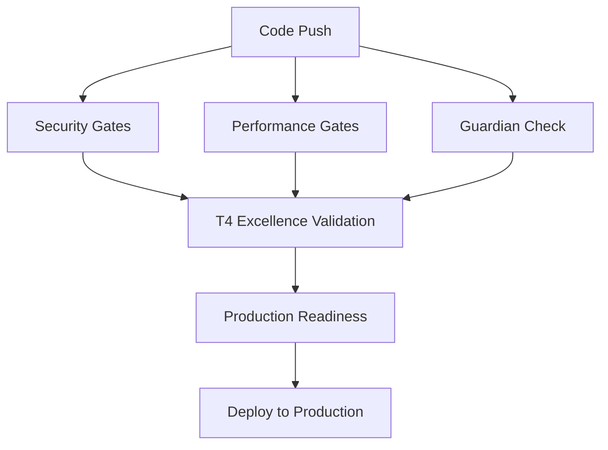

# 🎯 LUKHAS T4/0.01% Excellence CI/CD Pipeline

This directory contains the production-grade CI/CD workflows for LUKHAS AI, implementing T4/0.01% excellence standards.

## 🛡️ Security Gates (`security-gates.yml`)

**Trigger**: All PRs and pushes to main/develop
**Purpose**: Enforce security standards and prevent vulnerabilities

### Security Checks:
- **Semgrep Security Scanning**: Custom rules for LUKHAS-specific vulnerabilities
- **MockGuardian Detection**: Prevents MockGuardian usage in production code paths
- **Guardian Validation**: Ensures ProductionGuardian is correctly configured
- **Rate Limiting Security**: Validates rate limiting implementation
- **Token Security**: Tests OWASP ASVS Level 2 compliance

### Success Criteria:
- Zero critical security findings
- No MockGuardian detected in production paths
- Guardian correctly configured for production mode
- Rate limiting properly enforced
- Token validation meets OWASP standards

## ⚡ Performance Gates (`performance-gates.yml`)

**Trigger**: All PRs and pushes to main/develop
**Purpose**: Enforce T4/0.01% performance standards

### Performance Validation:
- **WebAuthn Latency**: <100ms P95
- **API Latency**: <500ms P95
- **Orchestration Latency**: <250ms P95
- **Memory Operations**: <50ms P95
- **Error Rate**: <0.01%

### Test Coverage:
- WebAuthn registration/authentication performance
- Multi-AI orchestration routing performance
- Memory system fold operations performance
- API load testing and latency validation
- Memory stress testing and efficiency

## 🎯 T4/0.01% Excellence Validation (`t4-excellence-validation.yml`)

**Trigger**: PRs to main, main branch pushes, daily schedule
**Purpose**: Comprehensive excellence standard validation

### Excellence Criteria:
- All security gates pass
- All performance targets met
- Production Guardian active
- Rate limiting operational
- Memory system within limits
- Monitoring and alerting configured

### Integration Testing:
- End-to-end system validation
- Cross-component performance testing
- Production readiness verification
- Long-term excellence monitoring

## 📊 Guardian Validation (`guardian-check.yml`)

**Trigger**: All code changes
**Purpose**: Ensure Guardian system integrity

### Validation Steps:
- Environment-aware Guardian selection
- Policy enforcement testing
- Production mode verification
- Security compliance checking

## 🔄 Workflow Dependencies



## 📋 Gate Requirements

### Pull Request Gates
All PRs must pass:
1. ✅ Security Gates (blocking)
2. ✅ Performance Gates (blocking)
3. ✅ Guardian Validation (blocking)

### Main Branch Gates
Main branch pushes must pass:
1. ✅ All PR gates
2. ✅ T4/0.01% Excellence Validation
3. ✅ Production Readiness Check

### Production Deployment Gates
Production deployments require:
1. ✅ All main branch gates passed
2. ✅ Manual approval from T4 team
3. ✅ Monitoring alerts configured
4. ✅ Rollback procedures verified

## 🚨 Emergency Procedures

### Security Gate Failure
- **Critical**: Immediate deployment block
- **Action**: Security team notification via Slack + email
- **Resolution**: Fix security issues before proceeding

### Performance Gate Failure
- **Warning**: Optimization required
- **Action**: Performance team notification
- **Resolution**: Optimize performance to meet T4 targets

### Guardian Gate Failure
- **Critical**: System security compromised
- **Action**: Immediate security lockdown
- **Resolution**: Fix Guardian configuration

## 📈 Monitoring and Alerting

### Prometheus Alerts
Located in `/monitoring/alerts/`:
- `lukhas-core.yml`: API and system alerts
- `lukhas-consciousness.yml`: Consciousness system alerts
- `lukhas-orchestration.yml`: Multi-AI orchestration alerts
- `lukhas-guardian.yml`: Guardian system alerts

### Alert Routing
- **Critical**: Immediate notification + PagerDuty
- **Warning**: Slack notification within 5 minutes
- **Info**: Daily summary reports

## 🔧 Maintenance

### Daily Tasks
- Review T4 excellence validation results
- Check for security scan findings
- Monitor performance trend degradation
- Validate Guardian system health

### Weekly Tasks
- Review and update Semgrep rules
- Analyze performance trends
- Update alert thresholds if needed
- Conduct security audit reviews

### Monthly Tasks
- Full T4/0.01% compliance audit
- Update CI/CD pipeline configurations
- Review and optimize performance targets
- Security framework updates

## 📝 Content Linting Workflow (`content-lint.yml`)

**Trigger**: PRs with branding changes, pushes to main, weekly schedule, manual
**Purpose**: Automated branding content validation and governance

### Jobs

1. **vocabulary-lint**: Forbidden vocabulary detection
2. **front-matter-lint**: YAML front-matter validation
3. **evidence-validation**: Claims registry generation and validation
4. **seo-validation**: SEO hygiene (canonical URLs, meta descriptions)
5. **markdown-links**: Broken link detection
6. **visual-regression**: Visual diff testing (requires Chromatic/Percy setup)
7. **evidence-artifacts**: JSON validation for evidence files
8. **summary**: Aggregated validation results

### Local Testing

Run checks locally before pushing:

```bash
# Vocabulary
python3 tools/branding_vocab_lint.py

# Front-matter
python3 tools/front_matter_lint.py

# Claims
python3 tools/generate_claims_registry.py
python3 tools/validate_claims.py

# SEO
python3 tools/validate_seo.py

# Or run all CI checks locally
make ci-lint-local
```

### Secrets Required

- `CHROMATIC_PROJECT_TOKEN` (optional) - For visual regression with Chromatic
- `PERCY_TOKEN` (alternative) - For visual regression with Percy

### Troubleshooting

**Q: Workflow fails on vocabulary-lint**
A: Check `tools/branding_vocab_lint.py` output for forbidden terms, fix content

**Q: Front-matter validation fails**
A: Ensure all required YAML fields present (title, domain, owner, tone, canonical, evidence_links, etc.)

**Q: Evidence validation fails**
A: Add `evidence_links` in front-matter and set `claims_approval: true` after review

**Q: Visual regression not running**
A: Add `CHROMATIC_PROJECT_TOKEN` secret in repo settings → Secrets and variables → Actions

## 📚 Documentation References

- [T4/0.01% Excellence Standards](https://docs.lukhas.ai/excellence/t4-standards)
- [Security Gate Runbooks](https://docs.lukhas.ai/runbooks/security-gates)
- [Performance Optimization Guide](https://docs.lukhas.ai/performance/optimization)
- [Guardian System Documentation](https://docs.lukhas.ai/security/guardian)
- [Monitoring and Alerting Guide](https://docs.lukhas.ai/monitoring/setup)

## 🎯 Excellence Metrics

### Current Targets (T4/0.01%)
- API Latency P95: <500ms ✅
- WebAuthn Latency P95: <100ms ✅
- Memory Operations P95: <50ms ✅
- Error Rate: <0.01% ✅
- Security Compliance: 100% ✅
- Guardian Uptime: 99.99% ✅

### Continuous Improvement
- Weekly performance reviews
- Monthly security audits
- Quarterly excellence standard reviews
- Annual T4 certification renewal