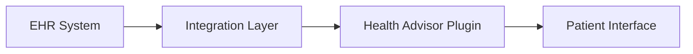

# Healthcare Provider Integration Guide

## Overview

This guide helps healthcare providers integrate their systems with the Health Advisor Plugin. It covers implementation, compliance, and best practices for healthcare organizations.

## Table of Contents

1. [Getting Started](#getting-started)
2. [System Requirements](#system-requirements)
3. [Integration Process](#integration-process)
4. [Clinical Features](#clinical-features)
5. [Patient Data Management](#patient-data-management)
6. [Security & Compliance](#security--compliance)
7. [Support](#support)

## Getting Started

### Prerequisites

- Healthcare system API access
- Digital certificates
- Compliance documentation
- Technical team availability

### Initial Setup

1. **System Assessment**
   - Current EHR system
   - Integration points
   - Data flow requirements
   - Security requirements

2. **Documentation Review**
   - Technical specifications
   - Compliance requirements
   - Security protocols
   - Integration guides

## System Requirements

### Technical Requirements

- Modern web browser
- Secure network connection
- API endpoint access
- Digital certificates

### Security Requirements

- HIPAA compliance
- Data encryption
- Access controls
- Audit logging

## Integration Process

### Step 1: Configuration

```yaml
healthcare_provider:
  name: "Hospital Name"
  id: "PROVIDER_ID"
  system_type: "EHR_SYSTEM"
  api_endpoints:
    base_url: "https://api.hospital.com"
    patient_records: "/api/v1/patients"
    appointments: "/api/v1/appointments"
```

### Step 2: Authentication Setup

- Configure OAuth 2.0
- Set up API keys
- Configure certificates
- Test connectivity

### Step 3: Data Mapping

Map your system's data fields to the plugin's format:

| Your Field | Plugin Field | Description |
|------------|--------------|-------------|
| patientId | patient_id | Patient identifier |
| medRecord | medical_record | Medical record |
| apptTime | appointment_time | Appointment time |

## Clinical Features

### Patient Management

1. **Record Access**
   - View patient history
   - Update records
   - Share information

2. **Appointment Scheduling**
   - Create appointments
   - Manage schedules
   - Send notifications

### Clinical Decision Support

1. **Integration Points**
   - Disease protocols
   - Treatment guidelines
   - Drug interactions

2. **Alert System**
   - Clinical alerts
   - Patient notifications
   - Staff communications

## Patient Data Management

### Data Flow



### Data Security

1. **Encryption**
   - Data at rest
   - Data in transit
   - Key management

2. **Access Control**
   - Role-based access
   - Authentication
   - Authorization

## Security & Compliance

### HIPAA Compliance

1. **Privacy Rule**
   - Patient consent
   - Information disclosure
   - Access controls

2. **Security Rule**
   - Technical safeguards
   - Physical safeguards
   - Administrative safeguards

### Audit Requirements

1. **Access Logging**
   - User actions
   - System events
   - Error logging

2. **Compliance Reporting**
   - Monthly reports
   - Incident reports
   - Audit trails

## Best Practices

### Clinical Integration

1. **Workflow Integration**
   - Minimize disruption
   - Optimize processes
   - Staff training

2. **Quality Assurance**
   - Data validation
   - Error checking
   - Performance monitoring

### Patient Safety

1. **Alert Management**
   - Clinical alerts
   - Drug interactions
   - Allergies

2. **Emergency Protocols**
   - Urgent care
   - Critical alerts
   - Emergency contacts

## Training Resources

### Staff Training

1. **Clinical Staff**
   - System overview
   - Clinical features
   - Safety protocols

2. **Administrative Staff**
   - Basic operations
   - Data entry
   - Patient management

### Documentation

1. **User Guides**
   - Quick start guide
   - Detailed manual
   - Video tutorials

2. **Reference Materials**
   - Field guides
   - Process flows
   - FAQ documents

## Support

### Technical Support

- Email: provider-support@health-advisor.com
- Phone: 1-800-HEALTH-IT
- Hours: 24/7

### Emergency Support

- Critical Issues: 1-800-URGENT-IT
- Response Time: < 15 minutes
- 24/7 availability

## Appendix

### Glossary

- **EHR**: Electronic Health Record
- **PHI**: Protected Health Information
- **API**: Application Programming Interface

### Reference Documents

1. Technical Specifications
2. Security Guidelines
3. Compliance Requirements
4. Integration Protocols
