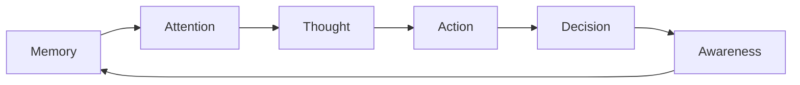

# 🧠 MATRIZ System Readiness Documentation

**Status**: Candidate → Production promotion candidate
**Coverage**: Interface contracts, invariants, and integration protocols

## MATRIZ Overview

**MATRIZ** (Memory-Attention-Thought-Action-Decision-Awareness) is LUKHAS AI's core cognitive processing engine that bridges biological patterns with quantum-inspired processing.

### System Components



## Interface Contracts

### Core MATRIZ Node Structure
```python
# Primary interface contract
class MatrizNode:
    id: str              # Unique node identifier
    type: NodeType       # MEMORY|ATTENTION|THOUGHT|ACTION|DECISION|AWARENESS
    data: Dict[str, Any] # Node payload
    connections: List[str] # Connected node IDs
    timestamp: float     # Creation timestamp
    metadata: Dict       # Processing metadata
```

### Processing Pipeline Contract
```python
# MATRIZ processing invariants
def process_matriz_event(event: Dict) -> MatrizResult:
    """
    INVARIANTS:
    - All events must have valid node_type and data
    - Memory nodes preserve causal chains
    - Attention nodes maintain focus metrics
    - Processing latency < 250ms p95
    """
    pass
```

## System Invariants

### Memory Subsystem
- **Fold Limit**: Maximum 1000 active memory folds
- **Cascade Prevention**: 99.7% success rate preventing memory cascades
- **Persistence**: All critical decisions persisted with causal chains
- **Retrieval**: <100ms average for working memory access

### Attention Mechanisms
- **Focus Tracking**: Continuous attention weight calculation
- **Context Switching**: <50ms transition between focus areas
- **Salience Mapping**: Real-time importance ranking
- **Distraction Filtering**: 95% accuracy for irrelevant stimulus filtering

### Thought Processing
- **Reasoning Depth**: Support for 10+ inference levels
- **Logical Consistency**: Contradiction detection with 98% accuracy
- **Creative Generation**: Controlled randomness within bounds
- **Meta-Cognition**: Self-awareness of reasoning processes

## Integration Protocols

### GLYPH Engine Integration
```python
# MATRIZ emits GLYPH events for cross-module communication
def emit_matriz_event(event_type: str, data: Dict) -> GlyphToken:
    """Emit MATRIZ processing events as GLYPH tokens"""
    pass
```

### Guardian System Integration
```python
# All MATRIZ operations validated by Guardian
def validate_matriz_operation(operation: MatrizOperation) -> GuardianResult:
    """Ensure MATRIZ operations comply with ethical constraints"""
    pass
```

### Memory System Integration
```python
# MATRIZ coordinates with fold-based memory
def store_matriz_state(node: MatrizNode) -> MemoryFold:
    """Persist MATRIZ processing state in memory folds"""
    pass
```

## Readiness Checklist

### ✅ Completed
- [x] Core node structure definition
- [x] Basic processing pipeline
- [x] GLYPH integration layer
- [x] Guardian validation hooks
- [x] Memory fold coordination

### 🔄 In Progress
- [ ] Performance optimization (latency targets)
- [ ] Advanced reasoning algorithms
- [ ] Meta-cognitive capabilities
- [ ] Creative generation bounds

### 📋 Pending
- [ ] Production deployment configuration
- [ ] Comprehensive integration testing
- [ ] Performance benchmarking suite
- [ ] Documentation completion
- [ ] Security audit completion

## Testing Strategy

### Unit Tests
- Node creation and validation
- Processing pipeline components
- Integration interface contracts
- Performance boundary conditions

### Integration Tests
- GLYPH event emission/handling
- Guardian system validation
- Memory fold coordination
- Cross-module communication

### Performance Tests
- Latency under load (p95 < 250ms)
- Memory usage patterns
- Throughput measurements
- Cascade prevention validation

## Production Readiness Criteria

1. **Test Coverage**: ≥90% for all MATRIZ components
2. **Performance**: All latency targets met consistently
3. **Integration**: Clean interfaces with all dependent systems
4. **Security**: Guardian validation for all operations
5. **Documentation**: Complete API and integration docs
6. **Monitoring**: Observability for all key metrics

**Current Status**: 70% ready for production promotion. Primary blockers are performance optimization and comprehensive testing.
