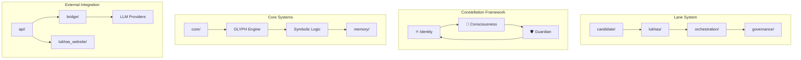
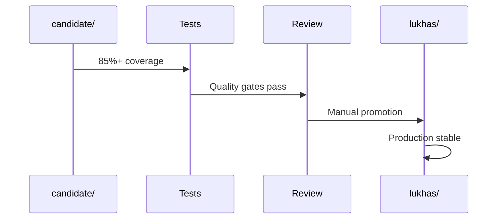

# 🗺️ LUKHAS AI System Architecture Map

## High-Level Architecture

## Module Dependency Matrix

### Core Infrastructure
| Module | Dependencies | Exports | Status |
|--------|-------------|---------|---------|
| `core/` | None (foundational) | GLYPH, symbolic logic | ✅ Production |
| `orchestration/` | core/, governance/ | Brain coordination | ✅ Production |
| `governance/` | core/ | Guardian System v1.0.0 | ✅ Production |

### Consciousness Systems
| Module | Dependencies | Exports | Status |
|--------|-------------|---------|---------|
| `consciousness/` | core/, memory/ | Awareness, decisions | ✅ Production |
| `memory/` | core/ | Fold-based storage | ✅ Production |
| `identity/` | core/, governance/ | ΛiD authentication | ✅ Production |
| `vivox/` | consciousness/ | VIVOX system (ME/MAE/CIL/SRM) | 🧪 Candidate |

### Advanced Processing
| Module | Dependencies | Exports | Status |
|--------|-------------|---------|---------|
| `quantum/` | core/ | Quantum-inspired algorithms | 🧪 Candidate |
| `bio/` | core/ | Bio-inspired adaptation | 🧪 Candidate |
| `emotion/` | consciousness/ | VAD affect processing | ✅ Production |

## Lane Architecture Details

### Promotion Flow

### Import Patterns
- ✅ **Valid**: `from lukhas.module import Component`
- ✅ **Valid**: `from candidate.module import Component` (within candidate/)
- ❌ **Invalid**: `from candidate.module import Component` (from lukhas/)
- ✅ **Bridge**: Fallback chains with graceful degradation

## Critical System Boundaries

### Security Boundaries
- **Guardian System**: All operations validated (drift threshold: 0.15)
- **Lane Isolation**: Candidate code cannot affect production systems
- **API Gateway**: External access controlled through `api/` layer

### Performance Boundaries
- **Memory Folds**: 1000 fold limit with 99.7% cascade prevention
- **API Latency**: <100ms p95 target for identity operations
- **Test Execution**: <2 minutes for full suite

### Integration Points
- **LLM Bridge**: OpenAI, Anthropic, Google, Perplexity APIs
- **Web Interface**: Next.js frontend with particle systems
- **MCP Server**: Claude Desktop integration
- **Azure Deployment**: Container Apps with ingress

## Audit Focus Areas

1. **Cross-Lane Dependencies** - Check for violations in `reports/deep_search/CANDIDATE_USED_BY_LUKHAS.txt`
2. **Import Cycles** - Validated clean in `reports/deep_search/IMPORT_CYCLES.txt`
3. **Test Coverage** - Current metrics in `test_results/`
4. **Security Posture** - Guardian System logs and drift detection
5. **Performance** - Memory fold usage and API response times
