# Framework Usage Guide: Constellation vs Constellation

**Definitive guide for when to use Constellation Framework (internal) vs Constellation Framework (user-facing) in LUKHAS consciousness technology**

---

## 🎯 Framework Selection Matrix

### Constellation Framework (Internal/Technical)

**🔧 WHEN TO USE:**
- Internal documentation and technical specifications
- Code comments and developer-focused explanations  
- Architecture discussions and system design documents
- Technical implementation details and consciousness system internals
- Developer APIs and internal system interfaces
- Team communications about consciousness architecture

**⚛️ Identity · ✦ Memory · 🔬 Vision · 🌱 Bio · 🌙 Dream · ⚖️ Ethics · 🛡️ Guardian · ⚛️ Quantum VISUAL IDENTITY:**
- **⚛️ Identity**: Core consciousness identity and authentication systems
- **🧠 Consciousness**: Awareness processing and decision-making systems
- **🛡️ Guardian**: Ethical protection and coherence preservation systems

**📝 USAGE EXAMPLES:**
```markdown
✅ CORRECT - Internal Documentation:
"The Constellation Framework provides the foundational architecture with three core pillars: 
⚛️ Identity (authentication), 🧠 Consciousness (awareness processing), 
and 🛡️ Guardian (ethical protection)."

✅ CORRECT - Code Comments:
// Constellation Framework: Guardian system validates consciousness authenticity
// ⚛️ Identity layer handles authentication, 🧠 Consciousness processes awareness
```

**🎯 TARGET AUDIENCE:**
- Developers and software architects
- Internal team members
- Technical documentation readers
- System architects and consciousness engineers

---

### Constellation Framework (User-Facing)

**🌟 WHEN TO USE:**
- Public documentation and marketing materials
- User interfaces and external communications
- Website content and public-facing explanations
- Customer onboarding and educational content
- Press releases and external presentations
- Social media and public content

**🌌 8-STAR VISUAL IDENTITY:**
1. **⚛️ Identity** - The Anchor Star (`lukhas.id`)
2. **✦ Memory** - The Trail Star (`lukhas.cloud`, `lukhas.store`)
3. **🔬 Vision** - The Horizon Star (`lukhas.io`, `lukhas.app`)
4. **🌱 Bio** - The Living Star (`lukhas.dev`, `lukhas.team`)
5. **🌙 Dream** - The Drift Star (`lukhas.ai`, `lukhas.xyz`)
6. **⚖️ Ethics** - The North Star (`lukhas.eu`, `lukhas.us`)
7. **🛡️ Guardian** - The Watch Star (`lukhas.com`)
8. **⚛️ Quantum** - The Ambiguity Star (`lukhas.xyz`, `lukhas.lab`)

**📝 USAGE EXAMPLES:**
```markdown
✅ CORRECT - Public Website:
"Navigate the LUKHAS universe through our 8-star Constellation Framework. 
Each star represents a domain of consciousness technology, from Identity (⚛️) 
to Dreams (🌙) to Ethics (⚖️), forming a complete navigation system."

✅ CORRECT - User Documentation:
"The Constellation Framework guides you through LUKHAS capabilities like 
stars guide navigation - each illuminating a different aspect of 
consciousness technology."
```

**🎯 TARGET AUDIENCE:**
- Users and customers
- General public and media
- Potential clients and partners
- Educational content consumers

---

## 🚨 Critical Usage Distinctions

### Content Context Decision Tree

```mermaid
graph TD
    A[Creating LUKHAS Content?] --> B{Who is the audience?}
    B --> C[Developers/Internal Team]
    B --> D[Users/Public/Customers]
    
    C --> E[Use Constellation Framework ⚛️ Identity · ✦ Memory · 🔬 Vision · 🌱 Bio · 🌙 Dream · ⚖️ Ethics · 🛡️ Guardian · ⚛️ Quantum]
    E --> F[3 pillars: Identity, Consciousness, Guardian]
    E --> G[Technical implementation focus]
    E --> H[Architecture and system design language]
    
    D --> I[Use Constellation Framework 🌟]
    I --> J[8 stars: Full constellation navigation]
    I --> K[User benefit and experience focus]
    I --> L[Metaphorical and accessible language]
```



### Transition Examples

**Converting Constellation to Constellation for Public Use:**

❌ **WRONG - Public Content with Constellation:**
```markdown
"LUKHAS is built on the Constellation Framework with three core pillars: 
⚛️ Identity, 🧠 Consciousness, and 🛡️ Guardian."
```

✅ **CORRECT - Public Content with Constellation:**
```markdown
"LUKHAS consciousness technology spans eight domains, like stars in a 
constellation guiding your journey through AI possibilities - from Identity 
authentication to Dream-powered creativity to Guardian protection."
```

**Keeping Constellation for Technical Use:**

✅ **CORRECT - Internal Technical Document:**
```markdown
"Constellation Framework Implementation:
- ⚛️ Identity Module: Handles ΛiD authentication and user identity management
- 🧠 Consciousness Module: Processes awareness patterns and decision logic  
- 🛡️ Guardian Module: Validates ethical compliance and consciousness authenticity"
```

---

## 🎨 Tone and Language Differences

### Constellation Framework Tone (Internal)

**Characteristics:**
- **Precise and technical** language focused on implementation
- **Direct system descriptions** with concrete functionality
- **Architecture-focused** explanations of consciousness components
- **Developer-friendly** terminology and concepts

**Language Patterns:**
```markdown
✅ Constellation Examples:
- "The Constellation Framework implements consciousness through three core systems..."
- "Guardian validation ensures ethical compliance at the consciousness level..."
- "Identity authentication integrates with consciousness processing..."
```

### Constellation Framework Tone (User-Facing)

**Characteristics:**
- **Metaphorical and inspiring** language that connects emotionally
- **Navigation-focused** descriptions using star and journey metaphors
- **Benefit-oriented** explanations of user value and experience
- **Accessible** to non-technical audiences

**Language Patterns:**
```markdown
✅ Constellation Examples:
- "Like navigating by stars, the Constellation Framework guides you..."
- "Each star in our consciousness constellation illuminates new possibilities..."
- "Your journey through LUKHAS begins with any star that calls to you..."
```

---

## 🌟 Constellation Framework Implementation

### 8-Star Navigation Metaphor Usage

**Subtle Integration Guidelines:**
- **Don't overuse** star metaphors - they should enhance, not dominate
- **Maintain technical accuracy** while using accessible language  
- **Focus on user benefits** rather than technical implementation
- **Use constellation as navigation aid**, not forced poetic device

**Domain-Star Alignment:**
```markdown
✅ CORRECT Implementation:
"Secure your digital identity (Identity star) at lukhas.id, then explore 
creative possibilities (Dream star) at lukhas.ai, with Guardian protection 
(Watch star) ensuring ethical AI throughout your journey."

❌ AVOID Over-Metaphor:
"Drift among the stellar dreams in the cosmic constellation of consciousness 
as the ethereal stars guide your galactic journey through the universe of AI..."
```

### Content Type Guidelines

**Website Content:**
- Use Constellation Framework consistently
- Integrate navigation metaphor naturally
- Focus on user benefits and experience
- Maintain professional tone with subtle star references

**Marketing Materials:**
- Lead with Constellation Framework benefits
- Use 8-star system as differentiation
- Connect stars to specific user needs
- Avoid technical Constellation details

**User Documentation:**
- Navigate users through Constellation Framework
- Map features to relevant stars
- Provide clear benefit explanations
- Use Constellation only for technical API docs

**Technical Documentation:**
- Use Constellation Framework for system architecture
- Reference Constellation for user-facing features
- Maintain clear technical accuracy
- Focus on implementation details with Constellation

---

## 🔄 Migration and Content Updates

### Content Audit Process

**Step 1: Identify Content Type**
- Internal/Technical → Keep or convert to Constellation
- User-Facing/Public → Convert to Constellation

**Step 2: Audience Assessment**
- Developers/Architects → Constellation Framework appropriate
- Users/Customers/Public → Constellation Framework required

**Step 3: Context Evaluation**
- System architecture docs → Constellation
- User guides and marketing → Constellation  
- Code comments → Constellation
- Website content → Constellation

### Update Prioritization

**HIGH PRIORITY (Constellation Updates)**:
- Public website content (`lukhas_website/`)
- User-facing documentation (`docs/web/`)
- Marketing materials and vision statements
- Customer onboarding content

**MEDIUM PRIORITY (Framework Clarification)**:
- Mixed-audience documentation
- Developer resources with user sections
- Educational content for both audiences

**LOW PRIORITY (Constellation Maintenance)**:
- Pure technical documentation
- Internal architecture guides
- Code comments and technical specs

---

## 📋 Implementation Checklist

### For Content Creators

**Before Publishing Any Content:**
- [ ] Identify primary audience (internal vs external)
- [ ] Choose appropriate framework (Constellation vs Constellation)
- [ ] Verify tone matches framework selection
- [ ] Ensure metaphor usage is appropriate (subtle vs heavy)
- [ ] Check that technical accuracy is maintained
- [ ] Validate against brand guidelines

### For Developers

**When Writing Documentation:**
- [ ] Use Constellation for system architecture explanations
- [ ] Reference Constellation when describing user-facing features  
- [ ] Maintain clear separation between internal and external docs
- [ ] Include framework usage notes for future editors

### For Marketing Teams

**When Creating Public Content:**
- [ ] Always use Constellation Framework for public materials
- [ ] Integrate 8-star navigation naturally
- [ ] Focus on user benefits and experience value
- [ ] Avoid technical Constellation implementation details
- [ ] Test content with non-technical audiences

---

## 🎯 Success Metrics

### Framework Usage Success Indicators

**Constellation Framework (Internal) Success:**
- Developer comprehension and adoption rates
- Technical accuracy and implementation efficiency  
- Clear architecture communication
- Reduced technical confusion and errors

**Constellation Framework (User-Facing) Success:**
- User engagement and understanding metrics
- Brand differentiation and memorability
- Accessibility to non-technical audiences
- Consistent navigation and user experience

### Content Quality Standards

**Constellation Content Quality:**
- Technical accuracy and implementability
- Clear architectural guidance
- Developer-friendly language and examples
- Comprehensive system coverage

**Constellation Content Quality:**
- User benefit clarity and accessibility
- Natural metaphor integration
- Inspirational yet professional tone
- Comprehensive user journey coverage

---

## 🚀 Quick Reference

### Framework Selection Summary

| Context | Audience | Framework | Key Elements |
|---------|----------|-----------|--------------|
| Technical Docs | Developers | Constellation ⚛️ Identity · ✦ Memory · 🔬 Vision · 🌱 Bio · 🌙 Dream · ⚖️ Ethics · 🛡️ Guardian · ⚛️ Quantum | 3 pillars, implementation focus |
| User Guides | Customers | Constellation 🌟 | 8 stars, navigation metaphor |
| Code Comments | Internal | Constellation ⚛️ Identity · ✦ Memory · 🔬 Vision · 🌱 Bio · 🌙 Dream · ⚖️ Ethics · 🛡️ Guardian · ⚛️ Quantum | Technical precision |
| Website | Public | Constellation 🌟 | User benefits, accessibility |
| Architecture | Internal | Constellation ⚛️ Identity · ✦ Memory · 🔬 Vision · 🌱 Bio · 🌙 Dream · ⚖️ Ethics · 🛡️ Guardian · ⚛️ Quantum | System design, technical accuracy |
| Marketing | External | Constellation 🌟 | Inspiration, differentiation |

### Emergency Framework Fixes

**If you see Constellation in user-facing content:**
1. Assess if audience is truly internal/technical
2. Convert to Constellation if public/user-facing
3. Maintain technical accuracy during conversion
4. Use navigation metaphor subtly and naturally

**If you see over-metaphorical Constellation:**
1. Reduce excessive star/cosmic language
2. Focus on practical user benefits
3. Maintain professional tone
4. Keep metaphor as navigation aid, not poetry

---

**Status**: ✅ Complete framework usage distinction guide  
**Purpose**: Clear Constellation (internal) vs Constellation (user-facing) guidance  
**Philosophy**: Right framework for right audience = optimal consciousness communication  
**Implementation**: Immediate use for all LUKHAS content creation and updates

---

*Last updated: September 7, 2025*  
*Definitive guide for Constellation vs Constellation Framework usage across LUKHAS consciousness ecosystem*