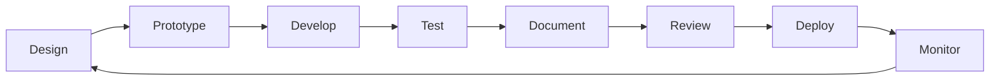
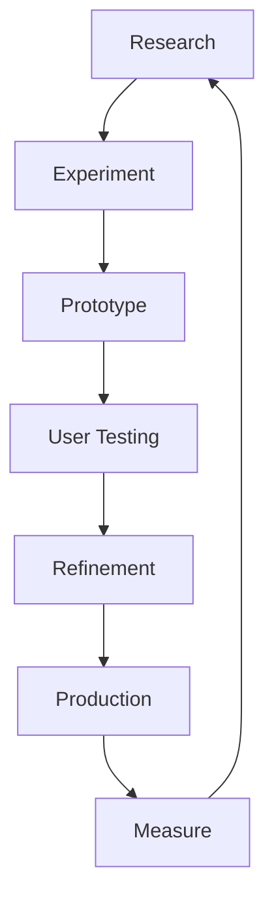

# 🏗️ LUKHAS AI Design System Principles
*Enterprise-Grade Best Practices from Tech Leadership*

**Inspired by Leading AI Companies** | **OpenAI • Anthropic • DeepMind**

---

## 📚 Table of Contents
- [Leadership Principles](#-leadership-principles)
- [OpenAI Standards](#-openai-standards)
- [Anthropic Practices](#-anthropic-practices)
- [DeepMind Excellence](#-deepmind-excellence)
- [LUKHAS Implementation Strategy](#-lukhas-implementation-strategy)
- [Quality Gates & Metrics](#-quality-gates--metrics)
- [Team Workflows](#-team-workflows)
- [Continuous Improvement](#-continuous-improvement)

---

## 🎯 Leadership Principles

### **Core Philosophy**
Drawing from the best practices of leading AI companies, LUKHAS AI adopts a comprehensive approach to design system management that emphasizes:

1. **Systematic Excellence**: Every design decision is documented, versioned, and measurable
2. **Developer Experience**: Tools and processes that accelerate development without sacrificing quality
3. **User-Centric Innovation**: Continuous research and iteration based on real user needs
4. **Ethical Design**: Accessibility, privacy, and user safety built into every component
5. **Performance Obsession**: Every millisecond matters in consciousness technology

---

## 🚀 OpenAI Standards

### **1. Design Tokens System**

```typescript
// tokens/index.ts
export const tokens = {
  colors: {
    primary: {
      50: '#f0f9ff',
      100: '#e0f2fe',
      // ... full scale
      900: '#0c4a6e',
    },
    semantic: {
      error: tokens.colors.red[600],
      warning: tokens.colors.amber[600],
      success: tokens.colors.green[600],
    },
  },
  spacing: {
    xs: '0.5rem',
    sm: '1rem',
    md: '1.5rem',
    lg: '2rem',
    xl: '3rem',
  },
  typography: {
    heading: {
      fontFamily: tokens.fonts.display,
      fontWeight: tokens.fontWeights.semibold,
      lineHeight: tokens.lineHeights.tight,
    },
  },
}
```

### **2. Component-Driven Development**

- **Atomic Design**: Atoms → Molecules → Organisms → Templates → Pages
- **Single Source of Truth**: All components in centralized library
- **Composition Pattern**: Build complex UIs from simple, reusable parts
- **Props Documentation**: TypeScript interfaces for all component props

### **3. Automated Visual Testing**

```yaml
# .github/workflows/visual-tests.yml
name: Visual Regression Tests
on:
  pull_request:
    paths:
      - 'components/**'
      - 'styles/**'
jobs:
  chromatic:
    runs-on: ubuntu-latest
    steps:
      - uses: actions/checkout@v3
      - uses: chromaui/action@v1
        with:
          projectToken: ${{ secrets.CHROMATIC_PROJECT_TOKEN }}
          autoAcceptChanges: 'main'
```

### **4. Performance Budgets**

```javascript
// lighthouse.config.js
module.exports = {
  performance: {
    budgets: [
      {
        resourceSizes: [
          { resourceType: 'script', budget: 200 },
          { resourceType: 'stylesheet', budget: 50 },
          { resourceType: 'image', budget: 500 },
          { resourceType: 'font', budget: 100 },
          { resourceType: 'total', budget: 1024 },
        ],
        metrics: [
          { metric: 'interactive', budget: 3000 },
          { metric: 'first-contentful-paint', budget: 1000 },
          { metric: 'speed-index', budget: 3000 },
        ],
      },
    ],
  },
}
```

---

## 🛡️ Anthropic Practices

### **1. Accessibility-First Design**

```typescript
// Every component must pass these checks
interface AccessibilityRequirements {
  wcag: 'AA' | 'AAA'
  keyboardNavigable: boolean
  screenReaderTested: boolean
  colorContrastRatio: number
  focusIndicator: boolean
  ariaLabels: boolean
  semanticHTML: boolean
}

// Component accessibility audit
const auditComponent = (component: Component): AccessibilityReport => {
  return {
    wcagLevel: checkWCAGCompliance(component),
    keyboardNav: testKeyboardNavigation(component),
    screenReader: testWithNVDA(component) && testWithJAWS(component),
    contrast: measureColorContrast(component),
    focusStates: validateFocusIndicators(component),
    aria: validateAriaImplementation(component),
    semantic: checkSemanticMarkup(component),
  }
}
```

### **2. Semantic HTML Enforcement**

```tsx
// ❌ Bad
<div onClick={handleClick}>Click me</div>

// ✅ Good
<button onClick={handleClick} aria-label="Perform action">
  Click me
</button>

// ❌ Bad
<div className="heading">Title</div>

// ✅ Good
<h2 className="heading">Title</h2>
```

### **3. Progressive Enhancement**

1. **Core Experience**: Works without JavaScript
2. **Enhanced Experience**: JavaScript adds interactivity
3. **Optimal Experience**: Modern browser features utilized
4. **Fallback Strategy**: Graceful degradation for older browsers

### **4. Documentation Standards**

```markdown
## Component: Button

### Purpose
Primary call-to-action element for user interactions.

### Usage
\`\`\`tsx
import { Button } from '@lukhas/ui'

<Button
  variant="primary"
  size="medium"
  onClick={handleClick}
  aria-label="Submit form"
>
  Submit
</Button>
\`\`\`

### Props
| Prop | Type | Default | Description |
|------|------|---------|-------------|
| variant | 'primary' \| 'secondary' \| 'glass' | 'primary' | Visual style |
| size | 'sm' \| 'md' \| 'lg' | 'md' | Button size |
| disabled | boolean | false | Disable interaction |

### Accessibility
- Keyboard: Space/Enter to activate
- Screen reader: Announces button label and state
- Focus: Visible focus ring with 2:1 contrast ratio

### Examples
[Live examples in Storybook]
```

---

## 🧠 DeepMind Excellence

### **1. Data Visualization Standards**

```typescript
// Visualization requirements for AI/ML interfaces
interface DataVizStandards {
  accuracy: {
    precision: number  // Decimal places for data points
    uncertainty: boolean  // Show confidence intervals
    source: boolean  // Display data provenance
  }
  performance: {
    fps: 60  // Minimum frame rate for animations
    dataPoints: 10000  // Max points before aggregation
    renderTime: 16  // Max ms per frame
  }
  accessibility: {
    colorBlind: boolean  // Colorblind-safe palettes
    patterns: boolean  // Use patterns not just colors
    altText: boolean  // Descriptions for screen readers
  }
}
```

### **2. Scientific Accuracy**

- **Data Integrity**: Never misrepresent data for aesthetics
- **Uncertainty Visualization**: Always show confidence intervals
- **Scale Consistency**: Maintain consistent scales across views
- **Annotation Standards**: Clear labels, units, and legends

### **3. Responsive Design Matrix**

```css
/* Device-specific optimizations */
@media (hover: hover) and (pointer: fine) {
  /* Desktop with mouse */
  .interactive { cursor: pointer; }
  .hover-effect { transition: all 0.3s; }
}

@media (hover: none) and (pointer: coarse) {
  /* Touch devices */
  .interactive { min-height: 44px; }
  .hover-effect { transition: none; }
}

@media (prefers-reduced-motion: reduce) {
  /* Accessibility preference */
  * { animation: none !important; }
}

@media (prefers-color-scheme: dark) {
  /* Dark mode preference */
  :root { --theme: dark; }
}
```

### **4. Cross-Browser Testing**

```yaml
# Browser support matrix
browsers:
  chrome:
    versions: [109, 110, 111, 112]
    features: ['webgpu', 'container-queries', 'has-selector']
  firefox:
    versions: [109, 110, 111, 112]
    features: ['webgpu-partial', 'container-queries', 'has-selector']
  safari:
    versions: [16.0, 16.1, 16.2, 16.3]
    features: ['webgpu-none', 'container-queries', 'has-selector']
  edge:
    versions: [109, 110, 111, 112]
    features: ['webgpu', 'container-queries', 'has-selector']
```

---

## 🧩 Brand Governance & Naming Consistency

**Goal**: Prevent drift between stylized branding and accessible/plain usage.

- **Display naming**: `LUKHΛS`, `ΛI`, `ΛiD`, `MΛTRIZ` allowed in logos, headings, and promo.
- **Plain naming**: *Lukhas*, *Lukhas AI*, *Lukhas ID*, *Matriz* used in body, a11y, and SEO.
- **Approvals**: Any new stylized ligature or glyph requires brand committee sign-off.
- **Linting**: Add a content-lint rule that flags `A` used where `Λ` is required in display contexts and vice versa in body copy.

### Product Naming: MΛTRIZ
- **Display form**: `MΛTRIZ` (Greek Lambda Λ replaces first A)
- **Plain form**: **Matriz** (use in paragraphs, SEO, alt text)
- **Slug/URL**: `/matriz` (never include Λ in URLs)
- **Legacy aliases**: References to MATADA should be updated to MATRIZ

## 🗣️ Voice & Tone Modes (Three‑Layer)

- **Poetic**: ≤ 40 words, metaphor-first, no promises.
- **Technical**: precise, cite sources, include assumptions and limits.
- **Plain-Language**: explain *what changes for the user*. Target grade 6–8.

**Definition of Done (content):** A page passes review if either (a) it includes all three layers; or (b) it exposes a **Tone Switch** that lets users choose.

## 🔐 Identity & Auth (ΛiD) Principles

- **Action text**: Use **"Log in"** for buttons; **"Login"** for pages/sections.
- **Button label (display)**: `Log in with ΛiD`; **ARIA**: `Log in with Lukhas ID`.
- **Copy standards**: Never shorten ΛiD to just ID in UI; always expand on first use: *Lukhas ID (ΛiD)*.
- **Security UX**: Show device, time, and location on every critical approval screen. Provide a frictionless cancel path.

## 🎭 LUKHAS Implementation Strategy

### **1. Design System Architecture**

```
design-system/
├── tokens/                 # Design tokens
│   ├── colors.ts
│   ├── typography.ts
│   ├── spacing.ts
│   └── index.ts
├── components/            # Component library
│   ├── atoms/
│   ├── molecules/
│   ├── organisms/
│   └── templates/
├── patterns/             # Design patterns
│   ├── forms/
│   ├── navigation/
│   └── data-viz/
├── guidelines/           # Documentation
│   ├── accessibility.md
│   ├── performance.md
│   └── branding.md
└── tools/               # Build tools
    ├── style-dictionary/
    ├── webpack-config/
    └── test-utils/
```

### **2. Component Development Workflow**



### **3. Quality Assurance Pipeline**

```typescript
// qa-pipeline.ts
export const qualityGates = {
  design: {
    figmaReview: true,
    accessibilityAudit: true,
    brandCompliance: true,
  },
  development: {
    typeScript: true,
    unitTests: 80, // coverage %
    integrationTests: true,
    e2eTests: true,
  },
  performance: {
    lighthouse: 90, // minimum score
    bundleSize: '200kb',
    renderTime: '16ms',
  },
  accessibility: {
    wcag: 'AA',
    keyboardNav: true,
    screenReader: true,
  },
  security: {
    dependencies: 'npm audit',
    csp: true,
    https: true,
  },
}
```

### **4. Continuous Integration**

```yaml
# .github/workflows/design-system.yml
name: Design System CI
on:
  push:
    branches: [main, develop]
  pull_request:
    branches: [main]

jobs:
  lint:
    runs-on: ubuntu-latest
    steps:
      - uses: actions/checkout@v3
      - run: npm run lint
      - run: npm run format:check

  test:
    runs-on: ubuntu-latest
    steps:
      - uses: actions/checkout@v3
      - run: npm run test:unit
      - run: npm run test:integration
      - run: npm run test:accessibility

  build:
    runs-on: ubuntu-latest
    steps:
      - uses: actions/checkout@v3
      - run: npm run build
      - run: npm run build:storybook
      - uses: actions/upload-artifact@v3
        with:
          name: build-artifacts
          path: dist/

  performance:
    runs-on: ubuntu-latest
    steps:
      - uses: actions/checkout@v3
      - run: npm run lighthouse
      - run: npm run bundle:analyze
```

---

## 📊 Quality Gates & Metrics

### **1. Component Quality Metrics**

```typescript
interface ComponentMetrics {
  // Code Quality
  complexity: number          // Cyclomatic complexity < 10
  maintainability: number     // Maintainability index > 80
  coverage: number           // Test coverage > 80%

  // Performance
  renderTime: number         // Initial render < 16ms
  reRenderTime: number       // Re-render < 8ms
  memoryUsage: number        // Memory footprint < 10MB

  // Accessibility
  wcagScore: 'A' | 'AA' | 'AAA'
  keyboardScore: number      // 0-100
  screenReaderScore: number  // 0-100

  // Documentation
  propsDocumented: boolean
  examplesProvided: boolean
  storybookStory: boolean
}
```

### **2. Design System Health Dashboard**

```typescript
// Monitor design system adoption and health
export const healthMetrics = {
  adoption: {
    componentsUsed: 85,      // % of apps using DS
    tokenAdoption: 92,       // % using design tokens
    customComponents: 15,    // % of custom vs DS components
  },
  quality: {
    bugRate: 0.02,          // Bugs per component
    techDebt: 120,          // Hours of tech debt
    testCoverage: 87,       // Overall test coverage %
  },
  performance: {
    buildTime: 45,          // Seconds
    bundleSize: 186,        // KB
    loadTime: 1.2,          // Seconds
  },
  satisfaction: {
    developerNPS: 72,       // Developer satisfaction
    designerNPS: 68,        // Designer satisfaction
    userNPS: 81,            // End user satisfaction
  },
}
```

---

## 👥 Team Workflows

### **1. Design-Dev Handoff**

```yaml
handoff_checklist:
  design:
    - Figma file with components
    - Design tokens exported
    - Interaction specifications
    - Responsive behaviors
    - Edge cases documented

  development:
    - Component structure agreed
    - Props interface defined
    - Accessibility requirements
    - Performance budgets set
    - Test scenarios identified

  review:
    - Visual QA completed
    - Interaction testing done
    - Accessibility audit passed
    - Performance verified
    - Documentation updated
```

### **2. Component Contribution Process**

1. **Proposal**: RFC (Request for Comments) document
2. **Design**: Figma prototype and specs
3. **Prototype**: CodeSandbox or local branch
4. **Review**: Design and engineering review
5. **Development**: Full implementation
6. **Testing**: Unit, integration, visual tests
7. **Documentation**: Storybook, props, examples
8. **Release**: Versioned npm package

### **3. Design System Governance**

```typescript
interface GovernanceModel {
  committee: {
    design: string[]      // Design representatives
    engineering: string[] // Engineering representatives
    product: string[]     // Product representatives
  }
  meetings: {
    frequency: 'weekly' | 'biweekly'
    agenda: string[]
    decisions: DecisionLog[]
  }
  processes: {
    contribution: Process
    deprecation: Process
    breaking: Process
  }
}
```

---

## 🔄 Continuous Improvement

### **1. Feedback Loops**

```typescript
// Collect metrics from production
const collectMetrics = async () => {
  return {
    performance: await collectWebVitals(),
    errors: await collectErrorRate(),
    usage: await collectComponentUsage(),
    feedback: await collectUserFeedback(),
  }
}

// Analyze and prioritize improvements
const prioritizeImprovements = (metrics: Metrics) => {
  return metrics
    .identify(issues)
    .calculateImpact()
    .estimateEffort()
    .prioritize()
    .createBacklog()
}
```

### **2. Version Management**

```json
{
  "versioning": {
    "strategy": "semver",
    "major": "Breaking changes",
    "minor": "New features",
    "patch": "Bug fixes",
    "prerelease": "alpha, beta, rc",
    "deprecation": "2 minor versions notice"
  }
}
```

### **3. Migration Support**

```typescript
// Automated migration tools
export const migrations = {
  v1ToV2: {
    components: componentMigrations,
    tokens: tokenMigrations,
    patterns: patternMigrations,
  },
  codemods: {
    updateImports: 'npx @lukhas/codemods update-imports',
    updateProps: 'npx @lukhas/codemods update-props',
    updateTokens: 'npx @lukhas/codemods update-tokens',
  },
  documentation: {
    migrationGuide: '/docs/migration/v1-to-v2',
    breakingChanges: '/docs/changelog/breaking',
    examples: '/docs/migration/examples',
  },
}
```

### **4. Innovation Pipeline**



---

## 🎯 Success Metrics

### **Key Performance Indicators (KPIs)**

```typescript
export const designSystemKPIs = {
  // Efficiency
  developmentVelocity: '+25%',      // Increase in feature delivery
  bugReduction: '-40%',             // Decrease in UI bugs
  consistencyScore: '95%',          // Design consistency across products

  // Quality
  accessibilityScore: 'AA',         // WCAG compliance level
  performanceScore: 90,             // Lighthouse score
  testCoverage: 85,                 // Percentage of code tested

  // Adoption
  componentReuse: '78%',            // Percentage of shared components
  teamAdoption: '100%',             // Teams using design system
  contributionRate: '15/month',     // New contributions per month

  // Satisfaction
  developerSatisfaction: 4.2,       // Out of 5
  designerSatisfaction: 4.1,        // Out of 5
  userSatisfaction: 4.5,            // Out of 5
}
```

---

## 🚀 Advanced Practices

### **1. AI-Assisted Design**

- **Generative Components**: AI-generated component variations
- **Automated Testing**: AI-powered visual regression detection
- **Smart Suggestions**: Context-aware component recommendations
- **Performance Optimization**: AI-driven performance improvements

### **2. Micro-Frontends Support**

```typescript
// Module federation for design system
module.exports = {
  name: 'designSystem',
  exposes: {
    './Button': './src/components/Button',
    './Card': './src/components/Card',
    './tokens': './src/tokens',
  },
  shared: {
    react: { singleton: true },
    'react-dom': { singleton: true },
  },
}
```

### **3. Design System as Code**

```typescript
// Programmatic design system generation
const generateComponent = (config: ComponentConfig) => {
  return {
    component: createComponent(config),
    styles: generateStyles(config),
    tests: generateTests(config),
    docs: generateDocs(config),
    story: generateStory(config),
  }
}
```

### **4. Real-Time Collaboration**

- **Live Design Updates**: Figma to code synchronization
- **Collaborative Editing**: Multi-user component editing
- **Instant Preview**: Real-time component preview
- **Version Control**: Git-based design versioning

---

## 📚 Resources & Tools

### **Essential Tools**

- **Design**: Figma, Sketch, Adobe XD
- **Prototyping**: Framer, Principle, ProtoPie
- **Development**: VS Code, WebStorm, Sublime
- **Testing**: Jest, Cypress, Playwright
- **Documentation**: Storybook, Docusaurus, Styleguidist
- **Performance**: Lighthouse, WebPageTest, SpeedCurve
- **Accessibility**: axe DevTools, WAVE, NVDA
- **Monitoring**: Sentry, LogRocket, FullStory

### **Learning Resources**

- [Design Systems Handbook](https://www.designsystems.com/)
- [Atomic Design Methodology](https://atomicdesign.bradfrost.com/)
- [WCAG Guidelines](https://www.w3.org/WAI/WCAG21/quickref/)
- [Web.dev Performance](https://web.dev/performance/)
- [A11y Project](https://www.a11yproject.com/)

### **Community**

- Design Systems Slack
- Clarity Conference
- Design Systems Weekly Newsletter
- GitHub Design Systems Repo

---

*Last Updated: 2025-08-19 | Version: 1.0.0 | LUKHAS AI Design System Principles*

*Inspired by the best practices of leading AI companies: OpenAI, Anthropic, and DeepMind*
