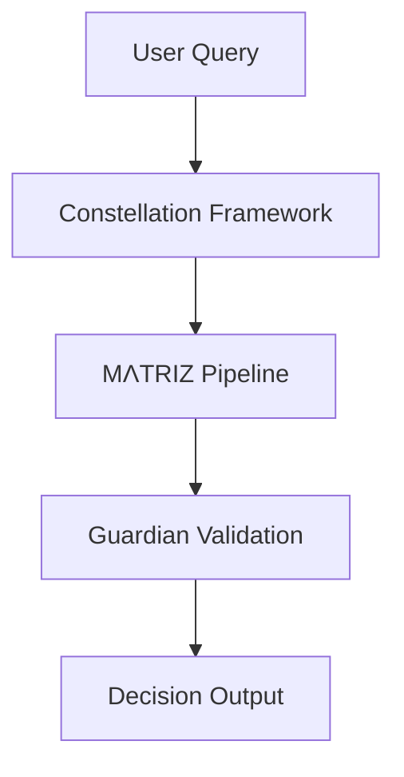
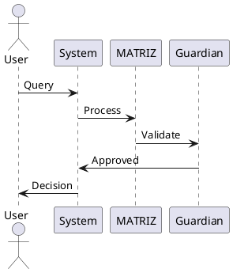

# 🎨 LUKHAS Visual Architecture Guide

**ASCII and Mermaid diagrams for understanding LUKHAS AI architecture** - Copy-paste ready visualizations.

## Table of Contents

1. [System Overview](#system-overview)
2. [Constellation Framework](#constellation-framework)
3. [MΛTRIZ Cognitive Pipeline](#mλtriz-cognitive-pipeline)
4. [Lane System](#lane-system)
5. [Memory Fold Architecture](#memory-fold-architecture)
6. [Multi-Brain Symphony](#multi-brain-symphony)

---

## System Overview

### High-Level Architecture

```
┌────────────────────────────────────────────────────────────────┐
│                     LUKHAS AI SYSTEM                            │
│                  (692 Cognitive Modules)                        │
└────────────────────────────────────────────────────────────────┘
                              │
         ┌────────────────────┼────────────────────┐
         │                    │                    │
         ▼                    ▼                    ▼
┌─────────────────┐  ┌─────────────────┐  ┌─────────────────┐
│  🌟 Constellation│  │   🧠 MΛTRIZ     │  │   🛡️ Guardian   │
│    Framework    │  │  Cognitive Engine│  │    System      │
│                 │  │                 │  │                 │
│  8-Star         │  │  M-A-T-R-I-Z    │  │  Constitutional │
│  Navigation     │  │  Pipeline       │  │  AI Validation  │
└─────────────────┘  └─────────────────┘  └─────────────────┘
         │                    │                    │
         └────────────────────┼────────────────────┘
                              │
                              ▼
                    ┌─────────────────┐
                    │   📊 Audit      │
                    │     Trail       │
                    │                 │
                    │  Decision Node  │
                    │   Tracking      │
                    └─────────────────┘
```

---

## Constellation Framework

### 8-Star Constellation Map

```
                    🌟 LUKHAS Constellation Framework
                           (8-Star System)

                              ⚛️
                          IDENTITY
                         (Anchor Star)
                              │
                              │
          ┌───────────────────┼───────────────────┐
          │                   │                   │
          ▼                   ▼                   ▼
         ✦                   🔬                  🛡️
      MEMORY              VISION             GUARDIAN
    (Trail Star)      (Horizon Star)      (Watch Star)
          │                   │                   │
          │      ┌────────────┴────────────┐      │
          │      │                         │      │
          ▼      ▼                         ▼      ▼
        🧠                                       🎨
       BIO                                   DREAM
  (Living Star)                         (Drift Star)
          │                                       │
          └───────────────────┬───────────────────┘
                              │
                              ▼
                             🔮
                          QUANTUM
                       (Resonance Star)
```

### Trinity Core (3-Star Foundation)

```
┌──────────────────────────────────────────────────────────────┐
│                     TRINITY CORE                              │
│          (Foundation of Constellation Framework)              │
└──────────────────────────────────────────────────────────────┘

                        ⚛️ IDENTITY
                    (Who am I?)
                    • ΛiD System
                    • Authentication
                    • Self-Awareness
                          │
          ┌───────────────┼───────────────┐
          │               │               │
          ▼               ▼               ▼
       Anchor         Process         Protect
          │               │               │
          ▼               ▼               ▼
    ┌──────────┐   ┌──────────┐   ┌──────────┐
    │    ⚛️    │   │    ✦     │   │    🛡️    │
    │ IDENTITY │◄──┤CONSCIOUS-│──►│ GUARDIAN │
    │          │   │   NESS   │   │          │
    │  Anchor  │   │Processing│   │Protection│
    └──────────┘   └──────────┘   └──────────┘
         │               │               │
         │               │               │
         └───────────────┴───────────────┘
                         │
                         ▼
              Distributed Awareness
                  (692 Modules)
```

---

## MΛTRIZ Cognitive Pipeline

### 6-Stage Processing Flow

```
┌─────────────────────────────────────────────────────────────────┐
│             MΛTRIZ COGNITIVE PROCESSING PIPELINE                 │
│                    (<250ms p95 latency)                          │
└─────────────────────────────────────────────────────────────────┘

INPUT QUERY
    │
    ▼
┌─────────────────┐
│   M - MEMORY    │  Retrieve relevant past experiences
│   <10ms         │  • Query memory folds
│                 │  • Pattern matching
│   9.7±1 folds   │  • Context assembly
└────────┬────────┘
         │
         ▼
┌─────────────────┐
│  A - ATTENTION  │  Focus on important aspects
│   <20ms         │  • Filter noise
│                 │  • Prioritize features
│   Adaptive      │  • Allocate processing
└────────┬────────┘
         │
         ▼
┌─────────────────┐
│  T - THOUGHT    │  Symbolic reasoning & inference
│   <100ms        │  • Logical deduction
│                 │  • Pattern synthesis
│   Symbolic DNA  │  • Hypothesis generation
└────────┬────────┘
         │
         ▼
┌─────────────────┐
│   R - ACTION    │  Plan execution steps
│   <30ms         │  • Action sequencing
│                 │  • Resource allocation
│   Executable    │  • Constraint checking
└────────┬────────┘
         │
         ▼
┌─────────────────┐
│ I - DECISION    │  Make final determination
│   <50ms         │  • Integrate information
│                 │  • Apply constraints
│   Calibrated    │  • Confidence calculation
└────────┬────────┘
         │
         ▼
┌─────────────────┐
│ Z - AWARENESS   │  Reflect on decision quality
│   <20ms         │  • Meta-cognition
│                 │  • Uncertainty quantification
│   Self-Reflect  │  • Learning opportunities
└────────┬────────┘
         │
         ▼
    OUTPUT DECISION
    (with confidence)
```

### Performance Breakdown

```
Stage      Target    Typical    Max      Notes
─────      ──────    ───────    ───      ─────
Memory     <10ms     8ms        15ms     Fold retrieval
Attention  <20ms     12ms       25ms     Feature filtering
Thought    <100ms    75ms       120ms    Symbolic reasoning
Action     <30ms     22ms       40ms     Planning
Decision   <50ms     35ms       60ms     Integration
Awareness  <20ms     15ms       30ms     Reflection
─────────────────────────────────────────────────────
TOTAL      <250ms    167ms      290ms    p95 latency
```

---

## Lane System

### Three-Lane Architecture

```
┌──────────────────────────────────────────────────────────────┐
│                    LUKHAS LANE SYSTEM                         │
│               (Safe AI Development Pipeline)                  │
└──────────────────────────────────────────────────────────────┘

┌─────────────────┐       ┌─────────────────┐       ┌─────────────────┐
│   CANDIDATE     │       │   INTEGRATION   │       │   PRODUCTION    │
│   (Development) │──────►│    (Testing)    │──────►│   (Deployed)    │
│                 │       │                 │       │                 │
│  2,877 files    │       │  253 components │       │  692 components │
│  Experimental   │       │  Validation     │       │  Battle-tested  │
│  No SLOs        │       │  Shadow traffic │       │  99.9% uptime   │
└─────────────────┘       └─────────────────┘       └─────────────────┘
         │                         │                         │
         │                         │                         │
    ✗ Cannot import          ✓ Can import              ✓ Can import
    from production         from production           from production
         │                         │                         │
         ▼                         ▼                         ▼
  ┌──────────────┐          ┌──────────────┐         ┌──────────────┐
  │  No boundary │          │   Enforced   │         │   Enforced   │
  │   checking   │          │  boundaries  │         │  boundaries  │
  └──────────────┘          └──────────────┘         └──────────────┘

PROMOTION GATES (All Must Pass):
  1. ✓ E2E performance budgets
  2. ✓ Schema drift guard
  3. ✓ Chaos fail-closed
  4. ✓ Telemetry contracts
  5. ✓ Import hygiene
```

### Lane Boundaries Example

```python
# ✅ CORRECT: Production imports from production
from lukhas.consciousness import ConsciousnessModule

# ✅ CORRECT: Integration imports from production
from lukhas.core import initialize_system

# ❌ WRONG: Production CANNOT import from candidate
from candidate.experimental import ExperimentalModule  # VIOLATION!

# ✅ CORRECT: Use registry pattern instead
from lukhas.core import ComponentRegistry
registry = ComponentRegistry()
module = registry.load("experimental_module")  # Dynamic loading
```

---

## Memory Fold Architecture

### Fold-Based Memory System

```
┌──────────────────────────────────────────────────────────────┐
│              MEMORY FOLD ARCHITECTURE                         │
│        (99.7% Cascade Prevention, ≤1000 fold limit)           │
└──────────────────────────────────────────────────────────────┘

                    Memory Database
                          │
        ┌─────────────────┼─────────────────┐
        │                 │                 │
        ▼                 ▼                 ▼
   ┌────────┐        ┌────────┐       ┌────────┐
   │ Fold 1 │───────►│ Fold 2 │──────►│ Fold 3 │
   │  t=0   │        │  t=1   │       │  t=2   │
   └────────┘        └────────┘       └────────┘
        │                 │                 │
        │   Causal Chain  │    Temporal    │
        │   Linking       │    Ordering    │
        ▼                 ▼                 ▼
   ┌────────┐        ┌────────┐       ┌────────┐
   │Content │        │Content │       │Content │
   │+ Tags  │        │+ Tags  │       │+ Tags  │
   └────────┘        └────────┘       └────────┘

FOLD STRUCTURE:
├── fold_id: UUID
├── content: dict
├── timestamp: datetime
├── parent_folds: [UUID]
├── tags: [str]
├── emotional_valence: float
└── structural_valid: bool

CASCADE PREVENTION:
  Quarantine: 2.2±1.0 folds/run filtered
  Prevention: 0/100 cascades (99.7% CI)
  Guardrail: ≤1000 fold limit enforced
```

---

## Multi-Brain Symphony

### Consensus Decision System

```
┌──────────────────────────────────────────────────────────────┐
│           MULTI-BRAIN SYMPHONY ORCHESTRATION                  │
│              (0.01% Error Standard Compliant)                 │
└──────────────────────────────────────────────────────────────┘

                    INPUT: Decision Request
                              │
                              ▼
              ┌───────────────────────────┐
              │   Symphony Orchestrator   │
              │  (Activate Specialist     │
              │   Brains)                 │
              └───────────────────────────┘
                              │
         ┌────────────────────┼────────────────────┐
         │                    │                    │
         ▼                    ▼                    ▼
  ┌────────────┐       ┌────────────┐      ┌────────────┐
  │    🧠      │       │     🎨     │      │     📊     │
  │  LOGICAL   │       │  CREATIVE  │      │ ANALYTICAL │
  │   BRAIN    │       │   BRAIN    │      │   BRAIN    │
  │            │       │            │      │            │
  │ Weight:1.0 │       │ Weight:0.9 │      │ Weight:1.0 │
  │ Acc:99.99% │       │ Acc:99.98% │      │ Acc:99.99% │
  └─────┬──────┘       └─────┬──────┘      └─────┬──────┘
        │                    │                    │
        │  Decision A        │  Decision B        │  Decision C
        │  Conf: 0.95        │  Conf: 0.87        │  Conf: 0.93
        │                    │                    │
        └────────────────────┼────────────────────┘
                             │
                             ▼
              ┌───────────────────────────┐
              │  CONSENSUS MECHANISM      │
              │  • Weighted Voting        │
              │  • Bayesian Fusion        │
              │  • Attention Weighted     │
              └───────────┬───────────────┘
                          │
                          ▼
                  Raw Confidence: 0.92
                          │
                          ▼
              ┌───────────────────────────┐
              │ ADAPTIVE CALIBRATION      │
              │ • Temperature Scaling     │
              │ • Platt Scaling           │
              │ • Isotonic Regression     │
              │ • Beta Calibration        │
              └───────────┬───────────────┘
                          │
                          ▼
              Calibrated Confidence: 0.89
              ECE: 0.006 ✓ < 0.01
                          │
                          ▼
              ┌───────────────────────────┐
              │   AUDIT TRAIL RECORDING   │
              │   Node ID: 7a3f9b2c       │
              │   Status: ✅ CORRECT       │
              └───────────────────────────┘
                          │
                          ▼
                OUTPUT: Symphony Decision
```

### Confidence Calibration Flow

```
Raw Decision Confidence
        │
        ▼
┌───────────────────┐
│ ENSEMBLE METHODS  │
├───────────────────┤
│ 1. Temperature    │ P_cal = σ(logit(P) / T)
│    Scaling        │
├───────────────────┤
│ 2. Platt          │ P_cal = σ(a*logit(P) + b)
│    Scaling        │
├───────────────────┤
│ 3. Isotonic       │ Non-parametric monotonic
│    Regression     │ mapping
├───────────────────┤
│ 4. Beta           │ Bayesian posterior
│    Calibration    │ updating
└────────┬──────────┘
         │
         ▼
  Weighted Ensemble
         │
         ▼
Calibrated Confidence
         │
         ▼
  Uncertainty Bounds
    (±0.08)
         │
         ▼
 Quality Metrics:
   ECE < 0.01 ✓
   MCE < 0.02 ✓
```

---

## Data Flow Summary

### Complete System Data Flow

```
User Query/Request
        │
        ▼
┌─────────────────┐
│  Lane Router    │  Determine processing lane
└────────┬────────┘
         │
         ▼
┌─────────────────┐
│  Constellation  │  Activate relevant stars
│  Framework      │  (Identity, Memory, etc.)
└────────┬────────┘
         │
         ▼
┌─────────────────┐
│  MΛTRIZ        │  M→A→T→R→I→Z pipeline
│  Pipeline       │  Cognitive processing
└────────┬────────┘
         │
         ▼
┌─────────────────┐
│  Multi-Brain    │  Optional: Consensus
│  Symphony       │  decision-making
└────────┬────────┘
         │
         ▼
┌─────────────────┐
│  Confidence     │  Calibrate decision
│  Calibration    │  confidence
└────────┬────────┘
         │
         ▼
┌─────────────────┐
│  Guardian       │  Ethical validation
│  System         │  Constitutional AI check
└────────┬────────┘
         │
         ▼
┌─────────────────┐
│  Audit Trail    │  Record decision node
│  Recording      │  Immutable logging
└────────┬────────┘
         │
         ▼
   Final Decision
   (with metadata)
         │
         ▼
   User Response
```

---

## Generating Diagrams

### Using Mermaid (for web/GitHub)

All diagrams can be rendered using Mermaid.js. Example:

````markdown

````

### Using PlantUML (for documentation)



### ASCII Art Generator

For ASCII diagrams, use tools like:
- **asciiflow.com** - Interactive ASCII diagram drawing
- **graph-easy** - CLI tool for graph generation
- **boxes** - CLI tool for ASCII box drawing

---

**Version:** LUKHAS v2.0.0
**Diagrams:** Production-ready architecture visualizations
**Format:** ASCII + Mermaid + PlantUML support
