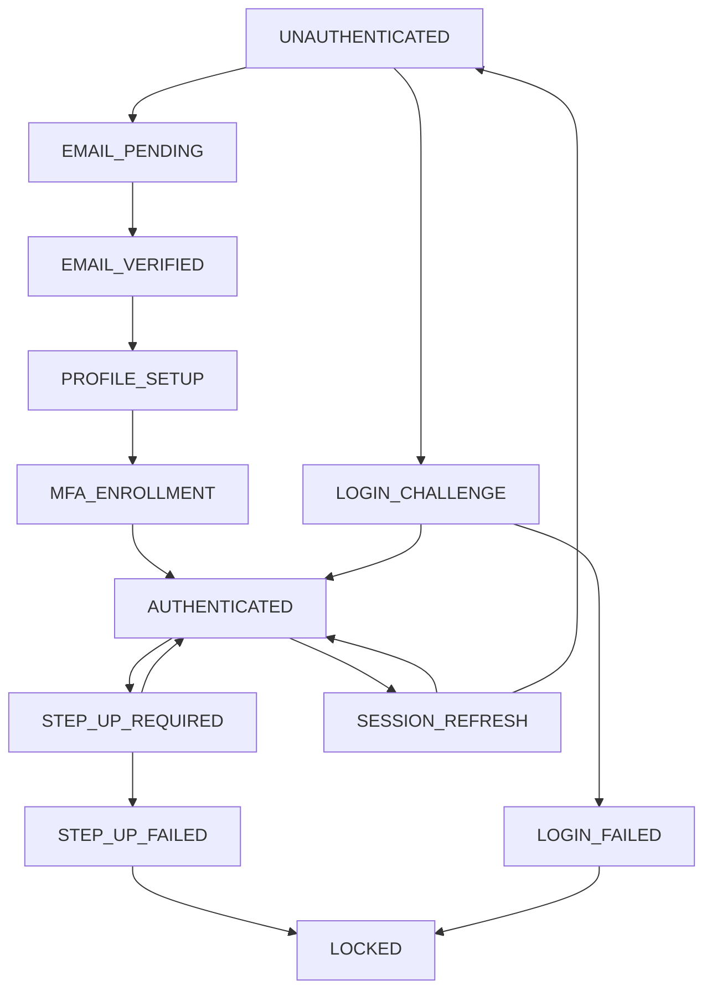

# Authentication Flow State Machine

## Overview

The LUKHAS authentication system implements a comprehensive state machine for user onboarding, login, and security step-up procedures. This specification defines the states, transitions, TTLs, and adaptive authentication flows.

## State Machine Architecture

### Core States



## State Definitions

### 1. UNAUTHENTICATED
**Description:** Initial state - no authentication context

**Duration:** Indefinite
**Transitions:**
- → EMAIL_PENDING (on signup)
- → LOGIN_CHALLENGE (on login attempt)

**Allowed Operations:**
- Public API access
- Documentation browsing
- Registration initiation

**Data:** None

---

### 2. EMAIL_PENDING
**Description:** Email verification required

**Duration:** 24 hours (TTL)
**Transitions:**
- → EMAIL_VERIFIED (on successful verification)
- → UNAUTHENTICATED (on expiry)

**Allowed Operations:**
- Resend verification email (rate limited)
- Cancel registration

**Data:**
```json
{
  "email": "user@example.com",
  "verificationToken": "encrypted",
  "attempts": 0,
  "createdAt": "2025-08-23T10:00:00Z",
  "expiresAt": "2025-08-24T10:00:00Z"
}
```

---

### 3. EMAIL_VERIFIED
**Description:** Email confirmed, profile setup pending

**Duration:** 7 days (TTL)
**Transitions:**
- → PROFILE_SETUP (automatic)
- → UNAUTHENTICATED (on expiry)

**Allowed Operations:**
- Complete profile setup
- Select initial tier preference

**Data:**
```json
{
  "email": "user@example.com",
  "emailVerifiedAt": "2025-08-23T10:05:00Z",
  "tempUserId": "temp-uuid",
  "realm": "LUKHAS",
  "zone": "EU"
}
```

---

### 4. PROFILE_SETUP
**Description:** Basic profile information collection

**Duration:** 7 days (TTL)
**Transitions:**
- → MFA_ENROLLMENT (on completion)
- → AUTHENTICATED (if MFA optional for tier)
- → UNAUTHENTICATED (on expiry)

**Allowed Operations:**
- Set display name
- Select timezone/locale
- Choose tier (T1/T2 default)

**Data:**
```json
{
  "displayName": "string",
  "timezone": "Europe/Berlin",
  "locale": "en-EU",
  "requestedTier": "T2",
  "profileCompleted": false
}
```

---

### 5. MFA_ENROLLMENT
**Description:** Multi-factor authentication setup

**Duration:** 7 days (TTL)
**Transitions:**
- → AUTHENTICATED (on successful enrollment)
- → PROFILE_SETUP (on retry)
- → UNAUTHENTICATED (on expiry)

**Allowed Operations:**
- Register passkey
- Generate backup codes
- Skip MFA (tier-dependent)

**Data:**
```json
{
  "mfaRequired": true,
  "enrollmentMethods": ["passkey", "backup_codes"],
  "enrolledMethods": [],
  "backupCodes": "encrypted",
  "passkeyChallenge": "temp-challenge"
}
```

---

### 6. AUTHENTICATED
**Description:** Fully authenticated user session

**Duration:** Variable by tier
- T1: 30 days
- T2: 14 days
- T3: 7 days
- T4: 1 day
- T5: 8 hours

**Transitions:**
- → STEP_UP_REQUIRED (on sensitive operation)
- → SESSION_REFRESH (on token expiry)
- → UNAUTHENTICATED (on logout/expiry)

**Allowed Operations:**
- All operations within tier scope
- Session management
- Profile updates

**Data:**
```json
{
  "userId": "uuid",
  "tier": "T2",
  "scopes": ["matriz:read", "api:keys:read"],
  "sessionId": "session-uuid",
  "deviceHandle": "device-uuid",
  "lastActivity": "2025-08-23T10:30:00Z",
  "accessToken": "jwt",
  "refreshToken": "jwt"
}
```

---

### 7. STEP_UP_REQUIRED
**Description:** Enhanced authentication required for sensitive operations

**Duration:** 5 minutes (TTL)
**Transitions:**
- → AUTHENTICATED (on successful step-up)
- → STEP_UP_FAILED (on failure)
- → AUTHENTICATED (on timeout, operation denied)

**Allowed Operations:**
- Complete step-up challenge
- Cancel operation

**Triggers:**
- API key generation (T2+)
- Tier upgrade (T3+)
- Settings changes (T2+)
- High-value transactions (T4+)

**Data:**
```json
{
  "requiredLevel": "UV_REQUIRED",
  "challenge": "passkey-challenge",
  "operation": "api_key_creation",
  "attempts": 0,
  "maxAttempts": 3,
  "createdAt": "2025-08-23T10:30:00Z"
}
```

---

### 8. STEP_UP_FAILED
**Description:** Step-up authentication failed

**Duration:** Progressive (1min, 5min, 15min, 1hr)
**Transitions:**
- → AUTHENTICATED (on timeout, reduced privileges)
- → LOCKED (on repeated failures)

**Allowed Operations:**
- Basic read operations only
- Logout

**Data:**
```json
{
  "failureCount": 3,
  "lastFailure": "2025-08-23T10:35:00Z",
  "cooldownUntil": "2025-08-23T11:35:00Z",
  "failureReason": "PASSKEY_VERIFICATION_FAILED"
}
```

---

### 9. LOCKED
**Description:** Account temporarily locked due to security violations

**Duration:** Progressive (1hr, 4hr, 24hr, 7 days)
**Transitions:**
- → UNAUTHENTICATED (on timeout)
- → LOGIN_CHALLENGE (on manual unlock)

**Allowed Operations:**
- Contact support
- Account recovery (if configured)

**Data:**
```json
{
  "lockReason": "EXCESSIVE_FAILED_ATTEMPTS",
  "lockedAt": "2025-08-23T10:40:00Z",
  "unlockAt": "2025-08-23T11:40:00Z",
  "attemptCount": 5,
  "canRecover": true
}
```

---

### 10. SESSION_REFRESH
**Description:** Token refresh in progress

**Duration:** 30 seconds (TTL)
**Transitions:**
- → AUTHENTICATED (on successful refresh)
- → UNAUTHENTICATED (on refresh failure)

**Allowed Operations:**
- Complete token exchange
- Logout

**Data:**
```json
{
  "refreshToken": "current-refresh-token",
  "familyId": "token-family-uuid",
  "deviceHandle": "device-uuid",
  "refreshAttempt": 1
}
```

---

### 11. LOGIN_CHALLENGE
**Description:** Active login attempt in progress

**Duration:** 5 minutes (TTL)
**Transitions:**
- → AUTHENTICATED (on success)
- → LOGIN_FAILED (on failure)
- → UNAUTHENTICATED (on timeout)

**Allowed Operations:**
- Complete login challenge
- Cancel login

**Data:**
```json
{
  "email": "user@example.com",
  "challengeType": "PASSKEY",
  "challenge": "webauthn-challenge",
  "attempts": 1,
  "maxAttempts": 3,
  "deviceTrusted": false
}
```

---

### 12. LOGIN_FAILED
**Description:** Login attempt failed

**Duration:** Progressive backoff (30s, 1min, 5min, 15min)
**Transitions:**
- → LOGIN_CHALLENGE (after cooldown)
- → LOCKED (on excessive failures)
- → UNAUTHENTICATED (on timeout)

**Allowed Operations:**
- Wait for cooldown
- Initiate account recovery

**Data:**
```json
{
  "failureCount": 2,
  "lastFailure": "2025-08-23T10:45:00Z",
  "cooldownUntil": "2025-08-23T10:46:00Z",
  "failureReason": "INVALID_PASSKEY",
  "nextAttemptAt": "2025-08-23T10:46:00Z"
}
```

## Adaptive Authentication Logic

### Risk Assessment

```typescript
interface RiskFactors {
  newDevice: boolean;          // +20 points
  newLocation: boolean;        // +15 points
  velocityAnomaly: boolean;    // +25 points
  timeAnomaly: boolean;        // +10 points
  vpnDetected: boolean;        // +10 points
  multipleFailures: boolean;   // +30 points
}

function calculateRiskScore(factors: RiskFactors): number {
  const base = 0;
  let score = base;

  if (factors.newDevice) score += 20;
  if (factors.newLocation) score += 15;
  if (factors.velocityAnomaly) score += 25;
  if (factors.timeAnomaly) score += 10;
  if (factors.vpnDetected) score += 10;
  if (factors.multipleFailures) score += 30;

  return Math.min(score, 100); // Cap at 100
}
```

### Step-up Triggers

| Risk Score | Action |
|------------|--------|
| 0-20 | Normal flow |
| 21-40 | Email verification |
| 41-60 | Passkey required |
| 61-80 | UV required + email |
| 81-100 | Manual review |

### Tier-Based Requirements

| Tier | Passkey Required | UV Required | Backup Codes | Session Duration |
|------|------------------|-------------|--------------|------------------|
| T1   | No               | No          | Optional     | 30 days          |
| T2   | Recommended      | No          | Yes          | 14 days          |
| T3   | Yes              | Yes         | Yes          | 7 days           |
| T4   | Yes              | Yes         | Yes          | 1 day            |
| T5   | Yes              | Yes         | Yes          | 8 hours          |

## Implementation

### State Storage

```typescript
interface AuthState {
  state: AuthFlowState;
  userId?: string;
  sessionId?: string;
  data: Record<string, any>;
  createdAt: string;
  expiresAt?: string;
  transitions: {
    from: AuthFlowState;
    to: AuthFlowState;
    timestamp: string;
    trigger: string;
  }[];
}
```

### State Transitions

```typescript
class AuthFlowStateMachine {
  async transition(
    currentState: AuthFlowState,
    trigger: string,
    context: AuthContext
  ): Promise<AuthFlowState> {
    const validator = this.getValidator(currentState);
    const isValid = await validator.canTransition(trigger, context);

    if (!isValid) {
      throw new AuthError('INVALID_STATE_TRANSITION',
        `Cannot transition from ${currentState} with trigger ${trigger}`);
    }

    const newState = this.getNextState(currentState, trigger);
    await this.persistStateTransition(currentState, newState, trigger, context);

    return newState;
  }
}
```

### TTL Management

```typescript
interface TTLConfig {
  state: AuthFlowState;
  duration: number; // seconds
  extendable: boolean;
  warningThreshold: number; // seconds before expiry
}

const TTL_CONFIGURATIONS: TTLConfig[] = [
  { state: 'EMAIL_PENDING', duration: 86400, extendable: false, warningThreshold: 3600 },
  { state: 'PROFILE_SETUP', duration: 604800, extendable: true, warningThreshold: 86400 },
  { state: 'MFA_ENROLLMENT', duration: 604800, extendable: true, warningThreshold: 86400 },
  { state: 'STEP_UP_REQUIRED', duration: 300, extendable: false, warningThreshold: 60 },
  // ... etc
];
```

## Monitoring & Observability

### Metrics

```typescript
interface AuthFlowMetrics {
  stateDistribution: Record<AuthFlowState, number>;
  transitionCounts: Record<string, number>;
  averageTransitionTime: Record<string, number>;
  expiryRates: Record<AuthFlowState, number>;
  errorRates: Record<AuthFlowState, number>;
}
```

### Alerts

- **High expiry rate** - Users not completing flows
- **Excessive step-ups** - Possible attack or UX issues
- **State machine errors** - Implementation bugs
- **Long transition times** - Performance issues

## Security Considerations

### Attack Mitigation

1. **Rate Limiting** - Per state and global limits
2. **State Validation** - Cryptographic state integrity
3. **TTL Enforcement** - Automatic cleanup of expired states
4. **Audit Logging** - All transitions logged
5. **Progressive Delays** - Failed attempts increase cooldowns

### Privacy Protection

1. **Data Minimization** - Only necessary data in state
2. **Encryption** - Sensitive state data encrypted
3. **Cleanup** - Automatic purging of expired states
4. **Consent** - Clear user consent for data collection

## Testing Strategy

### Unit Tests

```typescript
describe('AuthFlowStateMachine', () => {
  test('valid transitions succeed');
  test('invalid transitions fail');
  test('TTL expiry handling');
  test('state persistence');
  test('concurrent transition safety');
});
```

### Integration Tests

```typescript
describe('Complete Auth Flows', () => {
  test('successful registration flow');
  test('login with step-up flow');
  test('session refresh flow');
  test('account recovery flow');
});
```

### Load Tests

- **State creation rate** - 1000/sec
- **Transition processing** - 5000/sec
- **Concurrent users** - 10,000 active states
- **State cleanup** - 100,000 expired states/hour

---

*This state machine integrates with the LUKHAS Constellation Framework (⚛️ Identity · ✦ Memory · 🔬 Vision · 🌱 Bio · 🌙 Dream · ⚖️ Ethics · 🛡️ Guardian · ⚛️ Quantum) and follows LUKHAS branding guidelines.*
