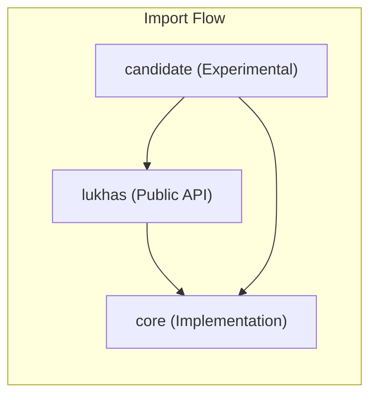
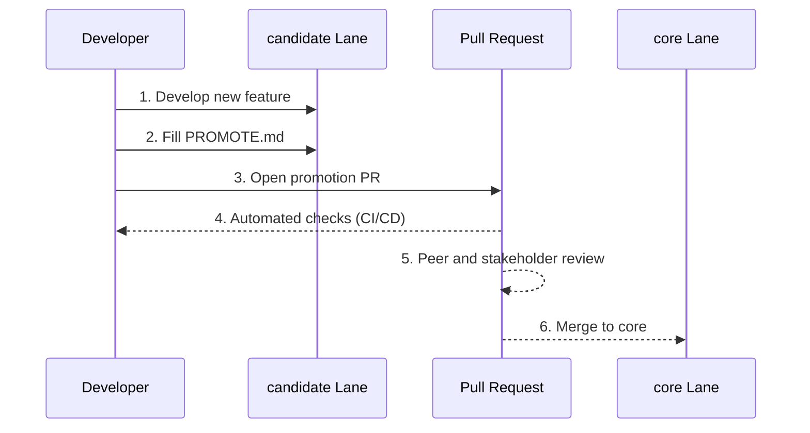

# LUKHAS Lane System Architecture

This document outlines the "lane system" architecture used in the LUKHAS AI project, which governs how code is organized, promoted, and imported across different stages of development. The system is designed to balance stability and innovation by providing clear separation between experimental, core, and legacy code.

## The Three Lanes

The LUKHAS codebase is divided into three primary lanes, each represented by a top-level directory: `candidate`, `core`, and `lukhas`.

### 1. `candidate` Lane: The Innovation Hub

-   **Purpose**: The `candidate` lane is the designated staging area for all new and experimental features. It provides an isolated environment for developers to build, test, and iterate on new capabilities without impacting the stability of the core system.
-   **Structure**: Modules within `candidate` are typically self-contained and focus on a specific feature or experiment.
-   **Stability**: Code in the `candidate` lane is considered experimental and may be unstable or subject to significant changes.

### 2. `core` Lane: The Stable Foundation

-   **Purpose**: The `core` lane contains the stable, production-ready components of the LUKHAS system. These are the foundational building blocks that have been rigorously tested and vetted through the promotion process.
-   **Structure**: The `core` module is organized into submodules representing key functional areas of the AI, such as orchestration, security, and memory.
-   **Stability**: The `core` lane is expected to be highly stable and reliable. Changes to this lane are carefully managed and undergo a thorough review process.

### 3. `lukhas` Lane: The Compatibility Shim

-   **Purpose**: The `lukhas` lane acts as a backward-compatibility layer and a stable, public-facing API for the LUKHAS system. As the codebase evolves and modules are refactored, the `lukhas` lane ensures that existing integrations and tools continue to function by providing a consistent import path.
-   **Structure**: This lane primarily re-exports functionality from the `core` and other top-level modules, creating a unified and stable namespace.
-   **Stability**: The `lukhas` lane is the most stable of the three and should only be updated to expose new, stable functionality from the `core` lane.

## Import Rules and Module Interaction

The lanes follow a strict, unidirectional import hierarchy to prevent circular dependencies and maintain architectural integrity. The stable, core implementation should not be aware of its consumers.

-   `lukhas` modules import from `core` to re-export functionality and provide a stable, public-facing API.
-   `core` modules **cannot** import from `candidate` or `lukhas`. They can only import from other `core` modules.
-   `candidate` modules can import from both `core` (for direct access to implementation) and `lukhas` (to use the stable public API).

This dependency structure ensures that the `core` remains a stable foundation, independent of the experimental code in `candidate` and the public-facing API in `lukhas`.



## Registry Patterns

The LUKHAS system uses registry patterns to dynamically discover and load modules, particularly for components like cognitive nodes and services. While the specific implementation may vary, the general pattern is as follows:

1.  A central registry is defined in the `core` module.
2.  Modules that implement a specific interface can register themselves with the registry upon initialization.
3.  The orchestrator or other high-level components can then query the registry to discover available implementations at runtime.

This pattern allows for a decoupled and extensible architecture, where new functionality can be added without modifying the core orchestration logic.

## The Promotion Process: `candidate` to `core`

Modules that have proven their value and stability in the `candidate` lane can be promoted to the `core` lane. This process is governed by the `PROMOTE.md` template and involves several key steps:

1.  **Documentation**: The module owner fills out the `PROMOTE.md` template, providing a detailed rationale, risk assessment, and rollback plan.
2.  **Acceptance Criteria**: The module must meet a strict set of acceptance criteria, including:
    -   High unit test coverage (>=90%).
    -   Passing static analysis, formatting, and security scans.
    -   Inclusion of integration tests and performance benchmarks where applicable.
    -   A thorough ethics assessment for any user- or model-facing changes.
3.  **Review and Approval**: The promotion proposal is submitted as a pull request and must be approved by the module owner, a tech lead, and at least two security reviewers.

This rigorous process ensures that only high-quality, well-tested, and secure code is integrated into the `core` system.



## Code Examples

To ensure stability and backward compatibility, always prefer importing from the `lukhas` namespace where possible.

```python
# Recommended import style
from lukhas.identity import WebAuthnCredentialStore
from lukhas.memory import EmbeddingIndex

# Avoid direct imports from core in external tools
# from core.security import ...

# Mocking for tests
# When testing a module that has dependencies on other modules,
# it is best practice to mock those dependencies to ensure
# test isolation.

import unittest
from unittest.mock import MagicMock
import sys

# Mock a missing or complex module
sys.modules['lukhas.some_complex_module'] = MagicMock()

from lukhas.some_module import MyClass

class TestMyClass(unittest.TestCase):
    def test_something(self):
        instance = MyClass()
        # ...
```
