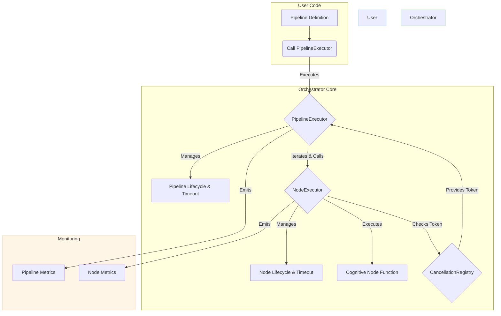
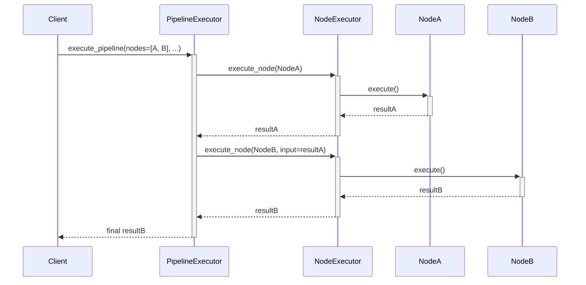
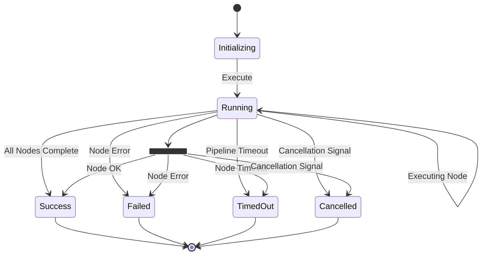
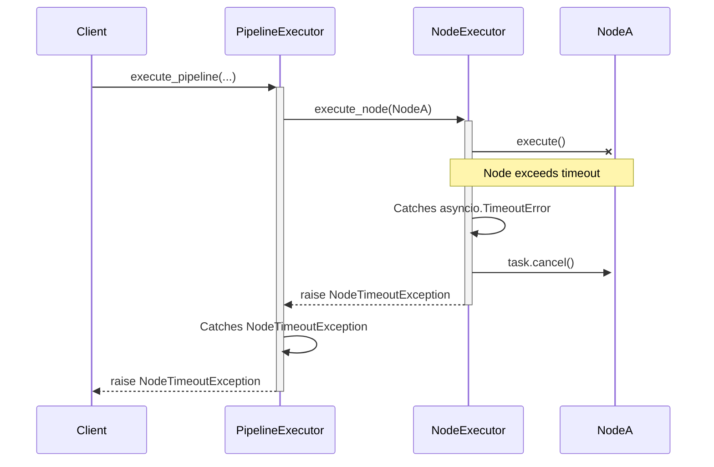

# LUKHAS Orchestrator Architecture

## 1. Overview

The LUKHAS Orchestrator is the backbone for executing complex, multi-stage cognitive workflows, known as pipelines. It is designed for high-performance, resilient, and observable execution of asynchronous tasks. Its primary role is to ensure that cognitive pipelines adhere to strict latency SLAs, handle failures gracefully, and provide mechanisms for control and introspection.

This document details the architecture of the orchestrator, covering its asynchronous design, pipeline execution model, timeout and cancellation mechanisms, and error recovery strategies.

## 2. Core Design Principles

The orchestrator is built upon four fundamental principles:

-   **Asynchronous by Design:** The entire execution flow is built on Python's `asyncio` library, enabling high-throughput, non-blocking I/O. This is critical for orchestrating cognitive nodes that may interact with external services (e.g., models, databases, APIs).
-   **Resilience and Fault Tolerance:** The system is designed to be resilient to failures. It provides robust timeout handling to prevent indefinite hangs and a clear error handling hierarchy to gracefully manage failures at both the node and pipeline level.
-   **Observability:** The orchestrator is instrumented to emit detailed metrics for performance monitoring and alerting. This provides deep insights into pipeline behavior, node performance, and error rates, which is essential for maintaining SLAs.
-   **Configurability:** Timeouts and other operational parameters are fully configurable, allowing operators to tune the orchestrator's behavior to meet the specific needs of different workloads.

## 3. Key Components

The orchestrator's architecture is composed of several key classes that collaborate to manage the pipeline lifecycle.

-   **`PipelineExecutor`**: The main entry point for executing a pipeline. It manages the overall pipeline timeout, orchestrates the sequence of node executions, and handles top-level error reporting.
-   **`NodeExecutor`**: Responsible for the execution of a single cognitive node. It enforces per-node timeouts, manages the node's lifecycle, and supports graceful cancellation.
-   **`CancellationRegistry`**: A centralized registry that manages cancellation tokens (`asyncio.Event`) for active pipelines. It provides a mechanism to signal cancellation to a running pipeline from an external context.
-   **`OrchestratorConfig` & `TimeoutConfig`**: Dataclasses that provide centralized configuration for all operational parameters, primarily timeout durations.
-   **Custom Exceptions**: A hierarchy of specific exceptions (`PipelineTimeoutException`, `NodeTimeoutException`, `CancellationException`) that allows for precise error handling by callers.



## 4. Architecture Deep Dive

### 4.1. Asynchronous Execution Model

The orchestrator leverages `asyncio` to execute pipelines concurrently and efficiently.

1.  **Pipeline as a Task:** The `PipelineExecutor` wraps the entire pipeline's execution in a single `asyncio.wait_for()` call. This enforces the top-level pipeline timeout.
2.  **Node as a Task:** The `NodeExecutor` executes each individual node function by creating an `asyncio.Task`. This allows the node to run concurrently while the executor monitors it for timeouts or cancellation signals.
3.  **Cancellation Handling:** The `_execute_with_cancellation` method in the `NodeExecutor` uses `asyncio.wait()` to listen for two events simultaneously: the completion of the node task and the setting of the cancellation token. This ensures that a cancellation signal is acted upon immediately, without waiting for the node to complete.

**Sequence Diagram: Successful Pipeline Execution**


### 4.2. Pipeline Stages & Lifecycle

A pipeline progresses through a defined set of states, from registration to completion or failure.

**State Diagram: Pipeline Lifecycle**


1.  **Initialization:** `PipelineExecutor` creates a `PipelineContext` to track the state of the execution, including the start time and a new cancellation token.
2.  **Execution Loop:** It iterates through the list of nodes, calling `NodeExecutor.execute_node()` for each one in sequence. The output of one node becomes the input for the next.
3.  **Termination:** The pipeline terminates in one of four states:
    *   **Success:** All nodes execute successfully within the time limits.
    *   **Pipeline Timeout:** The total execution time exceeds `pipeline_timeout_seconds`.
    *   **Node Timeout/Error:** A single node fails or exceeds `node_timeout_seconds`.
    *   **Cancelled:** The pipeline's cancellation token is set.

### 4.3. Timeout & Cancellation Handling

The orchestrator implements a multi-level timeout and cancellation strategy to ensure resilience.

**Sequence Diagram: Node Timeout Scenario**


-   **Node Timeout:** `NodeExecutor` uses `asyncio.wait_for()` to enforce the `node_timeout_seconds`. If a timeout occurs, it cancels the underlying `asyncio.Task` for the node, waits for a brief `cleanup_grace_seconds`, and raises a `NodeTimeoutException`.
-   **Pipeline Timeout:** `PipelineExecutor` uses a top-level `asyncio.wait_for()`. If it triggers, it immediately sets the pipeline's cancellation token. This signal propagates down to the currently executing node, causing it to terminate quickly via the cancellation mechanism. It then raises a `PipelineTimeoutException`, which includes the list of successfully completed nodes.
-   **Explicit Cancellation:** A pipeline can be cancelled by an external caller via the `CancellationRegistry`. The registry sets the pipeline's `asyncio.Event` token. The `NodeExecutor` is constantly monitoring this event and will raise a `CancellationException` as soon as it is set.

### 4.4. Error Recovery & Fault Tolerance

The orchestrator is designed to "fail fast" and provide clear, actionable exceptions.

-   **Exception Hierarchy:** The specific exceptions allow callers to distinguish between different failure modes and implement targeted recovery logic (e.g., retrying a pipeline that failed due to a node timeout vs. abandoning a pipeline that was cancelled).
-   **Stateful Exceptions:** `PipelineTimeoutException` contains the `completed_nodes` list. This allows callers to know how far the pipeline progressed before failing, which can be useful for debugging or partial recovery.
-   **No Automatic Retries:** The core orchestrator does not implement automatic retries. This is a deliberate design choice. Retries are considered a higher-level concern that should be implemented by the caller, as the decision to retry often depends on the specific error and the business context.

## 5. Code Examples

### Example 1: Basic Pipeline Execution

```python
import asyncio
from lukhas.orchestrator.pipeline import PipelineExecutor
from lukhas.orchestrator.config import OrchestratorConfig

# Mock missing lukhas modules for documentation example
import sys
from unittest.mock import MagicMock
sys.modules['lukhas.monitoring'] = MagicMock()
sys.modules['lukhas.monitoring.metrics'] = MagicMock()

async def fetch_data(query: dict) -> dict:
    print("Fetching data...")
    await asyncio.sleep(0.1)
    return {"data": "raw_data"}

async def process_data(input_data: dict) -> dict:
    print("Processing data...")
    await asyncio.sleep(0.1)
    return {"processed": True}

async def main():
    executor = PipelineExecutor(OrchestratorConfig())
    nodes = [("fetch", fetch_data), ("process", process_data)]

    try:
        result = await executor.execute_pipeline(
            pipeline_id="data_pipeline",
            nodes=nodes,
            initial_input={"query": "example"}
        )
        print(f"Pipeline succeeded with result: {result}")
    except Exception as e:
        print(f"Pipeline failed: {e}")

if __name__ == "__main__":
    asyncio.run(main())
```

### Example 2: Handling Timeouts

```python
# ... (imports and node definitions from above)
from lukhas.orchestrator.exceptions import NodeTimeoutException, PipelineTimeoutException
from lukhas.orchestrator.config import TimeoutConfig

async def slow_node(input_data: dict) -> dict:
    print("This node is slow...")
    await asyncio.sleep(1) # This will timeout
    return {"processed": True}

async def main():
    # Configure an aggressive timeout
    config = OrchestratorConfig(
        timeouts=TimeoutConfig(node_timeout_ms=100, pipeline_timeout_ms=500)
    )
    executor = PipelineExecutor(config)
    nodes = [("fetch", fetch_data), ("process_slow", slow_node)]

    try:
        await executor.execute_pipeline(
            pipeline_id="slow_pipeline",
            nodes=nodes,
            initial_input={"query": "example"}
        )
    except NodeTimeoutException as e:
        print(f"Node '{e.node_id}' timed out after {e.timeout_ms}ms.")
    except PipelineTimeoutException as e:
        print(f"Pipeline timed out. Completed nodes: {e.completed_nodes}")
    except Exception as e:
        print(f"An unexpected error occurred: {e}")

if __name__ == "__main__":
    asyncio.run(main())

```

## 6. Observability

The orchestrator is heavily instrumented with Prometheus metrics to provide visibility into its performance. Key metrics include:

-   `orchestrator_pipeline_duration_ms`: Histogram of end-to-end pipeline latency.
-   `orchestrator_node_duration_ms`: Histogram of individual node latency.
-   `orchestrator_pipeline_timeouts_total`: Counter for pipeline timeouts.
-   `orchestrator_node_timeouts_total`: Counter for node timeouts.

These metrics are crucial for setting up alerts on SLA violations (e.g., p95 latency > 250ms) and for identifying performance bottlenecks within complex pipelines. For detailed queries, see the `docs/orchestrator/TIMEOUTS.md` document.
