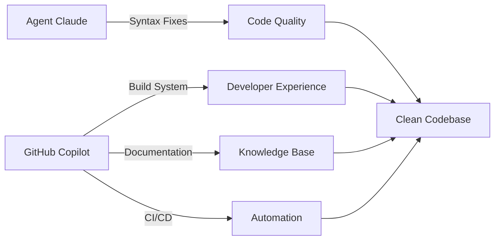

# 🤖 Parallel Agent Coordination Guide

**Maximizing Multi-Agent Efficiency for LUKHAS AI Development**

## 🎯 Current Scenario: Agent Claude + GitHub Copilot

**Active Example:** Agent Claude is handling syntax fixes while GitHub Copilot works on complementary tasks.

### ✅ Successful Parallel Workflow:



## 🎯 Parallel Task Coordination Principles

### 1. **Non-Interfering Domains**
- **Syntax Agent**: Focuses on code structure, imports, type hints
- **Infrastructure Agent**: Works on build systems, documentation, CI/CD
- **Testing Agent**: Develops test frameworks and validation
- **Security Agent**: Handles compliance and vulnerability scanning

### 2. **Complementary Task Selection**
When one agent is actively working, others should focus on:

#### ✅ Safe Parallel Tasks:
- **Documentation creation/updates** (docs/, README files)
- **Build system improvements** (Makefile, CI/CD workflows) 
- **Tool development** (scripts/, tools/, automation)
- **Configuration updates** (YAML, JSON config files)
- **Testing framework development** (test infrastructure, not test content)
- **Monitoring and analytics** (reports/, dashboards)

#### ⚠️ Avoid During Active Code Work:
- **Same file modifications** (causes merge conflicts)
- **Import structure changes** (interferes with syntax fixing)
- **Large refactoring** (competes with ongoing structural changes)
- **Dependency updates** (can break syntax work)

### 3. **Communication Protocol**

#### Before Starting Work:
```bash
# Check current agent status
git status --porcelain | head -10

# Look for active modifications
git log --oneline -5

# Check for agent coordination indicators
grep -r "Agent Claude\|Claude Code\|GitHub Copilot" . --include="*.md" --include="*.json" 2>/dev/null | tail -5
```

#### During Work:
- **Commit frequently** with clear agent identification
- **Use descriptive commit messages** indicating agent and domain
- **Avoid overlapping file domains** until coordination

#### Example Commit Messages:
```
🔧 [GitHub Copilot] Build System: T4 unused imports integration
🐛 [Agent Claude] Syntax: Fix F401 violations in consciousness/
📚 [GitHub Copilot] Docs: Create parallel agent coordination guide
🧪 [Testing Specialist] Tests: Add T4 system validation suite
```

## 🚀 Recommended Parallel Workflows

### Scenario A: Syntax Cleanup in Progress
**Active Agent:** Claude (syntax fixes)
**Parallel Opportunities:**
- Documentation enhancement and creation
- Build system optimization (Makefile, CI/CD)
- Tool development (scripts, automation)
- Monitoring dashboard implementation
- Security compliance documentation

### Scenario B: Architecture Refactoring
**Active Agent:** Architecture Specialist  
**Parallel Opportunities:**
- Test framework development
- Performance monitoring tools
- Documentation structure overhaul
- External integration setup
- Deployment automation

### Scenario C: Feature Development
**Active Agent:** Feature Developer
**Parallel Opportunities:**
- Unit test creation for new features
- Documentation for feature usage
- Integration test framework
- Performance benchmarking tools
- Security assessment of new features

## 🛠️ Parallel Development Tools

### Git Coordination:
```bash
# Create non-conflicting branches
git checkout -b feature/build-system-enhancement
git checkout -b feature/documentation-overhaul
git checkout -b feature/monitoring-dashboard

# Frequent sync points
git add . && git commit -m "🔄 [Agent] Sync point: <domain> work in progress"
```

### File System Organization:
```
lukhas/
├── core/                   # Agent Claude: Syntax fixes
├── api/                    # Agent Claude: Import cleanup  
├── docs/                   # GitHub Copilot: Documentation
├── tools/                  # GitHub Copilot: Build tools
├── .github/workflows/      # GitHub Copilot: CI/CD
├── scripts/                # GitHub Copilot: Automation
└── monitoring/             # GitHub Copilot: Dashboards
```

### Task Coordination Matrix:

| Domain | Agent Claude | GitHub Copilot | Testing Specialist | Security Specialist |
|--------|-------------|----------------|-------------------|-------------------|
| **Code Syntax** | ✅ Primary | ❌ Avoid | ❌ Avoid | ❌ Avoid |
| **Documentation** | ❌ Avoid | ✅ Primary | ✅ Secondary | ✅ Secondary |
| **Build System** | ❌ Avoid | ✅ Primary | ✅ Secondary | ❌ Avoid |
| **CI/CD** | ❌ Avoid | ✅ Primary | ✅ Secondary | ✅ Secondary |
| **Testing** | ❌ Avoid | ✅ Secondary | ✅ Primary | ❌ Avoid |
| **Security** | ❌ Avoid | ✅ Secondary | ❌ Avoid | ✅ Primary |

## 📊 Success Metrics

### Parallel Efficiency Indicators:
- **Zero merge conflicts** between agent work
- **Complementary progress** across multiple domains
- **Fast integration cycles** (daily or more frequent)
- **Clean commit history** with clear agent attribution

### Quality Gates:
- All agent work passes CI/CD validation
- Documentation stays current with code changes
- No cross-agent dependency blocks
- Clear handoff protocols when domains overlap

## 🎯 Best Practices for Agent Coordination

### 1. **Domain Expertise Assignment**
- Assign agents to their strength domains
- Avoid domain overlap during active development
- Clear escalation paths for cross-domain issues

### 2. **Timing Coordination**
- Syntax/structure work gets priority (foundational)
- Documentation and tooling work in parallel
- Testing follows structural stability
- Security assessment after feature completion

### 3. **Integration Points**
- **Daily sync commits** for coordination
- **Weekly integration merges** for major work
- **Feature completion handoffs** between agents
- **Quality gate validation** before promotion

---

**🎭 Trinity Framework Integration:** This coordination follows ⚛️🧠🛡️ principles with authentic agent identity, consciousness-aware workflows, and guardian system protection.

**Generated by:** GitHub Copilot (Deputy Assistant)  
**Date:** September 12, 2025  
**Purpose:** Optimizing multi-agent development efficiency for LUKHAS AI platform