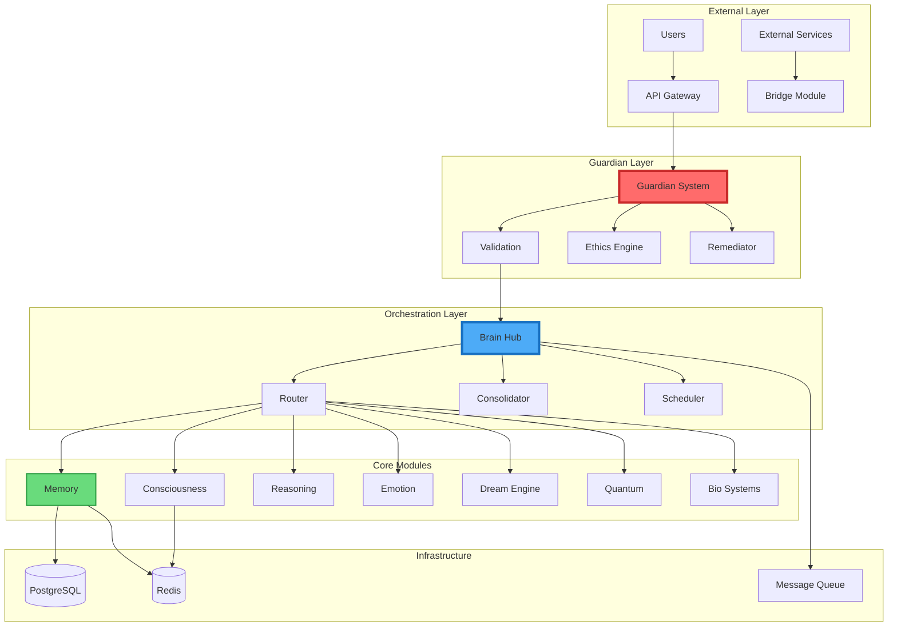
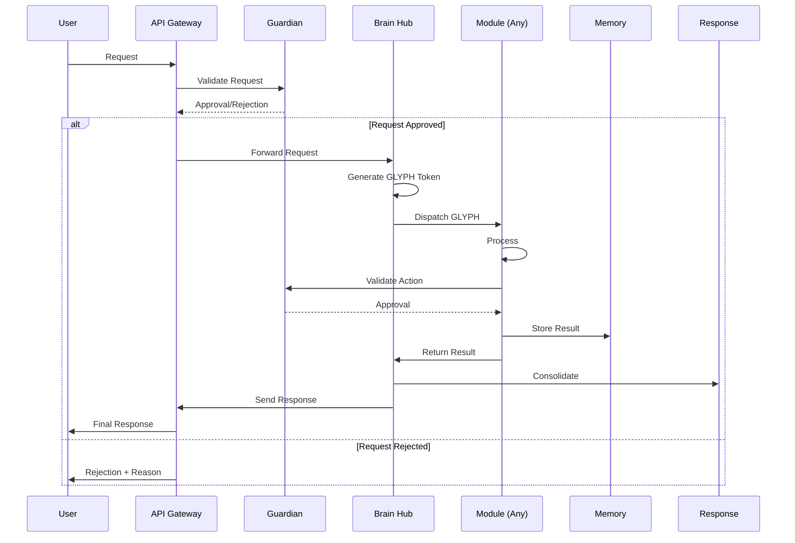
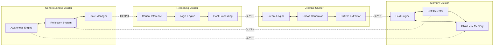
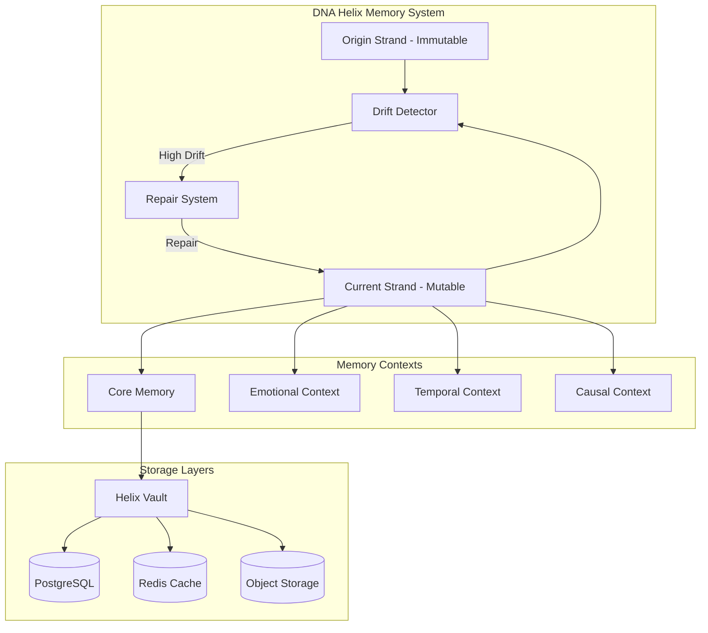
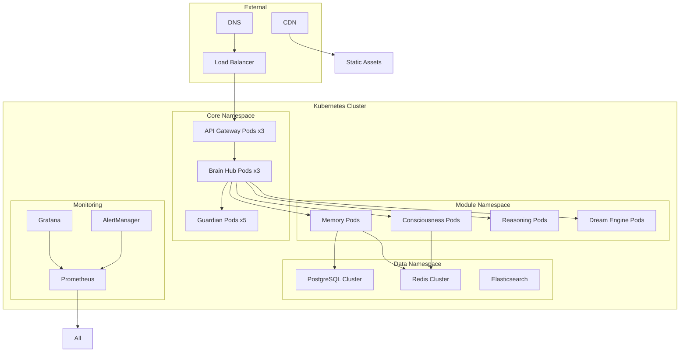
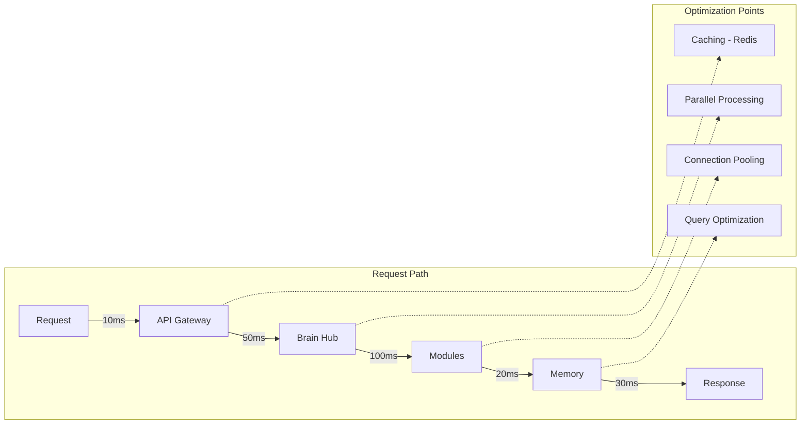
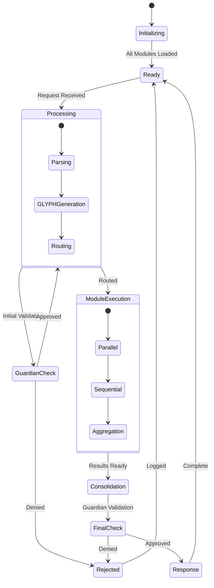
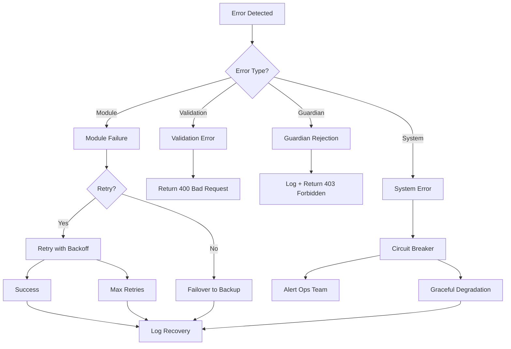

# LUKHAS  Architecture Diagrams

## System Architecture Overview



## Data Flow Architecture



## Module Interaction Map



## Security Architecture

```mermaid
graph TB
    subgraph "Security Layers"
        L1[Application Security]
        L2[Guardian Protection]
        L3[Module Isolation]
        L4[Infrastructure Security]
    end
    
    subgraph "Application Security"
        A1[Input Validation]
        A2[Rate Limiting]
        A3[Token Auth]
    end
    
    subgraph "Guardian Protection"
        G1[Ethics Validation]
        G2[Threat Detection]
        G3[Behavioral Analysis]
        G4[Symbolic Firewall]
    end
    
    subgraph "Module Isolation"
        M1[Capability Control]
        M2[Resource Quotas]
        M3[Sandbox Execution]
    end
    
    subgraph "Infrastructure Security"
        I1[Network Segmentation]
        I2[Encryption]
        I3[Key Management]
        I4[Audit Logging]
    end
    
    L1 --> A1 & A2 & A3
    L2 --> G1 & G2 & G3 & G4
    L3 --> M1 & M2 & M3
    L4 --> I1 & I2 & I3 & I4
```



## Memory Architecture



## Deployment Architecture



## Performance Flow



## State Management



## Error Handling Flow



## Module Lifecycle

```mermaid
graph LR
    subgraph "Module Lifecycle"
        Init[Initialize] --> Reg[Register with Guardian]
        Reg --> Load[Load Configuration]
        Load --> Ready[Ready State]
        Ready --> Proc[Process Requests]
        Proc --> Ready
        Ready --> Pause[Pause for Update]
        Pause --> Update[Hot Reload]
        Update --> Ready
        Ready --> Term[Terminate]
        Term --> Clean[Cleanup]
        Clean --> [*]
    end
    
    subgraph "Health Monitoring"
        Ready -.-> HC[Health Check]
        HC -->|Healthy| OK[Continue]
        HC -->|Unhealthy| Restart[Restart Module]
        Restart --> Init
    end
```

These diagrams provide a visual representation of LUKHAS 's architecture, showing:
1. Overall system structure and layers
2. Data flow through the system
3. Module interactions and dependencies
4. Security architecture
5. Memory system design
6. Deployment topology
7. Performance considerations
8. State management
9. Error handling
10. Module lifecycle management