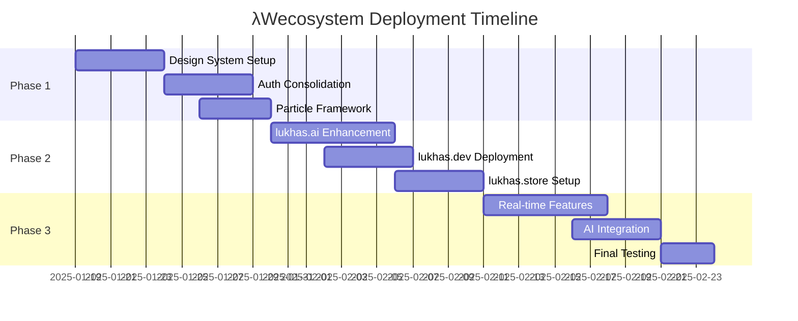

# 🌐 λWecosystem Unified Deployment Strategy

## Executive Summary

This document outlines the comprehensive deployment strategy for integrating existing LUKHAS web projects across the λWecosystem domains. We have identified **6 major web project collections** with **50+ distinct interfaces** ready for strategic deployment across 9 primary domains.

---

## 📊 Complete Web Projects Inventory

### 🎯 Production-Ready Projects

#### 1. **LUKHAS Main Website** (Active)
- **Location**: `/lukhas_website/`
- **Technology**: Next.js 14, React, TypeScript, Tailwind CSS
- **Status**: ✅ Production Ready (localhost:3004)
- **Features**:
  - Consciousness branding implemented
  - Constellation Framework integration
  - Product grid with λ ecosystem
  - Hero sections with particle effects ready
  - Career, compliance, and vision pages

#### 2. **LUKHAS Visual Studio**
- **Location**: `/web_projects/lukhas_studio/lukhas_visual_studio_clean/`
- **Technology**: React + Vite, Radix UI, Tailwind, Microservices
- **Architecture**:
  - API Gateway with FastAPI
  - 6 Microservices (Auth, Trust Scorer, Steganography, etc.)
  - React Native mobile app
  - Docker containerization ready
- **Features**:
  - Advanced component library (40+ Radix UI components)
  - Real-time chat interface
  - Visual generator service
  - Entropy synchronization

#### 3. **Enterprise Chat Interface**
- **Location**: `/web_projects/team_dashboards/lambda_bot_enterprise_chat.html`
- **Technology**: Standalone HTML5, Advanced CSS3, Vanilla JS
- **Features**:
  - Glassmorphism design
  - Constellation Framework glyphs (⚛️🧠🛡️)
  - Real-time messaging UI
  - 605 lines of optimized code

#### 4. **Three.js Particle Visualizer**
- **Location**: `/web_projects/team_dashboards/threejs_visualizer.js`
- **Technology**: Three.js, WebGL
- **Features**:
  - AI-controlled particle systems
  - Consciousness state visualization
  - Real-time entropy response
  - 612 lines of advanced 3D code

#### 5. **Team Dashboard System**
- **Location**: `/web_projects/team_dashboards/interfaces/`
- **Technology**: Python/Streamlit, FastAPI
- **Components**:
  - Dev Dashboard
  - Research Dashboard
  - Universal Adaptive Dashboard
  - WebSocket server
  - Agent logic system

### 🔧 Development Projects

#### 6. **Lambda Web Ecosystem Collection**
- **Location**: `/web_projects/additional_interfaces/web-interfaces/`
- **Sub-projects**:
  - Lambda Web AI assets
  - Lambda Web ID backend
  - Next.js apps with content strategy
  - React studio experiences
  - Web consolidated systems
  - Production-ready auth systems

---

## 🌍 Domain-to-Project Mapping Strategy

### Primary Domain Assignments

| Domain | Primary Project | Secondary Projects | Purpose |
|--------|----------------|-------------------|---------|
| **lukhas.ai** | Main Website (Enhanced) | Enterprise Chat, Particle Visualizer | Core consciousness platform |
| **lukhas.dev** | Visual Studio Clean | Team Dashboards, Dev Tools | Developer ecosystem |
| **lukhas.store** | Lambda Web Ecosystem | Product Grid from Main Site | Application marketplace |
| **lukhas.id** | Auth Systems (Consolidated) | QR Glyphs, Identity Interfaces | Authentication hub |
| **lukhas.io** | API Gateway + Dashboards | WebSocket Server, Real-time Tools | I/O and data flow |
| **lukhas.cloud** | Microservices Suite | Docker Containers, K8s Configs | Cloud infrastructure |
| **lukhas.team** | Team Dashboard System | Enterprise Chat, Collaboration Tools | Team collaboration |
| **lukhas.xyz** | Three.js Visualizer | Experimental Interfaces | Research & experiments |
| **lukhas.eu/us** | Compliance Pages | Regional Variations | Regional services |

---

## 🔄 Integration Strategy

### Phase 1: Core Infrastructure (Weeks 1-2)
1. **Unified Design System**
   - Extract Radix UI components from Visual Studio
   - Create shared Tailwind configuration
   - Establish consciousness color palette across all projects
   - Implement consistent typography (Inter/SF Pro)

2. **Authentication Layer**
   - Consolidate auth systems from multiple projects
   - Implement LUKHAS ID SSO across domains
   - Deploy QR glyph authentication
   - Set up JWT token management

3. **Particle System Framework**
   - Extract Three.js visualizer as npm package
   - Create React/Next.js wrapper components
   - Implement WebGL fallbacks
   - Optimize for 60fps across devices

### Phase 2: Domain Deployment (Weeks 3-4)
1. **lukhas.ai Enhancement**
   - Integrate particle system into hero section
   - Add consciousness state indicators
   - Implement real-time chat widget
   - Connect to Guardian System

2. **lukhas.dev Setup**
   - Deploy Visual Studio interface
   - Configure microservices orchestration
   - Launch developer documentation
   - Enable API playground

3. **lukhas.store Marketplace**
   - Migrate Lambda ecosystem interfaces
   - Implement app installation flow
   - Create developer submission portal
   - Set up payment integration

### Phase 3: Advanced Features (Weeks 5-6)
1. **Real-time Capabilities**
   - Deploy WebSocket infrastructure
   - Implement live particle synchronization
   - Enable cross-domain state sharing
   - Create consciousness broadcasting

2. **AI Integration**
   - Connect LUKHAS consciousness models
   - Implement particle behavior AI control
   - Deploy chat bot intelligence
   - Enable predictive UI adaptation

---

## 🏗️ Deployment Architecture

### Technical Stack Consolidation

```yaml
Frontend:
  Primary: Next.js 14 + React 18
  Styling: Tailwind CSS + Radix UI
  3D: Three.js + React Three Fiber
  Animation: Framer Motion + GSAP

Backend:
  API: FastAPI (Python)
  Microservices: Docker + Kubernetes
  Real-time: WebSocket + Socket.io
  Database: PostgreSQL + Redis

Infrastructure:
  CDN: Cloudflare
  Hosting: Vercel (Frontend) + AWS (Backend)
  Container: Docker + K8s
  Monitoring: Prometheus + Grafana
```

### Unified Build Pipeline

```bash
# Root monorepo structure
lukhas-web/
├── apps/
│   ├── main-site/        # lukhas.ai
│   ├── dev-portal/       # lukhas.dev
│   ├── marketplace/      # lukhas.store
│   └── id-system/        # lukhas.id
├── packages/
│   ├── ui-components/    # Shared Radix UI
│   ├── particle-engine/  # Three.js systems
│   ├── auth-sdk/         # LUKHAS ID SDK
│   └── consciousness/    # AI connectors
├── services/
│   ├── api-gateway/
│   ├── microservices/
│   └── websocket-server/
└── infrastructure/
    ├── docker/
    ├── kubernetes/
    └── terraform/
```

---

## 📈 Project Optimization Plan

### Projects to Merge
1. **Authentication Systems**: Consolidate 4 separate auth implementations
2. **Dashboard Variants**: Unify team, dev, and research dashboards
3. **Studio Versions**: Merge v1 and v2 into single stable version

### Projects to Archive
1. Duplicate backup folders in additional_interfaces
2. Legacy standalone HTML files (keep as reference)
3. Incomplete web-ideas prototypes

### Projects to Enhance
1. **Three.js Visualizer**: Convert to reusable npm package
2. **Enterprise Chat**: Upgrade to React component
3. **Visual Studio**: Add consciousness branding layer

---

## 📊 Resource Allocation

### Development Team Structure

| Team | Focus Area | Priority Projects |
|------|------------|-------------------|
| **Core Platform** (3 devs) | lukhas.ai enhancement | Main website, Particle integration |
| **Developer Experience** (2 devs) | lukhas.dev, documentation | Visual Studio, API docs |
| **Infrastructure** (2 devs) | Deployment, DevOps | Docker, K8s, CI/CD |
| **Identity Team** (1 dev) | lukhas.id, auth | SSO, QR glyphs |
| **3D/Graphics** (1 dev) | Particle systems | Three.js optimization |

### Timeline & Milestones



---

## 🚀 Immediate Actions

### Week 1 Priorities
1. ✅ Set up monorepo structure with Turborepo/Nx
2. ✅ Extract and consolidate UI components
3. ✅ Deploy staging environments for each domain
4. ✅ Implement shared authentication service
5. ✅ Create particle system npm package

### Quick Wins
- Deploy Enterprise Chat as widget on lukhas.ai
- Add Three.js visualizer to main site hero
- Launch lukhas.dev with existing Visual Studio
- Enable LUKHAS ID SSO across domains

---

## 🎯 Success Metrics

### Technical KPIs
- Page load time < 3 seconds
- Lighthouse score > 90
- 60fps particle animations
- 99.9% uptime across domains

### Business KPIs
- Unified user experience across ecosystem
- Single sign-on adoption > 80%
- Developer portal engagement
- Marketplace app submissions

---

## 🔒 Risk Mitigation

### Technical Risks
- **Performance**: Implement progressive enhancement for particles
- **Compatibility**: Ensure WebGL fallbacks
- **Scalability**: Use CDN and edge functions
- **Security**: Regular audits and penetration testing

### Deployment Risks
- **Rollback Strategy**: Maintain previous versions for quick revert
- **Feature Flags**: Gradual rollout of new features
- **Monitoring**: Real-time alerts for critical issues
- **Documentation**: Comprehensive deployment guides

---

## 📋 Conclusion

We have a robust collection of web projects ready for strategic deployment across the λWecosystem. By consolidating redundant systems, enhancing core experiences with consciousness technology, and creating a unified deployment architecture, we can launch a world-class AI platform ecosystem that showcases LUKHAS's consciousness capabilities.

**Total Assets**:
- 6 major project collections
- 50+ distinct interfaces
- 9 domain deployments
- 1 unified consciousness experience

**Next Step**: Begin Phase 1 implementation with monorepo setup and component extraction.

---

*Generated: January 18, 2025*
*Status: Ready for Implementation*
*Version: 1.0.0*
