# API Onboarding Usage Guide

**Trinity Framework**: ⚛️ Identity · 🛡️ Guardian  
**Version**: 1.0  
**Last Updated**: 2025-10-08

---

## Overview

The LUKHAS API Onboarding system provides a streamlined, consciousness-aware user registration and authentication flow with **ΛID** (Lambda ID) integration and GDPR compliance.

## Features

- **Tier-Based Registration**: Alpha, Beta, Gamma, Delta tiers with graduated access
- **ΛID Generation**: Automatic symbolic identity creation (`Λ_{tier}_{user_id}`)
- **GDPR Compliance**: Built-in consent management and data processing transparency
- **JWT Integration**: Seamless token-based authentication with embedded ΛID claims
- **Rate Limiting**: Tier-based API rate limits (Alpha: 3.0x, Beta: 2.0x, Gamma: 1.5x, Delta: 1.0x)

---

## Quick Start

### 1. User Registration

```python
from candidate.bridge.api.onboarding import OnboardingService

# Initialize service
onboarding = OnboardingService()

# Create new user
result = await onboarding.create_user(
    tier="alpha",
    email="user@example.com",
    consent_gdpr=True,
    consent_data_processing=True
)

print(result)
# {
#     "user_id": "user_abc123",
#     "lambda_id": "Λ_alpha_user_abc123",
#     "tier": "alpha",
#     "created_at": "2025-10-08T12:00:00Z",
#     "jwt_token": "eyJhbGc..."
# }
```

### 2. Tier Validation

```python
# Validate user tier before privileged operations
is_valid = onboarding.validate_tier(user_tier="alpha", required_tier="beta")

if is_valid:
    # User has sufficient access
    perform_privileged_operation()
```

### 3. GDPR Consent Management

```python
# Check consent status
consent_status = await onboarding.get_consent_status(user_id="user_abc123")

# Update consent preferences
await onboarding.update_consent(
    user_id="user_abc123",
    consent_gdpr=True,
    consent_marketing=False
)
```

---

## Access Tiers

| Tier | Multiplier | Rate Limit (req/min) | Features |
|------|------------|----------------------|----------|
| **Alpha (⚛️)** | 3.0x | 300 | Full API access, priority support, advanced features |
| **Beta (🧠)** | 2.0x | 200 | Enhanced access, beta features, standard support |
| **Gamma (✦)** | 1.5x | 150 | Standard access, core features |
| **Delta (🛡️)** | 1.0x | 100 | Basic access, essential features |

---

## Authentication Flow

```mermaid
graph LR
    A[User Registration] --> B[ΛID Generation]
    B --> C[JWT Token Creation]
    C --> D[Token Returned]
    D --> E[API Access]
    E --> F[Rate Limiting]
```



---

## API Endpoints

### `POST /api/v1/onboarding/register`

**Request:**
```json
{
  "tier": "alpha",
  "email": "user@example.com",
  "password": "secure_password_123",
  "consent_gdpr": true,
  "consent_data_processing": true
}
```

**Response:**
```json
{
  "user_id": "user_abc123",
  "lambda_id": "Λ_alpha_user_abc123",
  "tier": "alpha",
  "jwt_token": "eyJhbGc...",
  "created_at": "2025-10-08T12:00:00Z"
}
```

### `GET /api/v1/onboarding/status/{user_id}`

**Response:**
```json
{
  "user_id": "user_abc123",
  "lambda_id": "Λ_alpha_user_abc123",
  "tier": "alpha",
  "active": true,
  "consent_status": {
    "gdpr": true,
    "data_processing": true,
    "marketing": false
  }
}
```

---

## GDPR Compliance

### Data Collection
- **Email**: Required for account creation
- **Password**: Hashed using bcrypt (never stored in plaintext)
- **Consent Preferences**: Tracked with timestamps
- **Activity Logs**: ΛTRACE audit trail for transparency

### User Rights
- **Right to Access**: `GET /api/v1/onboarding/data-export/{user_id}`
- **Right to Deletion**: `DELETE /api/v1/onboarding/account/{user_id}`
- **Right to Rectification**: `PATCH /api/v1/onboarding/profile/{user_id}`
- **Right to Portability**: JSON export of all user data

---

## Error Handling

```python
from candidate.bridge.api.exceptions import (
    OnboardingError,
    TierValidationError,
    ConsentRequiredError
)

try:
    result = await onboarding.create_user(tier="alpha", ...)
except ConsentRequiredError:
    print("GDPR consent is required")
except TierValidationError:
    print("Invalid tier specified")
except OnboardingError as e:
    print(f"Onboarding failed: {e}")
```

---

## Best Practices

1. **Always Validate Consent**: Ensure GDPR consent is explicitly provided
2. **Use Appropriate Tiers**: Match tier to user needs (don't over-provision)
3. **Implement Rate Limiting**: Respect tier-based rate limits
4. **Secure Token Storage**: Store JWT tokens securely (HttpOnly cookies)
5. **Monitor ΛID Usage**: Track ΛID for audit and compliance purposes

---

## Performance Considerations

- **Onboarding Time**: <100ms average (SLA target)
- **Token Generation**: <10ms per token
- **Tier Validation**: <5ms per check
- **Database Queries**: Indexed on `user_id` and `lambda_id`

---

## Testing

```python
import pytest
from candidate.bridge.api.onboarding import OnboardingService

@pytest.mark.asyncio
async def test_onboarding_flow():
    onboarding = OnboardingService()
    
    result = await onboarding.create_user(
        tier="beta",
        email="test@example.com",
        consent_gdpr=True
    )
    
    assert result["tier"] == "beta"
    assert result["lambda_id"].startswith("Λ_beta")
```

---

## Support & Resources

- **Documentation**: [https://docs.lukhas.ai/onboarding](https://docs.lukhas.ai/onboarding)
- **API Reference**: [https://api.lukhas.ai/docs](https://api.lukhas.ai/docs)
- **Support Email**: support@lukhas.ai
- **GitHub Issues**: [https://github.com/lukhas-ai/lukhas/issues](https://github.com/lukhas-ai/lukhas/issues)

---

**🛡️ Guardian-Approved | ⚛️ Consciousness-Aware | 🌟 Trinity Framework Compliant**
