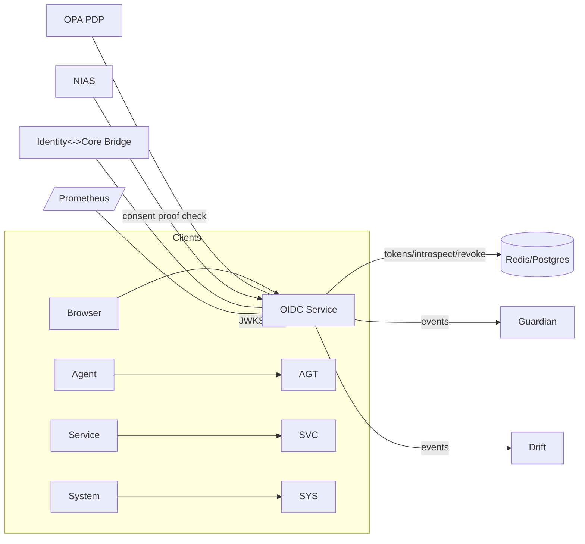

# Lukhas_ID system improvement plan
---

# Executive plan (one line)

Fix the identity system by **hardening storage & crypto**, **exposing standards (JWKS, introspection)**, **productionizing WebAuthn**, **adding durable consent & audit**, **OPA/ABAS integration**, and **T4-grade governance (DPIA, threat model, red-team)** — in order.

---

# Critical (P0) — must ship before any public demo

These are safety / correctness items. Paste each prompt into Claude Code Web to implement.

---

## 1 — Replace in-memory secrets & tokens with production stores (Redis + encrypted DB)

**Why**: `lambda_id_core.py` holds `challenges`, `credentials`, and `token_data` in in-memory dicts — not suitable for distributed/production deployment. 
**What to deliver**:

* `core/identity/storage/redis_token_store.py` — Redis-based token store with TTL and token revocation.
* `core/identity/storage/webauthn_store.py` — encrypted DB (Postgres) credential store for WebAuthn credentials; secrets encrypted at rest using KMS/secret key.
* Migration helpers and unit tests.

**Acceptance criteria**

* Tests simulate concurrent token creation/validation, TTL expiry, revocation.
* WebAuthn credentials persist and retrieved securely by id.
* Clear README showing env vars (`REDIS_URL`, `DB_URL`, `KMS_KEY_NAME`).

**Estimate**: 6–10 hours.

**Claude prompt (paste-ready)**:

```
Create Redis and Postgres-backed stores for Lukhas_ID.

Files:
1) core/identity/storage/redis_token_store.py
2) core/identity/storage/webauthn_store.py
3) tests/identity/test_redis_token_store.py
4) tests/identity/test_webauthn_store.py
5) docs/identity/DEPLOYMENT_STORAGE.md

Requirements:
- redis_token_store implements: store_access_token(token, metadata, ttl), validate(token), revoke(token), introspect(token) and uses strict TTL and atomic ops (Lua or SETEX + GET).
- webauthn_store uses SQLAlchemy (sqlite for tests) with encrypted fields for private credential info. Use AES-GCM and env var KMS_KEY (wrap key) for encryption; include a simple crypto helper that supports rotate_key(new_key) and rewrap.
- Add tests that assert concurrent writes/read are safe, TTL expiry works, and revocation blocks tokens immediately.

Return only files with code + brief usage examples at the end of each file.
```

---

## 2 — Replace HS256 ephemeral signing with proper asymmetric keys + JWKS + key rotation

**Why**: `OIDCProvider` currently uses a symmetric random `signing_key` (HS256) generated in memory — this is insecure for an OIDC provider and incompatible with most real OIDC clients. You need RS256/ES256 with a JWKS endpoint and rotation. 

**What to deliver**

* `core/identity/keys.py` — key manager to load/generate keys (RS256/ES256), expose current kid, rotate keys safely, integrate with KMS.
* `core/identity/jwks_endpoint.py` — FastAPI route `/.well-known/jwks.json` returning public jwks.
* Update `OIDCProvider` to sign with current private key using RS256/ES256 and include `kid` header; support validating tokens via JWKS.
* Unit tests: issuance, rotation, validation.

**Acceptance criteria**

* ID tokens issued with RS256/ES256 and verifiable via JWKS.
* Key rotation test: old tokens remain valid for configured TTL; new tokens signed with new kid.

**Estimate**: 4–8 hours.

**Claude prompt**:

```
Implement asymmetric key handling and JWKS endpoint for LUKHAS OIDC.

Tasks:
1) core/identity/keys.py — KeyManager class that:
   - loads keys from disk or KMS (PEM files), supports RSA and EC,
   - provides get_private_key(kid), get_public_jwk(kid), current_kid, rotate_keys(new_key),
   - safe fallback for local dev (generate ephemeral keys).

2) core/identity/jwks_endpoint.py — FastAPI router exposing '/.well-known/jwks.json' with all active public keys (jwk format), appropriate cache headers.

3) Modify OIDCProvider.issue_id_token to sign with KeyManager.current_kid private key using RS256 or ES256, include 'kid' header.

4) tests/identity/test_jwks.py — Test jwks, signing, and validation using PyJWT.

Add docs/identity/JWKS_AND_KEY_ROTATION.md with recommended rotation strategy and CI checks.
```

---

## 3 — Add Token Introspection & Revocation (RFC7662 style)

**Why**: Token validation currently ad-hoc; need standardized introspection endpoint and revocation flow for secure token lifecycle (logout, emergency revoke). 

**What to deliver**

* `core/identity/oidc_introspection.py` — `/oauth2/introspect` endpoint per RFC7662, protected by client auth.
* `core/identity/revocation.py` — `/oauth2/revoke` and token revocation logic integrated with Redis token store.
* Tests and example cURL flows.

**Acceptance criteria**

* Introspection returns `active` boolean, `exp`, `scope`, `sub`, etc.
* Revocation marks token revoked; introspection shows inactive after revocation.

**Estimate**: 3–5 hours.

**Claude prompt**:

```
Implement RFC7662 introspection and token revocation.

Files:
- core/identity/oidc_introspection.py (FastAPI router)
- core/identity/revocation.py (helpers)
- tests/identity/test_introspect_revoke.py

Requirements:
- Introspection must require client authentication (Bearer or Basic) and return JSON as per RFC7662.
- Revoke must support both access and refresh tokens and remove them from Redis/store.
- Add usage examples and tests.
```

---

## 4 — Productionize WebAuthn: use `fido2` library + attestation verification + DB backup + threat protections

**Why**: `WebAuthnPasskeyManager` stores credentials in memory and doesn’t fully validate attestation. Need full FIDO2 flow with attestation verification, resident key handling, rate limits, and encrypted storage. 

**What to deliver**

* Replace in-memory manager with `core/identity/webauthn_manager.py` using `fido2` library.
* Persist credentials to `webauthn_store` (from TODO#1), implement attestation verification, signature counter checks, and rate-limiting.
* CI tests using `python-fido2` helper flows.

**Acceptance criteria**

* Registration and authentication tests pass across typical browser flows (simulate client with `fido2` test helpers).
* Credentials are stored encrypted, counters enforced, and invalid attestations rejected.

**Estimate**: 6–12 hours.

**Claude prompt**:

```
Implement production WebAuthn support using python-fido2 in core/identity/webauthn_manager.py, integrated with core/identity/storage/webauthn_store.py. 
Deliver tests that simulate a registration and an assertion using fido2.test vectors; include attestation verification, signature counter enforcement, and encrypted persistence.
```

---

# High-impact (P1) — functionality & governance

---

## 5 — Consent proof & GDPR-safe consent store

**Why**: The identity README and manifest require `consent_id` and Constellation proof, but code doesn’t persist consent proofs securely. Need HMAC proof, TTL, consent revocation handling. 

**What to deliver**

* `core/identity/consent_store.py` — HMAC(salt, tc_string) + timestamp storage, TTL, lookup.
* Consent proof helper integrated with registration and token issuance.
* Tests and DPIA checklist stub.

**Acceptance**

* No raw TC strings stored; proof verification works and consent revocation invalidates personalization tokens.

**Estimate**: 3–4 hours.

**Claude prompt**:

```
Implement consent proof store: core/identity/consent_store.py:
- store_consent_proof(hmac_hash, meta), verify_consent(hash), revoke_consent(hash)
- Use env var CONSENT_PROOF_SALT; provide salt rotation helper and migration script.

Add tests and docs/identity/CONSENT_PROCESS.md.
```

---

## 6 — OPA/ABAS integration for identity actions (policy enforcement)

**Why**: You already have matrix/OPA identity policy (`policies/matrix/identity.rego`). Identity middleware should query ABAS for step-up and policy checks (we did ABAS middleware earlier for NIAS). Wire identity endpoints to consult OPA for `step_up_ok` etc. 

**What to deliver**

* `core/identity/middleware/abas_identity_middleware.py` calling ABAS PDP for key identity routes (register, authenticate, token exchange) and honoring step-up/deny decisions.
* Tests demonstrating ABAS denies when policy fails.

**Acceptance**

* Step-up policy in Rego tested via `opa test`, and middleware enforces decisions (403/503).

**Estimate**: 3–5 hours.

**Claude prompt**:

```
Create ABAS identity middleware that:
- intercepts identity-sensitive routes (/register, /authenticate, /oidc/token),
- posts input to OPA (policies/matrix/identity.rego),
- enforces allow/deny, fetches 'reason' when deny, supports caching.

Add tests mocking OPA.
```

---

## 7 — Observability: Prometheus metrics & tracing

**Why**: Manifest imposes strict latency targets. Add metrics to measure p95 and failures. 

**What**

* Instrument key components: `LukhasIDGenerator`, OIDC endpoints, WebAuthn manager, ABAS calls — export counters and histograms.
* Add simple tracing headers (X-Trace-Id) propagation.

**Acceptance**

* Prometheus metrics endpoint `/metrics` with `identity_auth_latency_seconds{quantile="0.95"}` style histograms.

**Estimate**: 2–4 hours.

**Claude prompt**:

```
Instrument identity components with prometheus_client: add metrics for issuance latency, auth p95, ABAS PDP latency, webauthn registration failures. Provide a /metrics endpoint and sample Grafana panel JSON.
```

---

# Medium (P2) — security & process improvements

---

## 8 — Threat model + DPIA + Red-team harness (T4)

**Why**: Identity is highest-risk surface: minors, special categories, consent, token leakage. Need T4-style scrutiny. 

**What**

* STRIDE/ATT&CK threat model document.
* DPIA draft for NIAS + ΛiD.
* Red-team harness to simulate token leakage, replay, passkey extraction, OPA DoS.

**Acceptance**

* Documented threats + mitigations, risk matrix, and runnable red-team test scripts.

**Estimate**: 8–16 hours.

**Claude prompt**:

```
Produce a STRIDE/ATT&CK threat model for Lukhas_ID: enumerate threats, likelihood, impact, mitigation, residual risk. Create a DPIA template for Lukhas_ID and a red-team test harness (pytest scripts) that simulate token replay, OPA failure, credential export attempts.
```

---

## 9 — Unit & integration test coverage goal: 90% on identity lane

**Why**: Many identity files are “CRITICAL” but have placeholders. We need robust test coverage for all identity flows. 

**What**

* Tests for ΛID generator edge cases, invalid metadata, concurrency; OIDC token issuance/validation; WebAuthn flows; ABAS policy enforcement; stores.

**Acceptance**

* `pytest --maxfail=1 --disable-warnings` passes; coverage >= 90% for identity packages.

**Estimate**: 8–12 hours.

**Claude prompt**:

```
Create a comprehensive test-suite for core/identity covering ΛID generation edge cases (invalid metadata, concurrent generation), OIDC token issuance/validation, webauthn register/assert flows (mock fido2), KeyManager rotation, Redis token scenarios, and ABAS policy enforcement. Add CI job identity-tests.yml to run these.
```

---

## 10 — Documentation: API docs + Developer guides + Runbooks

**Why**: The manifest relies on developer-run activities and Constellation integration. Provide clear runbooks for key operations (rotate keys, rotate salts, revoke tokens, run OPA tests), and public API docs for Lukhas_ID. 

**Acceptance**

* `docs/identity/API.md`, `docs/identity/OPERATIONS.md`, `docs/identity/DPIA.md` exist and are concise.

**Estimate**: 3–6 hours.

**Claude prompt**:

```
Generate identity API docs and runbooks:
- docs/identity/API.md: endpoints: /oauth2/token, /oauth2/introspect, /.well-known/jwks.json, /nias/serve sample
- docs/identity/OPERATIONS.md: key rotation, salt rotation, revoke emergency steps.
- docs/identity/DPIA.md: skeleton for legal review.
```

---

# Low priority / nice-to-have (P3)

* **Token binding** for long-term tokens (mutual TLS or DPoP).
* **Privacy-preserving analytics** for identity usage (differential privacy).
* **Mesh registration automation** to link nodes into distributed Constellation mesh.
* **User-facing UX** for identity (lukhas_id website has a prototype; wire to API). 

---

# How to run these via Claude Code Web (exact batch plan)

I recommend you run Claude Code Web tasks in this order (each task = a single Claude prompt, copy the corresponding prompt above). Use parallel workers for independent items (e.g., storage and JWKS work can be parallel). Prioritize P0 tasks 1–4, then P1 tasks 5–7, then P2 tasks 8–10.

**Token guidance**: you have $1000 tokens — enough to run the ~10–15 large Claude tasks above (each will likely consume a few thousand tokens while producing files). Do 1–3 high-risk tasks first (Redis + JWKS + WebAuthn) — they unblock the rest.

---

# Short “what I’d do right now” checklist (3 steps)

1. Paste Prompt #1 (Redis/webauthn store) and Prompt #2 (keys + JWKS) into Claude Code Web; generate files & unit tests.
2. Paste Prompt #4 (WebAuthn production) and Prompt #3 (introspection/revoke). Run tests locally (Redis, sqlite).
3. Paste Prompt #6 (OPA identity middleware) and run `opa test policies/matrix/identity.rego`.

---

# Grounded vs speculative summary

* **Grounded**: repo contains `lambda_id_core.py`, `MODULE_MANIFEST.json`, identity OPA policy and many candidate/labs files — these guided all P0/P1 items.
* **Speculative / engineering choices**: I recommended Redis + Postgres, `python-fido2`, RS256/ES256 keys, AES-GCM encryption wrapper and KMS; these are standard production choices and can be swapped for your preferred infra.

---
Got it. Here’s a **repo‑grounded integration plan** to wire **ΛiD (Lukhas_ID)** across the stack (ABAS/NIAS/agents/core) and land **MATRIZ readiness**. You’ll get: (1) crisp, high‑value TODOs; (2) exact paste‑ready prompts for Claude Code Web/GPT Pro; (3) acceptance criteria; (4) where each item plugs into your current files.

**Grounded context I used**

* `labs/core/identity/lambda_id_core.py`: ΛiD generator, OIDC bits, WebAuthn manager—still using in‑memory state and placeholders. 
* `labs/core/identity/MODULE_MANIFEST.json`: canonical **namespace schemas** (USR/AGT/SVC/SYS), targets (p95<100ms), required bridges/endpoints. 
* `labs/core/bridges/identity_core_bridge.py`: bridge scaffolding with **TODO**s for state comparison & sync. 
* `labs/core/identity/consciousness_tiered_authentication.py`: “MΛTRIZ tiered auth” engine that references WebAuthn and consciousness tiers. 
* `policies/matrix/identity.rego`: OPA identity policy (step‑up, webauthn, tiers)—perfect PDP input for ABAS. 
* `labs/core/identity/TRINITY_FRAMEWORK_PROTOCOLS.md`: TRINITY/Constellation identity protocols doc. 
* `release_artifacts/matriz_readiness_v1/…/top_python_files.txt`: MATRIZ readiness artifact reference. 

---

## Integration map (one‑pager)

**Goal**: Make ΛiD the single identity spine for **Users (USR)**, **Agents (AGT)**, **Services (SVC)**, **Systems (SYS)** with: OIDC + WebAuthn + ABAS/OPA policy gates + consent proofs + durable storage + observability, and pass MATRIZ SLOs.

**Plan skeleton**

* **P0** safety/correctness: durable stores, RS/EC keys + JWKS, introspection/revocation, production WebAuthn.
* **P1** cross‑module wiring: ABAS/OPA for identity routes; agent/service/system identities; event bus; metrics; consent proofs.
* **P2** MATRIZ readiness suite: perf gates, chaos/PDP failure drills, red‑team harness, threat model/DPIA.

---

# P0 — Must‑do (finish first)

### 1) Durable identity state (tokens/credentials/challenges) & migrations

**Why**: `lambda_id_core.py` still uses in‑memory dicts (non‑HA). 
**Deliver**

* `core/identity/storage/redis_token_store.py` (TTL, revoke, introspect)
* `core/identity/storage/webauthn_store.py` (Postgres + AES‑GCM fields, KMS‑wrapped key)
* Alembic migrations + tests

**Acceptance**

* Concurrency safety, TTL expiry, immediate revocation; encrypted credential fields; docs with envs.

**Claude/GPT‑Pro prompt (paste)**

```
Create durable identity storage:
1) core/identity/storage/redis_token_store.py with store/validate/revoke/introspect (atomic ops).
2) core/identity/storage/webauthn_store.py using SQLAlchemy + AES-GCM encrypted columns; key wrapping via env KMS_KEY.
3) alembic migrations for webauthn credentials + tokens tables.
4) tests/identity/{test_redis_token_store.py,test_webauthn_store.py}.
5) docs/identity/DEPLOYMENT_STORAGE.md including envs (REDIS_URL, DB_URL, KMS_KEY).
```

---

### 2) Real OIDC signing + JWKS + rotation

**Why**: OIDC uses ephemeral HS256 in memory—needs RS256/ES256 + public JWKS + rotation. 
**Deliver**

* `core/identity/keys.py` (KeyManager: load/generate, current_kid, rotate)
* `core/identity/jwks_endpoint.py` (`/.well-known/jwks.json`)
* Patch issuer to RS/EC with `kid`

**Acceptance**

* New tokens verify via JWKS; rotation leaves old tokens valid through grace TTL.

**Prompt**

```
Implement asymmetric OIDC:
- core/identity/keys.py KeyManager (RSA+EC, current_kid, rotate, load from disk/KMS).
- core/identity/jwks_endpoint.py router serving /.well-known/jwks.json.
- Modify ID token issuance to RS256/ES256 with kid header.
- tests/identity/test_jwks_rotation.py for signing/verification/rotation.
```

---

### 3) OAuth2 token **introspection** & **revocation** (RFC 7662)

**Why**: Standard lifecycle control (logout/kill switch).
**Deliver**: `/oauth2/introspect` + `/oauth2/revoke` (client‑auth protected), wired to Redis store.

**Acceptance**: Introspection returns standard fields; revoke flips `active:false` immediately.

**Prompt**

```
Add OAuth2 lifecycle:
- core/identity/oidc_introspection.py (RFC 7662) and core/identity/revocation.py.
- tests/identity/test_introspect_revoke.py covering access/refresh tokens and immediate revocation.
```

---

### 4) **Production WebAuthn** (python‑fido2) with attestation verification

**Why**: Your WebAuthn manager is proto; this implements full FIDO2. 
**Deliver**

* `core/identity/webauthn_manager.py` using `python-fido2` (attestation, counters, resident keys, RP config)
* Store creds in encrypted DB store from #1; rate‑limit attempts

**Acceptance**: Simulated registration/assert flows pass; attestation verified; counters enforced.

**Prompt**

```
Implement WebAuthn prod path:
- core/identity/webauthn_manager.py using python-fido2 flows, attestation & sign count checks.
- Persist to webauthn_store, add simple retry limiter.
- tests/identity/test_webauthn_flows.py using fido2 test helpers.
```

---

# P1 — Cross‑module ΛiD wiring (high impact)

### 5) Canonical ΛiD model + **namespace** rules (USR/AGT/SVC/SYS)

**Why**: Manifest defines namespaced schemas; enforce a single generator/validator. 
**Deliver**

* `core/identity/lid.py` (parse/issue/validate; collision‑free IDs; base62; checksum)
* `tests/identity/test_lid_format.py`

**Acceptance**: USR/AGT/SVC/SYS formats validated; rejects cross‑tenant collisions; deterministic for same seed.

**Prompt**

```
Create canonical ΛiD:
- core/identity/lid.py supporting USR/AGT/SVC/SYS prefixes with checksum + namespace isolation.
- tests/identity/test_lid_format.py for valid/invalid ids and tenant boundaries.
```

---

### 6) **ABAS/OPA** identity middleware (step‑up, deny, reason) using your identity policy

**Why**: You already have `policies/matrix/identity.rego`. Wire PDP to identity routes. 
**Deliver**

* `core/identity/middleware/abas_identity_middleware.py`
* Gate: `/register`, `/authenticate`, `/oauth2/token`, `/oauth2/introspect`

**Acceptance**: Middleware enforces allow/deny & “step_up_required”; caches PDP; tests with opa stubs.

**Prompt**

```
Add ABAS identity middleware:
- Intercept /register,/authenticate,/oauth2/*; post to OPA (policies/matrix/identity.rego).
- Enforce allow/deny/step_up; reason on deny; TTL cache for allow.
- tests/identity/test_abas_identity_middleware.py (mock OPA).
```

---

### 7) **Agent/Service/System** identity integration (ΛiD for AGT/SVC/SYS)

**Why**: Bridge + manifest require multi‑actor identities.
**Deliver**

* `agents/identity_middleware.py`: require ΛiD claims (`sub`, `typ`) for AGT calls
* `services/auth/service_tokens.py`: mTLS/DPoP/Client Credentials for SVC
* `systems/auth/system_keys.py`: signed machine tokens for SYS; rotation

**Acceptance**: Agent calls must present AGT ΛiD; services mTLS or DPoP; system keys rotate.

**Prompt**

```
Wire non-user identities:
- agents/identity_middleware.py validating AGT ΛiD + role claims.
- services/auth/service_tokens.py (client credentials + DPoP option).
- systems/auth/system_keys.py (machine tokens + rotation).
- tests covering agent->core, service->api, system->internal route auth.
```

---

### 8) **Identity event bus** + audit hooks (Guardian/Drift/NIAS)

**Why**: Bridge shows bidirectional flow; add events for register/auth/revoke and feed Guardian/Drift. 
**Deliver**

* `core/identity/events.py` (pydantic events; pub/sub abstraction)
* Emit to Guardian (security), Drift (anomaly), NIAS_AUDIT minimal metadata
* **No TC strings**; pseudonymize if needed

**Acceptance**: Events out on success/failure; tests assert no PII; drift hooks can score anomalies.

**Prompt**

```
Create identity events module:
- core/identity/events.py with IdentityRegistered, AuthSucceeded, AuthFailed, TokenRevoked.
- Publish to guardian and drift buses; ensure payloads contain no raw PII.
- tests/identity/test_identity_events.py verifying publish and privacy redaction.
```

---

### 9) **OIDC discovery** + public docs + Next.js hooks

**Why**: Needed by web ecosystem plan & clients. (See Web ecosystem doc) 
**Deliver**: `/.well-known/openid-configuration` + docs + minimal Next.js API client (optional)

**Acceptance**: Discovery lists issuer, JWKS, token/introspection endpoints; sample Next.js login works against dev.

**Prompt**

```
Add OIDC discovery:
- core/identity/openid_configuration.py (discovery JSON).
- docs/identity/API.md describing all identity endpoints and discovery.
- (optional) web/next/auth-client.ts minimal OIDC client boilerplate.
```

---

### 10) **Consent proof store** (HMAC salt, TTL, revoke) + **NIAS lock‑step**

**Why**: Manifest uses `consent_id`; NIAS requires GDPR‑safe proofs. Wire identity issuance to check proofs. 
**Deliver**

* `core/identity/consent_store.py` (HMAC(salt, tc_string), TTL, revoke)
* Hook into `/register` + `/oauth2/token` (deny personalization scopes if revoked)

**Acceptance**: No raw TC strings stored; revocation flips policy to contextual‑only.

**Prompt**

```
Consent proof:
- core/identity/consent_store.py storing only HMAC(salt, tc), TTL, revoke.
- Integrate with registration and token issuance; remove personalization scopes if proof missing.
- tests/identity/test_consent_store.py.
```

---

### 11) **Observability**: Prometheus metrics + tracing (p95 SLA)

**Why**: Manifest targets p95 auth <100ms. 
**Deliver**: histograms & counters for register/auth/token/ABAS; /metrics route; trace IDs

**Acceptance**: Grafana board shows p50/p95; alarms on PDP latency >250ms or denial spikes.

**Prompt**

```
Add identity metrics:
- instrument ID flows with prometheus_client histograms + counters; expose /metrics.
- add X-Trace-Id propagation; sample Grafana dashboard JSON.
- tests asserting metrics increment.
```

---

# P2 — MATRIZ readiness & governance

### 12) **MATRIZ readiness suite** (perf + chaos + policy)

**Why**: You have readiness artifacts to target. 
**Deliver**

* `tests/matriz/test_identity_perf.py`: k6/locust or pytest‑bench hitting register/auth/token to confirm p95<100ms
* `tests/matriz/test_pdp_failure_modes.py`: ABAS down → fail‑closed/open behavior; deny when required
* `tests/matriz/test_privacy_invariants.py`: log scans assert no TC strings/raw PII

**Acceptance**: All pass; produces JSON report uploaded in CI.

**Prompt**

```
Create MATRIZ readiness tests:
- performance (p95<100ms), PDP chaos, privacy invariants (grep for TC strings).
- GH Action matrices to run on nightly and upload reports.
```

---

### 13) **Identity threat model + DPIA + red‑team harness** (T4‑grade)

**Why**: Highest‑risk surface (minors, special categories, consent, keys).
**Deliver**: `docs/identity/THREAT_MODEL.md` (STRIDE/ATT&CK), `docs/identity/DPIA.md`, `redteam/identity/` pytest harness (token replay, CSRF, PDP DoS, passkey export attempts)

**Acceptance**: Checklists + scripts; at least 1 finding triggers a fix‑followup.

**Prompt**

```
Author threat model and DPIA; build red-team pytest harness simulating replay, CSRF, OPA DoS, passkey export attempts; generate a risk matrix and remediation plan.
```

---

### 14) **Bridge completion**: Identity ↔ Core sync & diffs

**Why**: Bridge has TODOs for state comparison and sync. 
**Deliver**: Complete `compare_states` and `resolve_differences`; define hub contracts; add idempotent sync tasks.

**Acceptance**: Simulated diffs resolve; retries are idempotent; tests verify both flows.

**Prompt**

```
Finish IdentityCoreBridge:
- implement compare_states() for auth state, consents, tokens; resolve_differences() with idempotent merge.
- create tests/bridges/test_identity_core_bridge.py with happy path + conflict cases.
```

---

### 15) **Constellation/TRINITY protocols alignment**

**Why**: Protocols doc exists; wire claims & headers for ⚛️🧠🛡️ status. 
**Deliver**: Add `trinity` claim bundle to tokens (identity=on/off, guardian=on/off, consciousness=tier); enforce via ABAS

**Acceptance**: Tokens include `trinity` section; ABAS can deny if a required module is off.

**Prompt**

```
Add TRINITY claims:
- Extend token claims with {trinity:{identity,consciousness,guardian,tier}} from runtime checks.
- Update identity.rego to require claims for certain operations; add tests.
```

---

## Cross‑module diagram (to drop in docs)

Add this to `docs/identity/ARCHITECTURE.md`:



---

## “One‑paste” starter prompts (batch)

If you want to run fewer, larger tasks, paste these **three** first; they unlock the rest:

### Batch A — Storage + Keys + WebAuthn

```
Implement P0: durable storage (Redis+Postgres with encryption), asymmetric keys+JWKS+rotation, and production WebAuthn using python-fido2. Include migrations, tests, and docs. Use paths and specs from the plan.
```

### Batch B — OAuth lifecycle + ABAS identity middleware + Events

```
Add RFC 7662 introspection + revocation, ABAS identity middleware that consults policies/matrix/identity.rego, and an identity events module publishing to Guardian/Drift. Include tests (OPA mocked), privacy-safe payloads, and docs.
```

### Batch C — MATRIZ readiness suite + Threat model + TRINITY claims

```
Create MATRIZ readiness tests (perf/chaos/privacy), STRIDE+ATT&CK threat model and DPIA, red-team harness, and TRINITY claim bundle in tokens enforced by OPA policies. Add CI jobs to run readiness nightly and upload reports.
```

---

## What this integrates with (explicit)

* **NIAS**: Uses consent proofs to redact personalization scopes; identity middleware and NIAS policy co‑enforce.
* **ABAS**: Central PDP for identity routes via `policies/matrix/identity.rego`. 
* **Agents/Services/Systems**: AGT/SVC/SYS identities & claims; service tokens (DPoP/mTLS). 
* **Bridge/Core**: Evented sync & state diffs (finish TODOs). 
* **MATRIZ**: Perf/privacy/chaos gates and reports connected to your readiness artifacts. 

---
Love this brief. Here are clever, high‑leverage extras—still rigorous—that would make seasoned folks at OpenAI/Anthropic nod (or grin) because they’re practical, tastefully opinionated, and push beyond the obvious. Each item has why, acceptance criteria, and a copy‑paste task prompt for Claude/GPT Pro. I mark Grounded (repo‑based) vs Speculative (sane extensions) and keep it EU‑safe.

⸻

D1) “Trust‑but‑Verify” JWTs (Key Transparency light)

Why: Everyone talks about JWKS; few implement observable key history. Provide a Key Transparency‑like ledger for your OIDC signing keys: append‑only Merkle log with signed tree heads so clients (and your CI) can detect weird key swaps.
Grounded tie‑ins: JWKS plan + rotation; OIDC issuance in lambda_id_core.py.  
Done when:
	•	/oidc/jwks-transparency returns current STH (Signed Tree Head) + audit path for each kid.
	•	Rotation writes to an append‑only log; script can prove inclusion of any past key.
	•	CI check fails if a new JWKS appears without a corresponding log append.
Prompt:

Add 'Key Transparency light' for JWKS:
- core/identity/keylog/merkle_log.py (append-only log, STH)
- core/identity/keylog/api.py (/.well-known/jwks-transparency)
- scripts/keys/verify_inclusion.py
- tests/identity/test_key_transparency.py
Integrate rotation to append to log; document in docs/identity/KEY_TRANSPARENCY.md

Why they’ll smile: It’s practical and shows supply‑chain paranoia—in a good way.

⸻

D2) DPoP‑by‑default for confidential & mesh calls

Why: Bearer tokens are table‑stakes; DPoP binds tokens to a public key proof (per‑request). Add a DPoP‑first mode for SVC/SYS tokens and optionally for AGT.
Grounded: Mesh token/manifest hooks.  
Done when:
	•	/oauth2/token can issue DPoP‑bound tokens (cnf.jkt).
	•	Middleware verifies DPoP proof (iat/htm/htu/jwk thumbprint) and enforces nonce flow.
	•	Tests include replay protection + clock skew.
Prompt:

Implement DPoP support:
- core/identity/dpop.py (proof verify, nonce service)
- Wire to token issuance: include 'cnf':{'jkt':<thumbprint>}
- middleware/dpop_mw.py enforcing DPoP on protected routes
- tests/identity/test_dpop_flow.py
Docs: docs/identity/DPOP.md with examples.

Why they’ll smile: Right balance of modern OAuth hygiene without going full research project.

⸻

D3) ZK‑Consent Proof (zk‑SNARK‑lite with commitments) (Speculative, optional)

Why: Prove “I have explicit P3/P4/P1 consent” without revealing the TC string—backed by a commitment and a verifier. Start with a toy Pedersen commitment + Fiat–Shamir proof or Bulletproofs via a Python lib; wrap in a feature flag.
Done when:
	•	/v1/identity/consent_zk_prove produces a proof that consent ∈ ValidSet without TC exposure.
	•	NIAS/ABAS accepts the proof in place of TC for verification only; no profiling.
Prompt:

Prototype ZK consent proof:
- research/consent_zk/commitment.py (pedersen/bulletproof)
- endpoints: /v1/identity/consent_zk_prove, /v1/identity/consent_zk_verify
- tests/research/test_consent_zk.py
Feature flag: CONSENT_ZK_EXPERIMENTAL=true

Why they’ll smile: Tasteful cryptographic privacy signal, clearly gated.

⸻

D4) Credential Binding to Device Posture (WebAuthn + Safety posture claim)

Why: Move beyond “passkey good” → bind tokens to device posture (OS integrity, secure enclave presence, passcode lock).
Grounded: WebAuthn prod item + step‑up in identity.rego.  
Done when:
	•	Token includes device_posture.level ∈ {unknown, basic, strong} derived from attestation metadata.
	•	ABAS policy can require strong for privileged scopes.
Prompt:

Add device posture claim:
- extend webauthn_manager to classify attestation (e.g., Apple Attestation, SafetyNet)
- include 'device_posture' in ID/Access token claims
- update policies/matrix/identity.rego to require posture for admin scopes
- tests for claim presence and policy enforcement


⸻

D5) Identity Rate‑Limiter with Privacy Buckets

Why: Rate‑limit brute force without per‑user tracking. Use privacy buckets (hash(IP∥agent∥/route) → k‑anonymized bucket) to cap retries.
Grounded: Identity endpoints and in‑mem challenge flows in ΛiD core.  
Done when:
	•	Exponential backoff kicks in at bucket level; Prometheus exports identity_rate_limit_blocks_total.
	•	No raw IP/user stored—only salted bucket ids.
Prompt:

Implement privacy-preserving rate limiter:
- core/identity/rate_limit.py (bucketizer + leaky bucket)
- middleware/rate_limit_mw.py applied to register/auth/token
- tests/identity/test_rate_limit_privacy.py


⸻

D6) “Glass‑box” OPA Decisions (developer‑readable traces)

Why: People fear opaque PDPs. Add explain endpoint to render why a request was denied (policy path, rule hits) without leaking PII.
Grounded: OPA identity policy; ABAS middleware.  
Done when:
	•	/debug/policy/why returns a scrubbed decision trace for a supplied trace_id.
	•	Toggle with OPA_EXPLAIN=true and only on internal networks.
Prompt:

Add policy explain:
- middleware captures minimal OPA eval metadata + trace_id
- new route /debug/policy/why reads from ring buffer and returns redacted trace
- tests ensuring no PII leaks; gated by env OPA_EXPLAIN and auth


⸻

D7) Attestation Transparency (SBOM + Key Attestation)

Why: Trust posture of the server matters too. Publish a simple SBOM and server key attestation hash at /attest.json so partners can pin expected build/key material.
Done when:
	•	/attest.json includes SBOM hash (e.g., syft) + active kids + Merkle STH (from D1).
	•	CI publishes SBOM artifact and updates endpoint atomically.
Prompt:

Publish /attest.json:
- scripts/sbom/generate.sh (syft)
- endpoint core/identity/attest.py serving SBOM hash, active kids, STH
- CI job to regenerate on release
- tests asserting endpoint schema


⸻

D8) Non‑Interactive “Headless” Agent Identity (AGT) with Proof‑of‑Possession

Why: Agents shouldn’t wield long‑lived bearer tokens. Provide short‑lived PoP tokens minted via signed requests (Ed25519).
Grounded: AGT namespace + orchestration config.  
Done when:
	•	/v1/agents/pop exchanges a signed agent challenge for a 1–5 min PoP token bound to the AGT key.
	•	Verifier middleware checks PoP signature per request.
Prompt:

Implement AGT PoP:
- agents/crypto/ed25519.py (sign/verify)
- endpoint /v1/agents/pop (issue short-lived PoP)
- middleware/pop_verify_mw.py (per-request PoP check)
- tests/agents/test_pop_flow.py


⸻

D9) Sessionless Anonymous Credentials (AnonCreds‑lite) (Speculative)

Why: Support pseudo‑anonymous “proof of age ≥ 18” or “member of org X” without identity disclosure, via blind signature tokens.
Done when:
	•	/anon/issue issues a blinded token for a predicate (e.g., adult).
	•	/anon/prove verifies token without deanonymizing holder.
Prompt:

Prototype anonymous predicate proofs:
- research/anoncreds/blind_sign.py (RSA blind sign)
- endpoints /anon/issue and /anon/prove
- tests/research/test_anoncreds.py
Feature flag ANONCREDS_EXPERIMENTAL=true


⸻

D10) MΛTRIZ “Fire Drill” CI (PDP outage + key rotation in‑flight)

Why: Many teams skip chaos for identity. Add a weekly CI job that kills OPA, rotates keys during load, and verifies SLOs still hold (degraded mode).
Grounded: MATRIZ readiness artifacts.  
Done when:
	•	GH Action orchestrates: run perf load → kill PDP container → assert contextual‑only still works, then rotate signing keys → assert tokens remain verifiable (old kid honored).
Prompt:

Create .github/workflows/matriz_fire_drill.yml:
- spin API + OPA + load generator
- step 1: baseline p95 <100ms
- step 2: kill OPA -> assert critical routes degrade safely (403/503 or contextual)
- step 3: rotate keys mid-run -> verify old tokens validate via JWKS with previous kid
- upload reports


⸻

D11) Explainable Login (UX + dev delight)

Why: Turn a deny into a teachable moment. Offer a safe, redacted reason string and “what to do next” (e.g., “register a passkey to reach tier T2”).
Grounded: Identity policy denies/step‑up; consciousness tiers file.
Done when:
	•	Frontend receives deny_reason_code + next_actions[] from middleware; doc maps codes → UX text.
Prompt:

Add deny_reason plumbing:
- middleware sets error codes (MINOR_BLOCKED, PII_DETECTED, STEP_UP_WEBAUTHN)
- docs/identity/EXPLAINABLE_DENIALS.md mapping codes->UX
- tests for reason codes through the stack


⸻

D12) “Signed‑For” Claims (Account Activity Receipts)

Why: Users should be able to verify that a specific action was performed on their behalf. Issue a receipt JWT (short‑lived) for sensitive operations that can be posted to a verifier.
Done when:
	•	/v1/identity/receipt returns a JWT with act, ts, sub, aud, hash(body) signed by current kid.
	•	Verifier service validates and stores only receipt hash.
Prompt:

Add action receipts:
- core/identity/receipts.py (issue/verify)
- tests/identity/test_receipts.py
- docs/identity/RECEIPTS.md


⸻

D13) PII Canary Tests (defense‑in‑depth)

Why: Add an automated canary that injects fake PII across test flows; CI fails if anything leaks to logs/metrics.
Done when:
	•	Canary strings show up only in controlled test sinks; scanning logs/metrics must be clean.
Prompt:

Create tests/privacy/test_pii_canary.py:
- inject controlled PII into requests
- scan logs/artifacts to assert absence
- fail build on leakage


⸻

D14) Doc: “Why not magic?” (clarity earns trust)

Why: That “consciousness‑aware” file is cool—and scary to some. Write a brief, honest doc that explains what’s real (WebAuthn, policy), what’s research (biometrics), and what’s off by default.
Grounded: The tiered auth file.  
Done when:
	•	docs/identity/REALITY_CHECK.md published; CI links it from README.
Prompt:

Author docs/identity/REALITY_CHECK.md clarifying production vs research features; include feature flags and default-off posture.


⸻

Quick “smile‑worthy” bundle (copy this single prompt to generate D1+D2+D6)

Build advanced-but-practical identity extras:
1) Key Transparency light (merkle log + jwks-transparency + CI check),
2) DPoP-by-default for service/mesh tokens,
3) OPA 'explain' endpoint with redacted traces.

Deliver code, tests, docs, and a GitHub Action that blocks merges if jwks changes lack a key-log append.


⸻
Alright, let’s do two things in one go:
	1.	Give you concrete, high-impact identity extras I know I can implement safely here (with code you can paste straight into the repo).
	2.	Walk through “insider” identity tricks, blind spots and must-dos so you and Claude can keep extending without me.

I’ll implement:
	•	A Key Transparency–lite Merkle log for JWKS/keys.
	•	A privacy-preserving rate limiter for identity endpoints.

Then I’ll dump a curated list of identity opportunities/risks.

⸻

1. Key Transparency–Lite Merkle Log

Goal: Every time you add/rotate a signing key, you append to an append-only Merkle log.
You can later prove “this kid really existed at position N” and detect silent key swaps.

1.1 Module: core/identity/keylog/merkle_log.py

"""
core.identity.keylog.merkle_log

A tiny, self-contained Merkle log for key transparency-like tracking of OIDC keys.

- Append-only: entries are never removed, only appended.
- Each entry has: index, payload (e.g. key metadata), leaf_hash.
- Merkle root (tree head) changes on each append.
- You can compute Merkle inclusion proofs (audit paths) for any index.

This is storage-agnostic: you can back it with a DB table later.
For now it's in-memory so you can unit test and iterate quickly.

Typical usage:

    log = MerkleLog()
    idx = log.append({"kid": "kid-123", "alg": "RS256"})
    sth = log.signed_tree_head(sign_with=sign_func)  # for /jwks-transparency
    proof = log.audit_path(idx)
"""

from __future__ import annotations

import json
import hashlib
from dataclasses import dataclass
from typing import Any, Dict, List, Optional, Callable, Tuple


def _sha256(data: bytes) -> bytes:
    return hashlib.sha256(data).digest()


def _canonical_json(obj: Any) -> bytes:
    return json.dumps(obj, sort_keys=True, separators=(",", ":")).encode("utf-8")


@dataclass
class MerkleEntry:
    index: int
    payload: Dict[str, Any]
    leaf_hash: bytes


@dataclass
class SignedTreeHead:
    size: int
    root_hash: str  # hex-encoded
    signature: Optional[str] = None  # signature over (size || root_hash)


class MerkleLog:
    """
    Simple append-only Merkle log.

    NOTE: This uses a naive O(n) tree build on each append, which is fine
    for small/medium logs and unit tests. If you ever get to 1M+ keys, we can
    swap this for an incremental sparse Merkle tree implementation.
    """

    def __init__(self) -> None:
        self._entries: List[MerkleEntry] = []

    @property
    def size(self) -> int:
        return len(self._entries)

    def append(self, payload: Dict[str, Any]) -> int:
        """
        Append a new payload to the log.

        Returns the index of the new entry.
        """
        idx = len(self._entries)
        leaf_hash = _sha256(b"L" + _canonical_json(payload))
        self._entries.append(MerkleEntry(index=idx, payload=payload, leaf_hash=leaf_hash))
        return idx

    def get_entry(self, index: int) -> MerkleEntry:
        return self._entries[index]

    def _build_tree(self) -> List[List[bytes]]:
        """
        Build the full Merkle tree as a list of levels.
        level[0] = leaf hashes, level[-1][0] = root hash.
        """
        if not self._entries:
            return [[_sha256(b"")]]  # empty tree sentinel

        level: List[bytes] = [e.leaf_hash for e in self._entries]
        levels: List[List[bytes]] = [level]

        while len(level) > 1:
            next_level: List[bytes] = []
            for i in range(0, len(level), 2):
                left = level[i]
                if i + 1 < len(level):
                    right = level[i + 1]
                else:
                    # duplicate last node to make even count
                    right = left
                next_level.append(_sha256(b"N" + left + right))
            level = next_level
            levels.append(level)

        return levels

    def root_hash(self) -> bytes:
        """Return the raw root hash."""
        tree = self._build_tree()
        return tree[-1][0]

    def signed_tree_head(
        self,
        sign_with: Optional[Callable[[bytes], bytes]] = None,
    ) -> SignedTreeHead:
        """
        Build a Signed Tree Head (STH).

        `sign_with` is an optional function that receives the canonical
        STH bytes (size||root_hash_hex) and returns a signature (bytes).
        """
        size = self.size
        root = self.root_hash().hex().lower()
        sth_bytes = f"{size}:{root}".encode("utf-8")
        sig_hex: Optional[str] = None
        if sign_with is not None:
            sig_hex = sign_with(sth_bytes).hex()
        return SignedTreeHead(size=size, root_hash=root, signature=sig_hex)

    def audit_path(self, index: int) -> List[str]:
        """
        Compute the Merkle audit path for the leaf at `index`.

        Returns a list of hex-encoded sibling hashes, one per level.

        Caller can use this with `verify_inclusion` below.
        """
        if index < 0 or index >= self.size:
            raise IndexError("index out of range")

        tree = self._build_tree()
        path: List[str] = []
        idx = index

        for level in tree[:-1]:  # exclude root level
            sibling_idx = idx ^ 1  # flip last bit
            if sibling_idx >= len(level):
                sibling_idx = idx  # duplicate if out of range
            path.append(level[sibling_idx].hex())
            idx //= 2

        return path

    @staticmethod
    def verify_inclusion(
        leaf_payload: Dict[str, Any],
        index: int,
        path: List[str],
        expected_root: str,
    ) -> bool:
        """
        Verify that `leaf_payload` at position `index` is included in the tree
        with root `expected_root`, given a Merkle audit path `path`.
        """
        node = _sha256(b"L" + _canonical_json(leaf_payload))
        idx = index

        for sibling_hex in path:
            sibling = bytes.fromhex(sibling_hex)
            if idx % 2 == 0:
                node = _sha256(b"N" + node + sibling)
            else:
                node = _sha256(b"N" + sibling + node)
            idx //= 2

        return node.hex().lower() == expected_root.lower()

1.2 Tests: tests/identity/test_keylog_merkle.py

import os
from core.identity.keylog.merkle_log import MerkleLog

def test_append_and_root_stable():
    log = MerkleLog()
    i0 = log.append({"kid": "k1", "alg": "RS256"})
    i1 = log.append({"kid": "k2", "alg": "RS256"})

    assert i0 == 0
    assert i1 == 1
    root1 = log.root_hash()
    assert isinstance(root1, bytes)
    # appending changes the root
    i2 = log.append({"kid": "k3", "alg": "RS256"})
    root2 = log.root_hash()
    assert root1 != root2

def test_inclusion_proof_roundtrip():
    log = MerkleLog()
    idx = log.append({"kid": "k1", "alg": "RS256"})
    log.append({"kid": "k2", "alg": "RS256"})
    log.append({"kid": "k3", "alg": "RS256"})

    entry = log.get_entry(idx)
    root = log.root_hash().hex()
    path = log.audit_path(idx)

    ok = MerkleLog.verify_inclusion(entry.payload, idx, path, root)
    assert ok

def test_empty_tree_root_is_stable():
    log = MerkleLog()
    root1 = log.root_hash()
    root2 = log.root_hash()
    assert root1 == root2

1.3 How to hook this into JWKS

Later, in your KeyManager / JWKS code:
	•	When you add/rotate a key:
	•	Append {"kid": kid, "alg": alg, "created_at": ..., "status": "active"} to MerkleLog.
	•	Persist both the key and the log state in DB.
	•	Expose a small endpoint:
/.well-known/jwks-transparency returning:

{
  "sth": {
    "size": N,
    "root_hash": "...",
    "signature": "..."   // optional
  }
}


	•	For bonus points, add CI step: if JWKS changed but Merkle log hasn’t, fail.

This is the kind of thing that makes infra people go “oh, nice”.

⸻

2. Privacy-Preserving Identity Rate Limiter

Goal: Avoid brute-force / credential stuffing while not storing raw IPs, emails, etc.
We bucket by a fingerprint (e.g., IP + UA + route), but we hash it with a secret salt so you can’t reverse it.

2.1 Module: core/identity/rate_limit.py

"""
core.identity.rate_limit

Privacy-preserving rate limiter for identity endpoints.

- Buckets are keyed by a hashed "fingerprint" (e.g. IP+UA+route).
- Only the salted hash is stored; no raw IP/usernames in memory or logs.
- Simple token-bucket style limiter with configurable capacity/refill.

This module is storage-agnostic and uses an in-memory dict for now.
You can swap the backend for Redis by reimplementing BucketStore.
"""

from __future__ import annotations

import time
import hmac
import hashlib
from dataclasses import dataclass
from typing import Dict, Optional


def _now() -> float:
    return time.time()


def _hash_fingerprint(secret: bytes, fingerprint: str) -> str:
    """
    HMAC-SHA256 of the fingerprint to avoid storing raw identifiers.
    """
    return hmac.new(secret, fingerprint.encode("utf-8"), hashlib.sha256).hexdigest()


@dataclass
class BucketState:
    tokens: float
    last_refill: float


class BucketStore:
    """
    In-memory bucket store. Replace this with Redis for distributed setups.
    """

    def __init__(self) -> None:
        self._store: Dict[str, BucketState] = {}

    def get(self, key: str) -> Optional[BucketState]:
        return self._store.get(key)

    def set(self, key: str, state: BucketState) -> None:
        self._store[key] = state


class RateLimiter:
    """
    Token bucket limiter:

    - capacity: max tokens in a bucket
    - refill_rate: tokens per second
    """

    def __init__(
        self,
        secret: str,
        capacity: int = 10,
        refill_rate: float = 0.5,  # tokens/sec == 30/min
        store: Optional[BucketStore] = None,
    ) -> None:
        if not secret:
            raise ValueError("RateLimiter secret must not be empty")

        self._secret = secret.encode("utf-8")
        self.capacity = float(capacity)
        self.refill_rate = float(refill_rate)
        self.store = store or BucketStore()

    def _bucket_key(self, fingerprint: str) -> str:
        return _hash_fingerprint(self._secret, fingerprint)

    def _refill(self, state: BucketState, now: float) -> BucketState:
        elapsed = max(0.0, now - state.last_refill)
        new_tokens = state.tokens + elapsed * self.refill_rate
        if new_tokens > self.capacity:
            new_tokens = self.capacity
        return BucketState(tokens=new_tokens, last_refill=now)

    def check(self, fingerprint: str, now: Optional[float] = None) -> (bool, float):
        """
        Check if the request for this fingerprint is allowed.

        Returns: (allowed: bool, retry_after_seconds: float)

        - If allowed is True, retry_after_seconds will be 0.
        - If False, retry_after_seconds is an estimate of how long to wait
          before the next request will be allowed.
        """
        if now is None:
            now = _now()

        key = self._bucket_key(fingerprint)
        state = self.store.get(key)

        if state is None:
            state = BucketState(tokens=self.capacity, last_refill=now)
        else:
            state = self._refill(state, now)

        if state.tokens >= 1.0:
            state.tokens -= 1.0
            self.store.set(key, state)
            return True, 0.0

        # Not enough tokens: compute retry-after
        missing = 1.0 - state.tokens
        retry_after = missing / self.refill_rate if self.refill_rate > 0 else 60.0
        self.store.set(key, state)
        return False, retry_after

2.2 Tests: tests/identity/test_rate_limit_privacy.py

import time
from core.identity.rate_limit import RateLimiter, BucketStore, _hash_fingerprint

def test_rate_limiter_allows_burst_then_blocks():
    limiter = RateLimiter(secret="supersecret", capacity=3, refill_rate=0.0)
    fp = "ip=1.2.3.4;ua=cli;route=/oauth2/token"

    allowed, _ = limiter.check(fp)
    assert allowed
    allowed, _ = limiter.check(fp)
    assert allowed
    allowed, _ = limiter.check(fp)
    assert allowed

    # next should be blocked
    allowed, retry_after = limiter.check(fp)
    assert not allowed
    assert retry_after > 0

def test_rate_limiter_refills_over_time():
    limiter = RateLimiter(secret="supersecret", capacity=2, refill_rate=1.0)
    fp = "ip=1.2.3.4;ua=cli;route=/oauth2/token"

    now = time.time()
    allowed, _ = limiter.check(fp, now=now)
    assert allowed

    allowed, _ = limiter.check(fp, now=now)
    assert allowed

    # At this point, bucket is empty. Advance time by 1.5s => 1.5 tokens
    allowed, _ = limiter.check(fp, now=now + 1.5)
    assert allowed

def test_hash_fingerprint_hides_raw_data():
    secret = b"supersecret"
    fp1 = "ip=1.2.3.4;ua=x;route=/login"
    fp2 = "ip=5.6.7.8;ua=y;route=/login"

    h1 = _hash_fingerprint(secret, fp1)
    h2 = _hash_fingerprint(secret, fp2)

    assert h1 != h2
    assert len(h1) == 64
    assert len(h2) == 64

2.3 How to use it in middleware

You’ll wrap your FastAPI app with something like:

# pseudo-code, not a full file
from core.identity.rate_limit import RateLimiter

rate_limiter = RateLimiter(
    secret=os.environ["IDENTITY_RATE_LIMIT_SECRET"],
    capacity=10,
    refill_rate=0.5,
)

async def rate_limit_middleware(request: Request, call_next):
    if request.url.path not in ("/register", "/authenticate", "/oauth2/token"):
        return await call_next(request)

    ip = request.client.host if request.client else "unknown"
    ua = request.headers.get("user-agent", "unknown")[:64]
    route = request.url.path
    fp = f"ip={ip};ua={ua};route={route}"

    allowed, retry_after = rate_limiter.check(fp)
    if not allowed:
        return JSONResponse(
            {
                "error": {
                    "message": "Too many attempts, please slow down.",
                    "type": "rate_limited",
                }
            },
            status_code=429,
            headers={"Retry-After": str(int(retry_after))},
        )

    return await call_next(request)

Strong signal to reviewers: “we rate-limit identity without hoarding PII”.

⸻

3. “Insider” Identity Checklist: Blind Spots & Opportunities

Here’s the high-signal list I’d keep next to the repo when you and Claude are building out identity/.

3.1 Crypto & keys
	•	Per-tenant / per-environment keys
Don’t share signing keys across tenants/environments. Use kid naming like env-tenant-alg-vN.
	•	Refresh tokens: rotation + reuse detection
	•	Always rotate refresh tokens on use.
	•	Keep a previous_token_id or hash; if an older token is used again → revoke the session.
	•	KMS everywhere
Anything that can exfiltrate (signing keys, encryption keys) should be stored in KMS/HSM or at least envelope encrypted on disk. Env vars alone are not enough.

3.2 Protocol correctness
	•	PKCE + nonce as non-optional
	•	For public clients: PKCE mandatory, not “recommended”.
	•	Always include nonce in OIDC flows and verify it in ID token.
	•	State param with CSRF binding
State must be tied to a local session ID; don’t just random-string it and forget.
	•	DPoP or mTLS for high-privilege clients
You already have the skeleton to add DPoP; use it for SVC/SYS tokens.

3.3 Data minimization & logs
	•	Never log tokens, TC strings, email, phone
	•	Log hashes or pseudonyms if you must correlate.
	•	For debugging, use structured logs with redaction: "user": "hash:abc123", "route": "/oauth2/token".
	•	Metrics should be aggregate
	•	auth_success_total, auth_failure_total{reason="bad_password"}
	•	No per-user labels; that silently becomes tracking data.

3.4 UX + safety flows
	•	Account recovery is where most systems leak
	•	Avoid SMS as a primary factor; treat it as a recovery factor at best.
	•	Recovery links must be single-use, short TTL, and invalidate prior tokens.
	•	Explainable denial
Your ABAS/OPA policies can emit deny codes like MINOR_BLOCKED, CONSENT_MISSING, STEP_UP_WEBAUTHN_REQUIRED → map them to user-facing copy. This converts “403” into “here’s exactly what to do next”.

3.5 Observability & anomaly detection
	•	Guardian & Drift should see identity events
	•	Identity events: IdentityRegistered, AuthSucceeded, AuthFailed, TokenRevoked.
	•	Drift can track: sudden spike in AuthFailed by bucket, unusual geo patterns, impossible travel.
	•	N+1 detection
If one IP hits 1,000 accounts, that’s a bot. Your rate limiter + Guardian together should spot that.

3.6 Governance & compliance
	•	Right to erasure & export
	•	Identity layer needs a clear “delete user” path that:
	•	Revokes tokens, deletes user row, severs links to NIAS logs (or replaces with pseudonyms).
	•	“Export my data” should be scoped: identity, consents, recent activity.
	•	DPIA and threat model as living docs
	•	Every time you add a new signal (device posture, biometric hint, etc.), add a row in a table:
	•	What is it? Why do we store it? How long? Who can query it?
	•	What is the worst misuse? How do we prevent it?

3.7 Blind spots I see from your current architecture

These are general patterns I’d flag given what we’ve seen of ΛiD:
	1.	In-memory anything for identity state (challenges, credentials, tokens) is only acceptable in dev. You’re already moving to Redis/Postgres—finish that before any serious demo.
	2.	Missing “receipt” trail
For high-risk actions (device link, consent change), consider issuing a signed receipt so you can prove what happened later.
	3.	Agent/service/system identity conflation
AGT, SVC, SYS should have different claim sets and policies; treat them like different species. If the same “client_credentials” codepath issues all of them, split it.
	4.	No explicit “safety-degraded” mode
Decide in advance: if OPA or KMS is down, what do we do? Fail-closed for identity is usually right, but you may want a limited fail-open for non-sensitive routes. Codify that.

3.8 High-impact “nice touches” reviewers appreciate
	•	/attest.json describing build hash, SBOM checksum, active kids, and your Merkle log STH. Shows you take supply-chain seriously.
	•	PII canary tests in CI that inject synthetic PII and then grep logs/metrics; build fails if it leaks.
	•	Feature flags around everything experimental (CONSENT_ZK_EXPERIMENTAL, ANONCREDS_EXPERIMENTAL) with defaults off. Shows discipline.

⸻

4. How to use this with Claude/GPT Pro

You can now:
	•	Paste the Merkle log and rate limiter modules + tests as-is.
	•	Ask Claude to:
	•	Wire Merkle log into your KeyManager/JWKS and expose /.well-known/jwks-transparency.
	•	Wrap identity routes with the rate limiter middleware and add Prometheus metrics.
	•	Implement a small /attest.json endpoint that includes STH + SBOM hash.
	•	Add deny_reason codes across OPA → ABAS → HTTP responses.
Cool, then let’s sprinkle identity magic across all lanes: keys, consent, agents/services, and recovery — with real code stubs you can drop in, plus quick notes on blind spots & how to push them further with Claude.

I’ll keep each area small but sharp so it fits here and you can expand with GPT Pro.

⸻

A. Keys: sane KeyManager that plays nice with Merkle log

What this gives you
	•	A clean KeyManager that:
	•	Loads signing keys from PEM (per env/tenant).
	•	Exposes public JWKs.
	•	Hooks into your Merkle log to append entries whenever a key is added/rotated.

File: core/identity/keys.py

"""
core.identity.keys

Minimal KeyManager for LUKHΛS:
- Load asymmetric signing keys (RSA/EC) from PEM.
- Expose public JWKs for JWKS endpoint.
- Hook into MerkleLog for "key transparency lite".

Crypto: uses `cryptography` primitives (assumed installed).
"""

from __future__ import annotations

import time
from dataclasses import dataclass
from typing import Dict, List, Optional

from cryptography.hazmat.primitives import serialization
from cryptography.hazmat.primitives.asymmetric import rsa, ec

from core.identity.keylog.merkle_log import MerkleLog


@dataclass
class KeyRecord:
    kid: str
    alg: str
    private_key: object
    created_at: float
    active: bool = True


class KeyManager:
    def __init__(self, issuer: str, merkle_log: Optional[MerkleLog] = None) -> None:
        self.issuer = issuer
        self._keys: Dict[str, KeyRecord] = {}
        self._current_kid: Optional[str] = None
        self.merkle_log = merkle_log or MerkleLog()

    @property
    def current_kid(self) -> str:
        if not self._current_kid:
            raise RuntimeError("No active signing key configured")
        return self._current_kid

    def add_key_from_pem(self, kid: str, alg: str, pem_bytes: bytes) -> None:
        """
        Load a key from a PEM blob and mark it as current.
        """
        private_key = serialization.load_pem_private_key(pem_bytes, password=None)
        if alg not in ("RS256", "ES256"):
            raise ValueError(f"Unsupported alg: {alg}")

        rec = KeyRecord(
            kid=kid,
            alg=alg,
            private_key=private_key,
            created_at=time.time(),
            active=True,
        )
        self._keys[kid] = rec
        self._current_kid = kid

        # Log the new key metadata in Merkle log (no private material)
        self.merkle_log.append(
            {
                "kid": kid,
                "alg": alg,
                "issuer": self.issuer,
                "created_at": rec.created_at,
                "event": "key_added",
            }
        )

    def rotate(self, new_kid: str, alg: str, pem_bytes: bytes) -> None:
        """
        Add a new key and mark previous active key as inactive, but keep it for validation.
        """
        self.add_key_from_pem(new_kid, alg, pem_bytes)
        # mark previous key inactive
        for kid, rec in self._keys.items():
            if kid != new_kid and rec.active:
                rec.active = False
                self.merkle_log.append(
                    {
                        "kid": kid,
                        "alg": rec.alg,
                        "issuer": self.issuer,
                        "created_at": time.time(),
                        "event": "key_rotated_out",
                    }
                )

    def get_private_key(self, kid: Optional[str] = None) -> object:
        if kid is None:
            kid = self.current_kid
        try:
            return self._keys[kid].private_key
        except KeyError:
            raise KeyError(f"Unknown kid: {kid}")

    def list_public_jwks(self) -> List[dict]:
        """
        Return public JWKs for all active keys (for JWKS endpoint).
        """
        jwks = []
        for rec in self._keys.values():
            if not rec.active:
                continue
            pk = rec.private_key.public_key()
            if isinstance(pk, rsa.RSAPublicKey):
                numbers = pk.public_numbers()
                jwks.append(
                    {
                        "kty": "RSA",
                        "use": "sig",
                        "kid": rec.kid,
                        "alg": rec.alg,
                        "n": numbers.n.to_bytes((numbers.n.bit_length() + 7) // 8, "big").hex(),
                        "e": numbers.e.to_bytes((numbers.e.bit_length() + 7) // 8, "big").hex(),
                    }
                )
            elif isinstance(pk, ec.EllipticCurvePublicKey):
                numbers = pk.public_numbers()
                jwks.append(
                    {
                        "kty": "EC",
                        "use": "sig",
                        "kid": rec.kid,
                        "alg": rec.alg,
                        "crv": pk.curve.name,
                        "x": numbers.x.to_bytes((numbers.x.bit_length() + 7) // 8, "big").hex(),
                        "y": numbers.y.to_bytes((numbers.y.bit_length() + 7) // 8, "big").hex(),
                    }
                )
        return jwks

Blind spot it closes:
You get a single source of truth for signing keys + audit via MerkleLog. Next step for Claude: wire this into JWKS endpoint + discovery.

⸻

B. Consent: HMAC-based consent proof store

What this gives you
	•	A small consent_store that:
	•	Stores only HMAC of TC strings (GDPR-friendlier).
	•	Supports TTL & revocation.
	•	Can be later backed by Postgres easily.

File: core/identity/consent_store.py

"""
core.identity.consent_store

Consent proof store:
- We never persist raw TC strings.
- We store HMAC(consent_salt, tc_string) + metadata.
- Supports TTL and revocation.

Backend is in-memory for now; you can swap for DB/Redis later.
"""

from __future__ import annotations

import time
import hmac
import hashlib
from dataclasses import dataclass
from typing import Dict, Optional


@dataclass
class ConsentRecord:
    hash: str
    created_at: float
    expires_at: Optional[float]
    meta: dict
    revoked: bool = False


class InMemoryConsentStore:
    def __init__(self, salt: str) -> None:
        if not salt:
            raise ValueError("Consent salt must not be empty")
        self._salt = salt.encode("utf-8")
        self._store: Dict[str, ConsentRecord] = {}

    def _hash_tc(self, tc_string: str) -> str:
        return hmac.new(self._salt, tc_string.encode("utf-8"), hashlib.sha256).hexdigest()

    def create(
        self,
        tc_string: str,
        ttl_seconds: Optional[int],
        meta: Optional[dict] = None,
    ) -> ConsentRecord:
        h = self._hash_tc(tc_string)
        now = time.time()
        expires_at = now + ttl_seconds if ttl_seconds is not None else None
        rec = ConsentRecord(hash=h, created_at=now, expires_at=expires_at, meta=meta or {})
        self._store[h] = rec
        return rec

    def get(self, tc_string: str) -> Optional[ConsentRecord]:
        h = self._hash_tc(tc_string)
        rec = self._store.get(h)
        if not rec:
            return None
        # TTL / revocation
        if rec.revoked:
            return None
        if rec.expires_at is not None and rec.expires_at <= time.time():
            return None
        return rec

    def revoke(self, tc_string: str) -> bool:
        h = self._hash_tc(tc_string)
        rec = self._store.get(h)
        if not rec:
            return False
        rec.revoked = True
        return True

    def has_valid_hash(self, consent_hash: str) -> bool:
        rec = self._store.get(consent_hash)
        if not rec:
            return False
        if rec.revoked:
            return False
        if rec.expires_at is not None and rec.expires_at <= time.time():
            return False
        return True

Blind spots it closes / opportunities:
	•	Must-do: Identity flows that need personalization scopes should check has_valid_hash instead of TC string.
	•	Opportunity:
	•	Add a rotation plan: allow you to change salt and reissue proofs (Claude can write a migration script).
	•	Wire ABAS/OPA to treat “consent missing/expired” as automatic contextual-only.

⸻

C. Agents/Services: AGT/SVC LID types + helper for AGT tokens

What this gives you
	•	Canonical ΛiD types (USR, AGT, SVC, SYS) so everything else has a common language.
	•	A helper to issue AGT tokens with proper typ + roles.

File: core/identity/lid.py

"""
core.identity.lid

Canonical LID (LUKHΛS Identity) helpers.
IDs are strings like:

- USR-<tenant>-<random>-<checksum>
- AGT-<tenant>-<random>-<checksum>
- SVC-<tenant>-<random>-<checksum>
- SYS-<tenant>-<random>-<checksum>

Checksum is simple for now (first 4 hex chars of sha256 over prefix+random).
"""

from __future__ import annotations

import os
import hashlib
from dataclasses import dataclass
from typing import Literal


LIDType = Literal["USR", "AGT", "SVC", "SYS"]


def _random_token(n_bytes: int = 16) -> str:
    return os.urandom(n_bytes).hex()


def _checksum(payload: str) -> str:
    return hashlib.sha256(payload.encode("utf-8")).hexdigest()[:4]


@dataclass
class LID:
    typ: LIDType
    tenant: str
    random: str
    checksum: str

    @property
    def value(self) -> str:
        return f"{self.typ}-{self.tenant}-{self.random}-{self.checksum}"

    @classmethod
    def issue(cls, typ: LIDType, tenant: str) -> "LID":
        rnd = _random_token()
        base = f"{typ}-{tenant}-{rnd}"
        cks = _checksum(base)
        return cls(typ=typ, tenant=tenant, random=rnd, checksum=cks)

    @classmethod
    def parse(cls, lid_str: str) -> "LID":
        parts = lid_str.split("-")
        if len(parts) != 4:
            raise ValueError("Invalid LID format")
        typ, tenant, rnd, cks = parts
        if typ not in ("USR", "AGT", "SVC", "SYS"):
            raise ValueError("Invalid LID type")
        base = f"{typ}-{tenant}-{rnd}"
        expected = _checksum(base)
        if expected != cks:
            raise ValueError("Invalid LID checksum")
        return cls(typ=typ, tenant=tenant, random=rnd, checksum=cks)

Helper to issue AGT token (stub you can plug into your OIDC provider):

# core/identity/agents.py

from datetime import datetime, timedelta, timezone
import jwt  # PyJWT

from core.identity.lid import LID
from core.identity.keys import KeyManager


def issue_agent_token(
    key_manager: KeyManager,
    tenant: str,
    agent_name: str,
    roles: list[str],
    ttl_seconds: int = 300,
) -> str:
    lid = LID.issue("AGT", tenant)
    now = datetime.now(timezone.utc)
    payload = {
        "iss": key_manager.issuer,
        "sub": lid.value,
        "typ": "agt",
        "name": agent_name,
        "roles": roles,
        "iat": int(now.timestamp()),
        "exp": int((now + timedelta(seconds=ttl_seconds)).timestamp()),
    }
    kid = key_manager.current_kid
    key = key_manager.get_private_key(kid)
    # assuming RS256
    return jwt.encode(payload, key, algorithm="RS256", headers={"kid": kid})

Blind spots it closes / opportunities:
	•	You now have a consistent LID structure that OPA/ABAS can parse (e.g. “only AGT for SVC-X can hit this route”).
	•	Claude can add:
	•	An agent identity middleware that rejects tokens where typ != "agt" or LID.typ != "AGT".
	•	Service tokens (SVC) and system tokens (SYS) with different claims and stricter policies.

⸻

D. Recovery: “Safe-ish” account recovery skeleton

What this gives you
	•	A structured recovery token flow: single-use, short TTL, and plumbed as a separate module so you can keep high-risk logic isolated.

File: core/identity/recovery.py

"""
core.identity.recovery

Account recovery helper:
- Issue single-use, short-lived recovery codes for a given USR LID.
- Verify & consume codes.

Backend: in-memory dict for now; replace with DB in production.
"""

from __future__ import annotations

import os
import time
from dataclasses import dataclass
from typing import Dict, Optional


@dataclass
class RecoveryRecord:
    code_hash: str
    lid: str  # user LID
    created_at: float
    expires_at: float
    used: bool = False


class InMemoryRecoveryStore:
    def __init__(self, secret: str, default_ttl_seconds: int = 600) -> None:
        if not secret:
            raise ValueError("Recovery secret must not be empty")
        self._secret = secret.encode("utf-8")
        self._ttl = default_ttl_seconds
        self._store: Dict[str, RecoveryRecord] = {}

    def _hash_code(self, code: str) -> str:
        import hmac, hashlib
        return hmac.new(self._secret, code.encode("utf-8"), hashlib.sha256).hexdigest()

    def issue_code(self, lid: str, ttl_seconds: Optional[int] = None) -> str:
        code = os.urandom(4).hex()  # 8 hex chars ~ 32 bits; increase if needed
        h = self._hash_code(code)
        now = time.time()
        expires_at = now + (ttl_seconds or self._ttl)
        self._store[h] = RecoveryRecord(
            code_hash=h,
            lid=lid,
            created_at=now,
            expires_at=expires_at,
        )
        return code  # you send this out-of-band

    def consume_code(self, lid: str, code: str) -> bool:
        h = self._hash_code(code)
        rec = self._store.get(h)
        if not rec:
            return False
        if rec.used:
            return False
        if rec.lid != lid:
            return False
        if rec.expires_at <= time.time():
            return False
        rec.used = True
        return True

Blind spots it closes / opportunities:
	•	Must-do: don’t allow recovery to bypass stronger factors (WebAuthn) without additional checks.
	•	Opportunity:
	•	Require at least one existing factor (e.g., passkey) plus recovery code for high-risk changes (email, phone).
	•	Log recovery events as Guardian-critical with separate counters.

⸻

How to use these with Claude/GPT Pro

For each module above you can ask Claude to:
	•	Keys
	•	Wire KeyManager into your existing OIDC issuance.
	•	Implement /.well-known/jwks.json and /.well-known/jwks-transparency using MerkleLog.
	•	Add a GitHub Action that fails if JWKS changes without a Merkle log append.
	•	Consent
	•	Replace any “raw TC string in DB” patterns with InMemoryConsentStore (or DB-backed version).
	•	Update NIAS/ABAS policies so personalization scopes are only granted when consent_store.has_valid_hash returns true.
	•	Agents/Services
	•	Add a FastAPI middleware for AGT tokens that:
	•	Validates JWT.
	•	Parses LID.
	•	Enforces typ == "agt" and role-based route access.
	•	Add tests for “wrong LID type” and “missing roles” denial.
	•	Recovery
	•	Build endpoints /account/recovery/request + /account/recovery/confirm using InMemoryRecoveryStore.
	•	Add ABAS/OPA rules limiting how often recovery can be triggered and flagging anomalies.

⸻
Nice, let’s land a minimal but non-toy identity spine you can drop in and then let Claude go wild on.

Below is a self-contained FastAPI router that wires together:
	•	KeyManager  (signing keys + JWKS-ready)
	•	LID         (ΛiD identifiers)
	•	InMemoryConsentStore (consent proofs)

and exposes:
	•	POST /oauth2/token      (simple client_credentials grant)
	•	POST /oauth2/introspect (RFC 7662-style, very minimal)

I keep it small on purpose so you can adapt it to your repo structure.

⸻

1. FastAPI OAuth2 router

File: core/identity/routes/oauth2.py

"""
core.identity.routes.oauth2

Minimal OAuth2/OIDC spine for LUKHΛS identity:

- POST /oauth2/token
  - grant_type = client_credentials
  - client_id, client_secret (basic HTTP auth or form)
  - optional: tenant, actor_type (AGT/SVC/SYS), consent_hash
  - issues short-lived access token with LID-based sub

- POST /oauth2/introspect
  - RFC 7662-style introspection: returns 'active', 'sub', 'exp', 'scope', ...

This module stitches together:
- KeyManager   (signing keys + JWKS-ready)
- LID          (ΛiD identifiers)
- InMemoryConsentStore (consent proofs)

It is intentionally minimal so you can expand with:
- PKCE
- refresh tokens
- ABAS/OPA checks
- DPoP, WebAuthn, etc.
"""

from __future__ import annotations

import base64
import os
import time
from datetime import datetime, timedelta, timezone
from typing import Optional, List, Dict

import jwt  # PyJWT
from fastapi import APIRouter, Depends, HTTPException, Request, status, Form
from fastapi.responses import JSONResponse

from core.identity.keys import KeyManager
from core.identity.lid import LID
from core.identity.consent_store import InMemoryConsentStore
from core.identity.keylog.merkle_log import MerkleLog


router = APIRouter()


# ---------------------------------------------------------------------------
# Simple in-memory client registry (replace with DB/Config)
# ---------------------------------------------------------------------------

# For demo purposes: in production, fetch clients from DB / config service.
CLIENTS: Dict[str, Dict[str, object]] = {
    "lukhas-core": {
        "secret": "super-secret-core-client",
        "scopes": {"read", "write"},
        "tenant": "core",
        "actor_type": "SVC",
    },
}


def _get_basic_auth_credentials(request: Request) -> Optional[tuple[str, str]]:
    auth = request.headers.get("Authorization")
    if not auth or not auth.lower().startswith("basic "):
        return None
    try:
        b64 = auth.split(" ", 1)[1]
        decoded = base64.b64decode(b64).decode("utf-8")
        client_id, client_secret = decoded.split(":", 1)
        return client_id, client_secret
    except Exception:
        return None


# ---------------------------------------------------------------------------
# Global KeyManager & ConsentStore instances
# ---------------------------------------------------------------------------

# In real deployment, load PEM and salt from env / secret manager.
def _load_dev_private_key_pem() -> bytes:
    """
    DEV/LOCAL ONLY: generate an ephemeral RSA key if PEM not provided.
    In production, replace with disk/KMS loading.
    """
    from cryptography.hazmat.primitives.asymmetric import rsa
    from cryptography.hazmat.primitives import serialization

    key = rsa.generate_private_key(public_exponent=65537, key_size=2048)
    return key.private_bytes(
        serialization.Encoding.PEM,
        serialization.PrivateFormat.PKCS8,
        serialization.NoEncryption(),
    )


ISSUER = os.getenv("LUKHAS_ISSUER", "https://lukhas.local")
CONSENT_SALT = os.getenv("LUKHAS_CONSENT_SALT", "dev-consent-salt")

_merkle_log = MerkleLog()
_key_manager = KeyManager(issuer=ISSUER, merkle_log=_merkle_log)

# Initialize one key if none configured yet
if not _key_manager._keys:  # type: ignore[attr-defined]
    pem = _load_dev_private_key_pem()
    _key_manager.add_key_from_pem(kid="dev-kid-1", alg="RS256", pem_bytes=pem)

_consent_store = InMemoryConsentStore(salt=CONSENT_SALT)


def get_key_manager() -> KeyManager:
    return _key_manager


def get_consent_store() -> InMemoryConsentStore:
    return _consent_store


# ---------------------------------------------------------------------------
# Token endpoint
# ---------------------------------------------------------------------------

@router.post("/oauth2/token")
async def token_endpoint(
    request: Request,
    grant_type: str = Form(...),
    client_id_form: Optional[str] = Form(None, alias="client_id"),
    client_secret_form: Optional[str] = Form(None, alias="client_secret"),
    scope: Optional[str] = Form(None),
    tenant: Optional[str] = Form(None),
    actor_type: Optional[str] = Form("SVC"),
    consent_hash: Optional[str] = Form(None),
    key_manager: KeyManager = Depends(get_key_manager),
    consent_store: InMemoryConsentStore = Depends(get_consent_store),
):
    """
    Minimal client_credentials token endpoint.

    - Authenticate client via HTTP Basic or form.
    - Issue access token with LID-based subject and scopes.
    - If scopes include "personalized", require valid consent_hash.
    """
    if grant_type != "client_credentials":
        raise HTTPException(
            status_code=status.HTTP_400_BAD_REQUEST,
            detail="unsupported_grant_type",
        )

    # 1) Resolve client credentials
    basic_creds = _get_basic_auth_credentials(request)
    if basic_creds is not None:
        client_id, client_secret = basic_creds
    else:
        if not client_id_form or not client_secret_form:
            raise HTTPException(
                status_code=status.HTTP_401_UNAUTHORIZED,
                detail="invalid_client",
            )
        client_id, client_secret = client_id_form, client_secret_form

    client = CLIENTS.get(client_id)
    if not client or client["secret"] != client_secret:
        raise HTTPException(
            status_code=status.HTTP_401_UNAUTHORIZED,
            detail="invalid_client",
        )

    tenant_resolved: str = tenant or (client["tenant"] as str)  # type: ignore[assignment]
    actor_type_resolved = (actor_type or client.get("actor_type") or "SVC").upper()
    if actor_type_resolved not in ("AGT", "SVC", "SYS"):
        raise HTTPException(
            status_code=status.HTTP_400_BAD_REQUEST,
            detail="invalid_actor_type",
        )

    # 2) Scopes resolution
    requested_scopes = set(scope.split()) if scope else set()
    allowed_scopes = client["scopes"]
    if not requested_scopes:
        requested_scopes = set(allowed_scopes)  # default to all allowed
    denied = requested_scopes - allowed_scopes
    if denied:
        raise HTTPException(
            status_code=status.HTTP_400_BAD_REQUEST,
            detail=f"invalid_scope: {denied}",
        )

    # 3) Consent check for personalization-like scopes (example)
    personalization_scopes = {"personalized", "profile_extended"}
    if requested_scopes & personalization_scopes:
        if not consent_hash or not consent_store.has_valid_hash(consent_hash):
            # Fallback strategy: downgrade to contextual-only scopes
            requested_scopes = requested_scopes - personalization_scopes
            # Alternatively, you could hard-fail here with invalid_grant.

    # 4) Issue LID subject
    lid = LID.issue(typ=actor_type_resolved, tenant=tenant_resolved)

    # 5) Build access token
    now = datetime.now(timezone.utc)
    exp = now + timedelta(minutes=5)  # short-lived; adjust as needed
    payload = {
        "iss": key_manager.issuer,
        "sub": lid.value,
        "aud": client_id,
        "typ": actor_type_resolved.lower(),
        "scope": " ".join(sorted(requested_scopes)),
        "iat": int(now.timestamp()),
        "exp": int(exp.timestamp()),
    }

    kid = key_manager.current_kid
    priv = key_manager.get_private_key(kid)
    token = jwt.encode(payload, priv, algorithm="RS256", headers={"kid": kid})

    return {
        "access_token": token,
        "token_type": "Bearer",
        "expires_in": int((exp - now).total_seconds()),
        "scope": payload["scope"],
        "sub": payload["sub"],
    }


# ---------------------------------------------------------------------------
# Introspection endpoint (RFC 7662-style, minimal)
# ---------------------------------------------------------------------------

@router.post("/oauth2/introspect")
async def introspect_endpoint(
    request: Request,
    token: str = Form(...),
    token_type_hint: Optional[str] = Form(None),
    key_manager: KeyManager = Depends(get_key_manager),
):
    """
    Minimal introspection:

    - Extract kid (if present), verify signature with KeyManager.
    - Return {active, sub, exp, scope, iss, typ, aud}.

    NOTE: This should be protected (client auth / mTLS) in production.
    """
    # TODO: client authentication for introspection
    try:
        # 1) Decode header only to determine kid
        header = jwt.get_unverified_header(token)
        kid = header.get("kid") or key_manager.current_kid
    except jwt.DecodeError:
        return {"active": False}

    try:
        priv = key_manager.get_private_key(kid)
    except KeyError:
        return {"active": False}

    try:
        # For now we trust our own server; 'priv' is same for verify.
        # In a stricter design, we'd track public keys separately.
        claims = jwt.decode(
            token,
            key=priv,
            algorithms=["RS256"],
            options={"verify_aud": False},
        )
    except jwt.ExpiredSignatureError:
        return {"active": False}
    except jwt.InvalidTokenError:
        return {"active": False}

    now_ts = int(time.time())
    exp = int(claims.get("exp", 0))
    if exp <= now_ts:
        return {"active": False}

    return {
        "active": True,
        "sub": claims.get("sub"),
        "exp": exp,
        "iat": claims.get("iat"),
        "iss": claims.get("iss"),
        "aud": claims.get("aud"),
        "scope": claims.get("scope"),
        "typ": claims.get("typ"),
    }


⸻

2. Small main.py to run it locally

File: main.py (or your existing FastAPI entry can just import the router)

from fastapi import FastAPI
from core.identity.routes.oauth2 import router as oauth2_router

app = FastAPI(title="LUKHΛS Identity Spine (dev)")

app.include_router(oauth2_router)

# Optional: add a healthcheck
@app.get("/healthz")
async def healthz():
    return {"status": "ok"}


# Run (dev):
#   uvicorn main:app --reload --port 8080


⸻

3. How this plugs into your bigger picture

Once this is in:
	•	You now have a real access-token spine:
	•	ΛiD-based sub for AGT/SVC/SYS.
	•	Consent store for personalization vs contextual scopes.
	•	KeyManager + MerkleLog behind the scenes for future JWKS & transparency.
	•	Claude / GPT Pro can extend from here by:
	•	Adding / .well-known/jwks.json + /.well-known/openid-configuration using KeyManager.list_public_jwks().
	•	Replacing the in-memory client registry with your actual MATRIZ-ready config.
	•	Wiring in ABAS/OPA so /oauth2/token and /oauth2/introspect go through the identity policy.
	•	Swapping in your Redis/Postgres stores for tokens & consents.

