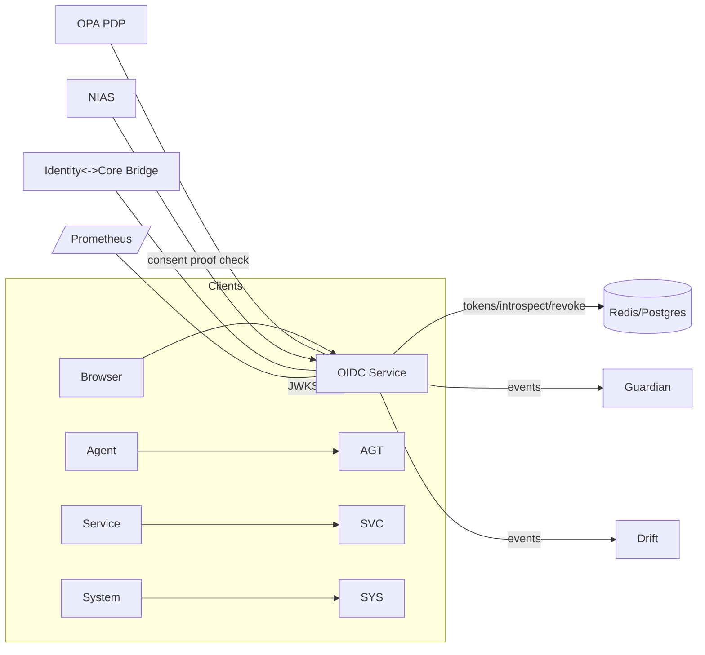

# Lukhas_ID system improvement plan
---

# Executive plan (one line)

Fix the identity system by **hardening storage & crypto**, **exposing standards (JWKS, introspection)**, **productionizing WebAuthn**, **adding durable consent & audit**, **OPA/ABAS integration**, and **T4-grade governance (DPIA, threat model, red-team)** — in order.

---

# Critical (P0) — must ship before any public demo

These are safety / correctness items. Paste each prompt into Claude Code Web to implement.

---

## 1 — Replace in-memory secrets & tokens with production stores (Redis + encrypted DB)

**Why**: `lambda_id_core.py` holds `challenges`, `credentials`, and `token_data` in in-memory dicts — not suitable for distributed/production deployment. 
**What to deliver**:

* `core/identity/storage/redis_token_store.py` — Redis-based token store with TTL and token revocation.
* `core/identity/storage/webauthn_store.py` — encrypted DB (Postgres) credential store for WebAuthn credentials; secrets encrypted at rest using KMS/secret key.
* Migration helpers and unit tests.

**Acceptance criteria**

* Tests simulate concurrent token creation/validation, TTL expiry, revocation.
* WebAuthn credentials persist and retrieved securely by id.
* Clear README showing env vars (`REDIS_URL`, `DB_URL`, `KMS_KEY_NAME`).

**Estimate**: 6–10 hours.

**Claude prompt (paste-ready)**:

```
Create Redis and Postgres-backed stores for Lukhas_ID.

Files:
1) core/identity/storage/redis_token_store.py
2) core/identity/storage/webauthn_store.py
3) tests/identity/test_redis_token_store.py
4) tests/identity/test_webauthn_store.py
5) docs/identity/DEPLOYMENT_STORAGE.md

Requirements:
- redis_token_store implements: store_access_token(token, metadata, ttl), validate(token), revoke(token), introspect(token) and uses strict TTL and atomic ops (Lua or SETEX + GET).
- webauthn_store uses SQLAlchemy (sqlite for tests) with encrypted fields for private credential info. Use AES-GCM and env var KMS_KEY (wrap key) for encryption; include a simple crypto helper that supports rotate_key(new_key) and rewrap.
- Add tests that assert concurrent writes/read are safe, TTL expiry works, and revocation blocks tokens immediately.

Return only files with code + brief usage examples at the end of each file.
```

---

## 2 — Replace HS256 ephemeral signing with proper asymmetric keys + JWKS + key rotation

**Why**: `OIDCProvider` currently uses a symmetric random `signing_key` (HS256) generated in memory — this is insecure for an OIDC provider and incompatible with most real OIDC clients. You need RS256/ES256 with a JWKS endpoint and rotation. 

**What to deliver**

* `core/identity/keys.py` — key manager to load/generate keys (RS256/ES256), expose current kid, rotate keys safely, integrate with KMS.
* `core/identity/jwks_endpoint.py` — FastAPI route `/.well-known/jwks.json` returning public jwks.
* Update `OIDCProvider` to sign with current private key using RS256/ES256 and include `kid` header; support validating tokens via JWKS.
* Unit tests: issuance, rotation, validation.

**Acceptance criteria**

* ID tokens issued with RS256/ES256 and verifiable via JWKS.
* Key rotation test: old tokens remain valid for configured TTL; new tokens signed with new kid.

**Estimate**: 4–8 hours.

**Claude prompt**:

```
Implement asymmetric key handling and JWKS endpoint for LUKHAS OIDC.

Tasks:
1) core/identity/keys.py — KeyManager class that:
   - loads keys from disk or KMS (PEM files), supports RSA and EC,
   - provides get_private_key(kid), get_public_jwk(kid), current_kid, rotate_keys(new_key),
   - safe fallback for local dev (generate ephemeral keys).

2) core/identity/jwks_endpoint.py — FastAPI router exposing '/.well-known/jwks.json' with all active public keys (jwk format), appropriate cache headers.

3) Modify OIDCProvider.issue_id_token to sign with KeyManager.current_kid private key using RS256 or ES256, include 'kid' header.

4) tests/identity/test_jwks.py — Test jwks, signing, and validation using PyJWT.

Add docs/identity/JWKS_AND_KEY_ROTATION.md with recommended rotation strategy and CI checks.
```

---

## 3 — Add Token Introspection & Revocation (RFC7662 style)

**Why**: Token validation currently ad-hoc; need standardized introspection endpoint and revocation flow for secure token lifecycle (logout, emergency revoke). 

**What to deliver**

* `core/identity/oidc_introspection.py` — `/oauth2/introspect` endpoint per RFC7662, protected by client auth.
* `core/identity/revocation.py` — `/oauth2/revoke` and token revocation logic integrated with Redis token store.
* Tests and example cURL flows.

**Acceptance criteria**

* Introspection returns `active` boolean, `exp`, `scope`, `sub`, etc.
* Revocation marks token revoked; introspection shows inactive after revocation.

**Estimate**: 3–5 hours.

**Claude prompt**:

```
Implement RFC7662 introspection and token revocation.

Files:
- core/identity/oidc_introspection.py (FastAPI router)
- core/identity/revocation.py (helpers)
- tests/identity/test_introspect_revoke.py

Requirements:
- Introspection must require client authentication (Bearer or Basic) and return JSON as per RFC7662.
- Revoke must support both access and refresh tokens and remove them from Redis/store.
- Add usage examples and tests.
```

---

## 4 — Productionize WebAuthn: use `fido2` library + attestation verification + DB backup + threat protections

**Why**: `WebAuthnPasskeyManager` stores credentials in memory and doesn’t fully validate attestation. Need full FIDO2 flow with attestation verification, resident key handling, rate limits, and encrypted storage. 

**What to deliver**

* Replace in-memory manager with `core/identity/webauthn_manager.py` using `fido2` library.
* Persist credentials to `webauthn_store` (from TODO#1), implement attestation verification, signature counter checks, and rate-limiting.
* CI tests using `python-fido2` helper flows.

**Acceptance criteria**

* Registration and authentication tests pass across typical browser flows (simulate client with `fido2` test helpers).
* Credentials are stored encrypted, counters enforced, and invalid attestations rejected.

**Estimate**: 6–12 hours.

**Claude prompt**:

```
Implement production WebAuthn support using python-fido2 in core/identity/webauthn_manager.py, integrated with core/identity/storage/webauthn_store.py. 
Deliver tests that simulate a registration and an assertion using fido2.test vectors; include attestation verification, signature counter enforcement, and encrypted persistence.
```

---

# High-impact (P1) — functionality & governance

---

## 5 — Consent proof & GDPR-safe consent store

**Why**: The identity README and manifest require `consent_id` and Constellation proof, but code doesn’t persist consent proofs securely. Need HMAC proof, TTL, consent revocation handling. 

**What to deliver**

* `core/identity/consent_store.py` — HMAC(salt, tc_string) + timestamp storage, TTL, lookup.
* Consent proof helper integrated with registration and token issuance.
* Tests and DPIA checklist stub.

**Acceptance**

* No raw TC strings stored; proof verification works and consent revocation invalidates personalization tokens.

**Estimate**: 3–4 hours.

**Claude prompt**:

```
Implement consent proof store: core/identity/consent_store.py:
- store_consent_proof(hmac_hash, meta), verify_consent(hash), revoke_consent(hash)
- Use env var CONSENT_PROOF_SALT; provide salt rotation helper and migration script.

Add tests and docs/identity/CONSENT_PROCESS.md.
```

---

## 6 — OPA/ABAS integration for identity actions (policy enforcement)

**Why**: You already have matrix/OPA identity policy (`policies/matrix/identity.rego`). Identity middleware should query ABAS for step-up and policy checks (we did ABAS middleware earlier for NIAS). Wire identity endpoints to consult OPA for `step_up_ok` etc. 

**What to deliver**

* `core/identity/middleware/abas_identity_middleware.py` calling ABAS PDP for key identity routes (register, authenticate, token exchange) and honoring step-up/deny decisions.
* Tests demonstrating ABAS denies when policy fails.

**Acceptance**

* Step-up policy in Rego tested via `opa test`, and middleware enforces decisions (403/503).

**Estimate**: 3–5 hours.

**Claude prompt**:

```
Create ABAS identity middleware that:
- intercepts identity-sensitive routes (/register, /authenticate, /oidc/token),
- posts input to OPA (policies/matrix/identity.rego),
- enforces allow/deny, fetches 'reason' when deny, supports caching.

Add tests mocking OPA.
```

---

## 7 — Observability: Prometheus metrics & tracing

**Why**: Manifest imposes strict latency targets. Add metrics to measure p95 and failures. 

**What**

* Instrument key components: `LukhasIDGenerator`, OIDC endpoints, WebAuthn manager, ABAS calls — export counters and histograms.
* Add simple tracing headers (X-Trace-Id) propagation.

**Acceptance**

* Prometheus metrics endpoint `/metrics` with `identity_auth_latency_seconds{quantile="0.95"}` style histograms.

**Estimate**: 2–4 hours.

**Claude prompt**:

```
Instrument identity components with prometheus_client: add metrics for issuance latency, auth p95, ABAS PDP latency, webauthn registration failures. Provide a /metrics endpoint and sample Grafana panel JSON.
```

---

# Medium (P2) — security & process improvements

---

## 8 — Threat model + DPIA + Red-team harness (T4)

**Why**: Identity is highest-risk surface: minors, special categories, consent, token leakage. Need T4-style scrutiny. 

**What**

* STRIDE/ATT&CK threat model document.
* DPIA draft for NIAS + ΛiD.
* Red-team harness to simulate token leakage, replay, passkey extraction, OPA DoS.

**Acceptance**

* Documented threats + mitigations, risk matrix, and runnable red-team test scripts.

**Estimate**: 8–16 hours.

**Claude prompt**:

```
Produce a STRIDE/ATT&CK threat model for Lukhas_ID: enumerate threats, likelihood, impact, mitigation, residual risk. Create a DPIA template for Lukhas_ID and a red-team test harness (pytest scripts) that simulate token replay, OPA failure, credential export attempts.
```

---

## 9 — Unit & integration test coverage goal: 90% on identity lane

**Why**: Many identity files are “CRITICAL” but have placeholders. We need robust test coverage for all identity flows. 

**What**

* Tests for ΛID generator edge cases, invalid metadata, concurrency; OIDC token issuance/validation; WebAuthn flows; ABAS policy enforcement; stores.

**Acceptance**

* `pytest --maxfail=1 --disable-warnings` passes; coverage >= 90% for identity packages.

**Estimate**: 8–12 hours.

**Claude prompt**:

```
Create a comprehensive test-suite for core/identity covering ΛID generation edge cases (invalid metadata, concurrent generation), OIDC token issuance/validation, webauthn register/assert flows (mock fido2), KeyManager rotation, Redis token scenarios, and ABAS policy enforcement. Add CI job identity-tests.yml to run these.
```

---

## 10 — Documentation: API docs + Developer guides + Runbooks

**Why**: The manifest relies on developer-run activities and Constellation integration. Provide clear runbooks for key operations (rotate keys, rotate salts, revoke tokens, run OPA tests), and public API docs for Lukhas_ID. 

**Acceptance**

* `docs/identity/API.md`, `docs/identity/OPERATIONS.md`, `docs/identity/DPIA.md` exist and are concise.

**Estimate**: 3–6 hours.

**Claude prompt**:

```
Generate identity API docs and runbooks:
- docs/identity/API.md: endpoints: /oauth2/token, /oauth2/introspect, /.well-known/jwks.json, /nias/serve sample
- docs/identity/OPERATIONS.md: key rotation, salt rotation, revoke emergency steps.
- docs/identity/DPIA.md: skeleton for legal review.
```

---

# Low priority / nice-to-have (P3)

* **Token binding** for long-term tokens (mutual TLS or DPoP).
* **Privacy-preserving analytics** for identity usage (differential privacy).
* **Mesh registration automation** to link nodes into distributed Constellation mesh.
* **User-facing UX** for identity (lukhas_id website has a prototype; wire to API). 

---

# How to run these via Claude Code Web (exact batch plan)

I recommend you run Claude Code Web tasks in this order (each task = a single Claude prompt, copy the corresponding prompt above). Use parallel workers for independent items (e.g., storage and JWKS work can be parallel). Prioritize P0 tasks 1–4, then P1 tasks 5–7, then P2 tasks 8–10.

**Token guidance**: you have $1000 tokens — enough to run the ~10–15 large Claude tasks above (each will likely consume a few thousand tokens while producing files). Do 1–3 high-risk tasks first (Redis + JWKS + WebAuthn) — they unblock the rest.

---

# Short “what I’d do right now” checklist (3 steps)

1. Paste Prompt #1 (Redis/webauthn store) and Prompt #2 (keys + JWKS) into Claude Code Web; generate files & unit tests.
2. Paste Prompt #4 (WebAuthn production) and Prompt #3 (introspection/revoke). Run tests locally (Redis, sqlite).
3. Paste Prompt #6 (OPA identity middleware) and run `opa test policies/matrix/identity.rego`.

---

# Grounded vs speculative summary

* **Grounded**: repo contains `lambda_id_core.py`, `MODULE_MANIFEST.json`, identity OPA policy and many candidate/labs files — these guided all P0/P1 items.
* **Speculative / engineering choices**: I recommended Redis + Postgres, `python-fido2`, RS256/ES256 keys, AES-GCM encryption wrapper and KMS; these are standard production choices and can be swapped for your preferred infra.

---
Got it. Here’s a **repo‑grounded integration plan** to wire **ΛiD (Lukhas_ID)** across the stack (ABAS/NIAS/agents/core) and land **MATRIZ readiness**. You’ll get: (1) crisp, high‑value TODOs; (2) exact paste‑ready prompts for Claude Code Web/GPT Pro; (3) acceptance criteria; (4) where each item plugs into your current files.

**Grounded context I used**

* `labs/core/identity/lambda_id_core.py`: ΛiD generator, OIDC bits, WebAuthn manager—still using in‑memory state and placeholders. 
* `labs/core/identity/MODULE_MANIFEST.json`: canonical **namespace schemas** (USR/AGT/SVC/SYS), targets (p95<100ms), required bridges/endpoints. 
* `labs/core/bridges/identity_core_bridge.py`: bridge scaffolding with **TODO**s for state comparison & sync. 
* `labs/core/identity/consciousness_tiered_authentication.py`: “MΛTRIZ tiered auth” engine that references WebAuthn and consciousness tiers. 
* `policies/matrix/identity.rego`: OPA identity policy (step‑up, webauthn, tiers)—perfect PDP input for ABAS. 
* `labs/core/identity/TRINITY_FRAMEWORK_PROTOCOLS.md`: TRINITY/Constellation identity protocols doc. 
* `release_artifacts/matriz_readiness_v1/…/top_python_files.txt`: MATRIZ readiness artifact reference. 

---

## Integration map (one‑pager)

**Goal**: Make ΛiD the single identity spine for **Users (USR)**, **Agents (AGT)**, **Services (SVC)**, **Systems (SYS)** with: OIDC + WebAuthn + ABAS/OPA policy gates + consent proofs + durable storage + observability, and pass MATRIZ SLOs.

**Plan skeleton**

* **P0** safety/correctness: durable stores, RS/EC keys + JWKS, introspection/revocation, production WebAuthn.
* **P1** cross‑module wiring: ABAS/OPA for identity routes; agent/service/system identities; event bus; metrics; consent proofs.
* **P2** MATRIZ readiness suite: perf gates, chaos/PDP failure drills, red‑team harness, threat model/DPIA.

---

# P0 — Must‑do (finish first)

### 1) Durable identity state (tokens/credentials/challenges) & migrations

**Why**: `lambda_id_core.py` still uses in‑memory dicts (non‑HA). 
**Deliver**

* `core/identity/storage/redis_token_store.py` (TTL, revoke, introspect)
* `core/identity/storage/webauthn_store.py` (Postgres + AES‑GCM fields, KMS‑wrapped key)
* Alembic migrations + tests

**Acceptance**

* Concurrency safety, TTL expiry, immediate revocation; encrypted credential fields; docs with envs.

**Claude/GPT‑Pro prompt (paste)**

```
Create durable identity storage:
1) core/identity/storage/redis_token_store.py with store/validate/revoke/introspect (atomic ops).
2) core/identity/storage/webauthn_store.py using SQLAlchemy + AES-GCM encrypted columns; key wrapping via env KMS_KEY.
3) alembic migrations for webauthn credentials + tokens tables.
4) tests/identity/{test_redis_token_store.py,test_webauthn_store.py}.
5) docs/identity/DEPLOYMENT_STORAGE.md including envs (REDIS_URL, DB_URL, KMS_KEY).
```

---

### 2) Real OIDC signing + JWKS + rotation

**Why**: OIDC uses ephemeral HS256 in memory—needs RS256/ES256 + public JWKS + rotation. 
**Deliver**

* `core/identity/keys.py` (KeyManager: load/generate, current_kid, rotate)
* `core/identity/jwks_endpoint.py` (`/.well-known/jwks.json`)
* Patch issuer to RS/EC with `kid`

**Acceptance**

* New tokens verify via JWKS; rotation leaves old tokens valid through grace TTL.

**Prompt**

```
Implement asymmetric OIDC:
- core/identity/keys.py KeyManager (RSA+EC, current_kid, rotate, load from disk/KMS).
- core/identity/jwks_endpoint.py router serving /.well-known/jwks.json.
- Modify ID token issuance to RS256/ES256 with kid header.
- tests/identity/test_jwks_rotation.py for signing/verification/rotation.
```

---

### 3) OAuth2 token **introspection** & **revocation** (RFC 7662)

**Why**: Standard lifecycle control (logout/kill switch).
**Deliver**: `/oauth2/introspect` + `/oauth2/revoke` (client‑auth protected), wired to Redis store.

**Acceptance**: Introspection returns standard fields; revoke flips `active:false` immediately.

**Prompt**

```
Add OAuth2 lifecycle:
- core/identity/oidc_introspection.py (RFC 7662) and core/identity/revocation.py.
- tests/identity/test_introspect_revoke.py covering access/refresh tokens and immediate revocation.
```

---

### 4) **Production WebAuthn** (python‑fido2) with attestation verification

**Why**: Your WebAuthn manager is proto; this implements full FIDO2. 
**Deliver**

* `core/identity/webauthn_manager.py` using `python-fido2` (attestation, counters, resident keys, RP config)
* Store creds in encrypted DB store from #1; rate‑limit attempts

**Acceptance**: Simulated registration/assert flows pass; attestation verified; counters enforced.

**Prompt**

```
Implement WebAuthn prod path:
- core/identity/webauthn_manager.py using python-fido2 flows, attestation & sign count checks.
- Persist to webauthn_store, add simple retry limiter.
- tests/identity/test_webauthn_flows.py using fido2 test helpers.
```

---

# P1 — Cross‑module ΛiD wiring (high impact)

### 5) Canonical ΛiD model + **namespace** rules (USR/AGT/SVC/SYS)

**Why**: Manifest defines namespaced schemas; enforce a single generator/validator. 
**Deliver**

* `core/identity/lid.py` (parse/issue/validate; collision‑free IDs; base62; checksum)
* `tests/identity/test_lid_format.py`

**Acceptance**: USR/AGT/SVC/SYS formats validated; rejects cross‑tenant collisions; deterministic for same seed.

**Prompt**

```
Create canonical ΛiD:
- core/identity/lid.py supporting USR/AGT/SVC/SYS prefixes with checksum + namespace isolation.
- tests/identity/test_lid_format.py for valid/invalid ids and tenant boundaries.
```

---

### 6) **ABAS/OPA** identity middleware (step‑up, deny, reason) using your identity policy

**Why**: You already have `policies/matrix/identity.rego`. Wire PDP to identity routes. 
**Deliver**

* `core/identity/middleware/abas_identity_middleware.py`
* Gate: `/register`, `/authenticate`, `/oauth2/token`, `/oauth2/introspect`

**Acceptance**: Middleware enforces allow/deny & “step_up_required”; caches PDP; tests with opa stubs.

**Prompt**

```
Add ABAS identity middleware:
- Intercept /register,/authenticate,/oauth2/*; post to OPA (policies/matrix/identity.rego).
- Enforce allow/deny/step_up; reason on deny; TTL cache for allow.
- tests/identity/test_abas_identity_middleware.py (mock OPA).
```

---

### 7) **Agent/Service/System** identity integration (ΛiD for AGT/SVC/SYS)

**Why**: Bridge + manifest require multi‑actor identities.
**Deliver**

* `agents/identity_middleware.py`: require ΛiD claims (`sub`, `typ`) for AGT calls
* `services/auth/service_tokens.py`: mTLS/DPoP/Client Credentials for SVC
* `systems/auth/system_keys.py`: signed machine tokens for SYS; rotation

**Acceptance**: Agent calls must present AGT ΛiD; services mTLS or DPoP; system keys rotate.

**Prompt**

```
Wire non-user identities:
- agents/identity_middleware.py validating AGT ΛiD + role claims.
- services/auth/service_tokens.py (client credentials + DPoP option).
- systems/auth/system_keys.py (machine tokens + rotation).
- tests covering agent->core, service->api, system->internal route auth.
```

---

### 8) **Identity event bus** + audit hooks (Guardian/Drift/NIAS)

**Why**: Bridge shows bidirectional flow; add events for register/auth/revoke and feed Guardian/Drift. 
**Deliver**

* `core/identity/events.py` (pydantic events; pub/sub abstraction)
* Emit to Guardian (security), Drift (anomaly), NIAS_AUDIT minimal metadata
* **No TC strings**; pseudonymize if needed

**Acceptance**: Events out on success/failure; tests assert no PII; drift hooks can score anomalies.

**Prompt**

```
Create identity events module:
- core/identity/events.py with IdentityRegistered, AuthSucceeded, AuthFailed, TokenRevoked.
- Publish to guardian and drift buses; ensure payloads contain no raw PII.
- tests/identity/test_identity_events.py verifying publish and privacy redaction.
```

---

### 9) **OIDC discovery** + public docs + Next.js hooks

**Why**: Needed by web ecosystem plan & clients. (See Web ecosystem doc) 
**Deliver**: `/.well-known/openid-configuration` + docs + minimal Next.js API client (optional)

**Acceptance**: Discovery lists issuer, JWKS, token/introspection endpoints; sample Next.js login works against dev.

**Prompt**

```
Add OIDC discovery:
- core/identity/openid_configuration.py (discovery JSON).
- docs/identity/API.md describing all identity endpoints and discovery.
- (optional) web/next/auth-client.ts minimal OIDC client boilerplate.
```

---

### 10) **Consent proof store** (HMAC salt, TTL, revoke) + **NIAS lock‑step**

**Why**: Manifest uses `consent_id`; NIAS requires GDPR‑safe proofs. Wire identity issuance to check proofs. 
**Deliver**

* `core/identity/consent_store.py` (HMAC(salt, tc_string), TTL, revoke)
* Hook into `/register` + `/oauth2/token` (deny personalization scopes if revoked)

**Acceptance**: No raw TC strings stored; revocation flips policy to contextual‑only.

**Prompt**

```
Consent proof:
- core/identity/consent_store.py storing only HMAC(salt, tc), TTL, revoke.
- Integrate with registration and token issuance; remove personalization scopes if proof missing.
- tests/identity/test_consent_store.py.
```

---

### 11) **Observability**: Prometheus metrics + tracing (p95 SLA)

**Why**: Manifest targets p95 auth <100ms. 
**Deliver**: histograms & counters for register/auth/token/ABAS; /metrics route; trace IDs

**Acceptance**: Grafana board shows p50/p95; alarms on PDP latency >250ms or denial spikes.

**Prompt**

```
Add identity metrics:
- instrument ID flows with prometheus_client histograms + counters; expose /metrics.
- add X-Trace-Id propagation; sample Grafana dashboard JSON.
- tests asserting metrics increment.
```

---

# P2 — MATRIZ readiness & governance

### 12) **MATRIZ readiness suite** (perf + chaos + policy)

**Why**: You have readiness artifacts to target. 
**Deliver**

* `tests/matriz/test_identity_perf.py`: k6/locust or pytest‑bench hitting register/auth/token to confirm p95<100ms
* `tests/matriz/test_pdp_failure_modes.py`: ABAS down → fail‑closed/open behavior; deny when required
* `tests/matriz/test_privacy_invariants.py`: log scans assert no TC strings/raw PII

**Acceptance**: All pass; produces JSON report uploaded in CI.

**Prompt**

```
Create MATRIZ readiness tests:
- performance (p95<100ms), PDP chaos, privacy invariants (grep for TC strings).
- GH Action matrices to run on nightly and upload reports.
```

---

### 13) **Identity threat model + DPIA + red‑team harness** (T4‑grade)

**Why**: Highest‑risk surface (minors, special categories, consent, keys).
**Deliver**: `docs/identity/THREAT_MODEL.md` (STRIDE/ATT&CK), `docs/identity/DPIA.md`, `redteam/identity/` pytest harness (token replay, CSRF, PDP DoS, passkey export attempts)

**Acceptance**: Checklists + scripts; at least 1 finding triggers a fix‑followup.

**Prompt**

```
Author threat model and DPIA; build red-team pytest harness simulating replay, CSRF, OPA DoS, passkey export attempts; generate a risk matrix and remediation plan.
```

---

### 14) **Bridge completion**: Identity ↔ Core sync & diffs

**Why**: Bridge has TODOs for state comparison and sync. 
**Deliver**: Complete `compare_states` and `resolve_differences`; define hub contracts; add idempotent sync tasks.

**Acceptance**: Simulated diffs resolve; retries are idempotent; tests verify both flows.

**Prompt**

```
Finish IdentityCoreBridge:
- implement compare_states() for auth state, consents, tokens; resolve_differences() with idempotent merge.
- create tests/bridges/test_identity_core_bridge.py with happy path + conflict cases.
```

---

### 15) **Constellation/TRINITY protocols alignment**

**Why**: Protocols doc exists; wire claims & headers for ⚛️🧠🛡️ status. 
**Deliver**: Add `trinity` claim bundle to tokens (identity=on/off, guardian=on/off, consciousness=tier); enforce via ABAS

**Acceptance**: Tokens include `trinity` section; ABAS can deny if a required module is off.

**Prompt**

```
Add TRINITY claims:
- Extend token claims with {trinity:{identity,consciousness,guardian,tier}} from runtime checks.
- Update identity.rego to require claims for certain operations; add tests.
```

---

## Cross‑module diagram (to drop in docs)

Add this to `docs/identity/ARCHITECTURE.md`:



---

## “One‑paste” starter prompts (batch)

If you want to run fewer, larger tasks, paste these **three** first; they unlock the rest:

### Batch A — Storage + Keys + WebAuthn

```
Implement P0: durable storage (Redis+Postgres with encryption), asymmetric keys+JWKS+rotation, and production WebAuthn using python-fido2. Include migrations, tests, and docs. Use paths and specs from the plan.
```

### Batch B — OAuth lifecycle + ABAS identity middleware + Events

```
Add RFC 7662 introspection + revocation, ABAS identity middleware that consults policies/matrix/identity.rego, and an identity events module publishing to Guardian/Drift. Include tests (OPA mocked), privacy-safe payloads, and docs.
```

### Batch C — MATRIZ readiness suite + Threat model + TRINITY claims

```
Create MATRIZ readiness tests (perf/chaos/privacy), STRIDE+ATT&CK threat model and DPIA, red-team harness, and TRINITY claim bundle in tokens enforced by OPA policies. Add CI jobs to run readiness nightly and upload reports.
```

---

## What this integrates with (explicit)

* **NIAS**: Uses consent proofs to redact personalization scopes; identity middleware and NIAS policy co‑enforce.
* **ABAS**: Central PDP for identity routes via `policies/matrix/identity.rego`. 
* **Agents/Services/Systems**: AGT/SVC/SYS identities & claims; service tokens (DPoP/mTLS). 
* **Bridge/Core**: Evented sync & state diffs (finish TODOs). 
* **MATRIZ**: Perf/privacy/chaos gates and reports connected to your readiness artifacts. 

---

## Quick next steps (tight)

1. Run **Batch A** (storage + keys + WebAuthn).
2. Run **Batch B** (OAuth lifecycle + ABAS middleware + events).
3. Wire the middleware in `get_app()` and confirm discovery/JWKS from a browser client.
4. Run **Batch C** to lock in MATRIZ readiness and T4 governance.

If you want, I can generate **the exact file contents** for Batch A or B right now (code + tests).
