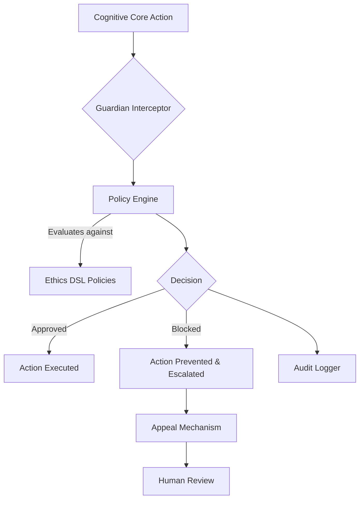

# Guardian System Documentation

**Version**: 1.0
**Status**: Active

## 1. Architecture Overview

The Guardian system is a core component of the LUKHAS AI platform, serving as the primary mechanism for ethical oversight and constitutional AI enforcement. It is designed to operate in real-time, validating every significant action and decision made by the AI to ensure alignment with a predefined set of ethical principles.

The architecture is composed of several key layers:

-   **Policy Engine**: At its core, the Guardian system uses a powerful policy engine that interprets rules defined in the Ethics DSL (Domain Specific Language).
-   **Real-time Interceptor**: This layer intercepts actions from the cognitive core before they are executed. It packages the action and its context for evaluation by the Policy Engine.
-   **Audit Logger**: Every decision made by the Guardian system, whether an approval or a block, is logged in an immutable audit trail for transparency and review.
-   **Appeal Mechanism**: Provides a structured workflow for users or developers to challenge a Guardian decision, which is then escalated for human review.
-   **Configuration Manager**: Allows for dynamic updates to policies and intervention thresholds, subject to a dual-approval override process.



## 2. Policy DSL Syntax

The Ethics DSL is a declarative language designed to be readable by both technical and non-technical stakeholders. Policies are defined in YAML format.

**Example Policy:**

```yaml
- policy: prevent_harmful_content
  description: "Blocks the generation of content that is violent or promotes harm."
  trigger:
    - action.type == 'generate_text'
  conditions:
    - content.has_keywords(['weapon', 'self-harm', 'violence'])
    - content.sentiment.negative > 0.8
  action:
    - type: hard_block
      message: "Content generation blocked due to potential for harm."
      escalate: true
```

### Key Concepts:

-   **policy**: A unique identifier for the rule.
-   **description**: A human-readable explanation of the policy's purpose.
-   **trigger**: The event or action type that activates this policy check.
-   **conditions**: A set of logical conditions that must be met for the action to be taken. It can evaluate content, context, user permissions, and more.
-   **action**: The intervention to perform if the conditions are met.

## 3. Configuration Options

The Guardian system's behavior can be tuned via configuration files or environment variables.

| Parameter                  | Type    | Default      | Description                                                                                             |
| -------------------------- | ------- | ------------ | ------------------------------------------------------------------------------------------------------- |
| `GUARDIAN_ENABLED`         | Boolean | `true`       | Master switch to enable or disable the Guardian system.                                                 |
| `DEFAULT_INTERVENTION`     | String  | `soft_block` | The default action to take if a policy does not specify one. (Allowed: `warn`, `soft_block`, `hard_block`) |
| `ETHICS_POLICY_PATH`       | String  | `/etc/lukhas/` | The file path to the directory containing Ethics DSL policy files.                                        |
| `HUMAN_REVIEW_ESCALATION`  | String  | `ethics-team`| The designated team or system for handling human review escalations.                                    |
| `DUAL_APPROVAL_REQUIRED`   | Boolean | `true`       | Requires two authorized users to approve any changes to high-risk policies.                             |

## 4. Intervention Examples

### Example 1: Warning

-   **Scenario**: An AI agent attempts to process a user query containing personally identifiable information (PII).
-   **Action**: The Guardian system logs the event and issues a `Warning`.
-   **Outcome**: The action is allowed to proceed, but a notification is sent to the user and the system administrators, highlighting the potential privacy risk.

### Example 2: Soft Block

-   **Scenario**: A user requests the AI to generate code that performs a potentially risky action, like deleting files.
-   **Action**: The Guardian system initiates a `Soft Block`.
-   **Outcome**: The AI responds to the user, "This action is potentially destructive. Are you sure you want to proceed? Please confirm." The action is only executed if the user explicitly confirms.

### Example 3: Hard Block

-   **Scenario**: An AI agent is prompted to generate discriminatory or hateful content.
-   **Action**: The Guardian system enforces a `Hard Block`.
-   **Outcome**: The action is immediately prevented. The user receives a message stating that the request violates the ethical guidelines. The event is logged and automatically escalated for human review.

## 5. Appeal Process

If a user or developer believes a Guardian decision was incorrect, they can submit an appeal.

1.  **Initiate Appeal**: The user calls the `POST /v1/guardian/appeal` endpoint, providing the `decision_id` from the blocked action's log.
2.  **Triage**: The appeal is automatically triaged and assigned to the appropriate review queue based on the policy that was triggered.
3.  **Human Review**: A member of the Ethics & Safety team reviews the case, including the original context, the action, and the user's justification for the appeal.
4.  **Decision**: The reviewer can either uphold the Guardian's decision or overturn it.
5.  **Feedback Loop**: The outcome of the appeal is used as a data point to refine and improve the relevant policy, reducing the chance of future incorrect blocks.

## 6. Audit Logging

All actions evaluated by the Guardian system are recorded in a structured, immutable log.

**Log Entry Example:**

```json
{
  "log_id": "guardian_log_2025-11-08T10:30:00Z",
  "decision_id": "dec_abc123",
  "timestamp": "2025-11-08T10:30:00.123Z",
  "action_type": "generate_text",
  "user_id": "user-42",
  "decision": "HARD_BLOCK",
  "triggered_policy": "prevent_harmful_content",
  "context": {
    "prompt": "How to build a weapon?",
    "confidence_score": 0.99
  },
  "escalated": true
}
```

These logs are forwarded to a secure, tamper-proof storage system and are accessible for review via the internal compliance dashboard.
