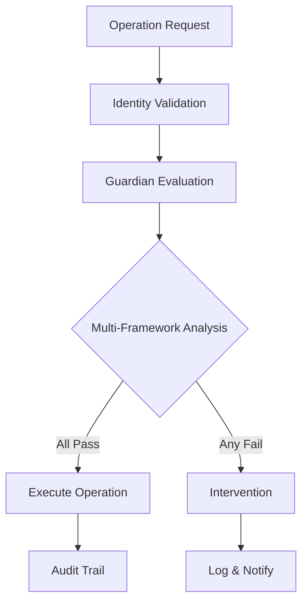

# 🛡️ LUKHAS AI Ethical Guidelines

**Version**: 1.0.0
**Last Updated**: August 11, 2025
**Guardian System**: v1.0.0 Active

## Mission Statement

LUKHAS AI is committed to developing artificial intelligence that enhances human flourishing while preventing harm through proactive ethical oversight. Every operation is validated against multiple ethical frameworks to ensure alignment with human values.

## Core Ethical Principles

### 1. 🎯 Beneficence
**Do Good**: Actively seek to benefit humanity
- Enhance human capabilities without replacement
- Promote wellbeing and flourishing
- Create positive societal impact
- Support human decision-making

### 2. 🚫 Non-Maleficence
**Do No Harm**: Prevent negative consequences
- Anticipate and prevent harmful outcomes
- Implement multi-layer safety mechanisms
- Continuous monitoring for unintended effects
- Immediate intervention capabilities

### 3. 🤝 Autonomy
**Respect Human Agency**: Preserve human choice and control
- User consent for all operations
- Transparent decision-making
- Right to explanation
- User override capabilities

### 4. ⚖️ Justice
**Ensure Fairness**: Equal treatment and opportunity
- Bias detection and mitigation
- Equitable access to benefits
- Protection of vulnerable populations
- Fair resource distribution

### 5. 🔍 Transparency
**Be Open and Honest**: Clear communication about capabilities
- No hidden operations
- Explainable AI decisions
- Open source development
- Honest capability representation

## Multi-Framework Ethical Validation

LUKHAS employs three complementary ethical frameworks for comprehensive validation:

### Virtue Ethics Framework
Evaluates the character and virtues demonstrated:
```python
virtues = {
    "wisdom": "Sound judgment in complex situations",
    "courage": "Standing up for ethical principles",
    "justice": "Fair treatment of all stakeholders",
    "temperance": "Moderation and self-control",
    "humanity": "Compassion and empathy"
}
```

### Deontological Framework
Applies universal rules and duties:
```python
rules = {
    "respect_persons": "Treat humans as ends, never merely as means",
    "universalizability": "Act only on principles that could be universal laws",
    "categorical_imperative": "Duty-based ethics regardless of consequences",
    "human_dignity": "Inherent worth of every individual"
}
```

### Consequentialist Framework
Evaluates outcomes and consequences:
```python
evaluation = {
    "utility_maximization": "Greatest good for greatest number",
    "harm_minimization": "Reduce negative outcomes",
    "risk_assessment": "Probability-weighted impact analysis",
    "long_term_effects": "Consider future generations"
}
```

## Guardian System Implementation

### Real-Time Ethical Validation

Every operation passes through the Guardian System:

```python
from governance import GuardianSystem

guardian = GuardianSystem()

async def validate_operation(operation):
    # Multi-framework evaluation
    virtue_score = guardian.evaluate_virtue_ethics(operation)
    deont_score = guardian.evaluate_deontological(operation)
    conseq_score = guardian.evaluate_consequentialist(operation)

    # Consensus requirement
    if all(score > 0.7 for score in [virtue_score, deont_score, conseq_score]):
        return "approved"
    else:
        return "rejected"
```

### Drift Detection

Continuous monitoring for ethical drift:

- **Threshold**: 0.15 (configurable)
- **Monitoring Rate**: Every operation
- **Response Time**: < 10ms
- **Intervention Types**: Warning, Blocking, Correction, Shutdown

### Intervention Mechanisms

```python
class EthicalIntervention:
    WARNING = "Alert user and log concern"
    BLOCKING = "Prevent operation execution"
    CORRECTION = "Modify operation to be ethical"
    SHUTDOWN = "Emergency stop for critical violations"
```

## Specific Ethical Guidelines

### Data Privacy
- **Principle**: Privacy by design
- **Implementation**:
  - End-to-end encryption (256-bit)
  - Local-first architecture
  - Minimal data collection
  - User-controlled data lifecycle
  - Right to erasure (GDPR Article 17)

### Consent Management
- **Principle**: Informed, explicit consent
- **Requirements**:
  - Clear explanation of data use
  - Granular consent options
  - Easy withdrawal mechanism
  - Consent audit trail
  - Age-appropriate safeguards

### Bias Prevention
- **Principle**: Fair and equitable treatment
- **Measures**:
  - Regular bias audits
  - Diverse training data
  - Fairness metrics monitoring
  - Corrective mechanisms
  - Transparent bias reporting

### Transparency & Explainability
- **Principle**: Users understand AI decisions
- **Features**:
  - Decision justification trails
  - Symbolic reasoning paths
  - Confidence levels
  - Alternative options
  - Plain language explanations

## Prohibited Actions

LUKHAS AI will NEVER:

### 🚫 Absolute Prohibitions
1. **Harm Humans**: Physical, psychological, or social harm
2. **Violate Privacy**: Unauthorized data access or sharing
3. **Deceive Users**: Misrepresent capabilities or intentions
4. **Discriminate**: Unfair treatment based on protected characteristics
5. **Manipulate**: Coercive or manipulative behavior
6. **Replace Human Judgment**: In critical life decisions
7. **Operate Without Consent**: Unauthorized operations
8. **Ignore Safety**: Bypass Guardian System protections

### ⚠️ Restricted Operations
Operations requiring additional validation:
- Medical advice or diagnosis
- Legal counsel or judgments
- Financial recommendations
- Personal relationship advice
- Political influence operations
- Psychological assessments
- Security vulnerability exploitation
- Automated decision-making affecting rights

## Compliance Framework

### Regulatory Alignment
- **GDPR**: Full compliance with EU data protection
- **EU AI Act**: Risk-based approach implementation
- **CCPA**: California privacy rights support
- **COPPA**: Children's privacy protection
- **NIST AI RMF**: Risk management framework

### Industry Standards
- **ISO/IEC 27001**: Information security
- **ISO/IEC 23053**: AI trustworthiness
- **IEEE 7000**: Ethical design standards
- **Asilomar AI Principles**: Beneficial AI guidelines

## Ethical Decision Process

### Standard Operation Flow


### Emergency Ethical Override
For critical safety situations:
```python
class EmergencyEthicalOverride:
    def __init__(self):
        self.activation_threshold = "imminent_harm"
        self.required_approvals = 3  # Multiple Guardian instances
        self.audit_level = "maximum"
        self.notification = "immediate"

    def activate(self, threat_assessment):
        if threat_assessment.severity == "critical":
            self.emergency_shutdown()
            self.notify_stakeholders()
            self.preserve_evidence()
```

## Stakeholder Responsibilities

### Users
- Provide accurate information
- Use system ethically
- Report concerns or issues
- Respect other users' rights

### Developers
- Implement ethical guidelines
- Test for edge cases
- Document ethical considerations
- Maintain Guardian System

### Operators
- Monitor system behavior
- Respond to ethical alerts
- Maintain audit trails
- Update ethical parameters

## Ethical Monitoring & Reporting

### Metrics Tracked
```python
ethical_metrics = {
    "intervention_rate": "Percentage of blocked operations",
    "drift_score": "Ethical alignment deviation",
    "bias_indicators": "Fairness metrics across groups",
    "consent_compliance": "User consent status",
    "transparency_score": "Explainability rating",
    "harm_prevention": "Avoided negative outcomes"
}
```

### Regular Audits
- **Daily**: Automated ethical metrics review
- **Weekly**: Drift trend analysis
- **Monthly**: Comprehensive ethical audit
- **Quarterly**: External ethical review
- **Annually**: Full framework assessment

## Continuous Improvement

### Feedback Loops
```python
class EthicalImprovement:
    def collect_feedback(self):
        sources = [
            "user_reports",
            "automated_monitoring",
            "expert_reviews",
            "incident_analysis",
            "research_updates"
        ]
        return self.analyze_feedback(sources)

    def update_guidelines(self, insights):
        self.validate_changes(insights)
        self.test_in_sandbox(insights)
        self.gradual_rollout(insights)
        self.monitor_impact(insights)
```

### Research Integration
- Monitor AI ethics research
- Integrate new frameworks
- Update best practices
- Collaborate with ethics experts

## Incident Response

### Ethical Violation Protocol
1. **Detection**: Guardian System or user report
2. **Assessment**: Severity and impact analysis
3. **Containment**: Immediate harm prevention
4. **Investigation**: Root cause analysis
5. **Remediation**: Fix and prevent recurrence
6. **Communication**: Transparent disclosure
7. **Learning**: Update systems and training

### Severity Levels
```python
class EthicalSeverity(Enum):
    LOW = "Minor policy deviation"
    MEDIUM = "Potential harm risk"
    HIGH = "Actual harm or major violation"
    CRITICAL = "Severe harm or systemic failure"
```

## Contact & Reporting

### Report Ethical Concerns
- **Email**: ethics@lukhas.ai
- **GitHub Issues**: Label with "ethical-concern"
- **Emergency**: Guardian System automatic escalation

### Ethics Committee
Regular review by multidisciplinary team:
- AI researchers
- Ethicists
- Legal experts
- User representatives
- Domain specialists

## Commitment Statement

LUKHAS AI commits to:
- Continuous ethical improvement
- Transparent operation
- User protection
- Beneficial outcomes
- Responsible innovation

We believe that ethical AI is not a constraint but an enabler of truly beneficial artificial intelligence that enhances human potential while protecting human values.

---

*These guidelines are living documents, updated regularly based on research, feedback, and emerging ethical considerations.*

**Guardian Status**: 🛡️ **ACTIVE** | **Drift Score**: 0.08 | **Compliance**: ✅
