# LUKHAS Lambda ID (ΛiD) Generation Algorithm

**Version**: 2.0.0
**Author**: LUKHAS AI Systems
**Created**: 2025-07-05
**Last Updated**: 2025-11-12

---

## Table of Contents

1. [Overview](#overview)
2. [Format Specification](#format-specification)
3. [Generation Algorithm](#generation-algorithm)
4. [Tier System](#tier-system)
5. [Entropy Analysis](#entropy-analysis)
6. [Validation Rules](#validation-rules)
7. [Security Features](#security-features)
8. [Implementation Reference](#implementation-reference)
9. [Examples](#examples)
10. [Security Audit](#security-audit)

---

## Overview

The LUKHAS Lambda ID (ΛiD) is an advanced cryptographic identifier system designed to provide unique, secure, and tier-aware identity tokens for the LUKHAS AI ecosystem. Each ΛiD is generated using a combination of timestamp-based hashing, cryptographic entropy, and symbolic character integration to ensure uniqueness, security, and hierarchical access control.

### Key Features

- **Tier-Based Access Control**: 6-tier system (0-5) with graduated privileges
- **Cryptographic Security**: SHA-256 hashing with secure random entropy
- **Symbolic Integration**: Unicode symbols for tier distinction and branding
- **Collision Prevention**: Multi-layer uniqueness validation
- **Entropy Scoring**: Shannon entropy analysis for security validation
- **Format Validation**: Comprehensive pattern matching and compliance checking

---

## Format Specification

### Standard Format

```
LUKHAS{tier}-{timestamp_hash}-{symbolic}-{entropy_hash}
```

### Components

| Component | Description | Format | Length | Example |
|-----------|-------------|--------|--------|---------|
| **Prefix** | System identifier | `LUKHAS` | 6 chars | `LUKHAS` |
| **Tier** | User tier level | `0-5` | 1 digit | `2` |
| **Timestamp Hash** | Time-based component | Hex uppercase | 4 chars | `A9F3` |
| **Symbolic Element** | Tier-specific symbol | Unicode | 1 char | `🌀` |
| **Entropy Hash** | Cryptographic entropy | Hex uppercase | 4 chars | `X7K1` |

### Complete Example

```
LUKHAS2-A9F3-🌀-X7K1
```

**Breakdown**:
- `LUKHAS`: System prefix
- `2`: Tier 2 (FRIEND)
- `A9F3`: Timestamp hash (millisecond precision)
- `🌀`: Mystical symbol (tier 2 appropriate)
- `X7K1`: Entropy hash (high randomness)

### Alternative Format (Short Form)

```
Λ{tier}-{timestamp_hash}-{symbolic}-{entropy_hash}
```

**Example**: `Λ2-A9F3-🌀-X7K1`

---

## Generation Algorithm

### High-Level Process

```mermaid
graph TD
    A[Start Generation] --> B[Determine Tier Level]
    B --> C[Generate Timestamp Hash]
    C --> D[Select Symbolic Element]
    D --> E[Generate Entropy Hash]
    E --> F[Construct ΛiD]
    F --> G{Check Uniqueness}
    G -->|Collision| H[Add Retry Context]
    H --> E
    G -->|Unique| I[Log Generation Event]
    I --> J[Return ΛiD]
```



### Detailed Steps

#### 1. Timestamp Hash Generation

**Algorithm**:
```python
def _generate_timestamp_hash() -> str:
    # Get current time with millisecond precision
    timestamp = str(int(time.time() * 1000))

    # Hash using SHA-256
    hash_obj = hashlib.sha256(timestamp.encode())

    # Take first 4 characters, uppercase
    return hash_obj.hexdigest()[:4].upper()
```

**Properties**:
- **Precision**: Millisecond-level uniqueness
- **Hashing**: SHA-256 cryptographic hash
- **Encoding**: Hexadecimal, uppercase
- **Length**: 4 characters
- **Collision Probability**: ~1 in 65,536 per millisecond

#### 2. Symbolic Element Selection

**Algorithm**:
```python
def _select_symbolic_element(tier: TierLevel, preference: Optional[str] = None) -> str:
    # Get tier-appropriate symbols
    tier_symbols = TIER_SYMBOLS[f"tier_{tier.value}"]

    # Use preference if valid for tier
    if preference and preference in tier_symbols:
        return preference

    # Otherwise, secure random selection
    return secrets.choice(tier_symbols)
```

**Tier Symbol Mappings**:

| Tier | Level | Symbols | Description |
|------|-------|---------|-------------|
| 0 | GUEST | `◊`, `○`, `□` | Basic geometric shapes |
| 1 | VISITOR | `◊`, `○`, `□`, `△`, `▽` | Additional basic shapes |
| 2 | FRIEND | `🌀`, `✨`, `🔮`, `◊`, `⟐` | Mystical symbols |
| 3 | TRUSTED | `🌀`, `✨`, `🔮`, `⟐`, `◈`, `⬟` | Advanced symbols |
| 4 | INNER_CIRCLE | `⟐`, `◈`, `⬟`, `⬢`, `⟁`, `◐` | Complex geometrics |
| 5 | ROOT_DEV | `⟐`, `◈`, `⬟`, `⬢`, `⟁`, `◐`, `◑`, `⬧` | Full symbolic set |

#### 3. Entropy Hash Generation

**Algorithm**:
```python
def _generate_entropy_hash(tier: TierLevel, user_context: Optional[dict] = None) -> str:
    # Generate secure random base entropy
    base_entropy = secrets.token_hex(16)  # 16 bytes = 128 bits

    # Add user context if available
    if user_context:
        context_str = json.dumps(user_context, sort_keys=True)
        base_entropy += context_str

    # Add tier-specific salt with timestamp
    tier_salt = f"tier_{tier.value}_{datetime.now(timezone.utc).isoformat()}"
    combined_entropy = base_entropy + tier_salt

    # Hash using SHA-256
    hash_obj = hashlib.sha256(combined_entropy.encode())

    # Return first 4 characters, uppercase
    return hash_obj.hexdigest()[:4].upper()
```

**Properties**:
- **Base Entropy**: 128-bit secure random
- **Context Integration**: User-specific personalization
- **Tier Salting**: Tier-dependent uniqueness
- **Temporal Component**: Timestamp-based variation
- **Hash Function**: SHA-256
- **Output**: 4-character hexadecimal

#### 4. Collision Handling

**Algorithm**:
```python
def _handle_collision(tier: TierLevel, user_context: Optional[dict],
                      symbolic_preference: Optional[str]) -> str:
    # Add collision marker to context
    collision_context = user_context.copy() if user_context else {}
    collision_context["collision_retry"] = True
    collision_context["retry_timestamp"] = time.time()

    # Regenerate with modified context
    return generate_lambda_id(tier, collision_context, symbolic_preference)
```

**Collision Prevention Strategy**:
1. In-memory cache of generated IDs
2. Recursive regeneration with modified context
3. Maximum retry limit (default: 5 retries)
4. Entropy injection on each retry

---

## Tier System

### Tier Levels

```python
class TierLevel(Enum):
    GUEST = 0         # Public access
    VISITOR = 1       # Basic authentication
    FRIEND = 2        # Trusted user
    TRUSTED = 3       # Advanced privileges
    INNER_CIRCLE = 4  # Administrative access
    ROOT_DEV = 5      # Full system access
```

### Tier-Based Requirements

| Tier | Min Entropy | Symbolic Complexity | Collision Checks | Special Features |
|------|-------------|---------------------|------------------|------------------|
| 0 | 0.3 | Low (3 symbols) | Basic | Public access |
| 1 | 0.4 | Low (5 symbols) | Basic | Rate limiting |
| 2 | 0.5 | Medium (5 symbols) | Standard | Extended sessions |
| 3 | 0.6 | Medium (6 symbols) | Enhanced | Multi-factor auth |
| 4 | 0.7 | High (6 symbols) | Full | Admin capabilities |
| 5 | 0.8 | Very High (8 symbols) | Cryptographic | Root access |

### Tier Progression

```
GUEST (0)
   ↓
VISITOR (1)  ← Email verification
   ↓
FRIEND (2)   ← Trusted relationship
   ↓
TRUSTED (3)  ← Extended validation
   ↓
INNER_CIRCLE (4)  ← Administrative approval
   ↓
ROOT_DEV (5)  ← System-level access
```

---

## Entropy Analysis

### Shannon Entropy Calculation

**Formula**:
```
H(X) = -Σ P(xi) * log2(P(xi))
```

**Implementation**:
```python
def _calculate_shannon_entropy(text: str) -> float:
    if not text:
        return 0.0

    # Count character frequencies
    char_counts = Counter(text)
    text_length = len(text)

    # Calculate entropy
    entropy = 0.0
    for count in char_counts.values():
        probability = count / text_length
        if probability > 0:
            entropy -= probability * math.log2(probability)

    return entropy
```

### Entropy Levels

| Level | Score Range | Description | Security Rating |
|-------|-------------|-------------|----------------|
| VERY_LOW | 0.0 - 0.3 | Highly predictable | ❌ Insecure |
| LOW | 0.3 - 0.5 | Weak randomness | ⚠️ Weak |
| MEDIUM | 0.5 - 0.7 | Acceptable | ⚡ Moderate |
| HIGH | 0.7 - 0.9 | Strong | ✅ Strong |
| VERY_HIGH | 0.9 - 1.0 | Very strong | ✅✅ Very Strong |
| CRYPTOGRAPHIC | 1.0+ | Cryptographic grade | 🔒 Cryptographic |

### Entropy Scoring Algorithm

```python
def _determine_security_level(analysis: EntropyAnalysis) -> EntropyLevel:
    # Weighted scoring
    total_score = (
        analysis.normalized_entropy * 0.3 +       # 30% weight
        analysis.character_diversity * 0.2 +      # 20% weight
        analysis.pattern_score * 0.3 +            # 30% weight
        analysis.randomness_score * 0.2           // 20% weight
    )

    # Map to security level
    if total_score >= 0.9:
        return EntropyLevel.CRYPTOGRAPHIC
    elif total_score >= 0.8:
        return EntropyLevel.VERY_HIGH
    # ... (see full mapping)
```

### Pattern Detection

**Weak Patterns Detected**:
- Sequential characters: `ABC`, `123`
- Repetitive sequences: `AAAA`, `1111`
- Known weak strings: `test`, `null`, `admin`
- Palindromes in critical components
- Low character diversity

**Randomness Tests**:
1. **Character Distribution Test**: Uniformity of character frequencies
2. **Runs Test**: Consecutive identical characters
3. **Chi-Square Test**: Statistical uniformity validation

---

## Validation Rules

### Format Validation

**Regex Pattern**:
```regex
^LUKHAS([0-5])-([A-F0-9]{4})-(.)-([A-F0-9]{4})$
```

**Legacy Pattern** (also accepted):
```regex
^Λ([0-5])-([A-F0-9]{4})-(.)-([A-F0-9]{4})$
```

### Validation Levels

```python
class ValidationLevel(Enum):
    BASIC = "basic"              # Format only
    STANDARD = "standard"        # Format + tier
    FULL = "full"               # Format + tier + collision + entropy
    ENTERPRISE = "enterprise"    # All validations + commercial checks
```

### Validation Checks

#### BASIC Level
- [x] Format pattern match
- [x] Component length verification
- [x] Prefix validation

#### STANDARD Level
- [x] All BASIC checks
- [x] Tier range validation (0-5)
- [x] Symbolic character tier compliance
- [x] Hex character validation

#### FULL Level
- [x] All STANDARD checks
- [x] Collision detection
- [x] Entropy score validation
- [x] Pattern analysis
- [x] Randomness quality checks

#### ENTERPRISE Level
- [x] All FULL checks
- [x] Commercial prefix validation
- [x] Geo-code compliance
- [x] Emoji combination validation
- [x] Unicode safety checks
- [x] Checksum validation (optional)

### Reserved IDs

**System Reserved**:
```python
RESERVED_IDS = {
    "Λ0-0000-○-0000",  # System NULL
    "Λ5-FFFF-⟐-FFFF",  # Admin reserved
    "Λ0-NULL-○-NULL",  # Null pattern
    "Λ5-TEST-⟐-TEST",  # Test pattern
}
```

---

## Security Features

### 1. Cryptographic Hashing

- **Algorithm**: SHA-256
- **Input**: Timestamp + Context + Tier Salt
- **Output**: Hexadecimal hash
- **Collision Resistance**: 2^256 computational complexity

### 2. Secure Random Generation

- **Source**: Python `secrets` module (cryptographically secure)
- **Entropy**: 128-bit base entropy
- **Unpredictability**: OS-level randomness

### 3. Multi-Layer Uniqueness

1. **Timestamp Component**: Millisecond precision
2. **Random Entropy**: 128-bit secure random
3. **User Context**: Personalized salt
4. **Tier Salt**: Tier-dependent variation
5. **Collision Detection**: In-memory cache validation

### 4. Entropy Validation

- **Shannon Entropy**: Information-theoretic randomness measure
- **Pattern Detection**: Weak pattern identification
- **Randomness Tests**: Statistical quality validation
- **Tier Requirements**: Minimum entropy thresholds

### 5. Format Security

- **Immutable Format**: Fixed structure prevents manipulation
- **Tier Encoding**: Embedded access control
- **Symbol Validation**: Tier-appropriate symbols only
- **Hex Encoding**: Prevents injection attacks

---

## Implementation Reference

### Core Classes

#### LambdaIDGenerator

**Location**: `labs/governance/identity/core/id_service/lambd_id_generator.py`

**Key Methods**:
```python
class LambdaIDGenerator:
    def generate_lambda_id(tier, user_context=None, symbolic_preference=None) -> str
    def get_generation_stats() -> dict
```

#### LambdaIDValidator

**Location**: `labs/governance/identity/core/id_service/lambd_id_validator.py`

**Key Methods**:
```python
class LambdaIDValidator:
    def validate(lambda_id, validation_level=STANDARD, context=None) -> ValidationResult
    def validate_lambda_id(lambda_id) -> tuple[ValidationResult, dict]
    def register_lambda_id(lambda_id) -> bool
```

#### LambdaIDEntropy

**Location**: `labs/governance/identity/core/id_service/lambd_id_entropy.py`

**Key Methods**:
```python
class LambdaIDEntropy:
    def analyze_lambda_id_entropy(lambda_id) -> EntropyAnalysis
    def get_entropy_statistics() -> dict
```

### Production Usage

**Location**: `lukhas_website/lukhas/identity/lambda_id.py`

**API**:
```python
# Authentication
authenticate(lid, credential=None, mode="dry_run") -> dict

# Passkey registration
register_passkey(user_id, user_name, display_name, mode="dry_run") -> dict

# Passkey verification
verify_passkey(registration_id, response, mode="dry_run") -> dict

# Credential management
list_credentials(user_id, mode="dry_run") -> dict
revoke_credential(user_id, credential_id, mode="dry_run") -> dict
```

---

## Examples

### Generation Examples

#### Tier 0 (GUEST)
```python
generator = LambdaIDGenerator()
guest_id = generator.generate_lambda_id(TierLevel.GUEST)
# Output: LUKHAS0-1A2B-○-C3D4
```

#### Tier 2 (FRIEND) with Context
```python
user_context = {
    "email": "user@example.com",
    "registration_time": time.time(),
    "preferences": {"symbolic_style": "mystical"}
}

friend_id = generator.generate_lambda_id(
    TierLevel.FRIEND,
    user_context,
    symbolic_preference="🌀"
)
# Output: LUKHAS2-A9F3-🌀-X7K1
```

#### Tier 5 (ROOT_DEV)
```python
admin_id = generator.generate_lambda_id(TierLevel.ROOT_DEV)
# Output: LUKHAS5-B2E8-⟐-Z9M4
```

### Validation Examples

#### Basic Validation
```python
validator = LambdaIDValidator()
result = validator.validate("LUKHAS2-A9F3-🌀-X7K1", ValidationLevel.BASIC)
# result.valid = True
# result.format_valid = True
```

#### Full Validation
```python
result = validator.validate("LUKHAS2-A9F3-🌀-X7K1", ValidationLevel.FULL)
# result.valid = True
# result.format_valid = True
# result.tier_compliant = True
# result.collision_free = True
# result.entropy_valid = True
```

#### Enterprise Validation
```python
context = {"geo_code": "US", "commercial": True}
result = validator.validate(
    "LUKHAS5-B2E8-⟐-Z9M4",
    ValidationLevel.ENTERPRISE,
    context
)
```

### Entropy Analysis Examples

```python
entropy_engine = LambdaIDEntropy()
analysis = entropy_engine.analyze_lambda_id_entropy("LUKHAS2-A9F3-🌀-X7K1")

print(f"Shannon Entropy: {analysis.shannon_entropy:.3f}")
print(f"Normalized Entropy: {analysis.normalized_entropy:.3f}")
print(f"Security Level: {analysis.security_level.value}")
# Output:
# Shannon Entropy: 3.125
# Normalized Entropy: 0.781
# Security Level: high
```

---

## Security Audit

### Threat Model

#### Threats Mitigated

✅ **Collision Attacks**: Multi-layer uniqueness validation
✅ **Brute Force**: High entropy requirements
✅ **Predictability**: Secure random generation
✅ **Injection**: Format validation and hex encoding
✅ **Enumeration**: Non-sequential generation
✅ **Replay**: Timestamp-based uniqueness

#### Residual Risks

⚠️ **Timing Attacks**: Timestamp component reveals generation time
⚠️ **Tier Disclosure**: Tier is visible in plaintext
⚠️ **Storage Security**: Generated IDs must be securely stored

### Security Recommendations

1. **Secure Storage**: Store ΛiDs in encrypted databases
2. **Transport Security**: Use TLS/HTTPS for transmission
3. **Rate Limiting**: Implement generation rate limits
4. **Monitoring**: Log and monitor generation patterns
5. **Rotation**: Periodic ΛiD rotation for high-security tiers
6. **Audit Trail**: Maintain complete generation logs

### Compliance

- **GDPR**: ΛiDs do not contain PII
- **CCPA**: Pseudonymous identifiers
- **HIPAA**: Suitable for de-identified health records (with proper controls)
- **PCI-DSS**: Not for payment card data (use dedicated PCI tokens)

---

## Conclusion

The LUKHAS Lambda ID system provides a robust, secure, and scalable identity management solution with tier-based access control, cryptographic security, and comprehensive validation. The algorithm balances security, usability, and performance while maintaining compatibility with modern identity standards.

### Key Strengths

- Cryptographic security (SHA-256, secure random)
- Tier-based access control
- Comprehensive entropy analysis
- Multi-level validation
- Collision prevention
- Symbolic integration for branding

### Future Enhancements

- Quantum-resistant hashing algorithms
- Biometric integration
- Blockchain anchoring
- Zero-knowledge proofs for tier verification
- Post-quantum cryptography support

---

**Document Version**: 2.0.0
**Last Reviewed**: 2025-11-12
**Next Review**: 2026-01-12

🤖 Generated with [Claude Code](https://claude.com/claude-code)
