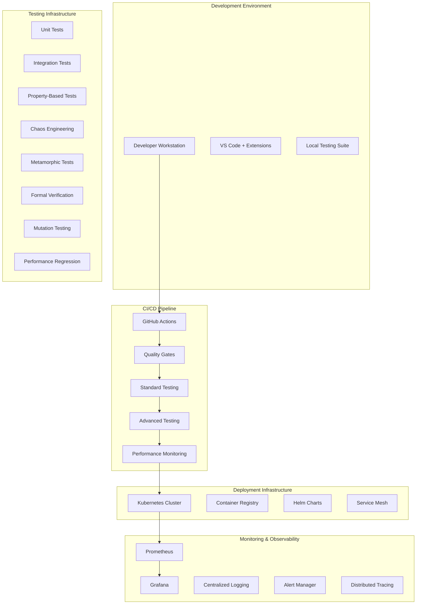

# LUKHAS AI DevOps Infrastructure Requirements
## Scaling 0.001% Engineering Excellence to Production

### Executive Summary

This document outlines the infrastructure requirements for implementing enterprise-grade DevOps practices that support LUKHAS AI's advanced testing methodologies and consciousness-aware quality assurance.

### Infrastructure Architecture



### 1. Core Infrastructure Components

#### 1.1 Compute Requirements

**GitHub Actions Runners:**
- **Standard Runners**: `ubuntu-latest` (2-core, 7GB RAM)
  - Usage: Quality gates, standard testing
  - Estimated cost: $0.008/minute
  - Concurrent limit: 20 jobs

- **Larger Runners** (recommended): `ubuntu-latest-4-core` (4-core, 16GB RAM)
  - Usage: Advanced testing methodologies
  - Estimated cost: $0.016/minute
  - Required for mutation testing and formal verification

- **Self-Hosted Runners** (for sensitive operations):
  - **Specs**: 8-core, 32GB RAM, 500GB SSD
  - **OS**: Ubuntu 22.04 LTS
  - **Purpose**: Consciousness system testing, security scans

#### 1.2 Storage & Artifacts

**Artifact Storage:**
- **Test Results**: 30-day retention for standard, 90-day for advanced
- **Performance Data**: 1-year retention for trend analysis
- **Coverage Reports**: 6-month retention
- **Security Scan Results**: 2-year retention (compliance)

**Estimated Storage Needs:**
```yaml
Daily Storage Growth:
  - Test Results: ~50MB
  - Performance Data: ~20MB
  - Coverage Reports: ~10MB
  - Build Artifacts: ~200MB
  - Total Daily: ~280MB
  - Annual Projection: ~100GB
```

#### 1.3 Container Infrastructure

**Docker Registry Requirements:**
```yaml
Container Registry: GitHub Container Registry (ghcr.io)
Base Images:
  - lukhas-base:python3.11-slim
  - lukhas-testing:advanced-tools
  - lukhas-production:optimized
  - lukhas-monitoring:observability

Storage: ~5GB (all image layers)
Bandwidth: ~1GB/month (CI/CD pulls)
```

### 2. Advanced Testing Infrastructure

#### 2.1 Property-Based Testing
```yaml
Dependencies:
  - hypothesis>=6.82.0
  - hypothesis[numpy]>=6.82.0
  - hypothesis-jsonschema>=0.23.0

Resources:
  - CPU: 2-4 cores (generation intensive)
  - Memory: 8GB+ (large test case generation)
  - Timeout: 600s per test module
```

#### 2.2 Chaos Engineering
```yaml
Tools:
  - chaos-toolkit>=1.16.0
  - pumba (container chaos)
  - toxiproxy (network chaos)

Infrastructure:
  - Isolated test environment
  - Docker-in-Docker capability
  - Network simulation tools
```

#### 2.3 Formal Verification
```yaml
Dependencies:
  - z3-solver>=4.12.0
  - pysmt>=0.9.5
  - sympy>=1.12

Requirements:
  - CPU: 4+ cores (theorem proving)
  - Memory: 16GB+ (complex proofs)
  - Timeout: 1200s per verification
```

#### 2.4 Mutation Testing
```yaml
Tools:
  - mutmut>=2.4.0
  - cosmic-ray>=8.3.0

Resources:
  - CPU: 8+ cores (parallel mutations)
  - Memory: 16GB+ (multiple processes)
  - Storage: ~1GB temporary files
  - Time: 30-60 minutes full run
```

### 3. Performance Monitoring Stack

#### 3.1 Metrics Collection
```yaml
Prometheus Configuration:
  scrape_interval: 15s
  evaluation_interval: 15s
  retention: 15d
  storage: 10GB

Metrics Endpoints:
  - /metrics (application metrics)
  - /consciousness/metrics (consciousness-specific)
  - /memory/metrics (memory system performance)
  - /identity/metrics (identity coherence)
```

#### 3.2 Dashboards
```yaml
Grafana Dashboards:
  - System Health Overview
  - Consciousness Performance
  - Test Execution Trends
  - Advanced Testing Insights
  - Performance Regression Tracking
  - Quality Gate Status
```

#### 3.3 Alerting Rules
```yaml
Critical Alerts:
  - Consciousness coherence < 0.85
  - Test failure rate > 5%
  - Performance regression > 25%
  - Security vulnerability detected

Warning Alerts:
  - Test execution time > baseline + 20%
  - Coverage drop > 5%
  - Memory usage increase > 15%
```

### 4. Security & Compliance Infrastructure

#### 4.1 Security Scanning Tools
```yaml
SAST Tools:
  - bandit (Python security)
  - semgrep (multi-language)
  - CodeQL (GitHub Advanced Security)

DAST Tools:
  - OWASP ZAP
  - Nuclei scanner

Dependency Scanning:
  - safety (Python dependencies)
  - npm audit (Node.js dependencies)
  - snyk (comprehensive)

Container Scanning:
  - Trivy
  - Docker Scout
```

#### 4.2 Compliance Automation
```yaml
SBOM Generation:
  - Tool: cyclonedx-bom
  - Format: SPDX 2.3, CycloneDX 1.5
  - Storage: 2-year retention

Audit Logging:
  - All CI/CD actions
  - Security scan results
  - Deployment activities
  - Access patterns
```

### 5. Development Environment Setup

#### 5.1 Required Tools
```bash
# Core Development Tools
python >= 3.9
git >= 2.30
docker >= 20.10
docker-compose >= 2.0

# Testing Framework
pytest >= 7.4.0
hypothesis >= 6.82.0
mutmut >= 2.4.0

# Advanced Testing Dependencies
z3-solver >= 4.12.0
chaos-toolkit >= 1.16.0
locust >= 2.15.0

# Code Quality
ruff >= 0.1.0
black >= 23.11.0
mypy >= 1.7.0
bandit >= 1.7.5

# Performance Monitoring
pytest-benchmark >= 4.0.0
memory-profiler >= 0.61.0
py-spy >= 0.3.14
```

#### 5.2 VS Code Extensions
```json
{
  "recommendations": [
    "ms-python.python",
    "ms-python.mypy-type-checker",
    "charliermarsh.ruff",
    "ms-python.black-formatter",
    "ms-vscode.test-adapter-converter",
    "hbenl.vscode-test-explorer",
    "ryanluker.vscode-coverage-gutters",
    "davidanson.vscode-markdownlint",
    "redhat.vscode-yaml",
    "ms-vscode.vscode-json"
  ]
}
```

### 6. Cost Analysis & Optimization

#### 6.1 Monthly Cost Estimates
```yaml
GitHub Actions (Standard):
  - Hours/month: ~200 hours
  - Cost: ~$96/month

GitHub Actions (4-core):
  - Hours/month: ~50 hours
  - Cost: ~$48/month

Storage:
  - Artifacts: ~$5/month
  - Container Registry: ~$2/month

Monitoring (if external):
  - Grafana Cloud: ~$50/month
  - Datadog Alternative: ~$100/month

Total Estimated: ~$200-300/month
```

#### 6.2 Cost Optimization Strategies
```yaml
Optimization Techniques:
  1. Intelligent test selection (reduce execution time)
  2. Parallel job execution (reduce wall time)
  3. Artifact cleanup policies (reduce storage)
  4. Self-hosted runners for intensive tasks
  5. Caching strategies for dependencies

Expected Savings: 30-40% of baseline costs
```

### 7. Deployment Architecture

#### 7.1 Kubernetes Configuration
```yaml
Cluster Requirements:
  - Nodes: 3-5 (HA setup)
  - CPU: 4 cores per node minimum
  - Memory: 16GB per node minimum
  - Storage: 100GB per node

Namespaces:
  - lukhas-production
  - lukhas-staging
  - lukhas-testing
  - monitoring
```

#### 7.2 Service Mesh (Istio)
```yaml
Features:
  - Traffic management
  - Security (mTLS)
  - Observability
  - Canary deployments

Resources:
  - Control Plane: 2 cores, 4GB RAM
  - Proxy Overhead: 0.1 cores, 128MB per pod
```

### 8. Disaster Recovery & Backup

#### 8.1 Backup Strategy
```yaml
Critical Data:
  - Source code: Git (distributed)
  - Test history: Daily backups
  - Performance baselines: Weekly backups
  - Configuration: Version controlled

Retention:
  - Daily backups: 30 days
  - Weekly backups: 12 weeks
  - Monthly backups: 12 months
```

#### 8.2 Recovery Procedures
```yaml
RTO (Recovery Time Objective): 4 hours
RPO (Recovery Point Objective): 1 hour

Recovery Scenarios:
  1. CI/CD pipeline failure
  2. Kubernetes cluster failure
  3. Monitoring system failure
  4. Complete infrastructure loss
```

### 9. Scaling Strategy

#### 9.1 Horizontal Scaling Triggers
```yaml
Scale Up When:
  - Queue depth > 10 jobs
  - Average wait time > 5 minutes
  - Test execution time > baseline + 50%

Scale Down When:
  - Queue depth < 2 jobs
  - Idle time > 15 minutes
  - Off-peak hours (configurable)
```

#### 9.2 Vertical Scaling Guidelines
```yaml
Standard Tests: 2-4 cores, 8GB RAM
Advanced Tests: 4-8 cores, 16-32GB RAM
Mutation Testing: 8-16 cores, 32-64GB RAM
Performance Tests: 4-8 cores, 16GB RAM
```

### 10. Implementation Roadmap

#### Phase 1: Foundation (Weeks 1-2)
- [x] Enhanced CI/CD pipeline
- [x] Performance monitoring setup
- [x] Test orchestrator implementation
- [ ] Security scanning integration
- [ ] Artifact management

#### Phase 2: Advanced Testing (Weeks 3-4)
- [x] Property-based testing integration
- [x] Chaos engineering framework
- [x] Metamorphic testing suite
- [x] Formal verification tools
- [ ] Mutation testing automation

#### Phase 3: Production Readiness (Weeks 5-6)
- [ ] Kubernetes deployment
- [ ] Service mesh configuration
- [ ] Monitoring dashboards
- [ ] Alerting rules
- [ ] Backup procedures

#### Phase 4: Optimization (Weeks 7-8)
- [ ] Cost optimization
- [ ] Performance tuning
- [ ] Scaling automation
- [ ] Documentation completion
- [ ] Team training

### 11. Success Metrics

#### 11.1 Quality Metrics
```yaml
Target Metrics:
  - Test Coverage: >85%
  - Mutation Score: >80%
  - Security Vulnerabilities: 0 critical
  - Performance Regression: <10%
  - Deployment Success Rate: >99%
```

#### 11.2 Efficiency Metrics
```yaml
Target Metrics:
  - CI/CD Pipeline Duration: <20 minutes
  - Test Execution Time: <15 minutes
  - Deployment Time: <5 minutes
  - Mean Time to Recovery: <30 minutes
  - Developer Feedback Loop: <2 minutes
```

### 12. Team Requirements

#### 12.1 Skill Requirements
```yaml
DevOps Engineer:
  - Kubernetes administration
  - GitHub Actions expertise
  - Python/testing frameworks
  - Monitoring/observability
  - Security best practices

Quality Engineer:
  - Advanced testing methodologies
  - Performance analysis
  - Security testing
  - Automation development
  - Statistical analysis
```

#### 12.2 Training Plan
```yaml
Week 1-2: Advanced Testing Foundations
  - Property-based testing with Hypothesis
  - Chaos engineering principles
  - Formal verification basics

Week 3-4: Infrastructure Mastery
  - Kubernetes operations
  - Monitoring setup
  - Security scanning tools

Week 5-6: LUKHAS-Specific Knowledge
  - Consciousness system architecture
  - Performance characteristics
  - Quality standards (0.001%)
```

---

This infrastructure specification provides the foundation for scaling LUKHAS AI's advanced testing methodologies to enterprise production environments while maintaining the highest quality standards.
