# Architecture Diagrams for MATRIZ Documentation

This document contains Mermaid diagrams to be included in WHY_MATRIZ.md

## System Architecture Diagram

## Request Flow Diagram

```mermaid
sequenceDiagram
    participant User
    participant API as API Façade
    participant MATRIZ as MATRIZ Engine
    participant Memory as Memory System
    participant Guardian as Guardian
    participant Models as Foundation Models
    participant Audit as Audit Log
    
    User->>API: POST /v1/responses
    API->>MATRIZ: Parse Request
    MATRIZ->>Memory: Retrieve Context
    Memory-->>MATRIZ: Historical Data
    MATRIZ->>Guardian: Policy Check
    Guardian-->>MATRIZ: Approved ✓
    MATRIZ->>Models: Multi-Model Query
    Models-->>MATRIZ: Responses
    MATRIZ->>MATRIZ: DNA Pattern Matching
    MATRIZ->>Memory: Update Context
    MATRIZ->>Guardian: Response Validation
    Guardian-->>MATRIZ: Validated ✓
    Guardian->>Audit: Log Decision
    MATRIZ-->>API: Synthesized Response
    API-->>User: JSON Response
```

## DNA Evolution Cycle

## Constellation Framework

## Data Flow: Memory System

## Comparison Matrix

---

## Integration with WHY_MATRIZ.md

Add these diagrams to the following sections:

1. **"Core Architecture"** → Insert "System Architecture Diagram"
2. **"API Surface"** → Insert "Request Flow Diagram"
3. **"Bio-Inspired Adaptation"** → Insert "DNA Evolution Cycle"
4. **"Constellation Framework"** → Insert "Constellation Framework" diagram
5. **"Technical Differentiators"** → Insert "Data Flow: Memory System"
6. **"Competitive Analysis"** (new section) → Insert "Comparison Matrix"
