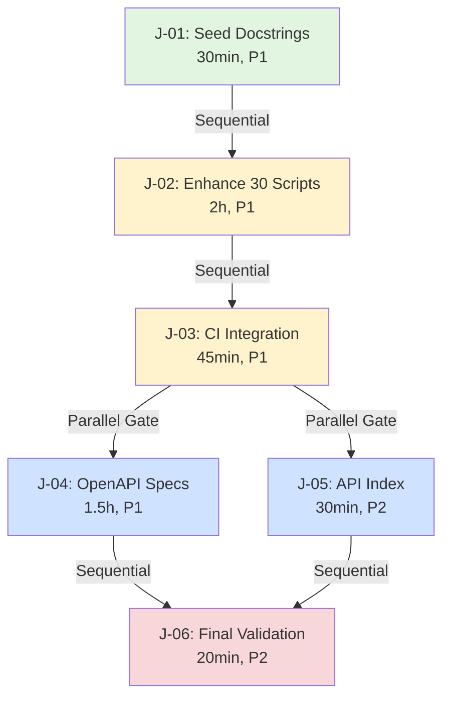

# Jules Tasks - Parallel Execution Strategy

**Version**: 2.0
**Date**: 2025-10-19
**Optimized For**: Multi-agent parallel execution

---

## 🎯 Execution Model

### Sequential Foundation (J-01 → J-02 → J-03)
These tasks MUST run sequentially to build the enforcement pipeline:

```
J-01: Seed docstrings (30min)
  ↓
J-02: Enhance 30 critical scripts (2h) ← Jules focus
  ↓
J-03: Integrate CI validation (45min) ← Codex assists
  ↓
[PARALLEL GATE OPENS]
```

### Parallel Execution After J-03
Once CI validation is in place, these can run concurrently:

```
              ┌─→ J-04: OpenAPI specs (1.5h) ← Claude Code
              │
J-03 complete ┼─→ J-05: API index (30min) ← Automation
              │
              └─→ [Both can run in parallel]
                     ↓
                  J-06: Final validation (20min) ← Copilot
```

**Total Time**:
- **Sequential**: 30min + 2h + 45min = 3h 15min
- **Parallel**: 1.5h (max of J-04, J-05)
- **Final**: 20min
- **TOTAL**: ~5 hours sequential OR ~3.5 hours with parallelism

---

## 👥 Optimal Agent Assignment

### Scenario 1: Single Agent (Jules Solo)
**Total Time**: ~5 hours
```
Jules:
  J-01 (30min) → J-02 (2h) → J-03 (45min) → J-04 (1.5h) → J-05 (30min) → J-06 (20min)
```

### Scenario 2: Two Agents (Jules + Helper)
**Total Time**: ~3.5 hours
```
Jules:
  J-01 (30min) → J-02 (2h)
      ↓
Codex:
  J-03 (45min) [after J-02]
      ↓
[PARALLEL]
Claude Code: J-04 (1.5h)
Automation:  J-05 (30min)
      ↓
Copilot: J-06 (20min)
```

### Scenario 3: Four Agents (Maximum Parallelism)
**Total Time**: ~3 hours
```
Agent 1 (Jules):
  J-01 (30min) → J-02 (2h)

Agent 2 (Codex):
  [waits for J-02] → J-03 (45min)

Agent 3 (Claude Code):
  [waits for J-03] → J-04 (1.5h)

Agent 4 (Automation):
  [waits for J-03] → J-05 (30min)

Agent 5 (Copilot):
  [waits for J-04, J-05] → J-06 (20min)
```

**Critical Path**: J-01 → J-02 → J-03 → J-04 → J-06 = 5h 5min
**Wall Clock Time**: ~3h (with staggered starts)

---

## 📋 Task Dependency Graph



**Legend**:
- 🟢 Green: Automated (J-01)
- 🟡 Yellow: Manual enhancement required (J-02, J-03)
- 🔵 Blue: Parallel-eligible (J-04, J-05)
- 🔴 Red: Final gate (J-06)

---

## 🎯 Parallelization Rules

### Can Run in Parallel
- ✅ J-04 and J-05 (after J-03 completes)
- ✅ Multiple file edits within J-02 (split by script)
- ✅ Multiple OpenAPI specs within J-04 (split by domain)

### Must Run Sequentially
- ❌ J-01 before J-02 (baseline coverage required)
- ❌ J-02 before J-03 (docstrings must exist for CI validation)
- ❌ J-03 before J-04/J-05 (validation must be in place)
- ❌ J-04, J-05 before J-06 (outputs required for final check)

---

## 🔧 Make Target Mapping

```makefile
# Sequential execution (single agent)
make jules-tasks

# Parallel execution (advanced)
make jules-J-01 && \
make jules-J-02 && \
make jules-J-03 && \
(make jules-J-04 & make jules-J-05 & wait) && \
make jules-J-06
```

**Individual Task Execution**:
```bash
make jules-J-01  # Run J-01 only
make jules-J-02  # Run J-02 only (requires J-01 complete)
make jules-J-03  # Run J-03 only (requires J-02 complete)
make jules-J-04  # Run J-04 only (requires J-03 complete)
make jules-J-05  # Run J-05 only (requires J-03 complete)
make jules-J-06  # Run J-06 only (requires J-04, J-05 complete)
```

---

## 📊 Resource Requirements

### Per Task

| Task | CPU | Memory | Disk I/O | Network |
|------|-----|--------|----------|---------|
| J-01 | Low | Low | Medium | None |
| J-02 | Low | Low | Low | None |
| J-03 | Low | Medium | Low | Medium (npm/pip) |
| J-04 | Low | Low | Medium | None |
| J-05 | Low | Low | Low | None |
| J-06 | Medium | Medium | Medium | None (pytest) |

**Recommendation**: J-04 and J-05 can safely run concurrently without resource contention.

---

## ✅ Acceptance Gate Checklist

### After J-01
- [ ] interrogate >= 85%
- [ ] All 347 scripts have module docstrings
- [ ] docs/audits/docstring_coverage.json created

### After J-02
- [ ] Top 30 scripts have function docstrings
- [ ] pydocstyle convention=google passes
- [ ] Manual spot-check complete

### After J-03
- [ ] CI workflow created: .github/workflows/docstring-quality.yml
- [ ] Pre-commit hooks configured
- [ ] swagger-cli and spectral installed

### After J-04
- [ ] 5 OpenAPI YAML files created
- [ ] swagger-cli validate passes
- [ ] spectral lint returns 0 errors
- [ ] Each spec has examples

### After J-05
- [ ] docs/apis/INDEX.md created
- [ ] docs/audits/openapi_lint_report.txt exists
- [ ] docs/apis/endpoint_catalog.json generated

### After J-06
- [ ] All tests green
- [ ] All 17 acceptance criteria met
- [ ] PR created with T4 commit
- [ ] docs/audits/jules_completion_report.md generated

---

## 🚨 Failure Recovery

### If J-01 Fails
**Impact**: Blocks entire chain
**Recovery**:
```bash
# Fix seed script
vim scripts/seed_module_docstrings.py
# Retry
make jules-J-01
```

### If J-02 Fails (Partial)
**Impact**: Some scripts lack full documentation
**Recovery**:
```bash
# Identify offenders
pydocstyle scripts/ | grep -E "^scripts/" > /tmp/offenders.txt
# Fix manually
# Retry validation
pydocstyle scripts/
```

### If J-03 Fails
**Impact**: No CI enforcement
**Recovery**:
```bash
# Check tool installation
which swagger-cli spectral
npm i -g @apidevtools/swagger-cli @stoplight/spectral-cli
# Retry CI integration
make jules-J-03
```

### If J-04 or J-05 Fails (Parallel)
**Impact**: Can continue with successful task
**Recovery**:
```bash
# Fix failed task independently
# Other parallel task unaffected
# Retry failed task
make jules-J-04  # or J-05
```

### If J-06 Fails
**Impact**: Cannot create PR
**Recovery**:
```bash
# Run validation separately
pytest -q -m matriz_smoke
scripts/validate_module_manifests.py --strict
make jules-validate
# Fix issues
# Retry
make jules-J-06
```

---

## 📈 Progress Tracking

### Recommended Metrics

**During Execution**:
- J-01: % of files processed (watch logs)
- J-02: # of scripts completed / 30
- J-03: CI jobs passing (green checkmarks)
- J-04: # of OpenAPI specs validated / 5
- J-05: Artifact count (3 expected)
- J-06: Test pass rate

**Dashboard Command**:
```bash
make jules-validate  # Shows overall status
```

**Detailed Progress**:
```bash
# Docstring coverage
interrogate -v scripts api

# OpenAPI validation
ls docs/openapi/*.openapi.yaml | wc -l

# Test status
pytest -q -m matriz_smoke --tb=no
```

---

## 🎓 Best Practices

### For Sequential Execution (Single Agent)
1. **Don't skip gates**: Each task validates the previous
2. **Commit after each task**: Enables rollback if needed
3. **Run validation frequently**: Catch issues early

### For Parallel Execution (Multi-Agent)
1. **Coordinate on J-03**: Wait for CI to be ready before forking
2. **Use separate branches**: Avoid merge conflicts
3. **Sync before J-06**: Ensure all outputs available for final validation

### For Task Handoff
1. **Document completion**: Leave notes for next agent
2. **Verify acceptance**: Don't pass incomplete work
3. **Push regularly**: Avoid losing work

---

## 📝 Example Execution Log

```bash
# Solo execution by Jules
[2025-10-19 10:00] Starting J-01...
[2025-10-19 10:30] ✅ J-01 complete (85% coverage)
[2025-10-19 10:30] Starting J-02...
[2025-10-19 12:30] ✅ J-02 complete (30 scripts documented)
[2025-10-19 12:30] Starting J-03...
[2025-10-19 13:15] ✅ J-03 complete (CI integrated)
[2025-10-19 13:15] Starting J-04 (parallel with J-05)...
[2025-10-19 13:15] Starting J-05 (parallel with J-04)...
[2025-10-19 14:45] ✅ J-04 complete (5 specs validated)
[2025-10-19 13:45] ✅ J-05 complete (index generated)
[2025-10-19 14:45] Starting J-06...
[2025-10-19 15:05] ✅ J-06 complete (PR created)

Total Time: 5h 5min
```

```bash
# Parallel execution by team
[2025-10-19 10:00] Jules: Starting J-01...
[2025-10-19 10:30] Jules: ✅ J-01 complete
[2025-10-19 10:30] Jules: Starting J-02...
[2025-10-19 12:30] Jules: ✅ J-02 complete
[2025-10-19 12:30] Codex: Starting J-03...
[2025-10-19 13:15] Codex: ✅ J-03 complete
[2025-10-19 13:15] Claude: Starting J-04...
[2025-10-19 13:15] Auto: Starting J-05...
[2025-10-19 13:45] Auto: ✅ J-05 complete
[2025-10-19 14:45] Claude: ✅ J-04 complete
[2025-10-19 14:45] Copilot: Starting J-06...
[2025-10-19 15:05] Copilot: ✅ J-06 complete

Total Wall Time: 3h 5min (with parallelism)
```

---

**Status**: Ready for execution
**Recommended**: Use Scenario 2 (Jules + helpers) for optimal balance of speed and coordination overhead

---

*Prepared by: Claude Code (LUKHAS Core Team)*
*Date: 2025-10-19*
