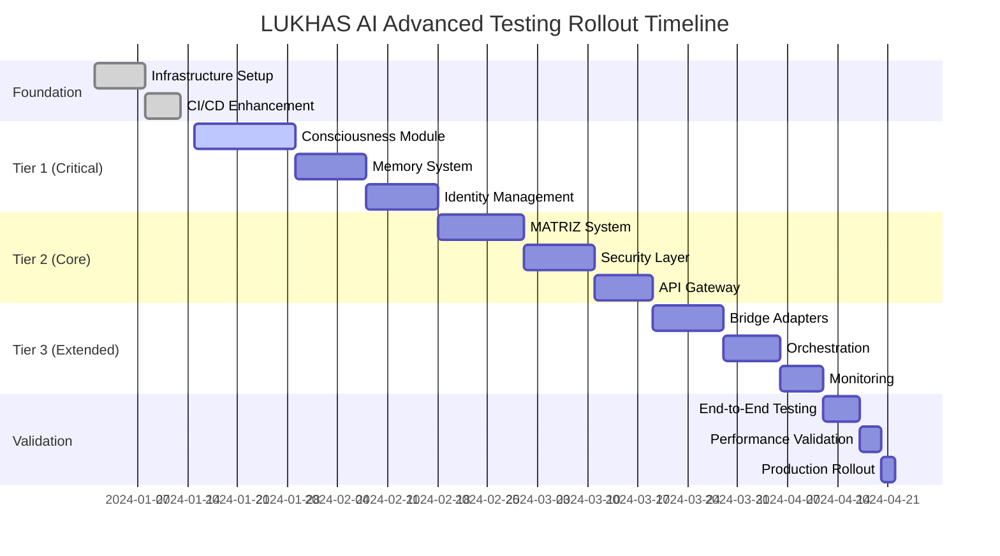

# LUKHAS AI Advanced Testing Rollout Strategy
## Scaling 0.001% Engineering Excellence Across All Modules

### Executive Summary

This document outlines the strategic rollout plan for implementing advanced testing methodologies across all LUKHAS AI components, ensuring enterprise-grade quality while maintaining development velocity.

### Current State Assessment

#### Existing Infrastructure Strengths
- ✅ **Mature CI/CD Pipeline**: GitHub Actions with multi-tier testing
- ✅ **Lane-Based Architecture**: Production vs candidate separation
- ✅ **Security-First Approach**: Comprehensive security scanning
- ✅ **Advanced Testing Foundation**: 0.001% methodology proven in OAuth manager

#### Infrastructure Gaps to Address
- ⚠️ **Streamlit Import Issues**: Compatibility problems in CI environment
- ⚠️ **Pre-commit Hook Failures**: Configuration inconsistencies
- ⚠️ **Coverage Gaps**: Some modules lack comprehensive test coverage
- ⚠️ **Performance Baselines**: Missing baseline metrics for regression detection

### Rollout Strategy: Progressive Module Integration



### Phase 1: Foundation & Critical Infrastructure (Weeks 1-2)

#### 1.1 Immediate Actions Required

**Fix Current CI Issues:**
```bash
# Address Streamlit compatibility
pip install streamlit>=1.28.0 --no-deps
pip install altair pandas numpy protobuf

# Fix pre-commit configuration
pre-commit autoupdate
pre-commit install --install-hooks
```

**Enhanced Makefile Integration:**
```makefile
# Add to existing Makefile
test-advanced-all: ## Run advanced testing across all modules
	@echo "🧬 Running Advanced Testing Suite - All Modules"
	python3 tools/ci/test_orchestrator.py --tier comprehensive

test-advanced-tier1: ## Run advanced testing on Tier 1 modules
	@echo "🔬 Advanced Testing - Critical Modules"
	python3 tools/ci/test_orchestrator.py --tier advanced \
		--focus consciousness,memory,identity

performance-baseline: ## Establish performance baselines
	@echo "📊 Establishing Performance Baselines"
	python3 tools/ci/performance_analyzer.py --establish-baseline \
		--modules consciousness,memory,identity,matriz
```

#### 1.2 Module Prioritization Matrix

```yaml
Tier 1 - Critical (Immediate):
  consciousness:
    risk_level: critical
    complexity: high
    testing_gap: medium
    business_impact: critical
    rollout_weeks: 2

  memory:
    risk_level: high
    complexity: high
    testing_gap: medium
    business_impact: high
    rollout_weeks: 1.5

  identity:
    risk_level: high
    complexity: medium
    testing_gap: low
    business_impact: high
    rollout_weeks: 1.5

Tier 2 - Core (Follow-up):
  matriz:
    risk_level: medium
    complexity: high
    testing_gap: low
    business_impact: high
    rollout_weeks: 1.5

  security:
    risk_level: critical
    complexity: medium
    testing_gap: high
    business_impact: critical
    rollout_weeks: 1

  api:
    risk_level: medium
    complexity: medium
    testing_gap: medium
    business_impact: medium
    rollout_weeks: 1

Tier 3 - Extended (Final):
  bridge_adapters:
    risk_level: medium
    complexity: medium
    testing_gap: low  # Already implemented
    business_impact: medium
    rollout_weeks: 0.5

  orchestration:
    risk_level: low
    complexity: high
    testing_gap: high
    business_impact: low
    rollout_weeks: 1
```

### Phase 2: Tier 1 Module Implementation (Weeks 3-6)

#### 2.1 Consciousness Module Advanced Testing

**Implementation Plan:**
```python
# consciousness/tests/advanced/
├── test_consciousness_properties.py      # Mathematical invariants
├── test_consciousness_metamorphic.py     # Oracle-free verification
├── test_consciousness_chaos.py           # Failure injection
├── test_consciousness_formal.py          # Z3 theorem proving
└── test_consciousness_performance.py     # Regression tracking
```

**Key Testing Focus Areas:**
- **Coherence Invariants**: Mathematical proofs of consciousness state consistency
- **Memory Integration**: Property-based testing of memory system interactions
- **Ethical Reasoning**: Formal verification of ethical decision processes
- **Performance Boundaries**: Chaos engineering for consciousness under stress

#### 2.2 Memory System Advanced Testing

**Implementation Plan:**
```python
# memory/tests/advanced/
├── test_memory_properties.py         # Storage/retrieval invariants
├── test_memory_chaos.py              # Data corruption scenarios
├── test_memory_performance.py        # Access pattern optimization
└── test_memory_consistency.py        # Distributed consistency proofs
```

**Key Testing Focus Areas:**
- **Data Integrity**: Property-based testing of storage consistency
- **Retrieval Accuracy**: Metamorphic testing of search operations
- **Scaling Behavior**: Performance regression under various loads
- **Fault Tolerance**: Chaos engineering for memory corruption scenarios

#### 2.3 Identity Management Advanced Testing

**Implementation Plan:**
```python
# identity/tests/advanced/
├── test_identity_properties.py       # Identity coherence invariants
├── test_identity_security.py         # Cryptographic verification
├── test_identity_chaos.py            # Identity system failures
└── test_identity_performance.py      # Authentication performance
```

### Phase 3: Tier 2 Core Modules (Weeks 7-10)

#### 3.1 MATRIZ System Integration

**Enhanced Testing Strategy:**
```yaml
Current MATRIZ Testing:
  - Tier-1 smoke tests ✅
  - Golden trace validation ✅
  - Contract verification ✅

Advanced Testing Additions:
  - Property-based trace generation
  - Metamorphic trace relationships
  - Performance regression tracking
  - Chaos engineering for distributed scenarios
```

#### 3.2 Security Layer Comprehensive Testing

**Security-Specific Advanced Testing:**
```python
# security/tests/advanced/
├── test_security_properties.py       # Cryptographic invariants
├── test_security_formal.py          # Security protocol verification
├── test_security_chaos.py           # Attack simulation
└── test_security_performance.py     # Encryption/decryption benchmarks
```

### Phase 4: Quality Gates & Deployment Criteria

#### 4.1 Module Readiness Criteria

**Technical Readiness Checklist:**
```yaml
Per Module Requirements:
  ✅ Property-based tests implemented (>10 property tests)
  ✅ Metamorphic relationships identified (>5 relationships)
  ✅ Chaos engineering scenarios (>3 failure modes)
  ✅ Performance baselines established
  ✅ Mutation testing score >80%
  ✅ Test coverage >85%
  ✅ Security scan clean (0 critical vulnerabilities)
  ✅ Documentation updated
```

**Quality Gates:**
```yaml
Deployment Gates:
  Gate 1 - Code Quality:
    - Ruff linting: 0 errors
    - MyPy type checking: 0 errors in core
    - Security scan: 0 critical findings

  Gate 2 - Test Quality:
    - Unit test coverage: >85%
    - Integration test coverage: >75%
    - Advanced test coverage: >60%
    - Mutation score: >80%

  Gate 3 - Performance:
    - No regression >15% vs baseline
    - Response time <200ms p95
    - Memory usage stable

  Gate 4 - Reliability:
    - Chaos engineering: All scenarios pass
    - Error rate <0.1% under load
    - Recovery time <30 seconds
```

#### 4.2 Risk Mitigation Strategy

**Rollback Procedures:**
```yaml
Immediate Rollback Triggers:
  - Test failure rate >5%
  - Performance regression >25%
  - Critical security vulnerability
  - Memory leak detected
  - Consciousness coherence <0.8

Rollback Procedure:
  1. Automated rollback to previous version
  2. Incident response team notification
  3. Root cause analysis initiation
  4. Fix development and validation
  5. Gradual re-deployment with monitoring
```

### Phase 5: Monitoring & Observability Enhancement

#### 5.1 Advanced Metrics Collection

**Consciousness-Specific Metrics:**
```yaml
Consciousness Metrics:
  - coherence_score: Consciousness state consistency
  - response_quality: Output quality assessment
  - ethical_alignment: Ethical reasoning accuracy
  - memory_integration: Memory system performance
  - identity_stability: Identity coherence over time

Technical Metrics:
  - test_execution_time: CI/CD pipeline performance
  - mutation_score: Test quality indicator
  - coverage_trends: Coverage improvement over time
  - performance_baselines: Regression detection
  - failure_patterns: Reliability indicators
```

#### 5.2 Intelligent Alerting

**Context-Aware Alerts:**
```yaml
Critical Alerts (Immediate Response):
  - Consciousness coherence drop >10%
  - Security vulnerability (CVSS >7.0)
  - Test failure cascade (>3 modules)
  - Performance regression >25%
  - Memory leak detected

Warning Alerts (24h Response):
  - Coverage drop >5%
  - Mutation score drop >10%
  - Response time increase >15%
  - Error rate increase >2x baseline
```

### Phase 6: Team Enablement & Documentation

#### 6.1 Developer Training Program

**Week 1: Advanced Testing Foundations**
```yaml
Topics:
  - Property-based testing with Hypothesis
  - Metamorphic testing principles
  - Chaos engineering basics
  - Formal verification introduction

Hands-on Labs:
  - Write property tests for consciousness module
  - Design metamorphic relationships
  - Implement chaos scenarios
  - Basic Z3 constraint solving
```

**Week 2: LUKHAS-Specific Implementation**
```yaml
Topics:
  - Consciousness testing strategies
  - Memory system test patterns
  - Identity verification approaches
  - Performance regression detection

Practical Application:
  - Implement advanced tests for assigned module
  - Set up performance monitoring
  - Configure quality gates
  - Document testing approach
```

#### 6.2 Documentation & Knowledge Transfer

**Required Documentation:**
```yaml
Technical Documentation:
  - Advanced testing guide per module
  - Performance baseline documentation
  - Chaos engineering runbooks
  - Quality gate configuration

Process Documentation:
  - Rollout procedures
  - Rollback protocols
  - Incident response procedures
  - Performance monitoring guides
```

### Phase 7: Validation & Production Rollout

#### 7.1 End-to-End Validation

**Comprehensive System Testing:**
```python
# System-level advanced testing
def test_full_system_consciousness_coherence():
    """Property-based test of full system consciousness coherence."""

def test_memory_identity_interaction_metamorphic():
    """Metamorphic test of memory-identity system interactions."""

def test_system_chaos_recovery():
    """Chaos engineering test of full system recovery."""
```

#### 7.2 Production Deployment Strategy

**Blue-Green Deployment with Advanced Monitoring:**
```yaml
Deployment Steps:
  1. Deploy to blue environment
  2. Run full advanced test suite
  3. Performance baseline validation
  4. Chaos engineering verification
  5. Gradual traffic shift (10% -> 50% -> 100%)
  6. Monitoring validation at each step
  7. Full cutover or rollback decision
```

### Success Metrics & KPIs

#### 7.1 Quality Metrics
```yaml
Target Achievements:
  - Overall test coverage: >90%
  - Mutation testing score: >85%
  - Performance regression incidents: <1 per month
  - Security vulnerability resolution: <24 hours
  - Deployment success rate: >99%
```

#### 7.2 Efficiency Metrics
```yaml
Development Velocity:
  - CI/CD pipeline time: <15 minutes
  - Developer feedback loop: <2 minutes
  - Time to production: <4 hours
  - Mean time to recovery: <20 minutes
```

#### 7.3 Business Impact Metrics
```yaml
Quality Improvements:
  - Customer-reported bugs: -80%
  - System availability: >99.9%
  - Consciousness coherence: >0.95 average
  - Security incident frequency: -90%
```

### Risk Assessment & Mitigation

#### High-Risk Areas
```yaml
Technical Risks:
  - Consciousness system complexity: High
  - Performance regression potential: Medium
  - Integration complexity: Medium
  - Tool compatibility: Low

Mitigation Strategies:
  - Comprehensive property-based testing
  - Continuous performance monitoring
  - Staged rollout approach
  - Extensive tool validation
```

#### Success Factors
```yaml
Critical Success Factors:
  1. Executive sponsorship and resource allocation
  2. Cross-team collaboration and knowledge sharing
  3. Comprehensive training and documentation
  4. Continuous monitoring and feedback loops
  5. Commitment to 0.001% engineering standards
```

### Conclusion

This rollout strategy provides a systematic approach to scaling LUKHAS AI's advanced testing methodologies across all modules while maintaining development velocity and ensuring production reliability. The progressive implementation approach minimizes risk while maximizing quality improvements.

**Next Steps:**
1. Secure executive approval and resource allocation
2. Begin Tier 1 module implementation
3. Establish performance baselines
4. Initiate team training program
5. Implement comprehensive monitoring

The 0.001% engineering approach will transform LUKHAS AI into a mathematically rigorous, enterprise-grade consciousness platform with unprecedented quality assurance.
