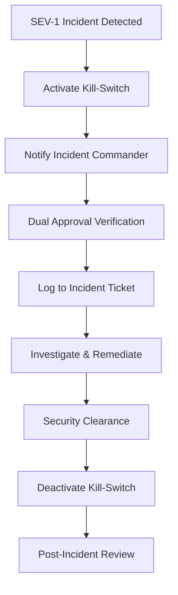

# Guardian Emergency Procedures Runbook

**Purpose**: Comprehensive procedures for Guardian system emergency operations, including kill-switch activation and enforcement overrides.

**Authorization**: T4+ dual approval required for all emergency procedures
**Audience**: Security Operations, Site Reliability Engineering, Incident Response

---

## 📋 Table of Contents

1. [Emergency Kill-Switch](#emergency-kill-switch)
2. [Guardian Override Procedures](#guardian-override-procedures)
3. [Enforcement Mode Management](#enforcement-mode-management)
4. [Monitoring & Verification](#monitoring--verification)
5. [Incident Response Integration](#incident-response-integration)

---

## 🚨 Emergency Kill-Switch

### Overview

The Guardian Emergency Kill-Switch is a **fail-safe mechanism** that immediately blocks ALL Guardian-protected operations across the entire system. This is a last-resort measure for critical security incidents.

**When to Use:**
- Active security breach detected
- Widespread system compromise
- Data exfiltration in progress
- Uncontrolled AI behavior
- Regulatory compliance violation requiring immediate shutdown

**Impact:** ALL Guardian-protected operations will be BLOCKED until kill-switch is deactivated.

---

### Kill-Switch Activation

#### Prerequisites
- [ ] **Active security incident** documented
- [ ] **Incident Commander** assigned
- [ ] **Dual approval** obtained (T4+ Security + T4+ Engineering)
- [ ] **Communication sent** to #incident-response channel

#### Activation Methods

**Method 1: File-Based Kill-Switch (Recommended)**

```bash
# On production server (requires sudo/root)
# This creates the kill-switch file
sudo touch /tmp/guardian_emergency_disable

# Verify kill-switch is active
sudo cat /tmp/guardian_emergency_disable

# Expected output:
# GUARDIAN EMERGENCY KILL-SWITCH ACTIVATED
# Timestamp: 2025-11-08T10:30:00Z
# Reason: [reason will be shown]
```

**Method 2: Programmatic Activation (Python)**

```python
from lukhas_website.lukhas.governance.guardian_system import activate_kill_switch

# Activate with reason
success = activate_kill_switch(
    reason="Security breach detected - data exfiltration attempt from IP 192.168.1.100"
)

if success:
    print("✅ Kill-switch activated successfully")
else:
    print("❌ Failed to activate kill-switch - check logs")
```

**Method 3: API Activation**

```bash
# Via Guardian API
curl -X POST https://api.lukhas.ai/v1/guardian/emergency/killswitch/activate \
  -H "Authorization: Bearer ${GUARDIAN_ADMIN_TOKEN}" \
  -H "Content-Type: application/json" \
  -d '{
    "reason": "Active security incident - ticket INC-12345",
    "approver1": "λid:alice.security.t5",
    "approver2": "λid:bob.engineering.t4",
    "incident_id": "INC-12345"
  }'
```

#### Verification

```bash
# Check kill-switch status
python3 -c "
from lukhas_website.lukhas.governance.guardian_system import check_kill_switch_status
status = check_kill_switch_status()
print(status['message'])
"

# Expected output when active:
# 🚨 KILL-SWITCH ACTIVE - All Guardian operations blocked

# Monitor Guardian logs
tail -f /var/log/lukhas/guardian.log | grep "KILL-SWITCH"

# Expected log output:
# [CRITICAL] 🚨 EMERGENCY KILL-SWITCH ACTIVATED: /tmp/guardian_emergency_disable exists - DENYING ALL
```

---

### Kill-Switch Deactivation

#### Prerequisites
- [ ] **Root cause resolved** and documented
- [ ] **Security clearance** obtained from Security Lead
- [ ] **Dual approval** for deactivation (T4+ Security + T4+ Engineering)
- [ ] **Post-incident review** scheduled
- [ ] **Monitoring increased** for 24 hours post-deactivation

⚠️ **CRITICAL**: Deactivation requires DIFFERENT approvers than activation (4 total approvers).

#### Deactivation Methods

**Method 1: File-Based (Recommended)**

```bash
# Verify kill-switch is still needed to be active
# Check with Incident Commander before proceeding

# Remove kill-switch file (requires sudo/root)
sudo rm /tmp/guardian_emergency_disable

# Verify deactivation
python3 -c "
from lukhas_website.lukhas.governance.guardian_system import check_kill_switch_status
status = check_kill_switch_status()
print(status['message'])
"

# Expected output:
# ✅ Kill-switch not active - Normal operations

# Log deactivation with approver info
logger -p user.warning "Guardian kill-switch deactivated by $(whoami) - Approver1: [NAME] Approver2: [NAME]"
```

**Method 2: Programmatic Deactivation**

```python
from lukhas_website.lukhas.governance.guardian_system import deactivate_kill_switch

# Deactivate with approver tracking
success = deactivate_kill_switch(
    approver="λid:charlie.security.t5 + λid:diana.engineering.t4"
)

if success:
    print("✅ Kill-switch deactivated - normal operations restored")
else:
    print("❌ Failed to deactivate kill-switch")
```

#### Post-Deactivation Checklist

Within 1 hour:
- [ ] Monitor Guardian decision logs for anomalies
- [ ] Verify normal operation flow resumed
- [ ] Document deactivation in incident ticket
- [ ] Send all-clear to #incident-response

Within 24 hours:
- [ ] Conduct post-incident review
- [ ] Update threat intelligence
- [ ] Review Guardian rules for gaps
- [ ] Update runbook if needed

Within 1 week:
- [ ] Complete incident report
- [ ] Share lessons learned
- [ ] Update Guardian policies if required
- [ ] Conduct tabletop exercise if systemic issue

---

## 🔄 Guardian Override Procedures

For non-emergency situations where Guardian blocks legitimate operations, see:

📖 **[Guardian Override Playbook](./guardian_override_playbook.md)**

Key differences:
- **Kill-Switch**: Blocks ALL operations (emergency only)
- **Override**: Allows SPECIFIC operations (planned bypass)

---

## ⚙️ Enforcement Mode Management

### Enforcement Modes

| Mode | Behavior | Use Case | Default |
|------|----------|----------|---------|
| `ENFORCED` | Full Guardian enforcement active | Production | ✅ Yes |
| `CANARY` | Partial enforcement (gradual rollout) | Staging, canary deployments | ❌ No |
| `DARK` | Logging only, no blocking | Development, testing | ❌ No |

### Current Enforcement Status

```bash
# Check current enforcement mode
grep "ENFORCE_ETHICS_DSL" .env.production

# Expected for production:
# ENFORCE_ETHICS_DSL=1

# Check runtime enforcement
python3 -c "
from lukhas_website.lukhas.consciousness.guardian_integration import GuardianValidationConfig
config = GuardianValidationConfig()
print(f'Enforcement mode: {config.enforcement_mode}')
print(f'Guardian active: {config.guardian_active}')
print(f'Ethics validation required: {config.ethics_validation_required}')
"

# Expected output:
# Enforcement mode: enforced
# Guardian active: True
# Ethics validation required: True
```

### Changing Enforcement Mode (NON-PRODUCTION ONLY)

⚠️ **WARNING**: NEVER change enforcement mode in production without Security Lead approval.

```bash
# Development/Staging only
export GUARDIAN_ENFORCEMENT_MODE=dark  # or canary
export ENFORCE_ETHICS_DSL=0

# Restart Guardian services
sudo systemctl restart lukhas-guardian
```

---

## 📊 Monitoring & Verification

### Health Checks

```bash
# Guardian system health
curl -s http://localhost:8000/health/guardian | jq .

# Expected healthy output:
# {
#   "status": "healthy",
#   "enforcement_enabled": true,
#   "emergency_active": false,
#   "kill_switch_active": false,
#   "components": ["reflector", "sentinel", "shadow_filter", "ethics_guardian"],
#   "latency_p95_ms": 45.3
# }

# Guardian metrics
curl -s http://localhost:9090/metrics | grep guardian

# Key metrics to monitor:
# guardian_decisions_total{status="allow"}
# guardian_decisions_total{status="deny"}
# guardian_latency_seconds_p95
# guardian_errors_total
# guardian_kill_switch_activations_total
```

### Log Monitoring

```bash
# Monitor Guardian decisions in real-time
tail -f /var/log/lukhas/guardian.log

# Filter for denials
grep "DENIED\|DENY" /var/log/lukhas/guardian.log | tail -20

# Filter for emergency events
grep "EMERGENCY\|KILL-SWITCH\|CRITICAL" /var/log/lukhas/guardian.log

# Check for enforcement bypasses
grep "enforcement disabled\|enforcement_enabled.*false" /var/log/lukhas/guardian.log
```

### Alerting

Guardian emergency alerts are sent to:
- **Slack**: #security-alerts, #incident-response
- **PagerDuty**: Guardian Oncall rotation
- **Email**: security@lukhas.ai, devops@lukhas.ai

---

## 🚑 Incident Response Integration

### Incident Severity Classification

| Severity | Guardian Action | Response Time | Approvals |
|----------|----------------|---------------|-----------|
| **SEV-1** | Kill-switch activation | Immediate | Dual T4+ |
| **SEV-2** | Enhanced monitoring | <15 min | Single T4+ |
| **SEV-3** | Normal monitoring | <1 hour | Standard |

### SEV-1 Incident Response Flow



### Communication Templates

**Kill-Switch Activation Announcement**

```
🚨 GUARDIAN EMERGENCY KILL-SWITCH ACTIVATED 🚨

Incident ID: INC-[NUMBER]
Timestamp: [ISO-8601 timestamp]
Reason: [Brief description]
Approvers: [Name1 (T4+), Name2 (T4+)]
Impact: ALL Guardian-protected operations BLOCKED
ETA Resolution: [Estimate]

Status updates: #incident-response
Incident Commander: @[name]
```

**Kill-Switch Deactivation Announcement**

```
✅ GUARDIAN KILL-SWITCH DEACTIVATED - NORMAL OPERATIONS RESTORED

Incident ID: INC-[NUMBER]
Deactivation Time: [ISO-8601 timestamp]
Duration: [hours:minutes]
Deactivation Approvers: [Name3 (T4+), Name4 (T4+)]
Root Cause: [Brief description]

All systems returning to normal operation.
Post-incident review scheduled for: [date/time]
```

---

## 📞 Emergency Contacts

| Role | Primary Contact | Backup Contact | Escalation |
|------|----------------|----------------|------------|
| **Security Lead** | security@lukhas.ai | security-oncall@lukhas.ai | CISO |
| **Incident Commander** | incident@lukhas.ai | devops-oncall@lukhas.ai | VP Engineering |
| **Guardian System Owner** | guardian@lukhas.ai | ai-safety@lukhas.ai | CTO |
| **Legal/Compliance** | legal@lukhas.ai | compliance@lukhas.ai | General Counsel |

**Emergency Hotline**: +1-555-GUARDIAN (24/7)

---

## 🔐 Security & Compliance

### Audit Trail

All Guardian emergency procedures are logged to:
- Guardian decision logs (`/var/log/lukhas/guardian.log`)
- Audit database (`guardian_audit` table)
- Compliance ledger (`exemption_ledger` table)
- SIEM (Splunk/ELK) for 7-year retention

### Required Documentation

Every kill-switch activation/deactivation must include:
1. ✅ Incident ticket ID
2. ✅ Business justification
3. ✅ Dual approver verification (4 total: 2 activation + 2 deactivation)
4. ✅ Timestamp and duration
5. ✅ Root cause analysis
6. ✅ Post-incident review

### Compliance Requirements

- **SOC 2**: Kill-switch events require 24-hour incident review
- **GDPR**: Data protection impact assessment if user data affected
- **PCI-DSS**: Immediate notification to QSA if payment data at risk
- **HIPAA**: Breach notification assessment if PHI potentially exposed

---

## 🧪 Testing & Drills

### Monthly Kill-Switch Drill

**Objective**: Verify kill-switch activation/deactivation procedures

```bash
# NON-PRODUCTION ONLY
# Simulate kill-switch activation
python3 -c "
from lukhas_website.lukhas.governance.guardian_system import activate_kill_switch
activate_kill_switch(reason='Monthly drill - TEST ONLY', custom_path='/tmp/guardian_drill_killswitch')
"

# Verify blocking behavior
# Attempt Guardian-protected operation (should fail)
python3 scripts/test_guardian_operation.py

# Deactivate drill kill-switch
python3 -c "
from lukhas_website.lukhas.governance.guardian_system import deactivate_kill_switch
deactivate_kill_switch(approver='drill-operator', custom_path='/tmp/guardian_drill_killswitch')
"
```

**Drill Checklist:**
- [ ] Activation time < 60 seconds
- [ ] All operations properly blocked
- [ ] Logs captured correctly
- [ ] Deactivation time < 60 seconds
- [ ] Normal operations resumed
- [ ] Metrics recorded accurately

---

## 📚 Related Documentation

- 📖 [Guardian Override Playbook](./guardian_override_playbook.md) - Planned bypasses
- 📖 [Guardian Safety Tags Runbook](./guardian_safety_tags_runbook.md) - Safety tag management
- 📖 [Go-Live Runbook](./GO_LIVE_RUNBOOK.md) - Production deployment
- 📖 [Incident Response Guide](../INCIDENT_RESPONSE.md) - General incident procedures

---

## 📝 Runbook Maintenance

**Owner**: Security Team
**Review Frequency**: Quarterly
**Next Review**: 2025-02-08
**Change Log**: See git history

**Feedback**: security@lukhas.ai or #guardian-system

---

## ⚠️ CRITICAL REMINDERS

1. 🚨 **Kill-switch blocks ALL operations** - Use only for emergencies
2. 🔐 **Dual approval required** - ALWAYS (4 total approvers for full cycle)
3. ⏱️ **Document immediately** - Audit trail is mandatory
4. 📞 **Communicate widely** - Keep stakeholders informed
5. 🔄 **Post-incident review** - Learn and improve

---

**Version**: 1.0.0
**Last Updated**: 2025-11-08
**Status**: Production Ready
**Classification**: Internal Use Only
