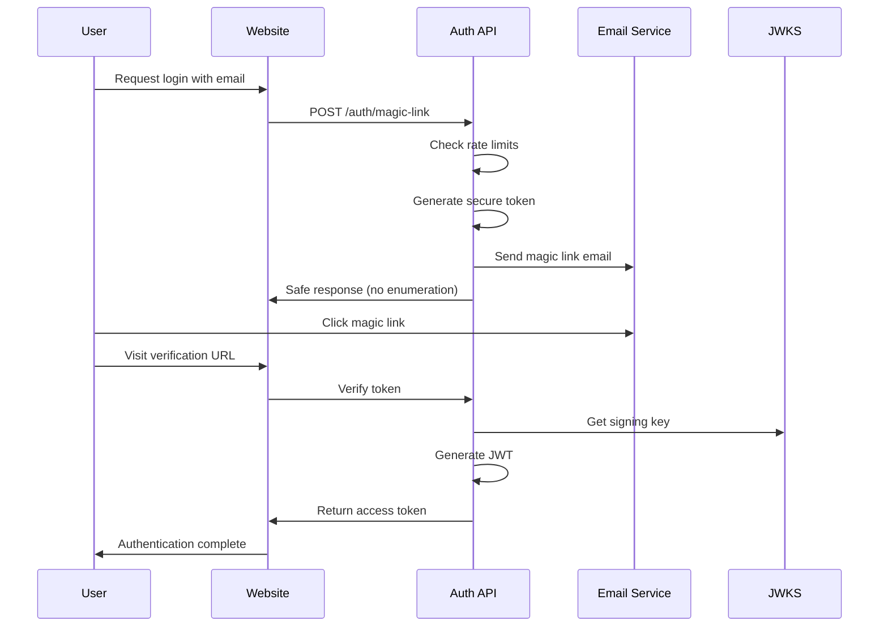

# ΛiD Authentication System - Security Infrastructure

## 🛡️ Overview

The LUKHAS AI ΛiD (Lambda Identity) authentication system implements enterprise-grade security with a focus on preventing common authentication vulnerabilities while maintaining excellent user experience.

## 🔐 Security Architecture

### Core Principles
- **Zero-password authentication**: Magic links and WebAuthn only
- **Enumeration protection**: Same responses regardless of account existence
- **Comprehensive rate limiting**: Per-email, per-IP, and global limits
- **Audit everything**: Complete security event logging
- **Defense in depth**: Multiple layers of protection

### Authentication Flow


## 📁 Infrastructure Components

### Environment Configuration
- **File**: `/Users/agi_dev/LOCAL-REPOS/Lukhas/.env.example`
- **Purpose**: Complete ΛiD authentication environment template
- **Security Features**:
  - Password authentication disabled by default
  - WebAuthn configuration for hardware keys
  - Magic link TTL and security settings
  - Break-glass emergency access configuration
  - Comprehensive audit and monitoring settings

### HTTPS Development Setup
- **File**: `/Users/agi_dev/LOCAL-REPOS/Lukhas/lukhas_website/next.config.js`
- **Purpose**: Enable HTTPS localhost for WebAuthn development
- **Security Headers**:
  - Content Security Policy enforcement
  - JWKS endpoint caching
  - Anti-clickjacking protection
  - Content type validation

### Certificate Generation
- **File**: `/Users/agi_dev/LOCAL-REPOS/Lukhas/scripts/generate-dev-certs.sh`
- **Purpose**: Generate self-signed certificates for development
- **Features**:
  - RSA 2048-bit encryption
  - Subject Alternative Names for localhost
  - Proper file permissions
  - Cross-platform compatibility

### JWKS Management
- **File**: `/Users/agi_dev/LOCAL-REPOS/Lukhas/lukhas_website/packages/auth/jwks.ts`
- **Purpose**: JSON Web Key Set management and rotation
- **Features**:
  - Quarterly key rotation with 30-day overlap
  - Secure key storage and validation
  - JWKS endpoint generation
  - Key lifecycle management

### Security Infrastructure
- **File**: `/Users/agi_dev/LOCAL-REPOS/Lukhas/lukhas_website/packages/auth/security.ts`
- **Purpose**: Rate limiting and enumeration protection
- **Features**:
  - Multi-tier rate limiting (email, IP, global)
  - Account enumeration prevention
  - Comprehensive audit logging
  - Real-time security monitoring

### JWKS API Endpoint
- **File**: `/Users/agi_dev/LOCAL-REPOS/Lukhas/lukhas_website/app/api/.well-known/jwks/route.ts`
- **Purpose**: Public key distribution for JWT verification
- **Security**:
  - Proper caching headers
  - Error handling without information leakage
  - CORS configuration for public access

## 📋 Documentation

### Break-Glass Procedures
- **File**: `/Users/agi_dev/LOCAL-REPOS/Lukhas/docs/security/break-glass-procedure.md`
- **Purpose**: Emergency access procedures and runbooks
- **Coverage**:
  - Multi-factor authentication requirements
  - Emergency access scenarios
  - Audit and compliance procedures
  - Key rotation schedules

### Email Security Requirements
- **File**: `/Users/agi_dev/LOCAL-REPOS/Lukhas/docs/security/email-security-requirements.md`
- **Purpose**: Email infrastructure security configuration
- **Coverage**:
  - SPF, DKIM, DMARC configuration
  - Rate limiting and anti-abuse measures
  - Bounce handling and suppression lists
  - Compliance requirements

## 🔧 Utilities

### Key Management
- **File**: `/Users/agi_dev/LOCAL-REPOS/Lukhas/scripts/key-management.sh`
- **Purpose**: Cryptographic key lifecycle management
- **Commands**:
  - `generate-jwt-keys`: Create new RSA key pairs
  - `rotate-keys`: Perform quarterly key rotation
  - `generate-totp`: Create TOTP secrets for break-glass
  - `validate-keys`: Verify key pair integrity
  - `backup-keys`: Secure key backup creation

## 🚀 Getting Started

### 1. Environment Setup
```bash
# Copy environment template
cp .env.example .env

# Generate development certificates
./scripts/generate-dev-certs.sh

# Generate JWT keys
./scripts/key-management.sh generate-jwt-keys

# Generate break-glass TOTP secret
./scripts/key-management.sh generate-totp
```

### 2. Development Server
```bash
# Navigate to website directory
cd lukhas_website

# Install dependencies
npm install

# Start HTTPS development server
DEV_HTTPS_ENABLED=true npm run dev
```

### 3. Security Testing
```bash
# Validate key pairs
./scripts/key-management.sh validate-keys

# Test JWKS endpoint
curl -k https://localhost:3000/.well-known/jwks.json

# Test rate limiting
curl -X POST https://localhost:3000/api/auth/magic-link \
  -H "Content-Type: application/json" \
  -d '{"email": "test@example.com"}'
```

## 🔍 Security Monitoring

### Key Metrics
- **Authentication attempts**: Success/failure rates
- **Rate limit hits**: Per endpoint and time window
- **JWKS requests**: Key distribution monitoring
- **Email deliverability**: Bounce rates and complaints
- **Break-glass access**: Emergency access attempts

### Alerting Thresholds
- **Failed auth rate**: >5 failures per IP per 15 minutes
- **Rate limit abuse**: >10 rate limit hits per IP per hour
- **Email bounce rate**: >5% hard bounces
- **JWKS errors**: Any 5xx responses
- **Break-glass access**: Any emergency access attempts

## ⚖️ Compliance

### Standards Compliance
- **SOC 2 Type II**: Access controls and monitoring
- **ISO 27001**: Information security management
- **GDPR**: Data protection and privacy by design
- **CCPA**: Consumer privacy rights
- **NIST Cybersecurity Framework**: Risk management

### Data Protection
- **Encryption at rest**: All sensitive data encrypted
- **Encryption in transit**: TLS 1.3 for all communications
- **Key management**: Hardware security modules for production
- **Data minimization**: Only collect necessary information
- **Right to erasure**: User data deletion capabilities

## 🔄 Maintenance Schedule

### Daily
- Monitor authentication metrics
- Review security alerts
- Check system health status

### Weekly
- Analyze audit logs
- Review rate limiting effectiveness
- Update threat intelligence

### Monthly
- Security metrics review
- Incident response drills
- Documentation updates

### Quarterly
- Key rotation procedures
- Security architecture review
- Penetration testing
- Compliance audits

## 📞 Security Contacts

### Internal Team
- **Security Team**: security@lukhas.ai
- **Development Team**: dev@lukhas.ai
- **Infrastructure Team**: infra@lukhas.ai

### Emergency Contacts
- **Security Hotline**: +1-XXX-XXX-XXXX (24/7)
- **Break-glass Access**: security-emergency@lukhas.ai
- **Incident Response**: incident-response@lukhas.ai

## 🔗 Related Documentation

- [Authentication Architecture](./authentication-architecture.md)
- [Incident Response Plan](./incident-response.md)
- [Security Audit Reports](./audit-reports/)
- [Penetration Test Results](./pentest-reports/)

---

**🔒 CONFIDENTIAL**: This documentation contains sensitive security information. Access is restricted to authorized personnel only.
