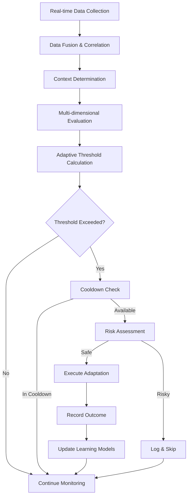

# LUKHAS  Trigger System Technical Guide

## Overview

This guide provides detailed technical information about the Enhanced Monitoring System's trigger mechanism, including threshold calculations, data integration patterns, and adaptation execution.

## 🎯 Trigger System Architecture

### Trigger Evaluation Pipeline



### Trigger Types and Implementation

#### 1. Stress Adaptation Trigger

**Purpose**: Responds to high stress levels and activates coping mechanisms

**Implementation**:
```python
async def evaluate_stress_trigger(self, snapshot: EndocrineSnapshot) -> Optional[PlasticityEvent]:
    # Multi-source stress calculation
    cortisol = snapshot.hormone_levels.get("cortisol", 0.5)
    adrenaline = snapshot.hormone_levels.get("adrenaline", 0.5)
    emotional_stress = (1.0 - snapshot.system_metrics.get("emotional_coherence", 0.5))
    cognitive_stress = snapshot.system_metrics.get("cpu_utilization", 0.5)

    # Combined stress indicator
    stress_level = (
        cortisol * 0.4 +           # Primary stress hormone
        adrenaline * 0.3 +         # Fight/flight response
        emotional_stress * 0.2 +   # Emotional distress
        cognitive_stress * 0.1     # System load stress
    )

    # Adaptive threshold calculation
    threshold = self._calculate_adaptive_threshold(
        "stress_adaptation",
        stress_level,
        base_threshold=0.7
    )

    if stress_level > threshold:
        return PlasticityEvent(
            trigger_type=PlasticityTriggerType.STRESS_ADAPTATION,
            hormone_context={"cortisol": cortisol, "adrenaline": adrenaline},
            reason=f"High stress detected: {stress_level:.3f} > {threshold:.3f}"
        )

    return None
```

**Adaptation Strategies**:
- **Immediate**: Activate stress response protocols, increase resource allocation
- **Gradual**: Slowly adjust system parameters to reduce stress load
- **Scheduled**: Plan stress reduction activities during optimal times

#### 2. Performance Optimization Trigger

**Purpose**: Detects suboptimal performance and initiates optimization

**Implementation**:
```python
async def evaluate_performance_trigger(self, snapshot: EndocrineSnapshot) -> Optional[PlasticityEvent]:
    # Performance indicator calculation
    decision_confidence = snapshot.system_metrics.get("decision_confidence", 0.5)
    response_time = 1.0 - snapshot.system_metrics.get("response_time", 0.5)  # Invert
    memory_efficiency = 1.0 - snapshot.system_metrics.get("memory_load", 0.5)  # Invert
    dopamine_level = snapshot.hormone_levels.get("dopamine", 0.5)

    performance_level = (
        decision_confidence * 0.3 +
        response_time * 0.3 +
        memory_efficiency * 0.2 +
        dopamine_level * 0.2
    )

    # Inverted threshold (low performance triggers optimization)
    threshold = self._calculate_adaptive_threshold(
        "performance_optimization",
        performance_level,
        base_threshold=0.4,
        inverted=True
    )

    if performance_level < threshold:
        return PlasticityEvent(
            trigger_type=PlasticityTriggerType.PERFORMANCE_OPTIMIZATION,
            hormone_context={"dopamine": dopamine_level},
            reason=f"Low performance: {performance_level:.3f} < {threshold:.3f}"
        )

    return None
```

#### 3. Social Enhancement Trigger

**Purpose**: Enhances social interaction capabilities when social hormones are low

**Implementation**:
```python
async def evaluate_social_trigger(self, snapshot: EndocrineSnapshot) -> Optional[PlasticityEvent]:
    oxytocin = snapshot.hormone_levels.get("oxytocin", 0.5)
    interaction_quality = snapshot.system_metrics.get("communication_clarity", 0.5)
    empathy_level = snapshot.system_metrics.get("empathy_engagement", 0.5)

    social_level = (
        oxytocin * 0.6 +           # Primary social bonding hormone
        interaction_quality * 0.2 +
        empathy_level * 0.2
    )

    threshold = self._calculate_adaptive_threshold(
        "social_enhancement",
        social_level,
        base_threshold=0.3,
        inverted=True
    )

    if social_level < threshold:
        return PlasticityEvent(
            trigger_type=PlasticityTriggerType.SOCIAL_ENHANCEMENT,
            hormone_context={"oxytocin": oxytocin},
            reason=f"Low social engagement: {social_level:.3f} < {threshold:.3f}"
        )

    return None
```

## 🧮 Adaptive Threshold Calculation

### Core Algorithm

```python
def _calculate_adaptive_threshold(
    self,
    trigger_type: str,
    current_value: float,
    base_threshold: float,
    inverted: bool = False
) -> float:
    """
    Six-factor adaptive threshold calculation that learns and evolves
    """

    # 1. START WITH BASE THRESHOLD
    threshold = base_threshold

    # 2. HISTORICAL ADAPTATION
    history = self._get_value_history(trigger_type)
    if len(history) > 10:
        recent_avg = np.mean(history[-10:])
        historical_avg = np.mean(history)
        adaptation_factor = (recent_avg - historical_avg) * 0.3

        if not inverted:
            threshold += adaptation_factor
        else:
            threshold -= adaptation_factor

    # 3. CIRCADIAN RHYTHM ADJUSTMENT
    current_hour = datetime.now().hour
    circadian_adjustment = self._get_circadian_adjustment(trigger_type, current_hour)
    threshold += circadian_adjustment

    # 4. SYSTEM LOAD FACTOR
    system_load = self._get_current_system_load()
    if system_load > 0.8:  # High load
        threshold += 0.05  # Less sensitive
    elif system_load < 0.3:  # Low load
        threshold -= 0.05  # More sensitive

    # 5. SUCCESS RATE LEARNING
    success_rate = self._get_trigger_success_rate(trigger_type)
    if success_rate > 0.8:  # High success
        threshold -= 0.02  # More aggressive
    elif success_rate < 0.3:  # Low success
        threshold += 0.02  # More conservative

    # 6. BOUNDS CHECKING
    if inverted:
        threshold = max(0.1, min(0.8, threshold))
    else:
        threshold = max(0.2, min(0.95, threshold))

    return threshold
```

### Circadian Rhythm Adjustments

```python
def _get_circadian_adjustment(self, trigger_type: str, hour: int) -> float:
    """Calculate time-based threshold adjustments"""

    adjustments = {
        "stress_adaptation": {
            "work_hours": (9, 17, -0.1),    # More sensitive during work
            "evening": (18, 22, 0.05),      # Less sensitive in evening
            "night": (23, 6, 0.1)           # Least sensitive at night
        },
        "performance_optimization": {
            "morning": (6, 10, -0.05),      # More sensitive in morning
            "afternoon": (14, 18, -0.03),   # Slightly more sensitive
            "night": (22, 6, 0.08)          # Less sensitive at night
        },
        "social_enhancement": {
            "social_hours": (10, 20, -0.08), # More sensitive during day
            "quiet_hours": (21, 9, 0.1)      # Less sensitive at night
        },
        "recovery_consolidation": {
            "evening": (19, 23, -0.15),     # Much more sensitive evening
            "night": (0, 8, -0.1),          # More sensitive at night
            "day": (9, 18, 0.1)             # Less sensitive during day
        }
    }

    trigger_adjustments = adjustments.get(trigger_type, {})

    for period, (start_hour, end_hour, adjustment) in trigger_adjustments.items():
        if start_hour <= hour <= end_hour or (start_hour > end_hour and (hour >= start_hour or hour <= end_hour)):
            return adjustment

    return 0.0  # No adjustment
```

### Learning from Success Rates

```python
def _update_trigger_success_rate(self, trigger_type: str, success: bool):
    """Update success rate tracking for learning"""

    # Get or create success history
    if trigger_type not in self.success_histories:
        self.success_histories[trigger_type] = deque(maxlen=50)

    # Add outcome
    self.success_histories[trigger_type].append(1.0 if success else 0.0)

    # Calculate new success rate
    history = self.success_histories[trigger_type]
    success_rate = sum(history) / len(history) if history else 0.5

    # Log significant changes
    if len(history) >= 10:
        recent_rate = sum(list(history)[-10:]) / 10
        if abs(recent_rate - success_rate) > 0.2:
            logger.info(
                "Significant success rate change detected",
                trigger_type=trigger_type,
                overall_rate=success_rate,
                recent_rate=recent_rate
            )

    return success_rate
```

## 📊 Data Integration Patterns

### Module Data Collection Strategy

```python
class ModuleDataCollector:
    """Systematic data collection from LUKHAS  modules"""

    async def collect_consciousness_data(self) -> Dict[str, Any]:
        """Collect consciousness-related metrics"""

        data = {}

        # Auto-consciousness metrics
        if self.consciousness_service:
            awareness = await self.consciousness_service.assess_awareness({})
            data.update({
                "awareness_level": awareness.get("overall_awareness", 0.5),
                "attention_targets": awareness.get("attention_targets", []),
                "consciousness_stability": awareness.get("stability", 0.5)
            })

        # Natural language interface metrics
        if self.nl_interface:
            # Get recent conversation metrics
            status = await self.nl_interface.get_status()
            data.update({
                "communication_quality": self._assess_communication_quality(status),
                "interaction_count": status.get("total_turns", 0),
                "emotional_engagement": self._calculate_emotional_engagement(status)
            })

        return data

    async def collect_memory_data(self) -> Dict[str, Any]:
        """Collect memory system metrics"""

        data = {}

        if self.memory_service:
            # Memory statistics
            stats = await self.memory_service.get_memory_statistics()
            data.update({
                "memory_load": min(1.0, stats.get("fold_count", 0) / 1000),
                "cascade_prevention_rate": stats.get("cascade_prevention_rate", 0.0),
                "consolidation_efficiency": stats.get("consolidation_rate", 0.0)
            })

            # Recent memory activity
            activity = await self.memory_service.get_recent_activity(minutes=5)
            data.update({
                "recent_memory_operations": len(activity),
                "memory_access_pattern": self._analyze_access_pattern(activity)
            })

        return data

    async def collect_biological_data(self) -> Dict[str, Any]:
        """Collect biological/endocrine metrics"""

        data = {}

        # Endocrine system data
        if self.endocrine_system:
            hormone_profile = await self.endocrine_system.get_hormone_profile()
            homeostasis_state = await self.endocrine_system.get_homeostasis_state()

            data.update({
                "hormone_levels": hormone_profile,
                "homeostasis_state": homeostasis_state,
                "biological_coherence": self._calculate_hormone_coherence(hormone_profile)
            })

        # System health proxies
        data.update(await self._collect_system_health_proxies())

        return data
```

### Data Fusion and Correlation

```python
class DataFusionEngine:
    """Fuses data from multiple sources into coherent metrics"""

    def fuse_stress_indicators(
        self,
        consciousness_data: Dict[str, Any],
        biological_data: Dict[str, Any],
        emotional_data: Dict[str, Any]
    ) -> float:
        """Fuse multiple stress indicators into single metric"""

        # Biological stress (40% weight)
        hormone_levels = biological_data.get("hormone_levels", {})
        bio_stress = (
            hormone_levels.get("cortisol", 0.5) * 0.6 +
            hormone_levels.get("adrenaline", 0.5) * 0.4
        )

        # Cognitive stress (30% weight)
        cognitive_stress = min(1.0, consciousness_data.get("awareness_level", 0.5) - 0.3)

        # Emotional stress (20% weight)
        emotional_stress = 1.0 - emotional_data.get("valence", 0.5)

        # System stress (10% weight)
        system_stress = biological_data.get("system_load", 0.5)

        # Weighted combination
        combined_stress = (
            bio_stress * 0.4 +
            cognitive_stress * 0.3 +
            emotional_stress * 0.2 +
            system_stress * 0.1
        )

        return max(0.0, min(1.0, combined_stress))

    def calculate_performance_indicator(
        self,
        consciousness_data: Dict[str, Any],
        memory_data: Dict[str, Any],
        reasoning_data: Dict[str, Any],
        biological_data: Dict[str, Any]
    ) -> float:
        """Calculate overall performance indicator"""

        # Cognitive performance components
        decision_quality = consciousness_data.get("decision_confidence", 0.5)
        memory_efficiency = 1.0 - memory_data.get("memory_load", 0.5)
        reasoning_quality = reasoning_data.get("logical_coherence", 0.5)

        # Biological performance support
        dopamine_support = biological_data.get("hormone_levels", {}).get("dopamine", 0.5)

        # Combined performance metric
        performance = (
            decision_quality * 0.3 +
            memory_efficiency * 0.25 +
            reasoning_quality * 0.25 +
            dopamine_support * 0.2
        )

        return max(0.0, min(1.0, performance))
```

## 🔧 Adaptation Execution Framework

### Adaptation Strategy Selection

```python
class AdaptationStrategySelector:
    """Selects optimal adaptation strategy based on context"""

    def select_strategy(
        self,
        trigger_event: PlasticityEvent,
        system_state: Dict[str, Any],
        historical_success: Dict[str, float]
    ) -> AdaptationStrategy:
        """Select best adaptation strategy for current situation"""

        trigger_type = trigger_event.trigger_type
        system_stability = system_state.get("stability", 0.5)
        urgency = self._calculate_urgency(trigger_event)

        # Strategy selection logic
        if urgency > 0.8 and system_stability > 0.7:
            return AdaptationStrategy.IMMEDIATE
        elif system_stability < 0.5:
            return AdaptationStrategy.GRADUAL
        elif self._is_experimental_safe(trigger_type, system_state):
            return AdaptationStrategy.EXPERIMENTAL
        elif self._has_optimal_timing(trigger_type):
            return AdaptationStrategy.SCHEDULED
        else:
            return AdaptationStrategy.CONDITIONAL

    def _calculate_urgency(self, trigger_event: PlasticityEvent) -> float:
        """Calculate urgency of adaptation need"""

        urgency_map = {
            PlasticityTriggerType.STRESS_ADAPTATION: 0.9,      # High urgency
            PlasticityTriggerType.EMOTIONAL_REGULATION: 0.8,   # High urgency
            PlasticityTriggerType.PERFORMANCE_OPTIMIZATION: 0.6, # Medium urgency
            PlasticityTriggerType.SOCIAL_ENHANCEMENT: 0.4,     # Lower urgency
            PlasticityTriggerType.RECOVERY_CONSOLIDATION: 0.3, # Low urgency
            PlasticityTriggerType.CREATIVE_BOOST: 0.2          # Lowest urgency
        }

        return urgency_map.get(trigger_event.trigger_type, 0.5)
```

### Risk Assessment Engine

```python
class AdaptationRiskAssessment:
    """Comprehensive risk assessment for adaptations"""

    def assess_adaptation_risk(
        self,
        adaptation_plan: AdaptationPlan,
        system_state: Dict[str, Any]
    ) -> Dict[str, Any]:
        """Comprehensive risk assessment"""

        risks = []
        risk_score = 0.0

        # System stability risk
        stability = system_state.get("stability", 0.5)
        if stability < 0.6:
            risks.append("Low system stability")
            risk_score += 0.3

        # Concurrent adaptation risk
        active_adaptations = system_state.get("active_adaptations", 0)
        if active_adaptations >= 3:
            risks.append("Too many concurrent adaptations")
            risk_score += 0.4

        # Resource usage risk
        resource_usage = system_state.get("resource_usage", 0.5)
        if resource_usage > 0.8 and adaptation_plan.resource_cost > 0.3:
            risks.append("High resource usage + expensive adaptation")
            risk_score += 0.5

        # Historical failure risk
        trigger_type = adaptation_plan.rule.trigger_type
        success_rate = self._get_historical_success_rate(trigger_type)
        if success_rate < 0.4:
            risks.append("Low historical success rate")
            risk_score += 0.2

        # Impact magnitude risk
        if adaptation_plan.estimated_impact > 0.7:
            risks.append("High impact adaptation")
            risk_score += 0.3

        return {
            "risk_score": min(1.0, risk_score),
            "risk_factors": risks,
            "approval_recommended": risk_score < 0.5,
            "mitigation_required": risk_score > 0.3
        }
```

## 🎓 Learning and Optimization

### Outcome Learning System

```python
class OutcomeLearningSystem:
    """Learns from adaptation outcomes to improve future performance"""

    def record_adaptation_outcome(
        self,
        adaptation_plan: AdaptationPlan,
        outcome_metrics: Dict[str, float],
        success: bool
    ):
        """Record and learn from adaptation outcome"""

        # Create outcome record
        outcome = {
            "timestamp": datetime.now(timezone.utc),
            "trigger_type": adaptation_plan.rule.trigger_type.value,
            "strategy": adaptation_plan.rule.strategy.value,
            "estimated_impact": adaptation_plan.estimated_impact,
            "actual_impact": self._calculate_actual_impact(outcome_metrics),
            "success": success,
            "context": self._capture_context(),
            "metrics_before": self._get_baseline_metrics(),
            "metrics_after": outcome_metrics
        }

        # Store outcome
        self.outcome_history.append(outcome)

        # Update learning models
        self._update_success_patterns(outcome)
        self._update_impact_predictions(outcome)
        self._update_context_models(outcome)

        # Generate insights
        if len(self.outcome_history) % 10 == 0:
            self._generate_learning_insights()

    def _update_success_patterns(self, outcome: Dict[str, Any]):
        """Update patterns that predict success"""

        trigger_type = outcome["trigger_type"]
        success = outcome["success"]
        context = outcome["context"]

        # Pattern key combining trigger type and context
        pattern_key = f"{trigger_type}_{context.get('system_state', 'unknown')}"

        # Update pattern success rate
        if pattern_key not in self.success_patterns:
            self.success_patterns[pattern_key] = deque(maxlen=20)

        self.success_patterns[pattern_key].append(1.0 if success else 0.0)

        # Calculate pattern strength
        pattern_history = self.success_patterns[pattern_key]
        if len(pattern_history) >= 5:
            success_rate = sum(pattern_history) / len(pattern_history)

            # Update threshold adjustments based on success rate
            if success_rate > 0.8:
                self.threshold_adjustments[trigger_type] = -0.05  # More aggressive
            elif success_rate < 0.3:
                self.threshold_adjustments[trigger_type] = 0.05   # More conservative
```

## 🚀 Performance Optimization

### Intelligent Batching

```python
class IntelligentBatchProcessor:
    """Optimizes data collection and processing through intelligent batching"""

    def __init__(self):
        self.batch_size_limits = {
            "low_load": 50,      # Larger batches when system idle
            "normal_load": 25,   # Standard batch size
            "high_load": 10      # Smaller batches when busy
        }
        self.pending_operations = []
        self.last_batch_time = time.time()

    def add_operation(self, operation: Callable, priority: int = 3):
        """Add operation to batch queue"""

        self.pending_operations.append({
            "operation": operation,
            "priority": priority,
            "timestamp": time.time()
        })

        # Auto-process if batch is full or high priority
        if len(self.pending_operations) >= self._get_current_batch_size() or priority >= 4:
            asyncio.create_task(self.process_batch())

    async def process_batch(self):
        """Process current batch of operations"""

        if not self.pending_operations:
            return

        # Sort by priority
        self.pending_operations.sort(key=lambda x: x["priority"], reverse=True)

        # Process operations
        results = []
        for op_info in self.pending_operations:
            try:
                result = await op_info["operation"]()
                results.append(result)
            except Exception as e:
                logger.error("Batch operation failed", error=str(e))

        # Clear processed operations
        self.pending_operations.clear()
        self.last_batch_time = time.time()

        return results

    def _get_current_batch_size(self) -> int:
        """Get optimal batch size based on system load"""

        try:
            import psutil
            cpu_usage = psutil.cpu_percent()

            if cpu_usage < 30:
                return self.batch_size_limits["low_load"]
            elif cpu_usage > 70:
                return self.batch_size_limits["high_load"]
            else:
                return self.batch_size_limits["normal_load"]

        except ImportError:
            return self.batch_size_limits["normal_load"]
```

This comprehensive trigger system creates a sophisticated, learning-capable monitoring infrastructure that truly embodies biological-inspired adaptive intelligence.
