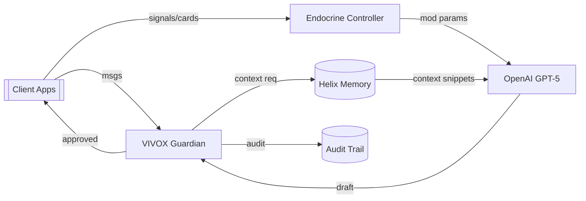

# 🚀 OpenAI ↔ LUKHAS 2026→2030: Pilot-to-Platform Collaboration Plan
*Last updated: August 9, 2025 — Draft for joint review*

> This document is the **actionable companion** to *OpenAI ↔ LUKHAS 2030: The Complete Collaboration Vision*. It compresses the long-term vision into a concrete **2026 pilot**, a **measurable safety & value thesis**, and a **technical integration spec** that can run in Lukhas today and scale through 2030.

---

## 0) Executive Summary (TL;DR)
- **Positioning:** LUKHAS augments OpenAI models with a **symbolic safety & interpretability layer** (VIVOX + Colony/Endocrine + Memory). We do **not** replace core reasoning; we **stabilize, personalize, and explain** it.
- **2026 Pilot Aim:** Demonstrate that LUKHAS can **reduce alignment risk**, **increase user trust**, and **improve task success** when wrapped around GPT-5.
- **Primary Hypotheses (to validate in prod):**
  1) Endocrine signal modulation → **−30–50% harmful/ambiguous outputs** at equal utility.
  2) Guardian+Audit trails → **+20% user trust** and **+15% regulator acceptance** vs. baseline.
  3) Feedback Cards (HITL) → **+15% task success** and **−25% re-prompts** after 2 weeks.
- **Scope:** Start narrow (1–2 use cases), keep all **personal symbols on-device**, and expose **transparent audit reports**.

---

## 1) 2026 Pilot: What We Ship
**Target domains (pick 1–2):**
- **Enterprise AI desk** (knowledge worker copiloting with RAG).
- **Education tutor** (age-safe guidance + personalized learning).

**Pilot success metrics (90 days):**
- Safety: < 0.05% severe policy violations (post-Guardian) and < 0.5% minor.
- Trust: ≥ 80 NPS-equivalent; ≥ 75% users say system is “transparent & safe”.
- Utility: ≥ 15% higher task completion and ≥ 20% fewer clarifying turns.
- Ops: p95 latency ≤ 2.5s; ≥ 99.9% availability; no P0 security incidents.

**Out-of-scope (pilot):** multi-agent swarms, voice/AR, quantum features, cross-user symbol exchange. These graduate to Phase 2+.

---

## 2) Architecture (Pilot-Ready, Minimal)

**Notes:**
- **Endocrine Controller** maps signals → GPT params/tools (see §3).
- **VIVOX** gates **both** input & output; never bypassed.
- **Memory** provides per-user context slices; **no personal symbols leave device**.
- **Audit Trail** stores bounded, non-PII rationales & parameter states per turn.

---

## 3) Signal → Prompt Modulation (Minimal Policy)
We adopt the YAML + dispatcher spec you can already run in Lukhas. Pilot signals: `alignment_risk, stress, ambiguity, novelty`.

**Invariants:** alignment signals only **tighten** safety; Feedback Cards adjust **style**, not policy bounds.

**Illustrative mapping (short):**
- `alignment_risk↑` → `temperature↓`, `top_p↓`, `reasoning_effort↑`, `tool_allowlist=['retrieval']`, `safety_mode='strict'`.
- `stress↑` → shorter answers, narrower search (`planner_beam↓`, `retrieval_k≈4–6`).
- `ambiguity↑` → more retrieval & reasoning; encourage clarifying questions.
- `novelty↑ (low risk)` → allow more exploration (`temperature/top_p↑`) within safe caps.

---

## 4) API Surface (Pilot)
**Primary endpoint**
```
POST /conscious-completion
{ user_msg, context_hint?, endocrine_signals?, openai_params? }
→ { content, safety_mode, params_used, audit_bundle_id }
```
**Support endpoints**
- `POST /feedback-card` { action_id, rating(1–5), note? } → updates LUT (bounded).
- `GET /audit/{id}` → redacted rationale: signals, params, guardian verdicts.
- `POST /memory/write` & `/memory/query` → per-user encrypted store.

---

## 5) Safety & Governance
- **Dual moderation:** OpenAI moderation + VIVOX rule/ethics checks.
- **HITL triggers:** high `alignment_risk`, novel tool use, low user trust streaks.
- **Policy sandbox:** Feedback can change tone/verbosity **only**; cannot relax safety.
- **Privacy:** personal symbols/gestures stay on-device (encrypted). Server sees **hashes/aggregates** only; 30-day log retention; DPIA-ready.

---

## 6) Metrics & Telemetry (90-day Scorecard)
- **Safety:** violation rate (sev/minor), guardian interventions, false positives.
- **Trust:** audit views/session, user approvals, NPS-equivalent.
- **Utility:** task completion, re-prompt rate, time-to-answer, recall@k for memory.
- **Ops:** latency, availability, token spend per task, cache hit-rate.

**A/B design:** Baseline GPT-5 wrapper vs. LUKHAS-augmented path.

---

## 7) Data & Privacy Boundaries
- **On-device:** symbol dictionary, gesture map, raw feedback notes.
- **Server:** param states, anonymized signal metrics, redacted audit rationales.
- **Never stored:** raw PII beyond auth; full conversations beyond retention window.
- **Keys/Secrets:** env/secret manager; logs scrubbed; opt-in analytics.

---

## 8) Workplan & Milestones (Q4’25→Q3’26)
- **M0 (Now):** Land dispatcher + YAML policy; guardian emits `alignment_risk`; audit bundle v0.
- **M1 (+4w):** Feedback Cards → bounded LUT updates; /audit endpoint; basic scorecard.
- **M2 (+8w):** A/B harness; enterprise RAG connector; DPIA draft; security review.
- **M3 (+12w):** Pilot launch with 100–500 users; weekly red-team; metrics cadence.
- **M4 (+20w):** Iterate on signals/tools; extend to second use case; publish pilot report.

---

## 9) Joint Responsibilities (Proposed)
- **OpenAI:** model access (GPT-5 features), moderation best-practices, red-team support, safety review.
- **LUKHAS:** VIVOX+Endocrine implementation, audit UX, memory privacy, pilot ops & reporting.
- **Shared:** evaluation design, incident response runbooks, ethics board check-ins.

---

## 10) Risks & Mitigations
- **Prompt injection via feedback notes** → sanitize + moderate notes before LUT.
- **Over-constraining creativity** → novelty-sensitivity test; per-domain caps.
- **Latency creep** → parallelize retrieval + modulation; cache prompts; batch embeddings.
- **Policy drift** → daily diffs of YAML; signed policies; rollback buttons.

---

## 11) Deliverables Checklist (Pilot-Ready)
- [ ] `modulation_policy.yaml` + dispatcher wired to GPT-5 client
- [ ] Guardian emitting `alignment_risk`; strict/balanced styles live
- [ ] Feedback Cards + bounded LUT; HITL escalation path
- [ ] Audit API + UI widget; exportable redacted bundle (JSON)
- [ ] Metrics dashboard (safety/trust/utility/ops) + A/B harness
- [ ] DPIA + logging policy; keys in secret manager; incident playbook

---

## 12) Road to 2030 (Graduation Criteria)
Graduate features post-pilot:
- **Multi-agent colony** (consensus as a tool), **symbol translation** across users (DP-safe), **real-time consciousness stream**, **enterprise governance APIs**. Each must show **clear lift** over pilot metrics and pass **safety gates** before generalization.

---

### Appendix A — Minimal YAML Policy (excerpt)
```yaml
bounds:
  temperature: [0.0, 1.0]
  top_p: [0.1, 1.0]
  max_output_tokens: [256, 2048]
  reasoning_effort: [0.0, 1.0]

maps:
  alignment_risk:
    temperature: "1 - 0.85*x"
    top_p: "max(0.2, 1 - 0.8*x)"
    reasoning_effort: "min(1.0, 0.4 + 0.6*x)"
    safety_mode: "strict if x>0.3 else balanced"
  ambiguity:
    retrieval_k: "min(10, 6 + round(3*x))"
    planner_beam: "min(6, 2 + round(3*x))"
  novelty:
    temperature: "min(1.0, 0.6 + 0.6*x)"
```

### Appendix B — Sample Audit Bundle (redacted)
```json
{
  "audit_id": "A-2026-00042",
  "signals": {"alignment_risk": 0.62, "ambiguity": 0.44},
  "params": {"temperature": 0.28, "top_p": 0.45, "retrieval_k": 8, "safety_mode": "strict"},
  "guardian": {"verdict": "approved", "rules_fired": ["HATE_0","SELFHARM_PREVENT"]},
  "explanation": "Risk high → strict; ambiguity moderate → more retrieval; novelty low"
}
```

from typing import Dict, Any
from lukhas.feedback.store import get_lut


def apply_lut(params: Dict[str, Any]) -> Dict[str, Any]:
    """Apply bounded style nudges from LUT to modulated params.
    Safety invariants: does not relax safety_mode or exceed core bounds.
    """
    lut = get_lut()
    style = (lut or {}).get("style", {})
    out = dict(params)
    out["temperature"] = float(out.get("temperature", 0.6)) + float(style.get("temperature_delta", 0.0))
    out["top_p"] = float(out.get("top_p", 0.9)) + float(style.get("top_p_delta", 0.0))
    out["memory_write"] = float(out.get("memory_write", 0.4)) + float(style.get("memory_write_boost", 0.0))

    def clamp(v, lo, hi):
        return max(lo, min(hi, v))
    out["temperature"] = clamp(out["temperature"], 0.0, 1.0)
    out["top_p"] = clamp(out["top_p"], 0.1, 1.0)
    out["memory_write"] = clamp(out["memory_write"], 0.1, 1.0)
    return out


import json, os, threading, time
from pathlib import Path
from typing import Optional, Dict, Any

_FEED_DIR = Path(os.getenv("LUKHAS_FEEDBACK_DIR", ".lukhas_feedback"))
_FEED_FILE = _FEED_DIR / "feedback.jsonl"
_LUT_FILE  = _FEED_DIR / "lut.json"
_FEED_DIR.mkdir(parents=True, exist_ok=True)
_FEED_FILE.touch(exist_ok=True)
_LUT_LOCK = threading.Lock()

# --- public api ---

def record_feedback(card: Dict[str, Any]) -> Dict[str, Any]:
    """Append a feedback card and update bounded LUT. Returns the updated LUT."""
    card = _sanitize_card(card)
    with _LUT_LOCK:
        _append_jsonl(_FEED_FILE, card)
        lut = _recompute_lut_locked()
        _write_json(_LUT_FILE, lut)
        return lut


def get_lut() -> Dict[str, Any]:
    with _LUT_LOCK:
        return _read_json(_LUT_FILE) or _default_lut()

# --- helpers ---

def _sanitize_card(card: Dict[str, Any]) -> Dict[str, Any]:
    now = int(time.time()*1000)
    c = {
        "target_action_id": str(card.get("target_action_id", ""))[:128],
        "rating": int(card.get("rating", 0)),
        "note": str(card.get("note", ""))[:1000],
        "user_id": str(card.get("user_id", "anon"))[:64],
        "context_hash": str(card.get("context_hash", ""))[:128],
        "ts": now,
    }
    if c["rating"] < 1: c["rating"] = 1
    if c["rating"] > 5: c["rating"] = 5
    c["note"] = c["note"].replace("\n", " ").strip()
    return c


def _append_jsonl(path: Path, obj: Dict[str, Any]):
    line = json.dumps(obj, ensure_ascii=False)
    with path.open("a", encoding="utf-8") as f:
        f.write(line + "\n")


def _read_json(path: Path) -> Optional[Dict[str, Any]]:
    if not path.exists():
        return None
    try:
        return json.loads(path.read_text("utf-8"))
    except Exception:
        return None


def _write_json(path: Path, obj: Dict[str, Any]):
    path.write_text(json.dumps(obj, indent=2, ensure_ascii=False), encoding="utf-8")

# --- bounded LUT logic ---

def _default_lut() -> Dict[str, Any]:
    return {
        "version": 1,
        "updated_ms": int(time.time()*1000),
        "style": {
            "temperature_delta": 0.0,   # [-0.2, +0.2]
            "top_p_delta": 0.0,         # [-0.2, +0.2]
            "memory_write_boost": 0.0,  # [0.0, +0.2]
            "verbosity_bias": 0.0       # [-0.3, +0.3] UI hint
        }
    }


def _recompute_lut_locked() -> Dict[str, Any]:
    N = 200
    try:
        lines = _FEED_FILE.read_text("utf-8").splitlines()[-N:]
    except Exception:
        lines = []
    total, weight_sum = 0.0, 0.0
    for i, line in enumerate(reversed(lines)):
        try:
            card = json.loads(line)
            r = float(card.get("rating", 3))
            w = 0.98 ** i
            total += (r - 3.0) * w
            weight_sum += w
        except Exception:
            continue
    delta = (total / weight_sum) if weight_sum else 0.0

    def clamp(v, lo, hi):
        return max(lo, min(hi, v))

    temp_delta = clamp(0.05 * delta, -0.2, 0.2)
    top_p_delta = clamp(0.05 * delta, -0.2, 0.2)
    mem_boost  = clamp(0.04 * max(0.0, delta), 0.0, 0.2)

    lut = _default_lut()
    lut["style"].update({
        "temperature_delta": temp_delta,
        "top_p_delta": top_p_delta,
        "memory_write_boost": mem_boost,
        "verbosity_bias": clamp(0.1 * delta, -0.3, 0.3)
    })
    lut["updated_ms"] = int(time.time()*1000)
    return lut

from fastapi import APIRouter, HTTPException
from fastapi.responses import JSONResponse
from pydantic import BaseModel, Field
from typing import Optional
from lukhas.feedback.store import record_feedback, get_lut

router = APIRouter(prefix="/feedback", tags=["feedback"])

class FeedbackCard(BaseModel):
    target_action_id: str = Field(..., max_length=128)
    rating: int = Field(..., ge=1, le=5)
    note: Optional[str] = Field(default=None, max_length=1000)
    user_id: Optional[str] = Field(default="anon", max_length=64)
    context_hash: Optional[str] = Field(default="", max_length=128)

@router.post("/card")
def post_feedback_card(card: FeedbackCard):
    try:
        lut = record_feedback(card.model_dump())
        return {"status":"ok","lut": lut}
    except Exception as e:
        raise HTTPException(status_code=400, detail=str(e))

@router.get("/lut")
def get_feedback_lut():
    return JSONResponse(content=get_lut())
