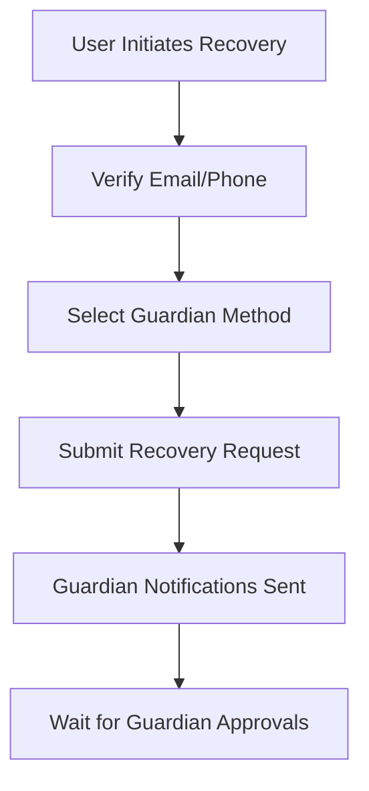

# Account Recovery Policy

## Overview

The LUKHAS account recovery system provides secure, user-controlled recovery mechanisms through a distributed Guardian system. This policy defines thresholds, cool-off periods, and recovery procedures aligned with the Trinity Framework (⚛️🧠🛡️).

## Guardian System Architecture

### Guardian Types

**Personal Guardians**
- Trusted contacts designated by the user
- Email or phone-based verification
- Minimum 2, maximum 5 guardians

**Institutional Guardians**
- Enterprise SSO providers
- Hardware security keys
- Biometric authentication systems

**Cryptographic Guardians**
- Hardware wallets
- TPM-based attestation
- Blockchain-based recovery

## Recovery Thresholds

### 2-of-N Guardian Configuration

| User Tier | Min Guardians | Required Approvals | Recovery Time |
|-----------|---------------|-------------------|---------------|
| T1        | 2             | 2-of-2           | 24 hours      |
| T2        | 2             | 2-of-3           | 12 hours      |
| T3        | 3             | 2-of-3           | 6 hours       |
| T4        | 3             | 3-of-5           | 2 hours       |
| T5        | 5             | 3-of-5           | 1 hour        |

### Approval Requirements

**Personal Guardian Approval:**
```json
{
  "guardianType": "PERSONAL",
  "verificationMethod": "EMAIL_LINK",
  "approvalWindow": "72h",
  "challenges": [
    {
      "type": "SHARED_SECRET",
      "description": "Security question set during guardian enrollment"
    },
    {
      "type": "IDENTITY_VERIFICATION",
      "description": "Photo ID or government verification"
    }
  ]
}
```

**Institutional Guardian Approval:**
```json
{
  "guardianType": "INSTITUTIONAL",
  "verificationMethod": "SAML_SSO",
  "approvalWindow": "24h",
  "challenges": [
    {
      "type": "SSO_AUTHENTICATION",
      "description": "Login through institutional provider"
    },
    {
      "type": "ADMIN_APPROVAL",
      "description": "IT administrator confirmation"
    }
  ]
}
```

## Cool-off Periods

### Progressive Delays

**First Recovery Attempt:** No delay
**Second Recovery Attempt:** 24-hour cool-off
**Third Recovery Attempt:** 72-hour cool-off
**Subsequent Attempts:** 7-day cool-off

### Risk-Based Adjustments

| Risk Factor | Cool-off Multiplier |
|-------------|-------------------|
| New Device | 2x |
| New Location | 1.5x |
| VPN/Proxy | 2x |
| Multiple Failed Attempts | 3x |
| High-Value Account | 2x |

### Emergency Override

**Criteria for Emergency Recovery:**
- Account compromise evidence
- Legal/law enforcement request
- Medical emergency documentation
- Death certificate (next-of-kin)

**Emergency Process:**
1. Submit emergency justification
2. Provide legal documentation
3. Manual review by security team
4. Multi-party approval required
5. Extended audit trail

## Recovery Procedures

### 1. Recovery Initiation



**API Endpoint:**
```
POST /api/recovery/initiate
{
  "email": "user@example.com",
  "recoveryMethod": "GUARDIAN",
  "justification": "Lost device, need account access",
  "emergencyContact": "+1234567890"
}
```

### 2. Guardian Notification

**Notification Content:**
```
Subject: Account Recovery Request for [User Name]

A recovery request has been submitted for the LUKHAS account
associated with [email].

Recovery Details:
- Requested: [timestamp]
- Device: [device info]
- Location: [city, country]
- IP: [IP address]
- Reason: [user justification]

To approve this request, click: [approval link]
To deny this request, click: [denial link]

This link expires in 72 hours.

If you did not expect this request, please deny it immediately
and contact security@lukhas.ai
```

### 3. Guardian Approval Process

**Approval Flow:**
1. Guardian receives notification
2. Clicks approval link
3. Verifies shared secret/security question
4. Reviews recovery request details
5. Submits approval or denial
6. System tracks approval timestamp

**Guardian Verification:**
```json
{
  "guardianId": "guardian-uuid",
  "approvalChallenge": {
    "question": "What was the name of your first pet?",
    "userAnswer": "encrypted-answer",
    "attempts": 0,
    "maxAttempts": 3
  },
  "metadata": {
    "ipAddress": "192.168.1.1",
    "userAgent": "Mozilla/5.0...",
    "timestamp": "2025-08-23T10:30:00Z"
  }
}
```

### 4. Recovery Completion

**Threshold Met:**
1. Required approvals received
2. Cool-off period satisfied
3. Security checks passed
4. New credentials generated
5. User notified of completion

**Recovery Package:**
```json
{
  "recoverySuccessful": true,
  "newCredentials": {
    "temporaryPassword": "encrypted",
    "magicLink": "one-time-login-link",
    "expiresAt": "2025-08-23T18:30:00Z"
  },
  "requiredActions": [
    "SET_NEW_PASSWORD",
    "RECONFIGURE_MFA",
    "REVIEW_SECURITY_SETTINGS"
  ],
  "securityReview": {
    "required": true,
    "deadline": "2025-08-30T10:30:00Z"
  }
}
```

## Guardian Management

### Guardian Enrollment

**Enrollment Flow:**
1. User navigates to Security Settings
2. Adds guardian contact information
3. Guardian receives enrollment invitation
4. Guardian accepts and sets verification challenge
5. Challenge stored encrypted, guardian activated

**Guardian Verification:**
```typescript
interface GuardianEnrollment {
  email: string;
  phoneNumber?: string;
  relationship: 'FAMILY' | 'FRIEND' | 'COLLEAGUE' | 'PROFESSIONAL';
  verificationChallenge: {
    question: string;
    answerHash: string;
  };
  enrolled: boolean;
  enrolledAt?: string;
  lastContactedAt?: string;
}
```

### Guardian Lifecycle

**Active Monitoring:**
- Email deliverability checks
- Phone number validation
- Periodic check-ins (quarterly)

**Guardian Rotation:**
- Annual guardian review required
- Automated removal of unresponsive guardians
- Proactive replacement recommendations

**Guardian Revocation:**
- Immediate revocation on user request
- Automatic revocation on bounce/error
- Notification to user on guardian changes

## Security Safeguards

### Anti-Abuse Measures

**Rate Limiting:**
- Maximum 3 recovery attempts per 30 days
- Per-user and per-IP rate limiting
- Geographic velocity checks

**Fraud Detection:**
```typescript
interface FraudSignals {
  multipleSimultaneousRecoveries: boolean;
  guardianEmailsFromSameDomain: boolean;
  recentPasswordChanges: boolean;
  suspiciousLoginAttempts: boolean;
  accountAgeUndersThreshold: boolean;
}
```

**Guardian Validation:**
- Email domain reputation checks
- Phone number carrier validation
- Social engineering attempt detection
- Guardian relationship verification

### Monitoring & Alerting

**Security Events:**
```json
{
  "event": "RECOVERY_INITIATED",
  "userId": "user-uuid",
  "riskScore": 75,
  "ipAddress": "192.168.1.1",
  "userAgent": "Mozilla/5.0...",
  "location": {
    "city": "Berlin",
    "country": "DE",
    "suspicious": false
  },
  "guardians": {
    "total": 3,
    "contacted": 3,
    "responsive": 2
  }
}
```

**Alert Triggers:**
- High-risk recovery attempts
- Guardian approval anomalies
- Multiple simultaneous recoveries
- Cross-account guardian patterns

## Compliance & Audit

### Audit Logging

**Required Log Events:**
- Recovery request initiation
- Guardian notifications sent
- Guardian approval/denial decisions
- Cool-off period calculations
- Recovery completion/failure
- Security review outcomes

**Log Retention:**
- Recovery events: 7 years
- Guardian interactions: 3 years
- Security decisions: 10 years

### Regulatory Compliance

**GDPR Considerations:**
- Right to recovery (continuation of service)
- Guardian consent for data processing
- Cross-border data transfer controls
- Data minimization in guardian selection

**SOC2 Controls:**
- Multi-person approval for sensitive recoveries
- Separation of duties in guardian system
- Regular access reviews of guardian permissions
- Incident response for recovery abuse

## Implementation Guidelines

### Database Schema

```sql
CREATE TABLE recovery_requests (
  id UUID PRIMARY KEY,
  user_id UUID NOT NULL REFERENCES users(id),
  status TEXT NOT NULL CHECK (status IN ('PENDING', 'APPROVED', 'DENIED', 'EXPIRED')),
  guardian_approvals_required INTEGER NOT NULL,
  guardian_approvals_received INTEGER DEFAULT 0,
  justification TEXT,
  risk_score INTEGER NOT NULL DEFAULT 0,
  cool_off_until TIMESTAMP,
  expires_at TIMESTAMP NOT NULL,
  completed_at TIMESTAMP,
  created_at TIMESTAMP NOT NULL DEFAULT CURRENT_TIMESTAMP,
  metadata JSONB DEFAULT '{}'::jsonb
);

CREATE TABLE guardian_approvals (
  id UUID PRIMARY KEY,
  recovery_request_id UUID NOT NULL REFERENCES recovery_requests(id),
  guardian_id UUID NOT NULL REFERENCES guardians(id),
  status TEXT NOT NULL CHECK (status IN ('PENDING', 'APPROVED', 'DENIED')),
  approved_at TIMESTAMP,
  ip_address INET,
  user_agent TEXT,
  verification_passed BOOLEAN,
  created_at TIMESTAMP NOT NULL DEFAULT CURRENT_TIMESTAMP
);
```

### API Integration

```typescript
interface RecoveryService {
  initiateRecovery(request: RecoveryRequest): Promise<RecoveryResponse>;
  approveRecovery(guardianId: string, approvalData: ApprovalData): Promise<void>;
  checkRecoveryStatus(requestId: string): Promise<RecoveryStatus>;
  completeRecovery(requestId: string): Promise<RecoveryCredentials>;
}
```

### Testing Strategy

**Unit Tests:**
- Guardian threshold calculations
- Cool-off period logic
- Risk scoring algorithms
- Approval validation

**Integration Tests:**
- End-to-end recovery flows
- Guardian notification delivery
- Multi-guardian coordination
- Failure scenario handling

**Security Tests:**
- Social engineering resistance
- Abuse detection effectiveness
- Cool-off bypass attempts
- Guardian impersonation tests

---

*This recovery policy integrates with the LUKHAS Trinity Framework and follows deny-by-default security principles.*
