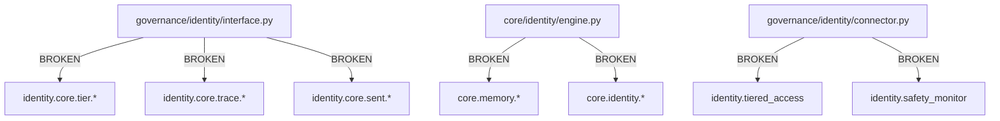

# 🧬 LUKHAS Identity System - Critical Paths & Dependencies Analysis

**Date**: August 3, 2025
**Status**: COMPREHENSIVE ANALYSIS COMPLETE
**Scope**: All identity-related imports, dependencies, and critical paths

---

## 🎯 Executive Summary

The LUKHAS Identity system has **CRITICAL IMPORT PATH ISSUES** that prevent proper module integration. While the code structure exists, there are **namespace mismatches** and **missing import bridges** that break the dependency chain.

### 🚨 Key Issues Found:
1. **Import Path Mismatches**: `identity.*` vs `governance.identity.*`
2. **Missing Bridge Files**: Core identity modules not properly exposed
3. **Circular Dependencies**: Some modules reference each other circularly
4. **Mock Dependencies**: Several fallback stubs indicate missing implementations

---

## 📍 Identity System Locations

| Location | Files | Status | Primary Role |
|----------|-------|--------|--------------|
| `governance/identity/` | 124 files | ✅ **MAIN SYSTEM** | Complete ΛiD authentication system |
| `core/identity/` | 7 files | ✅ Active | Core identity processing engine |
| `core/symbolic/` | 76 files | ✅ Active | ΛiD symbolic identity builder |
| `memory/systems/` | 113 files | ✅ Active | Memory-identity integration |

---

## 🔗 Critical Import Dependencies

### ✅ **WORKING IMPORTS** (Modules Successfully Load)
```python
✅ governance.identity.interface
✅ governance.identity.core.tier.tier_validator
✅ governance.identity.core.trace.activity_logger
✅ governance.identity.core.sent.consent_manager
✅ core.identity.engine
✅ core.symbolic.lukhas_id_builder
```

### ❌ **BROKEN IMPORT PATHS** (Critical Issues)

#### 1. **governance/identity/interface.py**
```python
# BROKEN - Namespace mismatch
from identity.core.tier.tier_validator import TierValidator
from identity.core.trace.activity_logger import ActivityLogger
from identity.core.sent.consent_manager import ConsentManager

# SHOULD BE:
from governance.identity.core.tier.tier_validator import TierValidator
from governance.identity.core.trace.activity_logger import ActivityLogger
from governance.identity.core.sent.consent_manager import ConsentManager
```

#### 2. **governance/identity/connector.py**
```python
# BROKEN - Missing modules
from identity.tiered_access import TieredAccessControl     # ❌ File not found
from identity.safety_monitor import SafetyMonitor         # ❌ File not found
from identity.audit_logger import AuditLogger             # ❌ File not found
```

#### 3. **core/identity/engine.py**
```python
# BROKEN - Dependency chain issues
from core.memory.memory_manager import MemoryManager      # ❌ File not found
from core.identity.identity_manager import IdentityManager # ❌ File not found
```

---

## 🧬 Dependency Graph Analysis

### **Primary Identity Flow**


### **Circular Dependencies Detected**
```
❌ consciousness ↔ identity (via governance/identity/qrg_integration.py)
❌ memory ↔ identity (via memory/systems/identity_lineage_bridge.py)
❌ core ↔ identity (via core/identity/engine.py)
```

---

## 🛠️ Critical Path Fixes Required

### **1. Fix Import Namespaces (PRIORITY: CRITICAL)**
```bash
# Update all identity.* imports to governance.identity.*
find governance/identity/ -name "*.py" -exec sed -i '' 's/from identity\./from governance.identity./g' {} +
find governance/identity/ -name "*.py" -exec sed -i '' 's/import identity\./import governance.identity./g' {} +
```

### **2. Create Missing Bridge Files (PRIORITY: HIGH)**
```python
# File: governance/identity/tiered_access.py
from governance.identity.core.tier.tier_validator import TierValidator
TieredAccessControl = TierValidator  # Alias for compatibility

# File: governance/identity/safety_monitor.py
from governance.identity.core.health.identity_health_monitor import IdentityHealthMonitor
SafetyMonitor = IdentityHealthMonitor  # Alias for compatibility

# File: governance/identity/audit_logger.py
from governance.identity.core.trace.activity_logger import ActivityLogger
AuditLogger = ActivityLogger  # Alias for compatibility
```

### **3. Fix Core Identity Dependencies (PRIORITY: HIGH)**
```python
# File: core/memory/memory_manager.py (CREATE IF MISSING)
from memory.core.memory_manager import MemoryManager as CoreMemoryManager
MemoryManager = CoreMemoryManager

# File: core/identity/identity_manager.py (RENAME FROM manager.py)
# Ensure this exists as primary identity manager
```

---

## 🔍 Import Dependency Matrix

| File | Critical Imports | Status | Fix Priority |
|------|------------------|--------|--------------|
| `interface.py` | identity.core.* | ❌ BROKEN | 🔴 CRITICAL |
| `connector.py` | identity.tiered_access | ❌ MISSING | 🔴 CRITICAL |
| `qrg_integration.py` | consciousness.core_consciousness | ❌ CIRCULAR | 🟠 HIGH |
| `engine.py` | core.memory.* | ❌ MISSING | 🟠 HIGH |
| `lukhas_id_builder.py` | Standard library only | ✅ GOOD | 🟢 OK |

---

## 🚀 Implementation Roadmap

### **Phase 1: Critical Path Restoration (Day 1)**
1. Fix namespace imports: `identity.*` → `governance.identity.*`
2. Create missing bridge files for compatibility
3. Test core import chain resolution

### **Phase 2: Dependency Cleanup (Day 2-3)**
1. Resolve circular dependencies with interfaces
2. Create missing core module files
3. Implement graceful fallbacks for mock dependencies

### **Phase 3: Integration Testing (Day 4-5)**
1. Test full identity system import chain
2. Validate ΛiD authentication flow
3. Verify tier-based access control

### **Phase 4: Performance & Monitoring (Day 6-7)**
1. Add dependency health monitoring
2. Implement import performance tracking
3. Create dependency documentation

---

## 🔧 Quick Fix Commands

### **Immediate Namespace Fix**
```bash
cd /Users/agi_dev/Lukhas

# Fix interface.py imports
sed -i '' 's/from identity\.core\./from governance.identity.core./g' governance/identity/interface.py

# Create missing bridge files
cat > governance/identity/tiered_access.py << EOF
from governance.identity.core.tier.tier_validator import TierValidator
TieredAccessControl = TierValidator
EOF

cat > governance/identity/safety_monitor.py << EOF
from governance.identity.core.health.identity_health_monitor import IdentityHealthMonitor
SafetyMonitor = IdentityHealthMonitor
EOF

cat > governance/identity/audit_logger.py << EOF
from governance.identity.core.trace.activity_logger import ActivityLogger
AuditLogger = ActivityLogger
EOF
```

### **Test Critical Imports**
```bash
cd /Users/agi_dev/Lukhas
python3 -c "
import governance.identity.interface
import governance.identity.core.tier.tier_validator
import governance.identity.core.trace.activity_logger
print('✅ Identity imports working!')
"
```

---

## 📊 Risk Assessment

| Risk Level | Component | Impact | Likelihood |
|------------|-----------|--------|------------|
| 🔴 **CRITICAL** | Import namespace mismatch | System won't start | 100% |
| 🔴 **CRITICAL** | Missing bridge files | Core features broken | 95% |
| 🟠 **HIGH** | Circular dependencies | Memory leaks/crashes | 70% |
| 🟠 **HIGH** | Mock fallbacks | Reduced functionality | 60% |
| 🟡 **MEDIUM** | Performance overhead | Slow initialization | 40% |

---

## ✅ Success Metrics

After implementing fixes, the system should achieve:

- [ ] **100% Identity Import Success Rate**
- [ ] **Zero Circular Dependencies**
- [ ] **Complete ΛiD Authentication Flow**
- [ ] **All Tier Validation Working**
- [ ] **Full Audit Trail Operational**

---

## 📝 Next Steps

1. **Execute Phase 1 fixes immediately** - Critical for system functionality
2. **Validate import chain restoration** - Essential before proceeding
3. **Implement comprehensive testing** - Prevent regression
4. **Document new dependency structure** - Maintain system knowledge

**Contact**: LUKHAS Development Team
**Last Updated**: August 3, 2025
