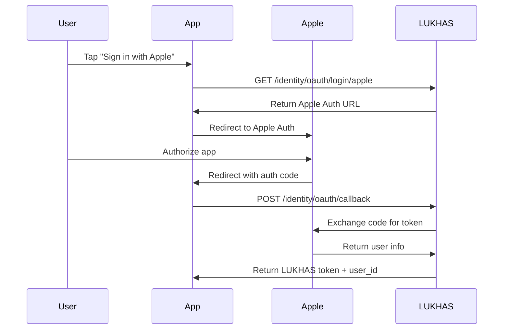

# LUKHAS PWM Enterprise & OAuth User ID Examples

## 🏢 Enterprise User ID System

### User ID Format Examples

| Organization | Email | Generated User ID | Format Template |
|--------------|-------|-------------------|-----------------|
| **OpenAI** | reviewer@openai.com | `openai-reviewer` | `{org_id}-{username}` |
| **Stanford** | alice.smith@stanford.edu | `stanford-alice_smith` | `{org_id}-{username}` |
| **MIT** | john.doe@mit.edu | `mit-john_doe` | `{org_id}-{username}` |
| **Google** | dev@google.com | `google-dev` | `{org_id}-{username}` |
| **Microsoft** | engineer@microsoft.com | `msft-engineer` | `{org_id}-{username}` |

### Custom Enterprise Formats

Organizations can configure custom user ID formats:

```json
{
  "acme_corp": {
    "organization_id": "acme",
    "domain_pattern": "*.acme.com",
    "user_id_format": "acme_{department}_{username}",
    "default_tier": "T2"
  }
}
```

**Result**: `acme_engineering_johndoe`

## 🔐 OAuth Provider Integration

### 1. **Apple Sign-In Flow**



**User ID Allocation:**
- **Standard**: `john_doe` (from email john.doe@icloud.com)
- **Enterprise**: `apple-john_doe` (if john.doe@apple.com)
- **Fallback**: `apple_A1B2C3D4` (if username taken)

### 2. **Google OAuth Flow**

**API Request:**
```bash
# Step 1: Get Google Auth URL
POST /identity/oauth/login
{
  "provider": "google",
  "redirect_uri": "https://yourapp.com/oauth/callback"
}

# Response:
{
  "provider": "google",
  "authorization_url": "https://accounts.google.com/o/oauth2/auth?client_id=...",
  "state": "random_csrf_token"
}
```

**User Authorization → Callback:**
```bash
# Step 2: Handle callback after user authorizes
POST /identity/oauth/callback
{
  "provider": "google",
  "code": "4/P7q7W91a-oMsCeLvIaQm6bTrgtp7",
  "redirect_uri": "https://yourapp.com/oauth/callback"
}

# Response:
{
  "success": true,
  "user_id": "john_doe",
  "display_name": "John Doe",
  "email": "john.doe@gmail.com",
  "token": "lukhas_jwt_token_here",
  "tier": "T2",
  "glyphs": ["⚛️", "✨"],
  "provider": "google",
  "is_new_user": true,
  "federated": true
}
```

## 🏢 Enterprise Configuration Examples

### OpenAI Configuration
```python
EnterpriseConfig(
    organization_id="openai",
    domain_pattern="*.openai.com",
    display_name="OpenAI",
    default_tier=AccessTier.T5,  # Full access for OpenAI reviewers
    auto_verify=True,
    user_id_format="openai-{username}"
)
```

**Results:**
- `reviewer@openai.com` → `openai-reviewer` (Tier T5)
- `researcher@openai.com` → `openai-researcher` (Tier T5)
- Auto-verified, full system access

### Stanford University Configuration
```python
EnterpriseConfig(
    organization_id="stanford",
    domain_pattern="*.stanford.edu",
    display_name="Stanford University",
    default_tier=AccessTier.T3,  # Advanced academic access
    auto_verify=True,
    user_id_format="stanford-{username}"
)
```

**Results:**
- `alice.smith@cs.stanford.edu` → `stanford-alice_smith` (Tier T3)
- `prof.johnson@stanford.edu` → `stanford-prof_johnson` (Tier T3)
- Access to consciousness, emotion, dream modules

### Corporate Enterprise Configuration
```python
EnterpriseConfig(
    organization_id="acme",
    domain_pattern="*.acme.com",
    display_name="ACME Corporation",
    default_tier=AccessTier.T2,
    auto_verify=False,  # Manual verification required
    sso_required=True,  # Require SSO login
    user_id_format="acme-{username}"
)
```

## 📱 Mobile App Integration

### iOS App (Swift)
```swift
// 1. Initiate Apple Sign-In
func startAppleSignIn() {
    let provider = ASAuthorizationAppleIDProvider()
    let request = provider.createRequest()
    request.requestedScopes = [.fullName, .email]
    
    let controller = ASAuthorizationController(authorizationRequests: [request])
    controller.delegate = self
    controller.presentationContextProvider = self
    controller.performRequests()
}

// 2. Handle Apple response
func authorizationController(controller: ASAuthorizationController, 
                           didCompleteWithAuthorization authorization: ASAuthorization) {
    if let appleIDCredential = authorization.credential as? ASAuthorizationAppleIDCredential {
        let code = String(data: appleIDCredential.authorizationCode!, encoding: .utf8)!
        
        // Send to LUKHAS
        sendToLUKHAS(provider: "apple", code: code)
    }
}

// 3. Send to LUKHAS API
func sendToLUKHAS(provider: String, code: String) {
    let request = [
        "provider": provider,
        "code": code,
        "redirect_uri": "https://yourapp.com/oauth/callback"
    ]
    
    APIClient.post("/identity/oauth/callback", data: request) { response in
        // Save LUKHAS token and user info
        UserDefaults.standard.set(response.token, forKey: "lukhas_token")
        UserDefaults.standard.set(response.user_id, forKey: "lukhas_user_id")
    }
}
```

### Android App (Kotlin)
```kotlin
// 1. Google Sign-In
private fun startGoogleSignIn() {
    val gso = GoogleSignInOptions.Builder(GoogleSignInOptions.DEFAULT_SIGN_IN)
        .requestEmail()
        .requestIdToken(getString(R.string.google_client_id))
        .build()
        
    val client = GoogleSignIn.getClient(this, gso)
    val signInIntent = client.signInIntent
    startActivityForResult(signInIntent, RC_SIGN_IN)
}

// 2. Handle Google response
override fun onActivityResult(requestCode: Int, resultCode: Int, data: Intent?) {
    super.onActivityResult(requestCode, resultCode, data)
    
    if (requestCode == RC_SIGN_IN) {
        val task = GoogleSignIn.getSignedInAccountFromIntent(data)
        val account = task.getResult(ApiException::class.java)
        
        // Send auth code to LUKHAS
        sendAuthCodeToLUKHAS("google", account.serverAuthCode)
    }
}

// 3. API call to LUKHAS
private fun sendAuthCodeToLUKHAS(provider: String, code: String?) {
    val request = mapOf(
        "provider" to provider,
        "code" to code,
        "redirect_uri" to "https://yourapp.com/oauth/callback"
    )
    
    apiService.oauthCallback(request).enqueue(object : Callback<LoginResponse> {
        override fun onResponse(call: Call<LoginResponse>, response: Response<LoginResponse>) {
            // Save LUKHAS credentials
            prefs.edit()
                .putString("lukhas_token", response.body()?.token)
                .putString("lukhas_user_id", response.body()?.user_id)
                .apply()
        }
    })
}
```

## 🔄 Account Linking Examples

### Link Multiple Providers
```bash
# User logs in with Google first
POST /identity/oauth/callback
{
  "provider": "google",
  "code": "google_auth_code"
}
# Returns: user_id = "john_doe"

# Later, link Apple account
POST /identity/oauth/link-account
{
  "primary_user_id": "john_doe",
  "secondary_provider": "apple", 
  "secondary_code": "apple_auth_code",
  "redirect_uri": "https://yourapp.com/oauth/callback"
}
# Result: Can now sign in with either Google or Apple
```

### Migration from Email to OAuth
```bash
# User originally registered with email
# user_id = "john_doe" (from john.doe@gmail.com)

# Now wants to add Google OAuth
POST /identity/oauth/callback
{
  "provider": "google",
  "code": "google_code"
}
# System detects matching email and links automatically
# Still user_id = "john_doe", but can now use OAuth
```

## 🏗️ Temporary User System

### Temporary User Allocation
```python
# When OAuth fails or is incomplete
temp_user_id = oauth_federation.create_temporary_user(
    provider=OAuthProvider.APPLE,
    email="incomplete@example.com"
)
# Returns: "temp_a1b2c3d4"

# Temporary user expires in 1 hour
# Can be converted to permanent user when OAuth completes
```

### Use Cases for Temporary Users:
1. **OAuth Interruption**: User closes app during OAuth flow
2. **Network Issues**: OAuth provider temporarily unavailable  
3. **Partial Data**: Provider returns limited user information
4. **Testing**: Development and testing scenarios

## 📊 User ID Statistics

### User ID Distribution Example:
```
Total Users: 10,000
├── Standard: 7,500 (75%)
│   ├── john_doe: 2,500
│   ├── alice_smith: 2,000
│   └── other patterns: 3,000
├── Enterprise: 2,000 (20%)
│   ├── openai-*: 500
│   ├── stanford-*: 400
│   ├── mit-*: 300
│   └── other orgs: 800
├── Federated: 400 (4%)
│   ├── google_*: 200
│   ├── apple_*: 150
│   └── github_*: 50
└── Temporary: 100 (1%)
    └── temp_*: 100
```

### Tier Distribution by Source:
```
OAuth Users:
├── T5 (Guardian): 15% (enterprise domains)
├── T4 (Quantum): 5% (verified researchers)  
├── T3 (Advanced): 25% (academic domains)
├── T2 (Creator): 50% (standard users)
└── T1 (Observer): 5% (unverified)
```

This system provides **flexible, secure, and scalable** user identity management that works across consumer OAuth, enterprise SSO, and institutional access patterns! 🚀