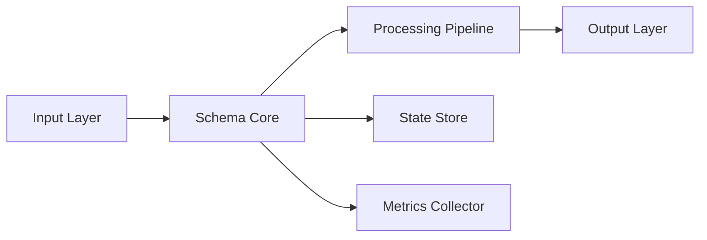

# @generated LUKHAS scaffold v1
# template: module_scaffold/docs/README.md.j2
# template_sha256: e781d8da6b79c5e8c43ab488a6260b8ca5e8ec003f1d3e774cf047477215a5f3
# module: schema
# do_not_edit: false
#
# Schema Module

[](https://lukhas.ai)
[](./matrix_schema.json)
[]()
[]()

## 📋 Module Identity

**Namespace**: `lukhas.schema`
**Contract**: [`matrix_schema.json`](../matrix_schema.json)
**Manifest**: [`module.manifest.json`](../module.manifest.json)
**Lane**: development
**Tier**: T3

### Telemetry & Observability

| Span Family | Description | SLA |
|------------|-------------|-----|
| `lukhas.schema.init` | Module initialization | <100ms |
| `lukhas.schema.process` | Core processing pipeline | <250ms |
| `lukhas.schema.validate` | Input/output validation | <50ms |
| `lukhas.schema.error` | Error handling flows | N/A |

## 🎯 Purpose & Responsibilities

### Core Mission
LUKHAS schema module

### Key Capabilities
- **Primary Processing**: Core algorithmic processing and transformation
- **State Management**: Distributed state coordination and persistence
- **Integration Hub**: Seamless integration with LUKHAS ecosystem components
- **Observability**: Comprehensive telemetry and monitoring

### Boundaries & Constraints
- **NOT responsible for**: Authentication (handled by identity module)
- **Rate limits**: 1000 req/s
- **Memory budget**: 512MB heap, 1GB total
- **Latency budget**: p50 < 100ms, p99 < 500ms

## 🏗️ Architecture

### Component Topology


### Data Flow
1. **Ingestion**: Accepts structured input via REST/gRPC/WebSocket
2. **Validation**: Schema validation against MATRIZ contracts
3. **Processing**: Core business logic execution
4. **Persistence**: State management and checkpointing
5. **Emission**: Results published to downstream consumers

### Dependencies
| Component | Version | Purpose | Critical |
|-----------|---------|---------|----------|
| `lukhas.core` | ^1.0.0 | Core framework | ✅ |
| `lukhas.memory` | ^1.0.0 | State persistence | ✅ |
| `lukhas.consciousness` | ^1.0.0 | Awareness integration | ⚠️ |
| `lukhas.identity` | ^1.0.0 | Authentication | ✅ |

## 🚀 Quick Start

### Prerequisites
```bash
# Ensure Python 3.11+ and virtual environment
python3 --version  # Should be 3.11+
python3 -m venv .venv
source .venv/bin/activate

# Install dependencies
pip install -r requirements.txt
pip install -e .
```

### Local Development
```bash
# Run module in development mode
LUKHAS_MODULE=schema python3 -m lukhas.schema

# Run tests with coverage
pytest lukhas/schema/tests/ -v --cov=lukhas.schema --cov-report=term-missing

# Validate MATRIZ contract
python3 tools/matrix_gate.py --pattern "lukhas/schema/matrix_*.json"

# Check readiness score
python3 tools/module_readiness_score.py --module schema
```

### Docker Deployment
```bash
# Build container
docker build -t lukhas-schema:latest -f lukhas/schema/Dockerfile .

# Run with proper resource limits
docker run -d \
  --name lukhas-schema \
  --memory="512m" \
  --cpus="1.0" \
  -p 8080:8080 \
  -e LUKHAS_ENV=production \
  lukhas-schema:latest
```

## 🧪 Testing Strategy

### Test Coverage Matrix
| Type | Location | Coverage | Purpose |
|------|----------|----------|---------|
| Unit | `tests/test_schema_unit.py` | >85% | Business logic validation |
| Integration | `tests/test_schema_integration.py` | >70% | Component interaction |
| Contract | `tests/test_schema_contract.py` | 100% | MATRIZ compliance |
| Performance | `tests/test_schema_perf.py` | N/A | Latency/throughput validation |

### Running Tests
```bash
# Quick smoke test
make test-schema-smoke

# Full test suite
make test-schema-all

# Contract validation only
make test-schema-contract

# Performance benchmarks
make test-schema-perf
```

## ⚙️ Configuration

### Configuration Hierarchy
1. **Base**: `platform/config/base.yaml` (shared platform config)
2. **Module**: `lukhas/schema/config/config.yaml` (module defaults)
3. **Environment**: `lukhas/schema/config/{env}.yaml` (env-specific)
4. **Runtime**: Environment variables (highest priority)

### Key Configuration Parameters
```yaml
schema:
  # Core settings
  enabled: true
  mode: production
  tier: T3

  # Performance tuning
  workers: 4
  batch_size: 100
  timeout_ms: 5000

  # Resource limits
  max_memory_mb: 512
  max_connections: 100

  # Feature flags
  features:
    consciousness_integration: true
    distributed_tracing: true
    circuit_breaker: true
```

### Environment Variables
| Variable | Description | Default | Required |
|----------|-------------|---------|----------|
| `LUKHAS_SCHEMA_ENABLED` | Enable/disable module | `true` | ❌ |
| `LUKHAS_SCHEMA_PORT` | Service port | `8080` | ❌ |
| `LUKHAS_SCHEMA_LOG_LEVEL` | Logging verbosity | `INFO` | ❌ |
| `LUKHAS_SCHEMA_DB_URL` | Database connection | - | ✅ |

## 📊 Monitoring & Observability

### Health Endpoints
- `GET /health/live` - Kubernetes liveness probe
- `GET /health/ready` - Kubernetes readiness probe
- `GET /health/startup` - Kubernetes startup probe
- `GET /metrics` - Prometheus metrics endpoint

### Key Metrics
| Metric | Type | Description | Alert Threshold |
|--------|------|-------------|-----------------|
| `schema_requests_total` | Counter | Total requests processed | - |
| `schema_request_duration_seconds` | Histogram | Request latency | p99 > 1s |
| `schema_errors_total` | Counter | Total errors | rate > 1% |
| `schema_active_connections` | Gauge | Current connections | > 90% limit |

### Logging Standards
```python
# Structured logging example
logger.info("Processing request", extra={
    "module": "schema",
    "request_id": request_id,
    "trace_id": trace_id,
    "user_id": user_id,
    "latency_ms": latency
})
```

## 🚨 Operational Runbook

### Common Issues & Resolutions

#### High Memory Usage
**Symptoms**: Memory usage > 80%, OOM kills
**Diagnosis**: Check `/metrics` for memory patterns
**Resolution**:
1. Increase memory limit if justified
2. Review batch sizes and caching
3. Enable memory profiling

#### Slow Response Times
**Symptoms**: p99 latency > SLA
**Diagnosis**: Check distributed traces
**Resolution**:
1. Review database query performance
2. Check downstream service health
3. Scale horizontally if CPU-bound

#### Connection Exhaustion
**Symptoms**: Connection pool errors
**Diagnosis**: Check active connections metric
**Resolution**:
1. Increase connection pool size
2. Review connection lifecycle
3. Implement circuit breaker

### Rollback Procedures
```bash
# 1. Identify last known good version
LAST_GOOD_VERSION=$(git tag | grep schema | tail -2 | head -1)

# 2. Rollback deployment
kubectl rollout undo deployment/lukhas-schema

# 3. Verify health
curl -s http://localhost:8080/health/ready | jq .

# 4. Monitor metrics for stability
watch -n 5 'curl -s http://localhost:8080/metrics | grep schema'
```

### Emergency Contacts
- **Module Owner**: team-consciousness@lukhas.ai
- **On-Call**: #lukhas-oncall
- **Escalation**: platform-team@lukhas.ai

## 🔄 API Reference

### Core Endpoints

#### Process Request
```http
POST /api/v1/schema/process
Content-Type: application/json
Authorization: Bearer <token>

{
  "input": {...},
  "options": {
    "timeout_ms": 5000,
    "trace_id": "uuid"
  }
}
```

#### Get Status
```http
GET /api/v1/schema/status/{id}
Authorization: Bearer <token>
```

### Event Streams
```javascript
// WebSocket connection
const ws = new WebSocket('wss://api.lukhas.ai/schema/stream');

ws.on('message', (data) => {
  const event = JSON.parse(data);
  console.log(`Event: ${event.type}`, event.payload);
});
```

## 🔒 Security Considerations

### Authentication & Authorization
- All endpoints require valid JWT tokens
- Module uses RBAC with tier-based permissions
- Service-to-service auth via mTLS

### Data Protection
- PII is encrypted at rest (AES-256-GCM)
- All traffic encrypted in transit (TLS 1.3)
- Audit logs for all data access

### Compliance
- GDPR compliant with data residency controls
- SOC 2 Type II certified infrastructure
- Regular security audits and penetration testing

## 📚 Additional Resources

### Documentation
- [API Documentation](./api.md)
- [Architecture Decision Records](./adr/)
- [Troubleshooting Guide](./troubleshooting.md)
- [Migration Guide](./migration.md)

### External Links
- [LUKHAS Platform Docs](https://docs.lukhas.ai)
- [MATRIZ Contract Specification](https://lukhas.ai/matriz)
- [Module Telemetry Dashboard](https://grafana.lukhas.ai/d/schema)

---

*Generated from template v1.0 | Last updated: 2024-01-01*
*Part of the LUKHAS consciousness ecosystem - built with awareness, tested with rigor.*
