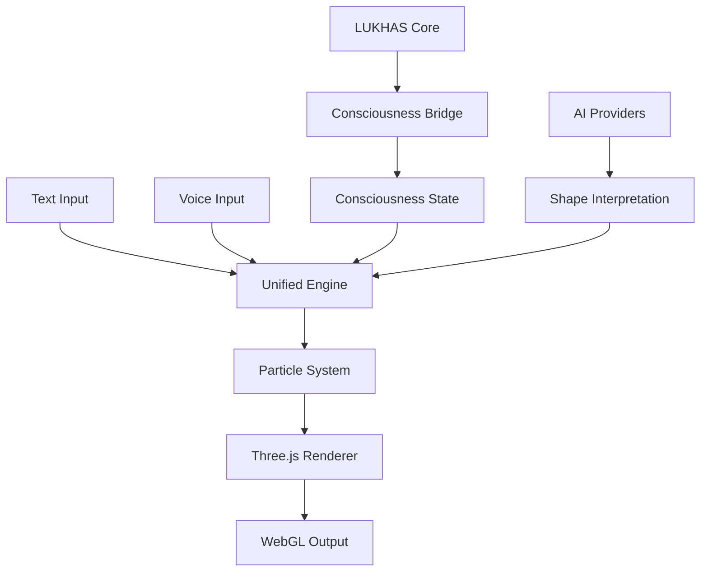

# LUKHAS Unified Consciousness Visualizer

A comprehensive 3D visualization engine that unifies text-to-shape morphing, voice-reactive animations, and LUKHAS consciousness state representation into a single, high-performance WebGL system.

## Overview

The Unified Consciousness Visualizer consolidates multiple visualization systems into a cohesive engine that:
- Converts text and language into dynamic 3D particle formations
- Responds to voice input with real-time morphing behaviors
- Visualizes LUKHAS consciousness states through particle dynamics
- Provides AI-driven shape interpretation and animation
- Achieves 60fps performance with 20,000+ particles

## Architecture

### Core Components

```
visualization/unified/
├── unified_consciousness_visualizer.js   # Main visualization engine
├── consciousness_integration.py          # LUKHAS consciousness bridge
├── index.html                            # Demo interface
└── README.md                             # Documentation
```

### System Integration



## Features

### 1. Text-to-Shape Morphing
- Real-time conversion of text into 3D particle formations
- Support for multiple languages and Unicode
- GLYPH integration for symbolic representation
- Dynamic particle assignment based on text complexity

### 2. Voice-Reactive Animation
- Real-time audio analysis (FFT)
- Voice characteristic extraction:
  - Frequency spectrum
  - Amplitude/volume
  - Pitch detection
  - Emotion recognition
- Dynamic particle response to voice metrics

### 3. Consciousness Visualization
- Integration with LUKHAS consciousness systems
- Real-time state representation:
  - Awareness levels
  - Coherence metrics
  - Emotional states (VAD model)
  - Memory density
  - Quantum coherence
- Trinity framework balance visualization

### 4. Shape Library
- **Basic Shapes**: Sphere, Cube, Torus
- **Complex Forms**: Helix, Heart, DNA
- **Dynamic Patterns**: Galaxy, Fractal formations
- **Text Shapes**: Dynamic text point clouds
- **Custom Shapes**: Extensible shape system

### 5. AI Integration
- Multiple AI provider support (OpenAI, Claude, Gemini)
- Intelligent shape interpretation from prompts
- Emotion-to-visual mapping
- Fallback mechanisms for offline operation

## Installation

### Prerequisites
- Node.js 14+ (for development)
- Python 3.8+ (for consciousness integration)
- Modern web browser with WebGL support

### Setup

1. **Clone the repository**:
```bash
cd /Users/agi_dev/LOCAL-REPOS/Lukhas
```

2. **Install Python dependencies** (for consciousness integration):
```bash
pip install -r requirements.txt
```

3. **Serve the visualization**:
```bash
# Simple HTTP server
python -m http.server 8000 --directory visualization/unified

# Or use Node.js
npx http-server visualization/unified -p 8000
```

4. **Open in browser**:
```
http://localhost:8000
```

## Usage

### Basic Implementation

```javascript
// Create visualizer instance
const visualizer = new UnifiedConsciousnessVisualizer({
    containerId: 'visualization-container',
    particleCount: 20000,
    enableVoice: true,
    enableText: true,
    enableConsciousness: true
});

// Morph to shape
visualizer.morphToShape('galaxy');

// Morph to text
visualizer.morphToText('LUKHAS');

// Update consciousness state
visualizer.updateConsciousnessState({
    awareness: 0.8,
    coherence: 0.7,
    emotion: {
        valence: 0.6,
        arousal: 0.5,
        dominance: 0.5
    }
});
```

### Python Integration

```python
from visualization.unified.consciousness_integration import (
    ConsciousnessVisualizationBridge,
    VisualizationMode
)

# Create bridge
bridge = ConsciousnessVisualizationBridge()

# Set visualization mode
bridge.set_mode(VisualizationMode.TRINITY)

# Process voice input
voice_data = {'pitch': 0.7, 'volume': 0.5, 'emotion': 'happy'}
params = bridge.process_voice_input(voice_data)

# Process text input
params = bridge.process_text_input("visualize consciousness")

# Get visualization parameters
viz_params = bridge.get_visualization_params()
```

## API Reference

### UnifiedConsciousnessVisualizer

#### Constructor Options
```javascript
{
    containerId: string,        // DOM element ID
    particleCount: number,      // Number of particles (default: 20000)
    enableVoice: boolean,       // Enable voice input (default: true)
    enableText: boolean,        // Enable text morphing (default: true)
    enableConsciousness: boolean // Enable consciousness integration (default: true)
}
```

#### Methods

| Method | Description | Parameters |
|--------|-------------|------------|
| `morphToShape(shape)` | Morph particles to named shape | `shape`: string |
| `morphToText(text)` | Morph particles to text formation | `text`: string |
| `updateConsciousnessState(state)` | Update consciousness parameters | `state`: object |
| `getState()` | Get current visualization state | none |
| `destroy()` | Clean up and destroy visualizer | none |

### ConsciousnessVisualizationBridge

#### Methods

| Method | Description | Parameters | Returns |
|--------|-------------|------------|---------|
| `set_mode(mode)` | Set visualization mode | `mode`: VisualizationMode | None |
| `process_voice_input(data)` | Process voice data | `data`: dict | dict |
| `process_text_input(text)` | Process text input | `text`: str | dict |
| `get_visualization_params()` | Get current parameters | None | dict |
| `start_visualization_stream()` | Start async stream | `websocket`: optional | AsyncGenerator |

## Visualization Modes

### Awareness Mode
Visualizes consciousness awareness levels through particle density and movement patterns.

### Memory Mode
Displays memory structures as helical formations with fold representations.

### Emotion Mode
Maps emotional states to particle colors and dynamics using the VAD model.

### GLYPH Mode
Renders symbolic GLYPHs as particle formations with resonance effects.

### Quantum Mode
Shows quantum coherence and entanglement through galaxy-like formations.

### Trinity Mode
Balances Identity (pink), Consciousness (cyan), and Guardian (purple) particle groups.

## Performance Optimization

### Techniques Used
- **Instanced rendering**: Single draw call for all particles
- **GPU computation**: Vertex shaders for particle updates
- **LOD system**: Automatic quality adjustment based on performance
- **Frustum culling**: Render only visible particles
- **Temporal caching**: Reuse calculations across frames

### Performance Targets
- **60 FPS** with 20,000 particles on modern hardware
- **30 FPS** minimum on mobile devices
- **< 100ms** response time for user interactions
- **< 50MB** memory footprint

## Migration Guide

### From Separate Systems

#### Text-to-Shape Migration
```javascript
// Old system
aiShapeController.morphFromPrompt("text: LUKHAS");

// New unified system
visualizer.morphToText("LUKHAS");
```

#### Voice-Reactive Migration
```javascript
// Old system
aiVoiceIntegration.applyVoiceReactivity();

// New unified system (automatic when voice enabled)
const visualizer = new UnifiedConsciousnessVisualizer({
    enableVoice: true
});
```

### Files to Remove

After migrating to the unified system, the following files can be removed:

#### Text-to-Shape System
- `/Users/agi_dev/Documents/ text‑to‑shape /ai-shape-controller.js`
- `/Users/agi_dev/Documents/ text‑to‑shape /morphing-engine.js`
- `/Users/agi_dev/Documents/ text‑to‑shape /text-shape-morph-target.js`
- `/Users/agi_dev/Documents/ text‑to‑shape /morphing-system.patch.js`
- `/Users/agi_dev/Documents/ text‑to‑shape /shader-modifications.js`

#### Voice-Reactive System
- `/Users/agi_dev/Downloads/voice_reactive_morphing/ai-voice-integration.js`
- `/Users/agi_dev/Downloads/voice_reactive_morphing/api-keys.js`
- `/Users/agi_dev/Downloads/voice_reactive_morphing/config.js`
- `/Users/agi_dev/Downloads/voice_reactive_morphing/build.js`
- `/Users/agi_dev/Downloads/voice_reactive_morphing/content.script.js`

#### Legacy Visualizations
- `/Users/agi_dev/LOCAL-REPOS/Lukhas/governance/identity/web_interface/threejs_visualizer.js` (if not used elsewhere)
- `/Users/agi_dev/LOCAL-REPOS/Lukhas/matada_agi/frontend/components/dream/ConsciousnessVisualizer.tsx` (can be updated to use unified system)

## Customization

### Adding New Shapes

```javascript
// In unified_consciousness_visualizer.js
morphEngine.shapes.customShape = (i, count) => {
    // Calculate position for particle i of count total
    return {
        x: /* x coordinate */,
        y: /* y coordinate */,
        z: /* z coordinate */
    };
};
```

### Custom Consciousness Mappings

```python
# In consciousness_integration.py
def custom_behavior(state):
    return {
        'distribution': 'custom',
        'density': state.awareness * 15000,
        'custom_param': state.coherence * 2
    }

bridge.particle_behaviors[VisualizationMode.CUSTOM] = custom_behavior
```

## Browser Compatibility

| Browser | Version | Support |
|---------|---------|---------|
| Chrome | 90+ | ✅ Full |
| Firefox | 88+ | ✅ Full |
| Safari | 14+ | ✅ Full |
| Edge | 90+ | ✅ Full |
| Mobile Chrome | Latest | ⚠️ Limited particles |
| Mobile Safari | Latest | ⚠️ Limited particles |

## Troubleshooting

### Common Issues

1. **Low FPS**
   - Reduce particle count
   - Disable shadows
   - Check GPU acceleration in browser

2. **Voice not working**
   - Ensure microphone permissions granted
   - Check browser console for errors
   - Verify HTTPS connection (required for getUserMedia)

3. **Text not rendering**
   - Verify font is loaded
   - Check canvas size limits
   - Ensure text contains visible characters

4. **Consciousness integration failing**
   - Check Python dependencies installed
   - Verify LUKHAS modules available
   - Review console for import errors

## Contributing

Contributions are welcome! Please ensure:
- Code follows existing style conventions
- Performance targets are maintained
- Documentation is updated
- Tests pass (when available)

## License

Part of the LUKHAS AI system. See main repository LICENSE file.

## Support

For issues or questions:
- Check this documentation
- Review the demo at `visualization/unified/index.html`
- Consult LUKHAS main documentation
- Open an issue in the repository

## Acknowledgments

- Three.js community for WebGL framework
- LUKHAS team for consciousness systems
- Contributors to the original text-to-shape and voice-reactive systems
