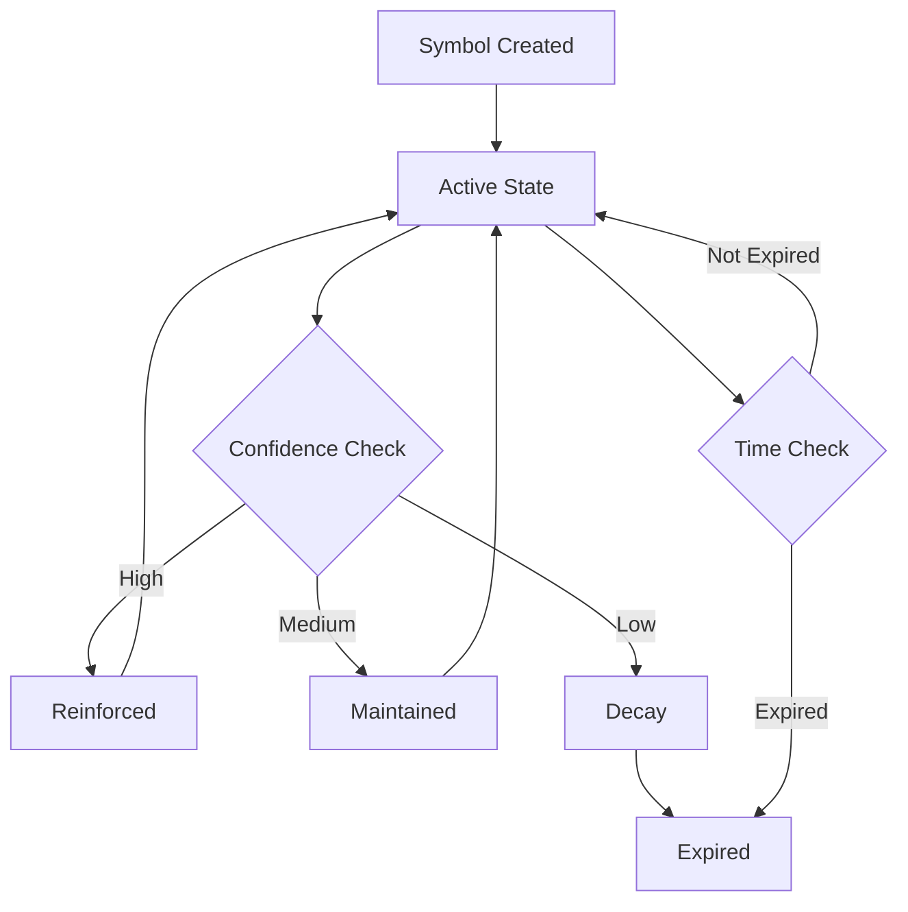

# 🔮 DΛST - Dynamic Lambda Symbol Tracker

## Real-Time Symbolic Context Intelligence

DΛST transforms digital chaos into meaningful symbolic context by tracking, analyzing, and predicting user activities, intentions, and environmental states in real-time. Unlike simple activity trackers that just log events, DΛST creates a living symbolic representation of your digital and physical context.

## ✨ Core Philosophy

> "Context is the language of consciousness.
> Symbols are the words we use to speak it." — LUKHAS AI

DΛST embodies this philosophy by:
- **Translating** raw activity data into meaningful symbolic representations
- **Learning** personal patterns and symbolic relationships
- **Predicting** future context states and activity transitions
- **Integrating** multi-source data into coherent symbolic narratives

## 🎯 Key Features

### Multi-Dimensional Symbol Tracking
- **10 Symbol Categories**: Activity, Context, Mood, Focus, Goal, Relationship, Temporal, Creative, Learning, Wellness
- **9 Data Sources**: Explicit user input, calendar, activity tracker, location, biometric, app integration, AI inference, social, environmental
- **Dynamic Confidence Scoring**: Weighted confidence based on source reliability and evidence strength

### Intelligent Context Analysis
- **Focus Score**: How concentrated current activities are (0.0-1.0)
- **Coherence Score**: How well symbols work together as a unified context
- **Stability Score**: How consistent the context is over time
- **Primary Activity Detection**: AI-identified main focus area

### Adaptive Symbol Management
- **Automatic Symbol Expiration**: Time-based symbol lifecycle management
- **Confidence Decay**: Gradual reduction of symbol confidence over time
- **Rule-Based Automation**: Custom rules for symbol addition/removal
- **Pattern Learning**: ML-powered relationship discovery between symbols

### Predictive Context Intelligence
- **Temporal Patterns**: Learn daily/weekly activity patterns
- **Context Transitions**: Predict likely next activities/states
- **Symbol Relationships**: Understand which symbols commonly co-occur
- **Anomaly Detection**: Identify unusual patterns or context breaks

## 🏗️ Architecture

```
DΛST/
├── dast_core.py              # Main DΛST engine
├── symbol_analyzer.py        # Symbol relationship and pattern analysis
├── context_predictor.py      # Future context prediction
├── rule_engine.py           # Automated symbol rule processing
├── integrations/            # External data source connectors
├── patterns/               # Learned pattern storage and analysis
├── analytics/              # Context analytics and insights
└── schemas/                # Symbol and context data models
```

## 🚀 Quick Start

### Installation
```bash
pip install lambda-dast
```

### Basic Usage
```python
from lambda_dast import DΛST, SymbolicTag, SymbolCategory, SymbolSource

# Initialize DΛST system
dast = DΛST()

# Register user with initial context
await dast.register_user("alice", initial_tags=["working", "focused"])

# Add symbols from different sources
await dast.add_symbol(
    user_id="alice",
    symbol="coding",
    category=SymbolCategory.ACTIVITY,
    source=SymbolSource.ACTIVITY_TRACKER,
    confidence=0.8,
    expires_in_hours=2
)

# Get current symbolic context
current_tags = await dast.get_current_tags("alice")
print(f"Current context: {current_tags}")

# Get detailed context analysis
context = await dast.get_context_snapshot("alice")
print(f"Focus Score: {context.focus_score}")
print(f"Primary Activity: {context.primary_activity}")
```

### Docker Deployment
```bash
docker run -p 8086:8086 lukhas/lambda-dast
```

## 💻 API Reference

### REST API Endpoints

#### Register User
```http
POST /api/v1/users/register
{
  "user_id": "alice",
  "initial_tags": ["working", "available"]
}
```

#### Add Symbol
```http
POST /api/v1/users/{user_id}/symbols
{
  "symbol": "meeting",
  "category": "activity",
  "source": "calendar",
  "confidence": 0.9,
  "expires_in_hours": 2,
  "metadata": {
    "event_title": "Team Standup",
    "attendees": 5
  }
}
```

#### Get Current Tags
```http
GET /api/v1/users/{user_id}/tags?category=activity&threshold=0.5
```

#### Get Context Snapshot
```http
GET /api/v1/users/{user_id}/context
```

#### Update from Integration
```http
POST /api/v1/users/{user_id}/integrations/calendar
{
  "events": [
    {
      "title": "Focus Time",
      "start_time": "2024-01-15T09:00:00Z",
      "duration_hours": 2,
      "type": "focus"
    }
  ]
}
```

### GraphQL Schema
```graphql
type SymbolicTag {
  symbol: String!
  category: SymbolCategory!
  source: SymbolSource!
  confidence: Float!
  weight: Float!
  expiresAt: DateTime
  metadata: JSON
  lambdaSignature: String!
}

type ContextSnapshot {
  userId: ID!
  tags: [SymbolicTag!]!
  primaryActivity: String
  focusScore: Float!
  coherenceScore: Float!
  stabilityScore: Float!
  lambdaFingerprint: String!
  timestamp: DateTime!
}

query getCurrentContext($userId: ID!) {
  user(id: $userId) {
    contextSnapshot {
      primaryActivity
      focusScore
      coherenceScore
      tags {
        symbol
        confidence
        category
      }
    }
  }
}
```

## 🏷️ Symbol System

### Symbol Categories
| Category | Purpose | Examples |
|----------|---------|----------|
| **Activity** | Current actions | "coding", "meeting", "writing", "researching" |
| **Context** | Environment | "office", "home", "travel", "coffee-shop" |
| **Mood** | Emotional state | "energetic", "calm", "stressed", "creative" |
| **Focus** | Attention areas | "deep-work", "learning", "problem-solving" |
| **Goal** | Intentions | "ship-feature", "learn-skill", "health-goal" |
| **Relationship** | Social context | "team-work", "solo", "mentoring", "networking" |
| **Temporal** | Time-based | "morning-routine", "deadline", "weekly-review" |
| **Creative** | Creative work | "brainstorming", "design", "writing", "ideation" |
| **Learning** | Knowledge work | "reading", "course", "tutorial", "research" |
| **Wellness** | Health activities | "exercise", "meditation", "break", "sleep" |

### Symbol Sources & Confidence
| Source | Base Confidence | Reliability | Examples |
|--------|-----------------|-------------|----------|
| **User Explicit** | 1.0 | Highest | Manual tag entry |
| **Calendar** | 0.9 | Very High | Meeting events, scheduled blocks |
| **Activity Tracker** | 0.8 | High | App usage, device interaction |
| **Location** | 0.8 | High | GPS, WiFi network detection |
| **Biometric** | 0.7 | Medium-High | Heart rate, stress levels |
| **App Integration** | 0.6 | Medium | Third-party app data |
| **AI Inference** | 0.5 | Medium | Pattern-based predictions |
| **Social** | 0.4 | Medium-Low | Social media, communication |
| **Environmental** | 0.3 | Low | IoT sensors, ambient data |

### Symbol Lifecycle


## 🤖 Integration Ecosystem

### NIΛS Integration (Message Context)
```python
# DΛST provides context for NIΛS message filtering
user_tags = await dast.get_current_tags(user_id)
message_tags = ["productivity", "work"]

# Check symbolic overlap for message relevance
if any(tag in user_tags for tag in message_tags):
    # Allow message delivery
    result = await nias.deliver_message(message)
```

### ΛBAS Integration (Attention Context)
```python
# DΛST informs ΛBAS about current activity context
context = await dast.get_context_snapshot(user_id)

if context.primary_activity == "deep-work":
    # ΛBAS increases protection boundaries
    await abas.activate_flow_protection(user_id)
```

### Calendar Integration
```python
# Automatic symbol extraction from calendar events
calendar_events = [
    {
        "title": "Sprint Planning",
        "start_time": "2024-01-15T14:00:00Z",
        "duration_hours": 2,
        "attendees": ["team@company.com"]
    }
]

# DΛST automatically infers: "planning", "team-work", "meeting"
await dast.update_from_calendar(user_id, calendar_events)
```

### Activity Tracker Integration
```python
# Real-time app usage tracking
activity_data = {
    "app_usage": {
        "vscode": 120,      # 2 hours coding
        "slack": 15,        # 15 min communication
        "notion": 30        # 30 min documentation
    },
    "location": "home office",
    "device_state": "active"
}

await dast.update_from_activity(user_id, activity_data)
# Auto-infers: "coding", "development", "home", "focused"
```

### Biometric Integration
```python
# Wearable device data
biometric_data = {
    "heart_rate": 75,
    "heart_rate_variability": 45,
    "stress_level": 0.3,
    "activity_level": 0.7,
    "sleep_quality": 0.8
}

# DΛST infers wellness and energy state symbols
await dast.update_from_biometric(user_id, biometric_data)
```

## 🧠 Pattern Learning & Prediction

### Temporal Patterns
DΛST learns when certain activities typically occur:

```python
# Example learned pattern
temporal_patterns = {
    "09:00": ["morning-energy", "planning", "email"],
    "10:00": ["deep-work", "coding", "focused"],
    "12:00": ["lunch", "break", "social"],
    "14:00": ["meetings", "collaboration", "team-work"],
    "16:00": ["creative", "design", "brainstorming"],
    "18:00": ["wrap-up", "planning", "reflection"]
}
```

### Symbol Relationships
Understanding which symbols naturally occur together:

```python
# Strong positive relationships (often co-occur)
relationships = {
    "coding": {"focused": 0.9, "deep-work": 0.8, "problem-solving": 0.7},
    "meeting": {"team-work": 0.9, "collaboration": 0.8, "communication": 0.7},
    "creative": {"brainstorming": 0.8, "design": 0.7, "inspiration": 0.6}
}
```

### Context Prediction
Predict likely next activities based on current context:

```python
async def predict_next_context(current_context: ContextSnapshot) -> List[str]:
    """Predict likely next symbols based on current context and patterns"""

    if current_context.primary_activity == "meeting":
        if current_context.focus_score < 0.3:  # Scattered meeting
            return ["email", "follow-up", "planning"]  # Likely next activities
        else:  # Focused meeting
            return ["action-items", "deep-work", "implementation"]

    elif current_context.primary_activity == "deep-work":
        if current_context.stability_score > 0.8:  # Stable focus
            return ["continued-focus", "breakthrough", "flow-state"]
        else:  # Unstable focus
            return ["break", "context-switch", "planning"]

    return ["transition", "planning"]  # Default predictions
```

## 💰 Pricing

### Starter - $99/month
- Up to 10 users
- Basic symbol tracking (5 categories)
- Standard integrations (calendar, basic activity)
- 30-day symbol history
- Email support

### Professional - $499/month
- Up to 100 users
- Full symbol system (all 10 categories)
- Advanced integrations (biometric, location, custom)
- 1-year symbol history
- Pattern learning and prediction
- API access
- Priority support

### Enterprise - $2,999/month
- Unlimited users
- Custom symbol categories
- Real-time analytics dashboard
- Advanced ML models
- On-premise deployment option
- Custom integrations
- Dedicated success manager
- 24/7 support

## 📊 Analytics & Insights

### Personal Analytics
- **Activity Distribution**: Time spent in different symbolic categories
- **Focus Patterns**: When and how often deep focus states occur
- **Context Coherence**: How well your activities align with intentions
- **Transition Analysis**: How smoothly you move between different contexts

### Team Analytics (Enterprise)
- **Collective Context**: Team-wide symbolic state analysis
- **Collaboration Patterns**: How team contexts align during shared work
- **Synchronization Metrics**: Team focus alignment and coordination
- **Context Diversity**: Range of symbolic contexts across team members

### Predictive Insights
- **Flow State Prediction**: When you're likely to enter deep focus
- **Context Transition Forecasting**: Predict upcoming activity changes
- **Optimal Scheduling**: Best times for different types of activities
- **Disruption Prevention**: Early warning for context fragmentation

## 🛡️ Privacy & Security

### Data Protection
- **Local-First Processing**: Core analysis happens on-device when possible
- **Selective Sync**: Choose which symbols and patterns to share
- **Anonymized Learning**: Pattern learning uses anonymized data
- **Granular Permissions**: Control what data sources are accessed

### Security Features
- **End-to-End Encryption**: All symbol data encrypted in transit
- **Zero-Knowledge Architecture**: Server cannot decrypt personal symbols
- **Audit Trails**: Complete logging of all symbol additions and changes
- **Lambda Signatures**: Cryptographic verification of symbol authenticity

### Privacy Controls
- **Symbol Categories**: Enable/disable tracking for specific categories
- **Source Controls**: Choose which data sources to integrate
- **Retention Settings**: Automatic deletion of old symbol data
- **Export/Delete**: Complete data portability and right to erasure

## 🔬 Research & Science

### Context Science Foundation
DΛST is built on established research in:
- **Activity Recognition**: ML-based human activity classification
- **Context-Aware Computing**: Situational computing paradigms
- **Symbolic AI**: Knowledge representation and reasoning
- **Temporal Pattern Mining**: Time-series pattern discovery
- **Attention Economics**: Cognitive resource allocation theory

### Novel Contributions
- **Symbolic Context Modeling**: Multi-dimensional symbolic representation
- **Confidence-Weighted Symbol Fusion**: Probabilistic multi-source integration
- **Temporal Coherence Analysis**: Context consistency measurement
- **Predictive Context Transitions**: Future state prediction algorithms

## 🌍 Real-World Applications

### Knowledge Workers
- **Software Developers**: Track coding patterns, identify optimal development windows
- **Researchers**: Monitor research activities, identify knowledge gaps
- **Consultants**: Analyze client work patterns, optimize project delivery

### Creative Professionals
- **Designers**: Track creative flow states, optimize inspiration timing
- **Writers**: Monitor writing productivity, identify peak creative hours
- **Artists**: Understand creative process patterns, enhance artistic output

### Teams & Organizations
- **Distributed Teams**: Coordinate team context for better collaboration
- **Agile Teams**: Track sprint activities, optimize team flow
- **Consulting Firms**: Analyze consultant utilization and context switching

### Healthcare & Wellness
- **Mental Health**: Monitor activity patterns for wellbeing insights
- **Chronic Conditions**: Track symptom patterns related to activities
- **Wellness Coaching**: Provide data-driven lifestyle recommendations

## 🔮 Future Roadmap

### Advanced Pattern Recognition (Q2 2024)
- **Deep Learning Models**: Neural network-based pattern discovery
- **Cross-User Pattern Sharing**: Privacy-preserving collective learning
- **Anomaly Detection**: Unusual pattern identification and alerting

### Quantum Context Modeling (Q3 2024)
- **Superposition States**: Multiple simultaneous context potentials
- **Quantum Coherence**: Context state entanglement and correlation
- **Probability Collapse**: Context state resolution through observation

### Consciousness Integration (Q4 2024)
- **Awareness States**: Link symbols to states of consciousness
- **Intent Prediction**: Predict future intentions from current context
- **Symbolic Consciousness**: AI understanding of symbolic meaning

## 📚 Documentation

- **API Documentation**: [docs.lukhas.ai/dast/api](https://docs.lukhas.ai/dast/api)
- **Integration Guide**: [docs.lukhas.ai/dast/integrations](https://docs.lukhas.ai/dast/integrations)
- **Symbol Reference**: [docs.lukhas.ai/dast/symbols](https://docs.lukhas.ai/dast/symbols)
- **Pattern Analysis**: [docs.lukhas.ai/dast/patterns](https://docs.lukhas.ai/dast/patterns)
- **Analytics Dashboard**: [docs.lukhas.ai/dast/analytics](https://docs.lukhas.ai/dast/analytics)

## 🤝 Support & Community

- **Enterprise Support**: support@lukhas.ai
- **Developer Community**: community.lukhas.ai/dast
- **Documentation**: docs.lukhas.ai/dast
- **GitHub Issues**: github.com/lukhas-ai/lambda-dast
- **Research Papers**: research.lukhas.ai/context

---

**DΛST** - Your Context, Symbolically Understood

*Part of the Lambda Products Suite by LUKHAS AI*

**Lambda (Λ)** - The symbol of transformation, representing the evolution from raw data streams to meaningful symbolic context through artificial intelligence.
