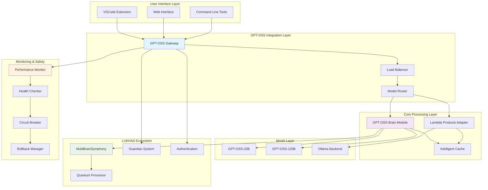

# GPT-OSS Integration: Technical Documentation

**Comprehensive Technical Guide for Developers and System Architects**

This document provides in-depth technical documentation for the GPT-OSS integration across the LUKHAS ecosystem, including architecture details, API specifications, implementation patterns, and system internals.

---

## 🏗️ System Architecture

### **High-Level Architecture Overview**



### **Core Components Architecture**

#### **1. GPT-OSS Gateway**

**Purpose**: Central routing and coordination hub for all GPT-OSS interactions

**Technical Specifications**:
```python
class GPTOSSGateway:
    """Central gateway for GPT-OSS integration"""

    def __init__(self):
        # Core components
        self.model_router = ModelRouter()
        self.load_balancer = LoadBalancer()
        self.cache_manager = CacheManager()
        self.monitoring = MonitoringSystem()

        # Safety systems
        self.circuit_breaker = CircuitBreaker()
        self.rate_limiter = RateLimiter()
        self.auth_validator = AuthValidator()

        # LUKHAS integration
        self.guardian_system = EnhancedGuardianSystem()
        self.consciousness_model = ConsciousnessModel()

    async def process_request(self, request: GPTOSSRequest) -> GPTOSSResponse:
        """Process incoming request with full safety and monitoring"""

        # 1. Authentication & Authorization
        auth_result = await self.auth_validator.validate(request.credentials)
        if not auth_result.is_valid:
            raise AuthenticationError(auth_result.error)

        # 2. Guardian system validation
        safety_check = await self.guardian_system.validate_request(request)
        if not safety_check.is_safe:
            raise SafetyValidationError(safety_check.reason)

        # 3. Rate limiting
        if not await self.rate_limiter.allow_request(request.user_id):
            raise RateLimitExceededError()

        # 4. Circuit breaker check
        if self.circuit_breaker.is_open():
            raise ServiceUnavailableError("GPT-OSS service temporarily unavailable")

        try:
            # 5. Route to appropriate model
            response = await self.model_router.route_request(request)

            # 6. Monitor performance
            await self.monitoring.record_request(request, response)

            return response

        except Exception as e:
            # Record failure for circuit breaker
            await self.circuit_breaker.record_failure(e)
            raise
```

#### **2. Model Router & Load Balancer**

**Purpose**: Intelligent routing between GPT-OSS model variants with load balancing

**Technical Implementation**:
```python
class ModelRouter:
    """Intelligent routing between GPT-OSS models"""

    def __init__(self):
        self.models = {
            'gpt-oss-20b': GPTOSSModel('gpt-oss-20b', max_context=8192),
            'gpt-oss-120b': GPTOSSModel('gpt-oss-120b', max_context=32768)
        }

        self.routing_strategy = AdaptiveRoutingStrategy()
        self.performance_tracker = PerformanceTracker()

    async def route_request(self, request: GPTOSSRequest) -> GPTOSSResponse:
        """Route request to optimal model variant"""

        # Analyze request complexity
        complexity_score = await self.analyze_request_complexity(request)

        # Select optimal model
        selected_model = await self.routing_strategy.select_model(
            request,
            complexity_score,
            self.performance_tracker.get_current_metrics()
        )

        # Load balance across model instances
        model_instance = await self.load_balancer.get_optimal_instance(
            selected_model
        )

        # Process request
        start_time = time.time()
        response = await model_instance.process(request)
        processing_time = time.time() - start_time

        # Update performance metrics
        await self.performance_tracker.record_performance(
            selected_model,
            processing_time,
            response.quality_score
        )

        return response

    async def analyze_request_complexity(self, request: GPTOSSRequest) -> float:
        """Analyze request complexity for optimal model selection"""

        complexity_factors = {
            'content_length': min(len(request.content) / 1000, 1.0),
            'context_depth': min(len(request.context or {}) / 10, 1.0),
            'reasoning_type': self.get_reasoning_complexity(request.type),
            'interdisciplinary': 1.0 if request.interdisciplinary else 0.0,
            'creative_component': 1.0 if request.creative else 0.0
        }

        # Weighted complexity score
        weights = [0.2, 0.2, 0.3, 0.15, 0.15]
        complexity = sum(
            factor * weight
            for factor, weight in zip(complexity_factors.values(), weights)
        )

        return complexity
```

#### **3. Intelligent Caching System**

**Purpose**: Multi-layer caching with semantic similarity and context awareness

**Technical Specifications**:
```python
class IntelligentCache:
    """Multi-layer semantic caching system"""

    def __init__(self):
        # Cache layers
        self.l1_cache = LRUCache(maxsize=1000)  # Fast memory cache
        self.l2_cache = RedisCache()            # Distributed cache
        self.semantic_cache = SemanticCache()   # Vector similarity cache

        # Cache intelligence
        self.similarity_engine = SimilarityEngine()
        self.invalidation_manager = CacheInvalidationManager()

    async def get(self, request: GPTOSSRequest) -> Optional[GPTOSSResponse]:
        """Intelligent cache retrieval with semantic matching"""

        # Generate cache key
        cache_key = self.generate_cache_key(request)

        # L1 Cache check (exact match)
        if cache_key in self.l1_cache:
            self.metrics.record_hit("l1")
            return self.l1_cache[cache_key]

        # L2 Cache check (distributed)
        l2_result = await self.l2_cache.get(cache_key)
        if l2_result:
            self.l1_cache[cache_key] = l2_result  # Promote to L1
            self.metrics.record_hit("l2")
            return l2_result

        # Semantic cache check (similarity matching)
        similar_entries = await self.semantic_cache.find_similar(
            request,
            similarity_threshold=0.85
        )

        if similar_entries:
            # Validate cache entry freshness
            for entry in similar_entries:
                if self.is_cache_fresh(entry):
                    self.metrics.record_hit("semantic")
                    return entry.response

        self.metrics.record_miss()
        return None

    async def set(self, request: GPTOSSRequest, response: GPTOSSResponse):
        """Intelligent cache storage with multi-layer persistence"""

        cache_key = self.generate_cache_key(request)

        # Store in all cache layers
        self.l1_cache[cache_key] = response
        await self.l2_cache.set(cache_key, response, ttl=3600)
        await self.semantic_cache.store_with_embedding(request, response)

        # Update cache analytics
        await self.update_cache_analytics(request, response)

    def generate_cache_key(self, request: GPTOSSRequest) -> str:
        """Generate deterministic cache key"""
        key_components = [
            request.content_hash,
            request.model_variant,
            str(request.temperature),
            str(request.max_tokens),
            json.dumps(request.context, sort_keys=True) if request.context else ""
        ]

        return hashlib.sha256("|".join(key_components).encode()).hexdigest()
```

---

## 🔌 API Specifications

### **GPT-OSS Gateway API**

#### **Base Endpoint**
```
https://api.lukhas.ai/gpt-oss/v1
```

#### **Authentication**
```http
POST /auth/token
Content-Type: application/json

{
  "credentials": {
    "user_id": "string",
    "grypto_signature": "string",
    "consciousness_token": "string"
  }
}

Response:
{
  "access_token": "jwt_token",
  "expires_in": 3600,
  "token_type": "Bearer"
}
```

#### **Core Processing Endpoints**

**1. VSCode Completion**
```http
POST /completion/vscode
Authorization: Bearer {access_token}
Content-Type: application/json

{
  "document": {
    "uri": "file:///path/to/file.py",
    "languageId": "python",
    "version": 1
  },
  "position": {
    "line": 42,
    "character": 15
  },
  "context": {
    "linePrefix": "def process_consciousness_",
    "lineSuffix": "():",
    "surroundingCode": "string",
    "symbols": [...]
  },
  "preferences": {
    "lukhas_patterns": true,
    "max_tokens": 500,
    "temperature": 0.7
  }
}

Response:
{
  "completions": [
    {
      "text": "data(self, consciousness_data: ΛConsciousnessData) -> QuantumState",
      "range": {
        "start": {"line": 42, "character": 15},
        "end": {"line": 42, "character": 15}
      },
      "confidence": 0.94,
      "reasoning": "LUKHAS consciousness pattern detected",
      "lukhas_enhanced": true
    }
  ],
  "processing_time_ms": 287,
  "model_used": "gpt-oss-20b",
  "cache_hit": false
}
```

**2. Brain Module Processing**
```http
POST /brain/reasoning
Authorization: Bearer {access_token}
Content-Type: application/json

{
  "input": {
    "content": "Analyze quantum consciousness emergence patterns",
    "type": "philosophical_reasoning",
    "context": {
      "previous_insights": [...],
      "consciousness_state": {...}
    }
  },
  "processing_options": {
    "depth": "comprehensive",
    "creativity": 0.8,
    "consciousness_aware": true,
    "bio_rhythm_sync": true
  },
  "integration": {
    "other_brains": ["dreams", "memory", "learning"],
    "symphony_mode": true
  }
}

Response:
{
  "reasoning_result": {
    "raw_output": "string",
    "structured_analysis": {...},
    "key_insights": [...],
    "confidence": 0.91
  },
  "brain_collaboration": {
    "dreams_contribution": {...},
    "memory_integration": {...},
    "learning_adaptation": {...}
  },
  "consciousness_coherence": 0.87,
  "processing_metrics": {
    "latency_ms": 645,
    "reasoning_depth": 8,
    "context_utilization": 0.93
  }
}
```

**3. Lambda Products Processing**
```http
POST /lambda-products/{product_type}
Authorization: Bearer {access_token}
Content-Type: application/json

{
  "request": {
    "product_type": "QRG",
    "content": "Evaluate AGI safety implications",
    "processing_mode": "REASONING",
    "priority": "high"
  },
  "context": {
    "domain": "AI_safety",
    "evidence_requirements": "peer_reviewed",
    "logical_rigor": "formal_logic"
  },
  "quality_thresholds": {
    "min_confidence": 0.8,
    "quality_score_minimum": 85,
    "logical_validity": 0.9
  }
}

Response:
{
  "product_response": {
    "product_type": "QRG",
    "request_id": "qrg_a7b3c9d1",
    "processing_time_ms": 1247,
    "confidence": 0.93
  },
  "gpt_oss_result": {
    "reasoning": {...},
    "confidence": 0.91
  },
  "lambda_enhanced_result": {
    "quality_score": 89,
    "logical_validity": 0.94,
    "evidence_strength": 0.88,
    "recommendations": [...],
    "insights": [...]
  },
  "symbolic_signature": "ΛQR89"
}
```

#### **Monitoring & Analytics Endpoints**

**1. System Health**
```http
GET /health/status
Authorization: Bearer {access_token}

Response:
{
  "overall_status": "healthy",
  "components": {
    "gateway": {"status": "healthy", "uptime": 99.9},
    "models": {
      "gpt-oss-20b": {"status": "healthy", "load": 0.67},
      "gpt-oss-120b": {"status": "healthy", "load": 0.23}
    },
    "cache": {"status": "healthy", "hit_rate": 0.87},
    "monitoring": {"status": "healthy", "alerts": 0}
  },
  "performance_metrics": {
    "avg_response_time_ms": 425,
    "requests_per_minute": 342,
    "error_rate": 0.002
  }
}
```

**2. Performance Analytics**
```http
GET /analytics/performance
Authorization: Bearer {access_token}
Query Parameters:
  - timeRange: 1h, 24h, 7d, 30d
  - component: vscode, brain, lambda
  - aggregation: avg, p50, p95, p99

Response:
{
  "time_range": "24h",
  "metrics": {
    "completion_performance": {
      "avg_response_time": 287,
      "p95_response_time": 456,
      "accuracy_rate": 0.923,
      "cache_hit_rate": 0.871
    },
    "brain_performance": {
      "reasoning_quality": 0.91,
      "context_coherence": 0.88,
      "insight_generation_rate": 0.84
    },
    "lambda_products": {
      "qrg_quality_score": 87.3,
      "nias_intelligence_accuracy": 0.89,
      "business_insight_relevance": 0.92
    }
  },
  "trends": {
    "performance_trend": "improving",
    "usage_growth": "+15%",
    "quality_trend": "stable_high"
  }
}
```

---

## 🔧 Implementation Patterns

### **1. Async Processing Pattern**

**Purpose**: High-performance async processing with proper error handling and resource management

```python
import asyncio
import aiohttp
from typing import Dict, List, Any, Optional
from contextlib import asynccontextmanager

class AsyncGPTOSSProcessor:
    """High-performance async GPT-OSS processor"""

    def __init__(self, max_concurrent: int = 10):
        self.max_concurrent = max_concurrent
        self.semaphore = asyncio.Semaphore(max_concurrent)
        self.session: Optional[aiohttp.ClientSession] = None

    @asynccontextmanager
    async def managed_session(self):
        """Context manager for HTTP session lifecycle"""
        if self.session is None:
            connector = aiohttp.TCPConnector(
                limit=100,
                limit_per_host=20,
                keepalive_timeout=30
            )
            self.session = aiohttp.ClientSession(connector=connector)

        try:
            yield self.session
        except Exception:
            # Session cleanup on error
            if self.session and not self.session.closed:
                await self.session.close()
            self.session = None
            raise

    async def process_batch(self, requests: List[GPTOSSRequest]) -> List[GPTOSSResponse]:
        """Process multiple requests concurrently with resource limits"""

        async with self.managed_session() as session:
            # Create semaphore-limited tasks
            tasks = [
                self._process_with_semaphore(request, session)
                for request in requests
            ]

            # Wait for all tasks with proper exception handling
            results = await asyncio.gather(*tasks, return_exceptions=True)

            # Separate successful results from exceptions
            successful_results = []
            errors = []

            for i, result in enumerate(results):
                if isinstance(result, Exception):
                    errors.append((i, result))
                else:
                    successful_results.append(result)

            # Log errors for monitoring
            if errors:
                logger.warning(f"Batch processing had {len(errors)} errors")
                for idx, error in errors:
                    logger.error(f"Request {idx} failed: {error}")

            return successful_results

    async def _process_with_semaphore(self, request: GPTOSSRequest, session: aiohttp.ClientSession) -> GPTOSSResponse:
        """Process single request with concurrency limiting"""

        async with self.semaphore:
            try:
                return await self._process_request(request, session)
            except asyncio.TimeoutError:
                logger.error(f"Request timeout for {request.id}")
                raise
            except Exception as e:
                logger.error(f"Request processing failed for {request.id}: {e}")
                raise

    async def __aenter__(self):
        """Async context manager entry"""
        return self

    async def __aexit__(self, exc_type, exc_val, exc_tb):
        """Async context manager cleanup"""
        if self.session and not self.session.closed:
            await self.session.close()
```

### **2. Circuit Breaker Pattern**

**Purpose**: Prevent cascade failures and provide graceful degradation

```python
import time
from enum import Enum
from typing import Callable, Any, Dict
from collections import deque
import asyncio

class CircuitState(Enum):
    CLOSED = "closed"      # Normal operation
    OPEN = "open"          # Blocking requests
    HALF_OPEN = "half_open"  # Testing recovery

class AdvancedCircuitBreaker:
    """Production-grade circuit breaker with adaptive thresholds"""

    def __init__(
        self,
        failure_threshold: int = 5,
        recovery_timeout: int = 60,
        success_threshold: int = 3
    ):
        self.failure_threshold = failure_threshold
        self.recovery_timeout = recovery_timeout
        self.success_threshold = success_threshold

        # State management
        self.state = CircuitState.CLOSED
        self.failure_count = 0
        self.success_count = 0
        self.last_failure_time = 0

        # Performance tracking
        self.performance_window = deque(maxlen=100)
        self.adaptive_mode = True

        # Metrics
        self.metrics = {
            "total_requests": 0,
            "failed_requests": 0,
            "circuit_opens": 0,
            "recovery_attempts": 0
        }

    async def execute(self, operation: Callable[..., Any], *args, **kwargs) -> Any:
        """Execute operation with circuit breaker protection"""

        self.metrics["total_requests"] += 1

        # Check circuit state
        if self.state == CircuitState.OPEN:
            if self._should_attempt_recovery():
                self.state = CircuitState.HALF_OPEN
                self.metrics["recovery_attempts"] += 1
                logger.info(f"🔄 Circuit breaker attempting recovery")
            else:
                raise CircuitBreakerOpenError("Circuit breaker is OPEN")

        # Execute operation with monitoring
        start_time = time.time()
        try:
            result = await operation(*args, **kwargs)
            execution_time = time.time() - start_time

            # Record success
            await self._record_success(execution_time)
            return result

        except Exception as e:
            execution_time = time.time() - start_time
            await self._record_failure(e, execution_time)
            raise

    async def _record_success(self, execution_time: float):
        """Record successful execution and update state"""

        self.performance_window.append(execution_time)

        if self.state == CircuitState.HALF_OPEN:
            self.success_count += 1
            if self.success_count >= self.success_threshold:
                # Recovery successful
                self.state = CircuitState.CLOSED
                self.failure_count = 0
                self.success_count = 0
                logger.info(f"✅ Circuit breaker recovered - CLOSED")

        # Adaptive threshold adjustment
        if self.adaptive_mode:
            await self._adjust_adaptive_thresholds()

    async def _record_failure(self, exception: Exception, execution_time: float):
        """Record failure and update circuit state"""

        self.metrics["failed_requests"] += 1
        self.failure_count += 1
        self.last_failure_time = time.time()

        # Add failure to performance window (with penalty)
        self.performance_window.append(execution_time * 2)  # Penalty factor

        # Check if circuit should open
        if self.failure_count >= self.failure_threshold:
            if self.state != CircuitState.OPEN:
                self.state = CircuitState.OPEN
                self.metrics["circuit_opens"] += 1
                logger.warning(f"🚨 Circuit breaker OPENED - {self.failure_count} failures")

        # Reset success count in half-open state
        if self.state == CircuitState.HALF_OPEN:
            self.success_count = 0

    def _should_attempt_recovery(self) -> bool:
        """Determine if recovery should be attempted"""
        return (time.time() - self.last_failure_time) >= self.recovery_timeout

    async def _adjust_adaptive_thresholds(self):
        """Adjust thresholds based on performance history"""
        if len(self.performance_window) < 50:
            return

        # Calculate performance statistics
        avg_time = sum(self.performance_window) / len(self.performance_window)

        # Adjust failure threshold based on performance
        if avg_time < 0.5:  # Fast responses
            self.failure_threshold = min(self.failure_threshold + 1, 10)
        elif avg_time > 2.0:  # Slow responses
            self.failure_threshold = max(self.failure_threshold - 1, 3)
```

### **3. Caching Strategy Pattern**

**Purpose**: Multi-layer intelligent caching with semantic similarity

```python
import hashlib
import json
import numpy as np
from typing import Optional, Dict, Any, List
import redis
from sentence_transformers import SentenceTransformer

class SemanticCache:
    """Semantic similarity-based caching system"""

    def __init__(self):
        # Vector similarity model
        self.similarity_model = SentenceTransformer('all-MiniLM-L6-v2')

        # Storage backends
        self.redis_client = redis.Redis(host='localhost', port=6379, decode_responses=True)
        self.vector_store = {}  # In production: use Pinecone, Weaviate, etc.

        # Configuration
        self.similarity_threshold = 0.85
        self.max_cache_entries = 10000
        self.embedding_dimension = 384

    async def get_similar_cached_response(
        self,
        query: str,
        context: Dict[str, Any]
    ) -> Optional[GPTOSSResponse]:
        """Retrieve cached response based on semantic similarity"""

        # Generate query embedding
        query_embedding = self.similarity_model.encode([query])[0]

        # Find similar cached queries
        similar_entries = await self._find_similar_embeddings(
            query_embedding,
            self.similarity_threshold
        )

        # Validate context compatibility
        for entry in similar_entries:
            if self._is_context_compatible(context, entry['context']):
                # Check cache freshness
                if self._is_cache_fresh(entry):
                    return self._deserialize_response(entry['response'])

        return None

    async def cache_response(
        self,
        query: str,
        context: Dict[str, Any],
        response: GPTOSSResponse
    ):
        """Cache response with semantic embedding"""

        # Generate embedding
        query_embedding = self.similarity_model.encode([query])[0]

        # Create cache entry
        cache_entry = {
            'query': query,
            'context': context,
            'response': self._serialize_response(response),
            'embedding': query_embedding.tolist(),
            'timestamp': time.time(),
            'access_count': 0
        }

        # Generate cache key
        cache_key = self._generate_cache_key(query, context)

        # Store in Redis
        await self._store_in_redis(cache_key, cache_entry)

        # Store embedding for similarity search
        self.vector_store[cache_key] = {
            'embedding': query_embedding,
            'metadata': cache_entry
        }

        # Maintain cache size limits
        await self._maintain_cache_limits()

    async def _find_similar_embeddings(
        self,
        query_embedding: np.ndarray,
        threshold: float
    ) -> List[Dict[str, Any]]:
        """Find semantically similar cached entries"""

        similar_entries = []

        for key, entry in self.vector_store.items():
            # Calculate cosine similarity
            similarity = np.dot(query_embedding, entry['embedding']) / (
                np.linalg.norm(query_embedding) * np.linalg.norm(entry['embedding'])
            )

            if similarity >= threshold:
                similar_entries.append({
                    'key': key,
                    'similarity': similarity,
                    **entry['metadata']
                })

        # Sort by similarity (highest first)
        similar_entries.sort(key=lambda x: x['similarity'], reverse=True)

        return similar_entries[:5]  # Return top 5 matches

    def _is_context_compatible(
        self,
        query_context: Dict[str, Any],
        cached_context: Dict[str, Any]
    ) -> bool:
        """Check if contexts are compatible for cache reuse"""

        # Key context fields that must match
        critical_fields = [
            'model_variant', 'temperature', 'max_tokens',
            'consciousness_aware', 'lukhas_patterns'
        ]

        for field in critical_fields:
            if query_context.get(field) != cached_context.get(field):
                return False

        # Flexible context fields (allow some variation)
        flexible_fields = ['domain', 'complexity', 'creativity']

        flexible_matches = 0
        for field in flexible_fields:
            if query_context.get(field) == cached_context.get(field):
                flexible_matches += 1

        # Require at least 70% flexible field matching
        flexible_threshold = len(flexible_fields) * 0.7

        return flexible_matches >= flexible_threshold
```

---

## 🔍 Monitoring & Observability

### **Comprehensive Monitoring Stack**

#### **1. Performance Metrics Collection**

```python
import time
import asyncio
from typing import Dict, List, Any
from dataclasses import dataclass, field
from collections import defaultdict, deque
import psutil
import GPUtil

@dataclass
class PerformanceMetrics:
    """Structured performance metrics"""

    # Request metrics
    total_requests: int = 0
    successful_requests: int = 0
    failed_requests: int = 0

    # Latency metrics
    response_times: deque = field(default_factory=lambda: deque(maxlen=1000))
    p50_latency: float = 0.0
    p95_latency: float = 0.0
    p99_latency: float = 0.0

    # Quality metrics
    confidence_scores: deque = field(default_factory=lambda: deque(maxlen=1000))
    accuracy_rates: deque = field(default_factory=lambda: deque(maxlen=100))

    # Resource metrics
    cpu_usage: float = 0.0
    memory_usage: float = 0.0
    gpu_usage: float = 0.0

    # Cache metrics
    cache_hit_rate: float = 0.0
    cache_miss_rate: float = 0.0

class PerformanceMonitor:
    """Comprehensive performance monitoring system"""

    def __init__(self):
        self.metrics = PerformanceMetrics()
        self.component_metrics = defaultdict(lambda: PerformanceMetrics())

        # Real-time monitoring
        self.monitoring_active = False
        self.collection_interval = 10  # seconds

        # Alert thresholds
        self.alert_thresholds = {
            'response_time_p95': 2000,  # ms
            'error_rate': 0.05,         # 5%
            'cpu_usage': 0.8,           # 80%
            'memory_usage': 0.85,       # 85%
            'cache_hit_rate_min': 0.7   # 70%
        }

    async def start_monitoring(self):
        """Start continuous performance monitoring"""

        self.monitoring_active = True

        # Start monitoring tasks
        monitoring_tasks = [
            asyncio.create_task(self._collect_system_metrics()),
            asyncio.create_task(self._collect_application_metrics()),
            asyncio.create_task(self._analyze_performance_trends()),
            asyncio.create_task(self._check_alert_conditions())
        ]

        try:
            await asyncio.gather(*monitoring_tasks)
        except Exception as e:
            logger.error(f"Monitoring system error: {e}")
        finally:
            self.monitoring_active = False

    async def _collect_system_metrics(self):
        """Collect system-level performance metrics"""

        while self.monitoring_active:
            try:
                # CPU metrics
                cpu_percent = psutil.cpu_percent(interval=1)
                self.metrics.cpu_usage = cpu_percent / 100.0

                # Memory metrics
                memory = psutil.virtual_memory()
                self.metrics.memory_usage = memory.percent / 100.0

                # GPU metrics (if available)
                try:
                    gpus = GPUtil.getGPUs()
                    if gpus:
                        self.metrics.gpu_usage = gpus[0].load
                except:
                    self.metrics.gpu_usage = 0.0

                await asyncio.sleep(self.collection_interval)

            except Exception as e:
                logger.error(f"System metrics collection error: {e}")
                await asyncio.sleep(5)

    async def record_request_metrics(
        self,
        component: str,
        response_time: float,
        success: bool,
        confidence_score: float = None
    ):
        """Record individual request metrics"""

        # Update global metrics
        self.metrics.total_requests += 1
        self.metrics.response_times.append(response_time)

        if success:
            self.metrics.successful_requests += 1
        else:
            self.metrics.failed_requests += 1

        if confidence_score is not None:
            self.metrics.confidence_scores.append(confidence_score)

        # Update component-specific metrics
        comp_metrics = self.component_metrics[component]
        comp_metrics.total_requests += 1
        comp_metrics.response_times.append(response_time)

        if success:
            comp_metrics.successful_requests += 1
        else:
            comp_metrics.failed_requests += 1

        # Calculate percentiles
        await self._update_percentiles()

    async def _update_percentiles(self):
        """Update latency percentiles"""

        if len(self.metrics.response_times) >= 10:
            sorted_times = sorted(self.metrics.response_times)
            n = len(sorted_times)

            self.metrics.p50_latency = sorted_times[int(n * 0.5)]
            self.metrics.p95_latency = sorted_times[int(n * 0.95)]
            self.metrics.p99_latency = sorted_times[int(n * 0.99)]

    def get_performance_summary(self) -> Dict[str, Any]:
        """Get comprehensive performance summary"""

        error_rate = 0.0
        if self.metrics.total_requests > 0:
            error_rate = self.metrics.failed_requests / self.metrics.total_requests

        avg_confidence = 0.0
        if self.metrics.confidence_scores:
            avg_confidence = sum(self.metrics.confidence_scores) / len(self.metrics.confidence_scores)

        return {
            "overview": {
                "total_requests": self.metrics.total_requests,
                "error_rate": error_rate,
                "avg_confidence": avg_confidence
            },
            "latency": {
                "p50_ms": self.metrics.p50_latency,
                "p95_ms": self.metrics.p95_latency,
                "p99_ms": self.metrics.p99_latency
            },
            "resources": {
                "cpu_usage": self.metrics.cpu_usage,
                "memory_usage": self.metrics.memory_usage,
                "gpu_usage": self.metrics.gpu_usage
            },
            "cache": {
                "hit_rate": self.metrics.cache_hit_rate,
                "miss_rate": self.metrics.cache_miss_rate
            },
            "by_component": {
                component: self._get_component_summary(metrics)
                for component, metrics in self.component_metrics.items()
            }
        }
```

#### **2. Health Check System**

```python
from enum import Enum
from typing import Dict, List, Any, Optional
import asyncio
import aiohttp

class HealthStatus(Enum):
    HEALTHY = "healthy"
    DEGRADED = "degraded"
    UNHEALTHY = "unhealthy"
    CRITICAL = "critical"

@dataclass
class HealthCheckResult:
    """Health check result structure"""

    component: str
    status: HealthStatus
    response_time_ms: float
    details: Dict[str, Any]
    timestamp: float

class HealthChecker:
    """Comprehensive health monitoring system"""

    def __init__(self):
        self.health_endpoints = {
            'gateway': 'http://localhost:8000/health',
            'models': {
                'gpt-oss-20b': 'http://localhost:8001/health',
                'gpt-oss-120b': 'http://localhost:8002/health'
            },
            'cache': 'http://localhost:6379/ping',
            'database': 'postgresql://localhost:5432/health'
        }

        self.health_checks = [
            self._check_gateway_health,
            self._check_model_health,
            self._check_cache_health,
            self._check_database_health,
            self._check_resource_health
        ]

        self.unhealthy_threshold = 3  # consecutive failures
        self.check_interval = 30      # seconds

    async def run_comprehensive_health_check(self) -> Dict[str, Any]:
        """Run all health checks and return comprehensive status"""

        health_results = {}
        overall_status = HealthStatus.HEALTHY

        # Run all health checks concurrently
        check_tasks = [check() for check in self.health_checks]
        results = await asyncio.gather(*check_tasks, return_exceptions=True)

        for i, result in enumerate(results):
            if isinstance(result, Exception):
                component = f"health_check_{i}"
                health_results[component] = HealthCheckResult(
                    component=component,
                    status=HealthStatus.CRITICAL,
                    response_time_ms=0,
                    details={"error": str(result)},
                    timestamp=time.time()
                )
            else:
                health_results.update(result)

        # Determine overall health status
        statuses = [result.status for result in health_results.values()]

        if HealthStatus.CRITICAL in statuses:
            overall_status = HealthStatus.CRITICAL
        elif HealthStatus.UNHEALTHY in statuses:
            overall_status = HealthStatus.UNHEALTHY
        elif HealthStatus.DEGRADED in statuses:
            overall_status = HealthStatus.DEGRADED

        return {
            "overall_status": overall_status,
            "timestamp": time.time(),
            "components": {
                name: {
                    "status": result.status.value,
                    "response_time_ms": result.response_time_ms,
                    "details": result.details
                }
                for name, result in health_results.items()
            },
            "summary": {
                "healthy": sum(1 for r in health_results.values() if r.status == HealthStatus.HEALTHY),
                "degraded": sum(1 for r in health_results.values() if r.status == HealthStatus.DEGRADED),
                "unhealthy": sum(1 for r in health_results.values() if r.status == HealthStatus.UNHEALTHY),
                "critical": sum(1 for r in health_results.values() if r.status == HealthStatus.CRITICAL)
            }
        }

    async def _check_gateway_health(self) -> Dict[str, HealthCheckResult]:
        """Check API gateway health"""

        start_time = time.time()
        try:
            async with aiohttp.ClientSession() as session:
                async with session.get(
                    self.health_endpoints['gateway'],
                    timeout=aiohttp.ClientTimeout(total=5)
                ) as response:
                    response_time = (time.time() - start_time) * 1000

                    if response.status == 200:
                        data = await response.json()
                        status = HealthStatus.HEALTHY
                        details = data
                    else:
                        status = HealthStatus.UNHEALTHY
                        details = {"http_status": response.status}

                    return {
                        "gateway": HealthCheckResult(
                            component="gateway",
                            status=status,
                            response_time_ms=response_time,
                            details=details,
                            timestamp=time.time()
                        )
                    }

        except asyncio.TimeoutError:
            return {
                "gateway": HealthCheckResult(
                    component="gateway",
                    status=HealthStatus.CRITICAL,
                    response_time_ms=(time.time() - start_time) * 1000,
                    details={"error": "timeout"},
                    timestamp=time.time()
                )
            }
        except Exception as e:
            return {
                "gateway": HealthCheckResult(
                    component="gateway",
                    status=HealthStatus.CRITICAL,
                    response_time_ms=(time.time() - start_time) * 1000,
                    details={"error": str(e)},
                    timestamp=time.time()
                )
            }
```

---

This technical documentation provides developers and system architects with comprehensive implementation details for integrating and maintaining the GPT-OSS enhancement across the LUKHAS ecosystem. The patterns and architectures shown here ensure scalable, reliable, and maintainable AI-enhanced development workflows.
