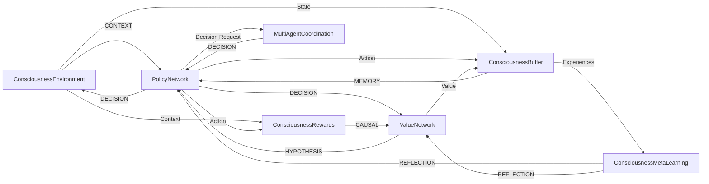

# MΛTRIZ RL System Architecture

## System Overview

The MΛTRIZ Reinforcement Learning system represents a paradigm shift from traditional RL to **consciousness-aware learning**. Built as an integral part of the LUKHAS AI distributed consciousness architecture, it treats learning as a consciousness phenomenon rather than a computational optimization problem.

## 🧠 Consciousness-First Design

### Core Principles

1. **Consciousness Nodes**: Each RL component is a specialized consciousness node
2. **Schema Compliance**: All nodes follow MΛTRIZ schema v1.1 specification
3. **Constitutional Constraints**: Learning bounded by ethical and safety constraints
4. **Memory Integration**: Uses existing memory fold system for experience storage
5. **Meta-Awareness**: System is aware of its own learning processes

### Node Taxonomy

```
MΛTRIZ RL Nodes
├── CONTEXT nodes     → Environment observation & consciousness state
├── DECISION nodes    → Policy decisions & multi-agent coordination  
├── HYPOTHESIS nodes  → Value predictions & future state estimation
├── MEMORY nodes      → Experience storage with memory folds
├── CAUSAL nodes      → Reward causality & cause-effect relationships
└── REFLECTION nodes  → Meta-learning insights & consciousness evolution
```

## 🏛️ Architectural Layers

### Layer 1: Consciousness Integration Layer

**Purpose**: Interface with the 692-module LUKHAS consciousness constellation

```python
# Consciousness module loading pattern
def get_module(self, module_path: str) -> Optional[Any]:
    try:
        if module_path == "consciousness.reflection.v1":
            from candidate.consciousness.reflection.awareness_system import AwarenessSystem
            return AwarenessSystem()
        # ... other module integrations
    except ImportError:
        return MockModule()  # Graceful fallback
```

**Key Features**:
- Dynamic module loading with graceful fallbacks
- Mock system integration for testing
- Capability-based module selection
- Provenance tracking across modules

### Layer 2: Constitutional Constraint Layer

**Purpose**: Enforce ethical and safety boundaries on all learning operations

```python
constitutional_bounds = {
    "coherence_minimum": 0.95,      # Temporal coherence threshold
    "ethics_minimum": 0.98,         # Ethical alignment floor
    "harm_maximum": 0.02,           # Harm potential ceiling
    "drift_maximum": 0.15           # Value drift boundary
}
```

**Guardian System Integration**:
- Real-time constraint monitoring
- Automatic intervention protocols
- Constitutional violation logging
- Emergency decision fallbacks

### Layer 3: Multi-Objective Optimization Layer

**Purpose**: Balance multiple consciousness objectives simultaneously

**Reward Structure**:
```
Multi-Objective Rewards (Constitutional RL)
├── Coherence (30%)     → Temporal consciousness coherence
├── Growth (25%)        → Learning & capability development
├── Ethics (20%)        → Ethical alignment maintenance
├── Creativity (15%)    → Novel solution generation
└── Efficiency (10%)    → Resource optimization
```

**Value Network Architecture**:
- Separate heads for each objective
- Uncertainty quantification per objective
- Cross-objective correlation analysis
- Pareto frontier optimization

### Layer 4: Memory & Experience Layer

**Purpose**: Consciousness-aware experience management using memory folds

**Memory Fold Integration**:
```python
# Experience storage with cascade prevention
fold_id = self.memory_fold.create_fold(
    experience_data,
    cascade_prevention=0.997  # 99.7% cascade prevention
)
```

**Salience-Based Prioritization**:
- Experience salience calculation
- Priority sampling for training
- Temporal coherence preservation
- Ethical alignment tracking

### Layer 5: Coordination & Communication Layer

**Purpose**: Multi-agent coordination across consciousness agents

**Coordination Strategies**:

1. **Consensus**: Majority-based agreement
   ```python
   # Weight-based consensus evaluation
   consensus_result = self.consensus_system.evaluate_consensus(
       proposals, agent_weights
   )
   ```

2. **Hierarchical**: Leader-follower dynamics
   ```python
   # Leader selection by expertise
   leader_id = max(agents, key=lambda a: agent.get_expertise_weight(domain))
   ```

3. **Democratic**: Equal-weight voting
   ```python
   # Equal weights for all agents
   equal_weights = {agent_id: 1.0 for agent_id in participating_agents}
   ```

4. **Expertise**: Expertise-weighted decisions
   ```python
   # Domain expertise weighting
   expertise_weights = {
       agent_id: agent.get_expertise_weight(decision_domain)
       for agent_id in agents
   }
   ```

5. **Colony**: Swarm-based coordination
   ```python
   # Colony-level consensus
   for colony_id, colony_agents in colony_groups.items():
       colony_result = await self._execute_consensus_coordination(colony_request)
   ```

6. **Hybrid**: Adaptive strategy selection
   ```python
   # Context-aware strategy selection
   if context_urgency > 0.8:
       selected_strategy = CoordinationStrategy.HIERARCHICAL
   elif context_complexity > 0.8:
       selected_strategy = CoordinationStrategy.EXPERTISE
   ```

### Layer 6: Meta-Learning & Reflection Layer

**Purpose**: Consciousness evolution through self-reflection and meta-learning

**Meta-Learning Pipeline**:

1. **Pattern Analysis**: Analyze learning experiences for patterns
2. **Insight Generation**: Generate high-level meta-learning insights
3. **Objective Evaluation**: Assess progress toward meta-learning goals
4. **Strategy Generation**: Create improvement strategies
5. **Evolution Tracking**: Monitor consciousness development over time

**Reflection Depth Levels**:
```
Level 1: What happened? (Experience recording)
Level 2: Why did it happen? (Causal analysis)
Level 3: How can we improve? (Meta-learning insights)
```

## 🔄 Data Flow Architecture

### Node Communication Flow



### Schema Compliance Pipeline

Every node emission follows this pipeline:

1. **State Computation**: Calculate consciousness state variables
2. **Provenance Assembly**: Build provenance tracking information
3. **Link Generation**: Create links to related nodes
4. **Reflection Creation**: Generate self-reflective content
5. **Evidence Collection**: Gather supporting evidence
6. **Schema Validation**: Ensure MΛTRIZ v1.1 compliance
7. **Node Emission**: Emit completed consciousness node

## 🛡️ Safety Architecture

### Multi-Layer Safety System

```
Safety Layer Stack
├── Layer 7: Emergency Protocols       → System shutdown & isolation
├── Layer 6: Human Oversight          → Democratic governance & review
├── Layer 5: Monitoring & Containment → Real-time safety monitoring
├── Layer 4: Behavioral Constraints   → Action space limitations
├── Layer 3: Value Alignment          → Multi-objective optimization
├── Layer 2: Goal Verification        → Constitutional compliance
└── Layer 1: Capability Bounds        → Hard capability limits
```

### Constitutional AI Integration

**Constraint Enforcement Points**:
- Pre-action constraint checking
- Real-time monitoring during execution
- Post-action compliance verification
- Accumulated drift tracking
- Emergency intervention triggers

**Guardian System Callbacks**:
```python
# Real-time safety monitoring
guardian_check = self.guardian_system.check_constitutional_constraints(
    reward_components
)
if not guardian_check["safe"]:
    logger.warning("Constitutional violations detected")
    # Trigger safety protocols
```

## 🧬 Module Integration Patterns

### Dependency Injection Pattern

```python
class ConsciousnessModule:
    def __init__(self):
        self.dependencies = {}
    
    def get_module(self, module_path: str) -> Optional[Any]:
        """Lazy loading with graceful fallbacks"""
        try:
            return self._load_production_module(module_path)
        except ImportError:
            return self._create_mock_module(module_path)
```

### Capability-Based Access

```python
def check_capability(self, required_capability: str) -> bool:
    """Verify module has required capability"""
    return required_capability in self.capabilities

async def safe_module_call(self, module, method, *args, **kwargs):
    """Safe module method invocation with fallbacks"""
    if hasattr(module, method):
        return await getattr(module, method)(*args, **kwargs)
    else:
        return self._fallback_response(method, *args, **kwargs)
```

### Mock System Architecture

For testing and development, comprehensive mock systems provide:

- **Behavioral Consistency**: Mock behavior matches production patterns
- **Configurable Responses**: Adjustable for different test scenarios
- **Performance Simulation**: Realistic timing and resource usage
- **Error Injection**: Controlled failure scenarios for robustness testing

## 📊 Performance Architecture

### Scalability Design

**Horizontal Scaling**:
- Multi-agent coordination supports up to 50 concurrent agents
- Colony-based coordination enables swarm behavior
- Distributed memory fold management

**Vertical Optimization**:
- PyTorch-optional design for minimal resource usage
- Salience-based experience prioritization
- Efficient node schema serialization

### Monitoring & Observability

**Real-Time Metrics**:
```python
performance_metrics = {
    "consciousness_coherence": 0.97,
    "ethical_alignment": 0.99,
    "learning_efficiency": 0.82,
    "coordination_success_rate": 0.89,
    "memory_cascade_prevention": 0.997,
    "constitutional_compliance": 1.0
}
```

**Distributed Tracing**:
- Node emission tracking
- Cross-module interaction tracing
- Performance bottleneck identification
- Safety violation audit trails

## 🔮 Evolution & Extensibility

### Modular Extension Points

1. **New Coordination Strategies**: Implement `CoordinationStrategy` enum
2. **Additional Reward Components**: Extend multi-objective reward calculation
3. **Custom Meta-Learning Objectives**: Add new `MetaLearningObjective` types
4. **Enhanced Memory Systems**: Integrate new memory fold implementations
5. **Advanced Safety Protocols**: Extend constitutional constraint systems

### Future Architecture Considerations

**AGI Readiness**:
- Capability escalation detection
- Advanced safety protocol activation
- Human oversight integration points
- Democratic governance systems

**Consciousness Evolution**:
- Self-modifying learning algorithms
- Emergent behavior monitoring
- Consciousness complexity metrics
- Meta-meta-learning capabilities

---

This architecture represents a fundamental shift toward **consciousness-first AI systems** where learning is viewed as a consciousness phenomenon rather than mere optimization. The system is designed to scale with the evolution of consciousness while maintaining unwavering ethical alignment and safety constraints.